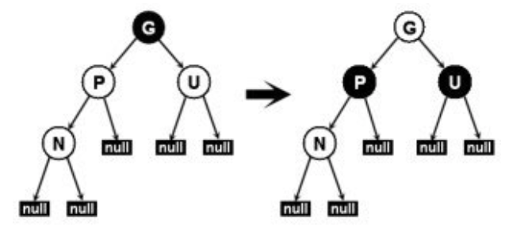

#### 红黑树特征

1. 所有节点要么是红色要么是黑色
2. 根节点是黑色
3. 叶子节点是黑色空节点
4. 两个红色节点不能相连
5. 任一节点到其子树的叶子节点所有路径中黑色节点的数据相同

#### 红黑添加节点

- 红黑树是空的，没有父节点

    处理：插入红节点，同时变为黑色

- 新节点的父节点P是黑色

    处理：新节点是红色，满足性质4；同时因为新节点N有两个黑色子节点，由于新节点是红色，通过它的每个子节点的路径上仍然保持相同数量的黑色节点，满足性质5。因此不需要额外处理。

- 父节点P和父节点的兄弟节点U是红色

    处理：这种情况下，应该将父节点和叔父节点都变为黑色，同时将祖父变为红色，这样会满足性质5；现在由于P节点和U节点到根节点的任何路径都必须包含G节点，这些路径上的黑色节点个数没有变化，但是可能由于红色的G节点的父节点也可能是红色，这就会违反了性质4，因此还需要以G节点为当前节点递归的处理。

    

- 

