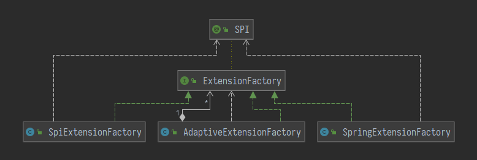

在Dubbo官网上有这样一句话

> Dubbo具有高度的可扩展能力，遵循微内核+插件的设计原则，所有核心能力如Protocol、Transport、Serialization被设计为扩展点，平等对待内置实现和第三方实现。

对于一个开源的RPC框架，可扩展性是十分重要的，那么Dubbo是怎么来实现这一点的呢，我们可以在Dubbo的源码中随处可以看到下面这样的代码：

```java
Protocol protocol = ExtensionLoader.getExtensionLoader(Protocol.class).getAdaptiveExtension();
```

这个ExtensionLoader就是Dubbo扩展能力的基础，也是理解Dubbo运行机制的基石，那么下面我们先来了解了解SPI是什么。


## SPI机制

SPI(Service Provider Interface)，是一种服务发现机制，Dubbo的SPI是从Java SPI增强而来，Dubbo的文档中给了三个增强的理由：

> - JDK 标准的 SPI 会一次性实例化扩展点所有实现，如果有扩展实现初始化很耗时，但如果没用上也加载，会很浪费资源。
> - 增加了对扩展点 IoC 和 AOP 的支持，一个扩展点可以直接 setter 注入其它扩展点。
> - 如果扩展点加载失败，连扩展点的名称都拿不到了。比如：JDK 标准的 ScriptEngine，通过 `getName()` 获取脚本类型的名称，但如果 RubyScriptEngine 因为所依赖的 jruby.jar 不存在，导致 RubyScriptEngine 类加载失败，这个失败原因被吃掉了，和 ruby 对应不起来，当用户执行 ruby 脚本时，会报不支持 ruby，而不是真正失败的原因。

其中第一点懒加载和第二点IOC是我们平时所熟知的，也是我个人认为比较重要的，至于第二点笔者也从未遇见过这样的场景。

首先来看一个小小的Dubbo SPI的使用案例：

```java
/** 定义一个扩展点的接口 */
@SPI("udp") 
public interface Transporter {
    void send(String msg);
    @Adaptive("transporter")
    void send(String msg, URL url);
}

/**实现类一*/
public class UDPTransporter implements Transporter{
    public void send(String msg) {
        System.out.println("Transfer " + msg + " thorough UDP");
    }
    public void send(String msg, URL url) {
        send(msg);
    }
}

/**实现类二*/
@Activate(value = "reliability")
public class TCPTransporter implements Transporter{
    public void send(String msg) {
        System.out.println("Transfer " + msg + " thorough TCP");
    }
    public void send(String msg, URL url) {
        send(msg);
    }
}
```

关联SPI机制，在/resources/META-INF/dubbo目录下创建如下文件


文件内容如下：

```properties
tcp=com.wanglaomo.playground.dubbo.provider.spi.TCPTransporter
udp=com.wanglaomo.playground.dubbo.provider.spi.UDPTransporter
```

相比于Java的SPI机制，我们可以看到Dubbo的SPI多了一层映射关系{tcp -> TCPTransporter, udp -> UDPTransporter}。

```java
ExtensionLoader extensionLoader = ExtensionLoader.getExtensionLoader(Transporter.class);

System.out.println(">>>>>>>>> 基础用法");
Transporter transporter = (Transporter) extensionLoader.getExtension("tcp");
transporter.send("msg");

System.out.println(">>>>>>>>> 默认实现");
Transporter defaultTransporter = (Transporter) extensionLoader.getDefaultExtension();
defaultTransporter.send("msg");

System.out.println(">>>>>>>>> 自适应实现");
Transporter adaptiveTransporter = (Transporter) extensionLoader.getAdaptiveExtension();
adaptiveTransporter.send("msg", URL.valueOf("test://localhost/test?transporter=udp"));

System.out.println(">>>>>>>>> 自动激活实现");
List<Transporter> activeTransporters = extensionLoader.getActivateExtension(URL.valueOf("test://localhost/test?reliability=true"), (String) null);
for(Transporter activateTransporter : activeTransporters) {
    activateTransporter.send("msg");
}
```

测试输出结果：

```
>>>>>>>>> 基础用法
Transfer msg thorough TCP
>>>>>>>>> 默认实现
Transfer msg thorough UDP
>>>>>>>>> 自适应实现
Transfer msg thorough TCP
>>>>>>>>> 自动激活实现
Transfer msg thorough TCP
```

在这个案例里面我们一次性地把Dubbo SPI的所有用法都过了个遍，在Dubbo源码中也无外乎就这几种。

## Dubbo SPI的基本概念

- Dubbo中所有可扩展的接口都称为`扩展点`。比如注册中心的扩展（Registry）、序列化方式的扩展（Serialization）。

- 当接口上标注了`@SPI`注解时，表示该接口就是一个扩展点。在Dubbo启动时，会将这些接口及对应的实现类扫描并进行相应类的加载。因此可以通过扩展点接口或@SPI注解让Dubbo帮助我们管理扩展点。

- 在**META-INF/dubbo**下的文件中，等号左边为扩展点的别名，等号右边为扩展点的实现类。

- **Dubbo URL**相当于一次Dubbo调用的配置信息，是可变化的。
- **@Activate**：表明该扩展点是可被激活的扩展点，value为空表示默认激活，当value不为空时，则表示Dubbo URL中包含相关参数时才会激活。
- **@Adaptive**可以被标注在类和方法上。
    - 标注方法时，表明Dubbo会对生成的代理类的该方法进行自适应拓展，会根据URL中的参数调用相应的扩展点的方法。从而实现在运行时动态的决定加载某一个扩展点。相当于代理模式和策略模式的一个结合。基本上，每一个扩展点都会被Dubbo生成一个相应的自适应扩展类。
    - 标注在类上时，则表明Dubbo直接使用该类作为已实现自适应扩展的类，而不用Dubbo再自行生成。目前Dubbo有这么两个类被加上了@Adaptive注解：`AdaptiveCompiler`和`AdaptiveExtensionFactory`。


## 扩展点的IOC工厂

Dubbo中频繁出现的ExtensionLoader类实现了对扩展点的管理。可以看到ExtensionLoader中维护了一个静态的ConcurrentHashMap，键为扩展点接口对应的Class，值为相对应的ExtensionLoader。

```java
static ConcurrentMap<Class<?>, ExtensionLoader<?>> EXTENSION_LOADERS = new ConcurrentHashMap<>();
```

而在每个ExtensionLoader的每一个对象中维护着下面的四种成员变量：

``` java
// 可激活的ExtensionLoader
Map<String, Object> cachedActivates = new ConcurrentHashMap<>();
// 自适应的实现
Class<?> cachedAdaptiveClass;
// 默认实现的名称 
String cachedDefaultName;
// 所有的扩展点别名和扩展点实体的集合
ConcurrentMap<String, Holder<Object>> cachedInstances = new ConcurrentHashMap<>();
```

通过这四种成员变量我们可以发现ExtensionLoader是一个很重的工厂类对象，再结合下面会讲到的扩展点自动注入，ExtensionLoader基本上实现了一个功能完备的扩展点IOC工厂。通过源码看看这个IOC工厂是怎么运行的，我们先以这一句代码为出发点来理解ExtensionLoader。

```java
// ExtensionLoader#getExtensionLoader
// ExtensionLoader的集合
private static final ConcurrentMap<Class<?>, ExtensionLoader<?>> EXTENSION_LOADERS = new ConcurrentHashMap<>();

//ExtensionLoader#getExtensionLoader
public static <T> ExtensionLoader<T> getExtensionLoader(Class<T> type) {
    if (type == null) {
        throw new IllegalArgumentException("Extension type == null");
    }
    // 判断是否为接口
    if (!type.isInterface()) {
        throw new IllegalArgumentException("Extension type (" + type + ") is not an interface!");
    }
    // 判断是否为@SPI标注的扩展点
    if (!withExtensionAnnotation(type)) {
        throw new IllegalArgumentException("Extension type (" + type + ") is not an extension");
    }

    // 创建ExtensionLoader
    ExtensionLoader<T> loader = (ExtensionLoader<T>) EXTENSION_LOADERS.get(type);
    if (loader == null) {
        EXTENSION_LOADERS.putIfAbsent(type, new ExtensionLoader<T>(type));
        loader = (ExtensionLoader<T>) EXTENSION_LOADERS.get(type);
    }
    return loader;
}
```

首先做一些扩展点接口的参数判断，然后通过ConcurrentHashMap#putIfAbsent方法来实现ExtensionLoader的延迟加载。然后让我们看一下ExtensionLoader的创建过程。

```java
// ExtensionLoader#construction
private final ExtensionFactory objectFactory;

private ExtensionLoader(Class<?> type) {
   this.type = type;
   objectFactory=(type==ExtensionFactory.class?null :ExtensionLoader.getExtensionLoader(ExtensionFactory.class).getAdaptiveExtension());
}
```

我们可以看到基本上这里只是个工厂类的壳子，相应的扩展类并没有被加载，因为扩展点实现类的加载也是延迟的。至于这个ExtensionFactory，因为它本身也被标注为@SPI扩展点，在获取它的ExtensionLoader时也会来这里走一遭，所以在这里进行了特殊的判断，打断了循环。ExtensionFactory也是个工厂类，包含了一个接口，该接口用于获取一个扩展点的实现类。

```java
 <T> T getExtension(Class<T> type, String name);
```

Dubbo会在自动注入扩展点时使用该方法，它一共有3个实现类：



在Dubbo中一般回直接使用AdaptiveExtensionFactory来获取扩展点实现类。

``` java
// AdapttiveExtensionFactory 
public AdaptiveExtensionFactory() {
    ExtensionLoader<ExtensionFactory> loader = ExtensionLoader.getExtensionLoader(ExtensionFactory.class);
    List<ExtensionFactory> list = new ArrayList<ExtensionFactory>();
    // 获取所有的扩展点实现类 
    for (String name : loader.getSupportedExtensions()) {
        list.add(loader.getExtension(name));
    }
    factories = Collections.unmodifiableList(list);
}

@Override
public <T> T getExtension(Class<T> type, String name) {
    // 逐个去获取实现类
    for (ExtensionFactory factory : factories) {
        T extension = factory.getExtension(type, name);
        if (extension != null) {
            return extension;
        }
    }
    return null;
}
```

在创建AdaptiveExtensionFactory时，会利用ExtensionLoader加载所有的ExtensionFactory扩展点的实现类，并在getExtension方法中逐个尝试获取扩展点实现类。SPIExtensionFactory比较简单，就是直接通过ExtensionLoader获得实现类的自适应扩展点实现类。

```java
// SPIExtensionFactory#getExtension
public <T> T getExtension(Class<T> type, String name) {
    if (type.isInterface() && type.isAnnotationPresent(SPI.class)) {
        ExtensionLoader<T> loader = ExtensionLoader.getExtensionLoader(type);
        if (!loader.getSupportedExtensions().isEmpty()) {
            return loader.getAdaptiveExtension();
        }
    }
    return null;
}

// SpringExtensionFactory#getExtension
// SpringExtensionFactory则是依托于Spring的IOC容器加载实现类。
public <T> T getExtension(Class<T> type, String name) {
    if (type.isInterface() && type.isAnnotationPresent(SPI.class)) {
        return null;
    }

    for (ApplicationContext context : CONTEXTS) {
        if (context.containsBean(name)) {
            Object bean = context.getBean(name);
            if (type.isInstance(bean)) {
                return (T) bean;
            }
        }
    }
    // ...省略
}

```

> 讲到这里，可能会觉得ExtensionLoader和ExtensionFactory有些重复的感觉。可以理解为，ExtensionFactory是一个SPI加载机制的扩展点，可以将别的加载类的体系纳入到Dubbo SPI的这个模型， 从而实现和Dubbo框架的融合，方便Dubbo统一的进行扩展点的管理，而不用在代码中四处“打补丁”。而鉴于现在有且只有Spring的一种，如果在不使用Spring Bean的情况下，而且完全可以去除掉ExtensionFactory这个类。

## 扩展点的分类

一个扩展点在被ExtensionLoader加载后，它的实现类会形成下面这几种扩展点：

- 普通扩展点实现默认扩展点实现
- 自适应扩展点实现（有且仅有一个）
- 可激活扩展点实现
- Wrapper扩展点实现

一个扩展点的实现可能同时隶属于上面的一种或多种。

### 普通扩展点实现

``` java
// ExtensionLoader#getExtension
public T getExtension(String name) {
    if (StringUtils.isEmpty(name)) {
        throw new IllegalArgumentException("Extension name == null");
    }
    // 如果name为true，则返回默认实现
    if ("true".equals(name)) {
        return getDefaultExtension();
    }
    final Holder<Object> holder = getOrCreateHolder(name);
    // 双重检查锁加载扩展点实现实例
    Object instance = holder.get();
    if (instance == null) {
        synchronized (holder) {
            instance = holder.get();
            if (instance == null) {
                // 创建扩展实现类对象
                instance = createExtension(name); 
                holder.set(instance);
            }
        }
    }
    return (T) instance;
}

private Holder<Object> getOrCreateHolder(String name) {
    // 因为Holder对象很轻量，所以这里没有使用双重检查锁
    Holder<Object> holder = cachedInstances.get(name);
    if (holder == null) {
        cachedInstances.putIfAbsent(name, new Holder<>());
        holder = cachedInstances.get(name);
    }
    return holder;
}

// Holder
public class Holder<T> {
    private volatile T value;
    public void set(T value) {
        this.value = value;
    }
    public T get() {
        return value;
    }
}
```

因为createExtension是一个很重的方法，会加载很多类，为了避免重复加载，包装了一层Holder对象，并对每一次加载执行双重检查锁确保线程安全。

```java
// ExtensionLoader#createExtension
private T createExtension(String name) {
    // 获取和扩展点别名配对的实现类的Class文件
    Class<?> clazz = getExtensionClasses().get(name);
    if (clazz == null) {
        throw findException(name);
    }
    try {
        T instance = (T) EXTENSION_INSTANCES.get(clazz);
        if (instance == null) {
            // 缓存集合中不存在，就通过反射创建实例，同时放入缓存集合中
            EXTENSION_INSTANCES.putIfAbsent(clazz, clazz.newInstance());
            instance = (T) EXTENSION_INSTANCES.get(clazz);
        }
        // 扩展点自动注入
        injectExtension(instance);
        // 处理wrapperClass，在下面自动包装扩展点讲解
        Set<Class<?>> wrapperClasses = cachedWrapperClasses;
        if (CollectionUtils.isNotEmpty(wrapperClasses)) {
            for (Class<?> wrapperClass : wrapperClasses) {
                instance = injectExtension((T) wrapperClass.getConstructor(type).newInstance(instance));
            }
        }
        return instance;
    } catch (Throwable t) {
        throw new IllegalStateException(t);
    }
}
```

上面这段代码主要包含三个主要逻辑，下面一个一个分析。

#### 1、获取扩展点实现类的Class文件

```java
private Map<String, Class<?>> getExtensionClasses() {
    Map<String, Class<?>> classes = cachedClasses.get();
    // 双重检查锁
    if (classes == null) {
        synchronized (cachedClasses) {
            classes = cachedClasses.get();
            if (classes == null) {
                //扫描并收集所有扩展点的Class文件
                classes = loadExtensionClasses();
                cachedClasses.set(classes);
            }
        }
    }
    return classes;
}
```

Dubbo会对所有扩展点的Class文件进行收集，并且对不同实现类的Class区分，使用双重检查操作避免重复加载。

```java
// ExtensionLoader#loadExtensionClasses
private static final String SERVICES_DIRECTORY = "META-INF/services/";
private static final String DUBBO_DIRECTORY = "META-INF/dubbo/";
private static final String DUBBO_INTERNAL_DIRECTORY = DUBBO_DIRECTORY + "internal/";

// synchronized in getExtensionClasses
private Map<String, Class<?>> loadExtensionClasses() {
    // 在下面默认扩展点讲解
    cacheDefaultExtensionName();

    Map<String, Class<?>> extensionClasses = new HashMap<>();
    // [套娃一]从给定目录中加载SPI配置文件及收集扩展点Class文件
    loadDirectory(extensionClasses,DUBBO_INTERNAL_DIRECTORY,type.getName());
    loadDirectory(extensionClasses,DUBBO_INTERNAL_DIRECTORY,type.getName().replace("org.apache", "com.alibaba"));
    loadDirectory(extensionClasses,DUBBO_DIRECTORY,type.getName());
    loadDirectory(extensionClasses,DUBBO_DIRECTORY,type.getName().replace("org.apache", "com.alibaba"));
    loadDirectory(extensionClasses,SERVICES_DIRECTORY,type.getName());
    loadDirectory(extensionClasses,SERVICES_DIRECTORY,type.getName().replace("org.apache", "com.alibaba"));
    return extensionClasses;
}
```

如上面所述Dubbo会从**约定的目录**下中扫描SPI配置文件。后面的replace应该是为了适配到Apache包的缘故。

- `/META-INF/services/`
- `META-INF/dubbo/`
- `META-INF/dubbo/internal`

```java
// ExtensionLoader#loadDirectory
private void loadDirectory(Map<String, Class<?>> extensionClasses, String dir, String type) {
    // 在上面案例中 fileName = "METAINF/dubbo/com.wanglaomo.playground.dubbo.provider.spi.Transporter"
    String fileName = dir + type;
    try {
        Enumeration<java.net.URL> urls;
        // 依次从这几个地方找ClassLoader 
        // Thread ClassLoader -> class.getClassLoader() -> SystemClassLoader
        ClassLoader classLoader = findClassLoader();
        if (classLoader != null) {
            urls = classLoader.getResources(fileName);
        } else {
            urls = ClassLoader.getSystemResources(fileName);
        }
        if (urls != null) {
            while (urls.hasMoreElements()) {
                java.net.URL resourceURL = urls.nextElement();
                // [套娃二]继续追进去吧
                loadResource(extensionClasses, classLoader, resourceURL);
            }
        }
    } catch (Throwable t) {
        logger.error(t);
    }
}
```

这一层套娃主要是获取当前环境中的ClassLoader，确保能够正确的加载扩展点实现类Class。同时使用该ClassLoader加载SPI配置文件。

```java
// ExtensionLoader#loadResource
private void loadResource(Map<String, Class<?>> extensionClasses, 
                          ClassLoader classLoader, 
                          java.net.URL resourceURL) {
    try {
        try (BufferedReader reader = 
             new BufferedReader(new InputStreamReader(resourceURL.openStream(),StandardCharsets.UTF_8))) {
            String line;
            // 以上面的案例中来说
            // line = "tcp=com.wanglaomo.playground.dubbo.provider.spi.TCPTransporter"
            while ((line = reader.readLine()) != null) {
                final int ci = line.indexOf('#');
                if (ci >= 0) {
                    line = line.substring(0, ci);
                }
                line = line.trim();
                if (line.length() > 0) {
                    try {
                        String name = null;
                        int i = line.indexOf('=');
                        // 以等号分割line获得扩展点别名和扩展点实现类Class的全限定名
                        if (i > 0) {
                            name = line.substring(0, i).trim();
                            line = line.substring(i + 1).trim();
                        }
                        if (line.length() > 0) {
                          //[套娃三] 真正获得Class的地方
                          loadClass(extensionClasses, resourceURL, Class.forName(line, true, classLoader), name);
                        }
                    } catch (Throwable t) {
                        IllegalStateException e = new IllegalStateException("Failed to load extension class");
                        exceptions.put(line, e);
                    }
                }
            }
        }
    } catch (Throwable t) {
        logger.error(t);
    }
}
```

这一层是解析SPI配置文件，得到扩展点别名和扩展点实现类Class的全限定名

```java
// ExtensionLoader#loadClass
private void loadClass(Map<String, Class<?>> extensionClasses, 
                       java.net.URL resourceURL, 
                       Class<?> clazz, 
                       String name) throws NoSuchMethodException {
    // 判断实现类是否implements扩展点接口
    if (!type.isAssignableFrom(clazz)) {
        throw new IllegalStateException("Error occurred when loading extension class");
    }
    // 在下面自适应扩展点中讲解。如果当前扩展点实现类上被标注了@Adaptive则表明该类为可适应扩展点实现类
    if (clazz.isAnnotationPresent(Adaptive.class)) {
        cacheAdaptiveClass(clazz);
    // 在下面自动包装扩展点中讲解
    } else if (isWrapperClass(clazz)) {
        cacheWrapperClass(clazz);
    } else {
        // 检查扩展点实现类的无参构造方法
        clazz.getConstructor();
        // 如果扩展点别名为空则从别的地方获取别名
        if (StringUtils.isEmpty(name)) {
            name = findAnnotationName(clazz);
            if (name.length() == 0) {
                throw new IllegalStateException("No such extension name for the class" + resourceURL);
            }
        }

        String[] names = NAME_SEPARATOR.split(name);
        if (ArrayUtils.isNotEmpty(names)) {
            // 在下面自动激活扩展点中讲解
            cacheActivateClass(clazz, names[0]);
            for (String n : names) {
                // 将扩展点实现类Class和扩展点别名的对应关系保存在Map中
                cacheName(clazz, n);
                // 将扩展点别名和扩展点实现类Class的对应关系保存在Map中
                saveInExtensionClass(extensionClasses, clazz, n);
            }
        }
    }
}

// ExtensionLoader#findAnnotationName
private String findAnnotationName(Class<?> clazz) {
    Extension extension = clazz.getAnnotation(Extension.class);
    if (extension == null) {
        // 没有被标注，则以驼峰命名法获取扩展点别名
        String name = clazz.getSimpleName();
        if (name.endsWith(type.getSimpleName())) {
            name = name.substring(0, name.length() - type.getSimpleName().length());
        }
        return name.toLowerCase();
    }
    // 如果扩展点实现类上被标注了@Extension注解，则以@Extension注解的value值为扩展点别名
    return extension.value();
}

private void saveInExtensionClass(Map<String, Class<?>> extensionClasses, Class<?> clazz, String name) {
    Class<?> c = extensionClasses.get(name);
    if (c == null) {
        extensionClasses.put(name, clazz);
    } else if (c != clazz) {
        // 不允许有两个扩展点别名相同
        throw new IllegalStateException("Duplicate extension name");
    }
}

```

这最后一层套娃主要是区分不同的扩展点实现类，我们可以看到，自适应扩展点和自动包装扩展点是和其他类型扩展点实现类是各自分隔的。而自动激活扩展点、默认扩展点和普通扩展点是相容的。

至此，所有的获取扩展点实现类的Class文件的相关逻辑已经追踪完毕。结合ExtensionLoader#createExtension中的代码，我们可以发现，Dubbo一次性会将所有的扩展点的Class文件收集起来，但是并不会将这些Class文件实例化，而是在使用到该扩展点实现类时才会实例化，从而达到了**延迟加载**的效果。

#### 2、扩展点实现类Class实例化

```java
T instance = (T) EXTENSION_INSTANCES.get(clazz);
if (instance == null) {
    // 通过反射创建实例
    EXTENSION_INSTANCES.putIfAbsent(clazz, clazz.newInstance());
    instance = (T) EXTENSION_INSTANCES.get(clazz);
}
```

扩展点实例化的代码就比较简单，因为之前已经检查过扩展点实现类的无参构造方法，所以这里可以直接使用clazz.newInstance()来实例化。同时也使用了ConcurrentHashMap的putIfAbsent来确保线程安全性。

#### 3、扩展点自动注入

```java
// ExtensionLoader#injectExtension
private T injectExtension(T instance) {
    try {
        // 前面所述的ExtensionFactory的实例不能为空
        if (objectFactory != null) {
            // 循环当前实例的方法
            for (Method method : instance.getClass().getMethods()) {
                // 所有对的set方法
                if (isSetter(method)) {
                    // 当方法上被标注@DisableInject时忽略自动注入
                    if (method.getAnnotation(DisableInject.class) != null) {
                        continue;
                    }
                    // 只根据set方法的第一个参数做匹配并得到该参数的类文件
                    Class<?> pt = method.getParameterTypes()[0];
                    // 如果为基本数据类型则跳过
                    if (ReflectUtils.isPrimitives(pt)) {
                        continue;
                    }
                    try {
                        // 根据驼峰命名法获得参数的扩展点别名
                        String property = getSetterProperty(method);
                        // 通过ExtensionFactory获得扩展点实例
                        Object object = objectFactory.getExtension(pt, property);
                        if (object != null) {
                            // 执行set方法进行注入
                            method.invoke(instance, object);
                        }
                    } catch (Exception e) {
                        logger.error("Failed to inject via method ");
                    }
                }
            }
        }
    } catch (Exception e) {
        logger.error(e.getMessage(), e);
    }
    return instance;
}

```

IOC注入的方式在上面的注释中已经写得很清楚了，并没有想象中那么智能，甚至可以说有一点笨拙，需要**对所有的扩展点的set方法有了一些约束**，但是胜在简单好用。

#### 4. 普通扩展点总结

实现原理主要是依赖了ClassLoader的一些机制，同时使用了反射的技术来操作扩展点实现类的Class文件和其上对应的注解。个人感觉是一个比较**经典的根据配置文件来加载工厂类的实现。其中的延迟加载、根据注解自动配置以及自动注入值得好好的吸收一下**。普通扩展点的加载是逻辑最长的一段，其他类型的扩展点的加载都是依托于普通扩展点加载完成。


### 自适应扩展点

自适应扩展点的加载可以从加载普通扩展点时的那个逻辑分支继续追踪

```java
private volatile Class<?> cachedAdaptiveClass = null; 

// ExtensionLoader#loadClass
private void loadClass(Map<String, Class<?>> extensionClasses, 
                       java.net.URL resourceURL, 
                       Class<?> clazz, 
                       String name) throws NoSuchMethodException {
    // ... 省略
    if (clazz.isAnnotationPresent(Adaptive.class)) {
        cacheAdaptiveClass(clazz);
    // ... 省略
}

private void cacheAdaptiveClass(Class<?> clazz) {
    if (cachedAdaptiveClass == null) {
        // 缓存自适应扩展点为
        cachedAdaptiveClass = clazz;
        // 被标注为@Adaptive的扩展点实现类只能有一个
    } else if (!cachedAdaptiveClass.equals(clazz)) {
        throw new IllegalStateException("More than 1 adaptive class found: ");
    }
}

```

这一段代码就是之前说的那句

> 当@Adaptive被标注在类上时，则表明Dubbo直接使用该类作为已实现自适应扩展的类，而不用Dubbo再自行生成。

的具体实现。那么Dubbo是怎么自动生成自适应扩展点呢？让我们从加载自适应扩展点的逻辑开始分析

```java
// ExtensionLoader#getAdaptiveExtension
private final Holder<Object> cachedAdaptiveInstance = new Holder<>();

public T getAdaptiveExtension() {
    // 还是一样的，双重检查锁确保只会加载一次且保证线程安全
    Object instance = cachedAdaptiveInstance.get();
    if (instance == null) {
        // 如果之前加载自适应扩展点时报错则直接抛出异常避免重复
        if (createAdaptiveInstanceError == null) {
            synchronized (cachedAdaptiveInstance) {
                instance = cachedAdaptiveInstance.get();
                if (instance == null) {
                    try {
                        // 创建自适应扩展点实例
                        instance = createAdaptiveExtension();
                        cachedAdaptiveInstance.set(instance);
                    } catch (Throwable t) {
                        createAdaptiveInstanceError = t;
                        throw new IllegalStateException("Failed to create adaptive instance: " + t.toString());
                    }
                }
            }
        } else {
            throw new IllegalStateException("Failed to create adaptive instance:"+, createAdaptiveInstanceError);
        }
    }
    return (T) instance;
}

private T createAdaptiveExtension() {
    try {
        return injectExtension((T) getAdaptiveExtensionClass().newInstance());
    } catch (Exception e) {
        throw new IllegalStateException("Can't create adaptive extension"+ type +",cause: " + e.getMessage(), e);
    }
}

```

创建自适应扩展点实例有三个步骤，其中injectExtension自动注入和之前的加载普通扩展点时一样的。而且也是通过无参构造方法新建一个新的实例。重点在于getAdaptiveExtensionclass获取自适应扩展点实现类的Class。

```java
// ExtensionLoader#getAdaptiveExtensionClass
private Class<?> getAdaptiveExtensionClass() {
    // 和之前类似加载所有的扩展点Class文件，有可能已经加载过了。
    getExtensionClasses();
    // 如果该type所有的扩展点中有标注为@Adaptive的扩展点实现类，则直接使用
    if (cachedAdaptiveClass != null) {
        return cachedAdaptiveClass;
    }
    // 否则创建一个
    return cachedAdaptiveClass = createAdaptiveExtensionClass();
}
```

这一段逻辑和之前一样

```java
// ExtensionLoader#createAdaptiveExtensionClass
private Class<?> createAdaptiveExtensionClass() {
    //生成自适应扩展点的源代码
    String code = new AdaptiveClassCodeGenerator(type, cachedDefaultName).generate();
    ClassLoader classLoader = findClassLoader();
    org.apache.dubbo.common.compiler.Compiler compiler = ExtensionLoader.getExtensionLoader(org.apache.dubbo.common.compiler.Compiler.class).getAdaptiveExtension();
    // 使用Compiler编译该源代码并生成Class文件
    return compiler.compile(code, classLoader);
}

```

通过给定的扩展点接口的Class文件及默认扩展点的名称生成自适应扩展点的源代码。因为该方法比较繁琐，主要就是字符串的组装，所以这里直接贴出我们上面的demo生成的自适应扩展点实现的源代码，方便理解。

```java
package com.wanglaomo.playground.dubbo.provider.spi;

import org.apache.dubbo.common.extension.ExtensionLoader;

public class Transporter$Adaptive implements com.wanglaomo.playground.dubbo.provider.spi.Transporter {
    // 因为adptive方法必须要传入URL对象，所以这里直接抛出一异常
    public void send(java.lang.String arg0) {
        throw new UnsupportedOperationException("The method public abstract void com.wanglaomo.playground.dubbo.provider.spi.Transporter.send(java.lang.String) of interface com.wanglaomo.playground.dubbo.provider.spi.Transporter is not adaptive method!");
    }

    public void send(java.lang.String arg0, org.apache.dubbo.common.URL arg1) {
        // 检查URL参数
        if (arg1 == null) throw new IllegalArgumentException("url == null");
        org.apache.dubbo.common.URL url = arg1;
        // 获得URL对象中有关我们事先配置好的@Adaptive参数对应的值，没有的话使用默认扩展点名称
        String extName = url.getParameter("transporter", "udp");
        if (extName == null)
            throw new IllegalStateException("Failed to get extension (com.wanglaomo.playground.dubbo.provider.spi.Transporter) name from url (" + url.toString() + ") use keys([transporter])");
        // 根据从参数获得的扩展点别名获得相应的扩展点实现类
        com.wanglaomo.playground.dubbo.provider.spi.Transporter extension = (com.wanglaomo.playground.dubbo.provider.spi.Transporter) ExtensionLoader.getExtensionLoader(com.wanglaomo.playground.dubbo.provider.spi.Transporter.class).getExtension(extName);
        // 调用具体扩展点实现类的具体方法
        extension.send(arg0, arg1);
    }
}

```

从生成出来的代码来看，主要是配合工厂类和URL对象来实现自动适配。有了源代码之后，就会调用Compiler对象进行编译，目前支持两种编译器，JavaassistCompiler和JDKCompiler。Javassist是一个操作字节码文件的库，可以动态的更改字节码文件，当然也可以实时编译，创建新的字节码文件。具体Compiler是怎么工作的和SPI机制关系不大，所以这里不做讲解。自适应扩展点很好的实现了了在运行时动态决定调用某个扩展点实现的功能，并且默认会给每一个扩展点生成一个，方便调用，主要的难点就是生成类的源代码和动态编译。


### 自动激活扩展点

自动激活扩展点的加载可以从加载普通扩展点时的那个逻辑分支继续追踪

```java
// ExtensionLoader#cacheActivateClass
private void cacheActivateClass(Class<?> clazz, String name) {
    // 当扩展点实现类被标注上@Activate注解时，则将扩展点别名和Activate对象的关联关系保存在Map中
    Activate activate = clazz.getAnnotation(Activate.class);
    if (activate != null) {
        cachedActivates.put(name, activate);
    } else {
        // support com.alibaba.dubbo.common.extension.Activate
        Activate oldActivate = clazz.getAnnotation(com.alibaba.dubbo.common.extension.Activate.class);
        if (oldActivate != null) {
            cachedActivates.put(name, oldActivate);
        }
    }
}
```

这段代码没什么特别的，主要是将关联关系提前收集并保存。主要的逻辑在加载自动激活扩展点的代码中

```java
// ExtensionLoader#getActivateExtension
public List<T> getActivateExtension(URL url, String key, String group) {
    
    // 从URL对象中通过给定键获取对应扩展点别名集合
    String value = url.getParameter(key);
    // 如果扩展点别名集合不为空则以逗号分隔
    return getActivateExtension(url, StringUtils.isEmpty(value) ? null : COMMA_SPLIT_PATTERN.split(value), group);
}

public List<T> getActivateExtension(URL url, String[] values, String group) {
    List<T> exts = new ArrayList<>();
    List<String> names = values == null ? new ArrayList<>(0) : Arrays.asList(values);
    // REMOVE_VALUE_PREFIX + DEFAULT_KEY = -default
    // 即如果URL配置对象中没有-default的配置
    if (!names.contains(REMOVE_VALUE_PREFIX + DEFAULT_KEY)) {
        getExtensionClasses();
        // 迭代收集起来的扩展点别名和Activate对象的关联关系
        for (Map.Entry<String, Object> entry : cachedActivates.entrySet()) {
            String name = entry.getKey();
            Object activate = entry.getValue();

            String[] activateGroup, activateValue;
            // 获得@Active注解上标注的激活Value集合和激活Group集合
            if (activate instanceof Activate) {
                activateGroup = ((Activate) activate).group();
                activateValue = ((Activate) activate).value();
            } else if (activate instanceof com.alibaba.dubbo.common.extension.Activate) {
                activateGroup = ((com.alibaba.dubbo.common.extension.Activate) activate).group();
                activateValue = ((com.alibaba.dubbo.common.extension.Activate) activate).value();
            } else {
                continue;
            }
            // 判断当前给定group是否在激活group中
            if (isMatchGroup(group, activateGroup)) {
                // 根据扩展点别名获得扩展点实例
                T ext = getExtension(name);
                
                // 如果指定扩展点别名不包含该扩展点，如果包含在下面会处理
                if (!names.contains(name)
                    // 如果URL配置对象中没有指定去除该扩展点
                    && !names.contains(REMOVE_VALUE_PREFIX + name)
                    // 并且该扩展点是激活的
                    && isActive(activateValue, url)) {
                    exts.add(ext);
                }
            }
        }
        exts.sort(ActivateComparator.COMPARATOR);
    }
    List<T> usrs = new ArrayList<>();
    // 迭代此次指定的指定的扩展点集合
    for (int i = 0; i < names.size(); i++) {
        String name = names.get(i);
        // 如果不包含去除该扩展点的设置
        if (!name.startsWith(REMOVE_VALUE_PREFIX)
            && !names.contains(REMOVE_VALUE_PREFIX + name)) {
            // 将给定激活的扩展点放在默认的激活点前面 -> 笔者也不知道这有啥用
            if (DEFAULT_KEY.equals(name)) {
                if (!usrs.isEmpty()) {
                    exts.addAll(0, usrs);
                    usrs.clear();
                }
            } else {
                T ext = getExtension(name);
                usrs.add(ext);
            }
        }
    }
    // 合并两种扩展点集合usrs和exts
    if (!usrs.isEmpty()) {
        exts.addAll(usrs);
    }
    return exts;
}

private boolean isMatchGroup(String group, String[] groups) {
    if (StringUtils.isEmpty(group)) {
        return true;
    }
    if (groups != null && groups.length > 0) {
        for (String g : groups) {
            if (group.equals(g)) {
                return true;
            }
        }
    }
    return false;
}

// 通过URL配置对象中是否存在参数名为 `value`或`.value` ，并且参数值非空。
private boolean isActive(String[] keys, URL url) {
    if (keys.length == 0) {
        return true;
    }
    for (String key : keys) {
        for (Map.Entry<String, String> entry : url.getParameters().entrySet()) {
            String k = entry.getKey();
            String v = entry.getValue();
            if ((k.equals(key) || k.endsWith("." + key))
                && ConfigUtils.isNotEmpty(v)) {
                return true;
            }
        }
    }
    return false;
}

```

-default配置的意思是不包含@Activate注解事先配置的匹配规则，只在此次给定的键从URL配置对象获得的扩展点别名集合中进行匹配。自动激活扩展点比较绕的就是会有两种匹配逻辑。把他们割裂看起来会好理解一点。我个人感觉这种写法虽然会让配置时少配置一些参数，但是难以一眼就判断出究竟是哪些扩展点是激活的。


### 默认扩展点

默认扩展点的加载可以从加载普通扩展点时的那个逻辑分支继续追踪

```java
//ExtensionLoader#cacheDefaultExtensionName
private String cachedDefaultName;

private void cacheDefaultExtensionName() {
    // type就是扩展点接口的Class文件
    // 以上面demo为例，则type = com.wanglaomo.playground.dubbo.provider.spi.Transporter
    final SPI defaultAnnotation = type.getAnnotation(SPI.class);
    // SPI注解标注不能为空
    if (defaultAnnotation != null) {
        // @SPI注解的value熟悉
        String value = defaultAnnotation.value();
        if ((value = value.trim()).length() > 0) {
            String[] names = NAME_SEPARATOR.split(value);
            // 只能有一个默认的扩展点
            if (names.length > 1) {
                throw new IllegalStateException("More than 1 default extension name on extension");
            }
            // 如果value不为空且只有一个，则将默认扩展点别名保存下来
            if (names.length == 1) {
                cachedDefaultName = names[0];
            }
        }
    }
}
```

从上面所知，获取默认扩展点别名是在加载所有扩展点的Class文件时，顺带收集的，而且只能有一个。因为loadExtensionClasses几乎是所有方法的前置方法，所以在获取默认默认扩展点时，cachedDefaultName肯定已经被赋值。下面来看看获取默认扩展点实例的逻辑。

```java
 public T getDefaultExtension() {
     // 确保cachedDefaultName一定已被收集过
     getExtensionClasses();
     // cachedDefaultName为空和为"true"时返回空
     if (StringUtils.isBlank(cachedDefaultName) || "true".equals(cachedDefaultName)) {
         return null;
     }
     // 继续获得普通扩展点实例的流程
     return getExtension(cachedDefaultName);
 }

```

默认扩展点的逻辑比较简单，就是事先配置在注解中，然后获取。

自动包装扩展点

自动包装扩展点在外面上面的Demo中并没有包含，因为我没有找到比较适合的例子来表明它的作用。但是自动包装也是很重要的，是一个很好玩的特性，Dubbo官方对于Wrapper类的介绍为：

> - 自动包装扩展点的 Wrapper 类。`ExtensionLoader` 在加载扩展点时，如果加载的扩展点有拷贝构造函数，则判定为扩展点 Wrapper 类。
>
> - Wrapper 类同样实现了扩展点接口，但是 Wrapper 不是扩展点的真正实现。它的用途主要是用于从 `ExtensionLoader` 返回扩展点时，包装在真正的扩展点实现外。即从 `ExtensionLoader` 中返回的实际上是 Wrapper 类的实例，Wrapper 持有了实际的扩展点实现类。扩展点的 Wrapper 类可以有多个，也可以根据需要新增。
>
> - 通过 Wrapper 类可以把所有扩展点公共逻辑移至 Wrapper 中。新加的 Wrapper 在所有的扩展点上添加了逻辑，有些类似 AOP，即 Wrapper 代理了扩展点。
>
> - AOP 类都命名为 `XxxWrapper`
>
> - 尽量采用 AOP 实现扩展点的通用行为，而不要用基类，比如负载均衡之前的 `isAvailable` 检查，它是独立于负载均衡之外的，不需要检查的是URL参数关闭。

所以说，我们可以把Wrapper类看作是Dubbo对于扩展点AOP的简单实现，在Dubbo内部大量的使用了该特性，比如ProtocolFilterWrapper。

```java
public class ProtocolFilterWrapper implements Protocol {

    private final Protocol protocol;
   
    private static <T> Invoker<T> buildInvokerChain(final Invoker<T> invoker, String key, String group) {
        Invoker<T> last = invoker;
        List<Filter> filters =
            ExtensionLoader.getExtensionLoader(Filter.class).getActivateExtension(invoker.getUrl(), key, group);
        if (!filters.isEmpty()) {
            for (int i = filters.size() - 1; i >= 0; i--) {
                final Filter filter = filters.get(i);
                // 组成责任链模式的调用
                // ... 省略
            }
        }

        return new CallbackRegistrationInvoker<>(last, filters);
    }
}
```

通过这个例子我们可以看到，利用Wrapper类的特性，我们可以将某个扩展点的方法的调用包装起来，在方法调用的前后加上我们自己的逻辑，如上面就形成了一种责任链模式的拦截器调用。理解了Wrapper的作用后，就很好理解自动包装相关的代码了。对于SPI来说，需要做的是给Wrapper类自动注入真正扩展点类的实现。让我们从之前的那个逻辑分支继续开始。

```java
// ExtensionLoader#loadClass
private void loadClass(Map<String, Class<?>> extensionClasses, 
                       java.net.URL resourceURL, 
                       Class<?> clazz, 
                       String name) throws NoSuchMethodException {
    if (clazz.isAnnotationPresent(Adaptive.class)) {
        // ... 省略
    } else if (isWrapperClass(clazz)) {
        cacheWrapperClass(clazz);
    } else {
        // ... 省略
    }
}

private boolean isWrapperClass(Class<?> clazz) {
    try {
        // 如果Class包含一个有且只有扩展点接口参数的方法，则为自动扩展实现类
        clazz.getConstructor(type);
        return true;
    } catch (NoSuchMethodException e) {
        return false;
    }
}

private void cacheWrapperClass(Class<?> clazz) {
    if (cachedWrapperClasses == null) {
        cachedWrapperClasses = new ConcurrentHashSet<>();
    }
    // 收集所有该扩展点的自动包装扩展点Class
    cachedWrapperClasses.add(clazz);
}

```

比较简单，还是收集。下面继续看组装自动包装扩展点的逻辑：

```java
// ExtensionLoader#createExtension
private T createExtension(String name) {
    // ... 省略
    try {
        T instance = (T) EXTENSION_INSTANCES.get(clazz);
	    // ... 省略
        Set<Class<?>> wrapperClasses = cachedWrapperClasses;
        if (CollectionUtils.isNotEmpty(wrapperClasses)) {
            for (Class<?> wrapperClass : wrapperClasses) {
                instance = injectExtension((T) wrapperClass.getConstructor(type).newInstance(instance));
            }
        }
    }
    // ... 省略
}
```

当我们真正的扩展点实现类被创建出来后，会进行自动包装类的实体注入。通过调用相应的构造方法实现。