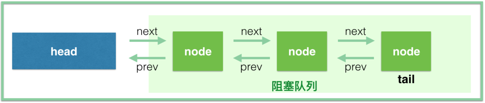
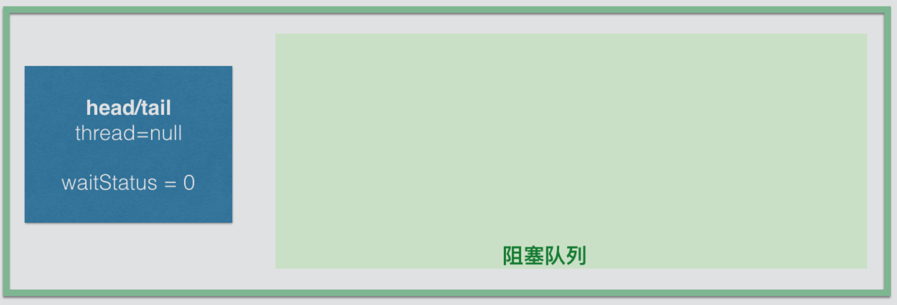
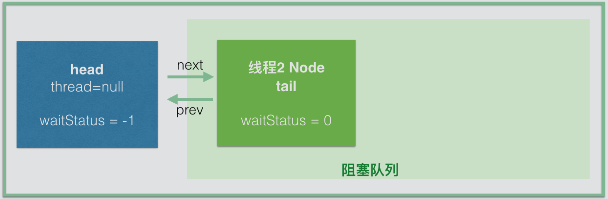
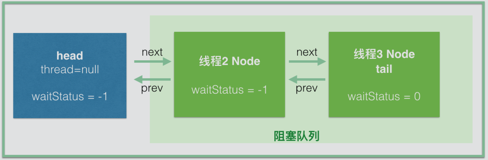

AbstractQueueSynchronizer同步器为提供了一个FIFO队列，用于构建锁或其他组件提供了基础框架，简称为AQS。AQS是Java并发包的基础工具类，是构建ReentrantLock、CountDownLatch、Semaphore、FutureTask等工具的基础组件。

## AQS结构

先看一下AQS的属性

```java
// 头结点，你直接把它当做 当前持有锁的线程 可能是最好理解的
private transient volatile Node head;

// 阻塞的尾节点，每个新的节点进来，都插入到最后，也就形成了一个链表
private transient volatile Node tail;

// 这个是最重要的，代表当前锁的状态，0代表没有被占用，大于 0 代表有线程持有当前锁
// 这个值可以大于 1，是因为锁可以重入，每次重入都加上 1
private volatile int state;

// 代表当前持有独占锁的线程，举个最重要的使用例子，因为锁可以重入
// reentrantLock.lock()可以嵌套调用多次，所以每次用这个来判断当前线程是否已经拥有了锁
// if (currentThread == getExclusiveOwnerThread()) {state++}
private transient Thread exclusiveOwnerThread; //继承自AbstractOwnableSynchronizer
```

同步器中维护的等待队列示意图如下，之后分析中的queue，不包含head



等待队列中每个节点都被封装成一个Node，Node的定义

```java
   static final class Node {
        static final Node SHARED = new Node();	//标识当前节点在共享模式下
        static final Node EXCLUSIVE = null;		//标识当前节点在独占模式下

        static final int CANCELLED =  1; //状态常量：线程被取消
        static final int SIGNAL    = -1; //状态常量：当前节点的后继节点需要被唤醒
        static final int CONDITION = -2; //状态常量：当前节点的线程等待Condition
        static final int PROPAGATE = -3; //状态常量：

        volatile int waitStatus;//等待状态
        volatile Node prev;		//前置节点引用
        volatile Node next;		//后继节点引用
        volatile Thread thread;	//当前节点关联的线程的引用
        Node nextWaiter;		//condition等待队列中后继节点的引用

        /** 当前节点是否是共享模式 */
        final boolean isShared() {
            return nextWaiter == SHARED;
        }

        /** 当前节点的前置节点 */
        final Node predecessor() throws NullPointerException {
            Node p = prev;
            if (p == null)
                throw new NullPointerException();
            else
                return p;
        }

        Node() {
        }
        Node(Thread thread, Node mode) {
            this.nextWaiter = mode;
            this.thread = thread;
        }
        Node(Thread thread, int waitStatus) {
            this.waitStatus = waitStatus;
            this.thread = thread;
        }
    }
```

下面以ReentrantLock为入口，逐步分析AQS。

```java
// 我用个web开发中的service概念
public class OrderService {
    // 使用static，这样每个线程拿到的是同一把锁，当然，spring mvc中service默认就是单例，别纠结这个
    private static ReentrantLock reentrantLock = new ReentrantLock(true);
    public void createOrder() {
        // 比如我们同一时间，只允许一个线程创建订单；lock 之后紧跟着 try 语句
        reentrantLock.lock();
        try {
            // 这块代码同一时间只能有一个线程进来(获取到锁的线程)，其他的线程在lock()方法上阻塞，等待获取到锁，再进来
            // 执行代码...
        } finally {
            // 释放锁
            reentrantLock.unlock();
        }
    }
}
```

ReentrantLock在内部使用内部类Sync来管理锁，所以真正的获取锁和释放锁都是通过Sync来控制的。

```java
abstract static class Sync extends AbstractQueuedSynchronizer {
    // ...
}

abstract static class NofairSync extends AbstractQueuedSynchronizer {
	// ...
}
```

Sync抽象类有两个实现，分别是NofairSync和FairSync，ReentrantLock默认情况下是非公平锁。

```java
public ReentrantLock(boolean fair) {
    sync = fair ? new FairSync() : new NonfairSync();
}
```

## 线程抢锁

下面以FairSync为例，跟着源代码分析

```java
static final class FairSync extends Sync {
    private static final long serialVersionUID = -3000897897090466540L;
	/** 争锁 */
    final void lock() {
        acquire(1);
    }
	
    /** 从AQS继承，获取锁 */
    public final void acquire(int arg) {
        //1、tryAcquire()方法先尝试获取锁，如果能获取成功，就直接返回了，也就不用后续放入队列等操作了
        //2、addWaiter()方法是将当前线程构建成节点加入同步队列中。Node.EXCLUSIVE表示节点是独占模式
        //3、acquireQueued()线程挂起，然后被唤醒的操作都在这个方法中，后续会详细分析它
        if (!tryAcquire(arg) && acquireQueued(addWaiter(Node.EXCLUSIVE), arg)){
            selfInterrupt();
        }
    }
    /**
     * 尝试获取锁
     */
    protected final boolean tryAcquire(int acquires) {
        final Thread current = Thread.currentThread();
        int c = getState();
        if (c == 0) {
            //
            if (!hasQueuedPredecessors() && compareAndSetState(0, acquires)) {
				setExclusiveOwnerThread(current);
                return true;
            }
        }else if (current == getExclusiveOwnerThread()) {
            int nextc = c + acquires;
            if (nextc < 0) throw new Error("Maximum lock count exceeded");
            setState(nextc);
            return true;
        }
        return false;
    }
    
    /**
     * 将当前线程构建成节点，然后通过CAS操作添加到同步队列尾部
     */
    private Node addWaiter(Node mode) {
        Node node = new Node(Thread.currentThread(), mode);
        Node pred = tail;
        // tail != null 表示队列不为空的时候
        if (pred != null) {
            //将当前队列的尾节点设置为新节点的前置节点
            node.prev = pred;
            if (compareAndSetTail(pred, node)) {
                //进入此处，表示设置尾节点成功，将当前节点与之前尾节点链接起来，此时已经双向链接完成
                pred.next = node;
                //节点入队完成，返回当前节点对象
                return node;
            }
        }
        
        //代码执行到此处时，有2种可能：队列时空的、CAS设置失败(有其他线程同时也在竞争入队)
        enq(node);
        return node;
    }
    
    /**
     * 采用自旋的方式将节点添加入队
     * 进入这个方法的2种情景：队列为空、有其他线程竞争入队
     * 自旋的语义是： CAS设置添加尾节点的时候，竞争一次不行就不断尝试，直到成功为止
     */
    private Node enq(final Node node) {
        for (;;) {
            Node t = tail;
            //队列为空的情景
            if (t == null) {
                //CAS更新操作，因为此刻可能有很多线程已经进来了，第一次初始化队列，给后面的做准备
                if (compareAndSetHead(new Node())){
                    //初始化队列完成，head节点的waitStatus=0，Node()创建对象时，Java为int类型的waitStatus设置了默认0
                    //这里没有return！下一次循环将进入下面的分支
                    tail = head;
                }
            } else { //同时存在其他线程竞争入队
                node.prev = t;
                if (compareAndSetTail(t, node)) {
                    t.next = node;
                    return t;
                }
            }
        }
    }
    
    /**
     * 线程挂起，然后被唤醒后去竞争锁的过程方法
     * 1、该方法的参数node，经过addWaiter()方法处理，已经添加到了阻塞队列中了
     * 2、这个方法如果返回true的话，上面调用处就会进入selfInterrupt()，也就是说正常情况下，应该返回false
     */
    final boolean acquireQueued(final Node node, int arg) {
        boolean failed = true;
        try {
            boolean interrupted = false;
            for (;;) {
                //获取当前线程对应的节点的前置节点
                final Node p = node.predecessor();
                /* p==head 表示当前节点是阻塞队列中的第一个，因为它的前置节点是head
                 * 注：阻塞队列不包含head节点，head节点表示占有锁的线程，链表中head后面的才是阻塞队列
                 * tryAcquire()尝试去竞争锁。为什么这么做？
                 * (1)它是队列第一个节点 (2)当前head可能是enq方法中刚初始化的节点，此刻的head节点没有关联线程，锁可竞争
                 */
                if (p == head && tryAcquire(arg)) {
                    setHead(node);
                    p.next = null; // help GC
                    failed = false;
                    return interrupted;
                }
                //执行到此处的情景：(1)当前线程在队列中不是第一个节点 (2)上面tryAcquire()没有抢赢其他线程
                if (shouldParkAfterFailedAcquire(p, node) && parkAndCheckInterrupt()){
                    interrupted = true;
                } 
            }
        } finally {
            // tryAcquire()方法抛出异常的时候，failed为true
            if (failed)
                cancelAcquire(node);
        }
    }
    
    /**
     * 当前线程没有抢到锁，是否需要挂起当前线程
     * pred参数前置节点，node参数是当前线程的节点
     */
    private static boolean shouldParkAfterFailedAcquire(Node pred, Node node) {
        int ws = pred.waitStatus;
        //前置节点的状态为-1，说明前置节点正常，当前线程需要挂起，直接返回true
        if (ws == Node.SIGNAL){
            return true;
        }
        //前置节点的同步状态大于0，说明前置节点线程取消了排队
        //需要知道的是：进入阻塞队列的线程会被挂起，而唤醒的操作是由前置节点完成的
        if (ws > 0) {
            //下面循环是将当前节点prev指向 waitStatus<0的节点。
            //简单说就是为了找一个好爹，因为还要依赖好爹唤醒它，循环向前遍历直到找到好爹为止
            do {
                node.prev = pred = pred.prev;
            } while (pred.waitStatus > 0);
            pred.next = node;
        } else {
            // 进入这个分支，意味着waitStatus不是-1和1，那么只能是0,2,3
            // 在前面的源代码中没有看到设置waitStatus，所以每个节点入队时，节点的waitStatus=0
            // 通过CAS操作将前置节点的waitStatus设置为Node.SIGNAL（即-1）
            compareAndSetWaitStatus(pred, ws, Node.SIGNAL);
        }
        //返回false，则会在acquireQueued()方法的循环中再次进入这个方法
        return false;
    }
    
    /**
     * 当shouldParkAfterFailedAcquire()方法返回true，也就是需要挂起当前线程的时候，这个方法就是用来挂起线程的
     */
    private final boolean parkAndCheckInterrupt() {
        LockSupport.park(this); //LockSupport.park()方法挂起当前线程，然后停在这里，等待被唤醒
        return Thread.interrupted();
    }
    
}
```

## 解锁操作

正常情况下，如果线程获取到锁，线程会被`LockSupport.park(this)`方法挂起，等待被唤醒

```java
public void unlock() {
    //代理给了Sync的release()方法去处理
    sync.release(1);
}

/**
 * Sync的release()方法
 */
public final boolean release(int arg) {
    if (tryRelease(arg)) {
        Node h = head;
        if (h != null && h.waitStatus != 0)
            unparkSuccessor(h);
        return true;
    }
    return false;
}

/**
 * FairSync覆写了Sync的treRelease()方法
 */
protected final boolean tryRelease(int releases) {
    int c = getState() - releases;
    // 只有占有锁的线程才能释放锁，否则就抛出异常；
    if (Thread.currentThread() != getExclusiveOwnerThread()){
        throw new IllegalMonitorStateException();
    }
    
    boolean free = false;
    // 重入锁的重入计数如果为0，表示释放完毕了，否则还不能释放掉
    if (c == 0) {
        free = true;
        setExclusiveOwnerThread(null);
    }
    //更新锁的同步状态
    setState(c);
    return free;
}

/**
 * 唤醒后继节点的线程
 * 当锁释放完毕之后，在tryRelease()方法中会返回true，此时释放锁的过程将进入下面的方法
 * 由release()方法中知道，node参数就是head节点
 */
private void unparkSuccessor(Node node) {
    int ws = node.waitStatus;
    //如果head节点的waitStatus<0，更新其为0
    if (ws < 0){
        compareAndSetWaitStatus(node, ws, 0);
    }
    //接下来处理后继节点。当后继节点为空或者后继节点线程取消等待(waitStatus=1)
    Node s = node.next;
    if (s == null || s.waitStatus > 0) {
        s = null;
        //遍历找到阻塞队列中第一个处于待唤醒状态(waitStatus：0,-1,-2)的节点，后续就会唤醒它
        for (Node t = tail; t != null && t != node; t = t.prev){
            if (t.waitStatus <= 0){
                s = t;
            } 
        }
    }
    // LockSupport.unpark()唤醒阻塞队列中等待状态的第一个节点中的线程
    if (s != null){
        LockSupport.unpark(s.thread);
    }
}

/**
 * 唤醒线程之后，被唤醒的线程将从这个阻塞时的这个方法这里继续向下走
 */
private final boolean parkAndCheckInterrupt() {
    //进入阻塞队列的时候，被阻塞在这里了
    LockSupport.park(this); 
    //Thread.interrupted()用于判断是否发生了中断，同时这句代码也会清除中断状态
    return Thread.interrupted();
}

/**
 * FairSync的selfInterrupt方法，该方法中唤醒线程
 */
static void selfInterrupt() {
    Thread.currentThread().interrupt();
}
```

## 总结

在并发情况下，加锁和解锁需要3个部件的协助：

- 锁状态：通过state这个状态变量用来判断锁是不是被线程占有了。为0的时候表示没有线程占有锁，可以争抢这个锁；用CAS操作设置为1，设置成功就表示抢锁成功，这样其他线程就不能获取了，如果锁可以重入的话，state加1就行了，释放锁就是减1，直到state为0，表示完全释放了锁，因此`lock()和unlock()调用次数必须匹配`，然后唤醒后继节点的线程，让其来占有锁。
- 线程的阻塞和唤醒：AQS采用了LockSupport.park(thread)来挂起线程，unpark()来唤醒线程。
- 阻塞队列：因为争抢锁的线程可能很多，但只能有一个线程拿到锁，其他线程必须都必须等待。这时候需要一个queue来管理这些线程，AQS通过FIFO队列来控制，就是一个双向链表。每个Node节点维护了前置后继节点的链接。

## 示意图解析

首先，第一个线程调用 reentrantLock.lock()，翻到最前面可以发现，tryAcquire(1) 直接就返回 true 了，结束。只是设置了 state=1，连 head 都没有初始化，更谈不上什么阻塞队列了。要是线程 1 调用 unlock() 了，才有线程 2 来，那世界就太太太平了，完全没有交集嘛，那我还要 AQS 干嘛。如果线程 1 没有调用 unlock() 之前，线程 2 调用了 lock(), 想想会发生什么？线程 2 会初始化 head (即new Node( ))，同时线程 2 也会插入到阻塞队列并挂起 (注意看这里是一个 for 循环，而且设置 head 和 tail 的部分是不 return 的，只有入队成功才会跳出循环)

```java
private Node enq(final Node node) {
    for (;;) {
        Node t = tail;
        if (t == null) {
            if (compareAndSetHead(new Node()))
                tail = head;
        } else {
            node.prev = t;
            if (compareAndSetTail(t, node)) {
                t.next = node;
                return t;
            }
        }
    }
}
```

首先，是线程2初始化 head 节点，此时 head、tail、waitStatus=0



然后线程2入队



同时我们也要看此时节点的 waitStatus，我们知道 head 节点是线程 2 初始化的，此时的 waitStatus 没有设置， java 默认会设置为 0，但是到 shouldParkAfterFailedAcquire 这个方法的时候，线程 2 会把前驱节点，也就是 head 的waitStatus设置为 -1。那线程 2 节点此时的 waitStatus 是多少呢，由于没有设置，所以是 0；如果线程 3 此时再进来，直接插到线程 2 的后面就可以了，此时线程 3 的 waitStatus 是 0，到 shouldParkAfterFailedAcquire 方法的时候把前驱节点线程 2 的 waitStatus 设置为 -1。



这里可以简单说下 waitStatus 中 SIGNAL(-1) 状态的意思，Doug Lea 注释的是：代表后继节点需要被唤醒。也就是说这个 waitStatus 其实代表的不是自己的状态，而是后继节点的状态，我们知道，每个 node 在入队的时候，都会把前驱节点的状态改为 SIGNAL，然后阻塞，等待被前驱唤醒。这里涉及的是两个问题：有线程取消了排队、唤醒操作。其实本质是一样的，读者也可以顺着 “waitStatus代表后继节点的状态” 这种思路去看一遍源码。

