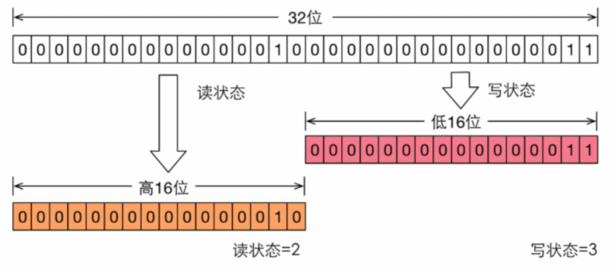

### 读写锁的实现分析

主要包括：读写状态的设计、写锁的获取与释放、读锁的获取与释放以及锁降级

#### 1、读写锁的设计实现

读写锁是基于自定义同步器实现同步功能，而读写状态就是同步器的同步状态。与ReentrantLock不同，ReentrantLock中自定义的同步器的状态表示的是线程重复获取的次数，而ReentrantReadWriteLock中自定义的同步器需要在同步状态（一个整型变量）上维护多个读线程和一个写线程的状态。如果在一个整型变量上维护多种状态，就一定需要按位切割使用这个变量。读写锁是将变量分为2个部分，高16位表示读，低16位表示写。



假设当前锁状态为S，那么get和set状态如下：

- 获取写状态：S&0x0000FFFF，将高16位全部抹去
- 获取读状态：S>>>16，无符号补0，右移16位
- 设置写状态：S + 1
- 设置读状态：S+（1<<16）即S + 0x00010000

根据状态进行判断：S不等于0，当写状态等于0时，


#### 2、写锁的获取与释放

写锁是一个支持重入的排它锁。如果当前线程已经获取了写锁，则增加写状态。如果当前线程在获取写锁时，读锁已经被获取或者该线程不是已经获取到锁的线程，则当前线程进入等待状态。获取写锁的源代码如下：

```java
protected final boolean tryAcquire(int acquires) {
		Thread current = Thread.currentThread();
		int c = getState();
  	//写锁数量，即获取独占锁的重入数
		int w = exclusiveCount(c);
  	//如果同步状态state不等于0，表示已经有其他线程已经获取了写锁或读锁
		if (c != 0) {
      	//存在读锁或者当前线程不是已经获取写锁的线程
				if (w == 0 || current != getExclusiveOwnerThread()){
          return false;
        }
      	//判断同一线程获取写锁的重入次数是否超过最大次数(65535)，写锁支持可重入，但不能超过最大次数
				if (w + exclusiveCount(acquires) > MAX_COUNT){
          throw new Error("Maximum lock count exceeded");
        }
      	//更新状态，此时当前线程已持有写锁，现在是重入，所以只需要修改重入次数
				setState(c + acquires);
				return true;
		}
  	
  	//执行在这里，意味着读锁和写锁都被没有获取过；writerShouldBlock表示是否阻塞
		if (writerShouldBlock() || !compareAndSetState(c, c + acquires)){
       return false;
    }
  	//设置锁为当前线程所有
		setExclusiveOwnerThread(current);
		return true;
}
```

这个方法除了最大重入次数判断之外，还增加了一个读锁是否存在的判断，这样做的原因是：读写锁要确保写操作对读操作可见，如果允许读锁在已被获取的情况下对写锁的获取，那么正在运行的其他线程就无法感知到当前写程序的操作。因此只有读操作全部都释放读锁，写锁才能够获取成功，而如果写锁被成功获取了，其他读写线程都将阻塞。

写锁的释放与ReentrantLock类似，每次释放都减少写状态，当写状态为0，表示写锁已经被释放了，从而其他线程又可以获取锁，而且写操作的结果对后续操作可见。


#### 3、读锁的获取与释放

读锁是一个支持可重入的共享锁。

- 它能够同时被多个线程同时获取，在没有其他写线程访问时，读锁总是能够内获取，而所做的也只是增加锁状态。
- 如果当前线程已经获得了读锁，则增加读状态；如果当前线程在获取状态的时候，其他线程已经获取了写锁，则进入等待队列。
- 读状态是所有线程已经获取到读锁的总次数。每个线程获取读锁的次数只能通过ThreadLocal实现，由线程自身维护

```java
protected final int tryAcquireShared(int unused) {
		Thread current = Thread.currentThread();
		int c = getState();
    //如果写锁线程数不等于0，且持有写锁的线程不是当前线程，进入阻塞等待状态(返回状态-1)
    if (exclusiveCount(c) != 0 && getExclusiveOwnerThread() != current){
      	return -1;
    }
  	//读锁数量
    int r = sharedCount(c);
    /*
     * readerShouldBlock()：读锁是否需要等待(公平锁的原则)
     * r < MAX_COUNT：已持有读锁的数量不能超过最大值
     * compareAndSetState(c, c + SHARED_UNIT)：设置读锁状态
     */
  	
  	//读线程不被阻塞、并且小于最大值、并且比较设置成功
    if (!readerShouldBlock() && r < MAX_COUNT && compareAndSetState(c, c + SHARED_UNIT)) {
    		if (r == 0) { //第一个获取读锁的线程，读线程占用资源数为1
    				firstReader = current;
    				firstReaderHoldCount = 1;
    		} else if (firstReader == current) {//更新首次获取锁线程占用的资源数，表示第一个获取读锁的线程重入的情况
    				firstReaderHoldCount++;
    		} else { 		//更新非首次获取锁线程的HoldCount
    				HoldCounter rh = cachedHoldCounter;//先查缓存
    				if (rh == null || rh.tid != getThreadId(current)){
              	cachedHoldCounter = rh = readHolds.get(); //缓存没有命中，从ThreadLocal中获取
            } else if (rh.count == 0)
    				readHolds.set(rh);
    				rh.count++;
    		}
    		return 1;
    }
    //一次获取读锁失败后，尝试循环获取
    return fullTryAcquireShared(current);
}
```

读锁的释放都减少锁状态计数，减少的值是(1<<16)


#### 4、锁降级

降级锁指的是写锁降级为读锁。

- 如果当前线程拥有写锁，然后将其释放，最后再获取读锁，这种分段完成的过程不能称为“锁降级”。
- 锁降级指的是把持住（当前拥有的）写锁，同时获取读锁，随后释放当前写锁的过程。

