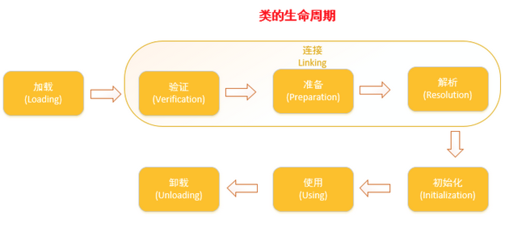
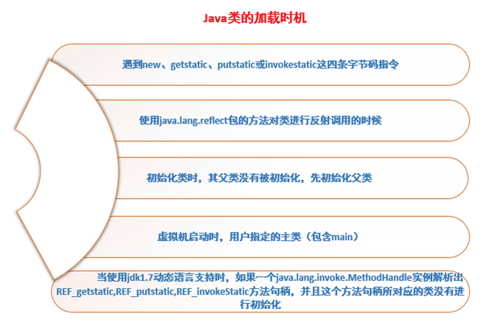

## 1、类加载机制

JVM类加载机制主要包括两个问题：`类加载时机和步骤`、`类加载的方式`。

与那些编译时需要进行连接工作的语言不同，在Java语言里面，类型的加载、连接和初始化过程都是在程序运行时完成的，这种策略虽然会令类加载时稍微增加一些性能开销，但是会为Java应用程序提供高度的灵活性，Java可以动态扩展语言特性就是依赖运行期动态加载和动态链接的特点实现的。

例如，如果编写一个面向接口的应用程序，可以等到运行时再指定其实际的实现类；用户可以通过Java预定义的和自定义的类加载器，让一个本地的应用程序可以在运行时从网络或其他地方加载按一个二进制流作为程序代码的一部分，这种组装应用程序的方式目前已广泛应用于Java程序中。那么对于Java的类加载会产生一些问题：

- 虚拟机什么时候才会加载Class文件并初始化？（`类加载和初始化时机`）
- 虚拟机如何加载一个Class文件呢？（`Java类加载的方式：类加载器、双亲委派机制`）
- 虚拟机加载一个Class文件要经历哪些具体的步骤呢？（`类加载过程和步骤`）


## 2、类加载时机

类的生命周期包括：加载、验证、准备、解析、初始化、使用、卸载。其中验证、准备、解析这三个阶段统称为连接。



加载、验证、准备、初始化和卸载5个阶段的顺序是确定的，类的加载过程必须按照这种顺序按部就班的开始。而解析阶段则不一定：它在某些情况下可以在初始化阶段之后才开始，这是为了支持Java语言的运行时绑定（动态绑定或晚期绑定）。注意类加载过程中必须按照这种顺序`按部就班`地开始，而不是`按部就班`地进行或完成，因为这些解读那通常都是相互交叉地混合式进行，通常会在一个阶段执行的过程中调用、激活另外一个阶段。

### 2.1、类加载时机

Java虚拟机规范中没有进行强制约束，这点可以交给虚拟机的具体实现决定。但是对于初始化阶段，虚拟机规范则是严格规定了有且只有5种情况必须立即对类进行`初始化`（加载、验证、准备当然需要在此之前开始）。这5种情况如下图：



#### 其中第一点主要解释为以下几种情况下：

- 使用new关键字实例化对象
- 获取或设置一个类的静态字段（被final修饰的除外）
- 调用一个类的静态方法时。


对于这5种会触发类进行初始化的场景，虚拟机规范中使用了一个强烈的限定语：“有且只有”，这5种场景中的行为成为对一个类进行`主动引用`。除此以外，所有引用类的方式都不会触发初始化，成为`被动引用`。

`需要特别指出的是，类的实例化和类的初始化是两个完全不同的概念：`

- 类的实例化是指创建一个类的实例对象的过程
- 类的初始化是指为类各个成员赋初始值的过程，是类生命周期中的一个阶段。

### 2.2、被动引用常见的三种情况

- 通过子类引用父类的静态字段，不会导致子类初始化

```java
package com.gopherasset.jvm;
public class PrTest1 {
	public static void main(String[] args) {
		int x = Son.count;
	}
}
class Father {
	static int count = 1;
	static {
		System.out.println("Initialize class Father");
	}
}
class Son extends Father {
	static {
		System.out.println("Initialize class Son");
	}
}


```

```
//输出结果如下：
Initialize class Grandpa
Initialize class Father
```

`对于静态字段，只有直接定义这个字段的类才会被初始化，因此通过其子类来引用父类中定义的静态字段，只会触发父类的初始化而不会触发子类的初始化。至于是否要触发子类的加载和验证，在虚拟机中并未明确规定，这点取决于虚拟机的具体实现。对于Sun HotSpot虚拟机来说，可通过-XX:+TraceClassLoading参数观察到此操作会导致子类的加载。`上面的例子中，由于count字段是在Father类中定义的，因此该类会被初始化，此外，在初始化类Father的时候，虚拟机发现其父类Grandpa还没被初始化，因此虚拟机将先初始化其父类Grandpa，然后初始化子类Father，而Son始终不会被初始化。

- 通过数组来引用类，不会触发此类的初始化

```java
package com.gopherasset.jvm;
public class PrTest2 {
	public static void main(String[] args) {
		E[] es = new E[10];
	}
}

class E {
	static {
		System.out.println("Initialize class E");
	}
}

```

注意，`newArray指令触发的只是数组类型本身的初始化，而不会导致其相关类型的初始化`。

- 常量在编译阶段会存入调用类的常量池中，本质上并没有直接引用到定义常量的类，因此不会触发定义常量的类的初始化。

```java
package com.gopherasset.jvm;

public class PrTest3 {
	public static void main(String[] args) {
		System.out.println(ConstClass.COUNT);
	}
}
class ConstClass {
	static final int COUNT = 1;
	static {
		System.out.println("Initialize class ConstClass");
	}
}
```

上述代码运行之后，只输出“1”，这是因为虽然在Java源码中引用了ConstClass类中常量COUNT，但是编译阶段将此常量的值“1”已经存储到了PrTest3类的常量池中，对常量ConstClass.COUNT的引用实际上都被转化为PrTest3类对自身常量池的引用了。也就是说，实际上PrTest3的class文件中并没有ConstClass类的符号引用入口，这两个类在编译为Class文件之后就不存在关系了。


## 3、类的加载过程


1. ### 加载（loading）

    在加载阶段，虚拟机需要完成以下三件事情：

    1. 通过一个类的全限定名来获取定义此类的二进制流（获取class文件的途径有本地磁盘、网络、动态生成、数据库等）
    2. 将这个字节流所代表的静态数据结构转化为方法区的运行时数据结构。
    3. 在内存（hotspot虚拟机而言）中生成一个代表这个类的java.lang.Object对象，作为方法区这个类的各种数据结构访问入口。

    加载阶段和连接阶段的部分内容是交叉进行的，加载阶段尚未完成，连接阶段可能已经开始。

2. ### 验证（Verification）

    验证是连接阶段的第一步，这一阶段的目的是为了确保Class文件的字节流中包含的信息符合当前虚拟机的运行要求，保证虚拟机安全的运行Class文件。验证阶段大致会完成的检验动作：

    - 文件格式：验证字节流是否符合Class文件格式的规范。（如魔数以0xCAFEBABE开头，主次版本号在虚拟机处理范围）
    - 元数据验证：对字节码描述的信息进行语义分析，保证其描述的信息符合Java语言规范的要求（如是否有父类等）
    - 字节码验证：通过数据流和控制流分析，确定程序语义是合法的、符合逻辑的。
    - 符号引用验证：确保解析动作能正确执行。

    `验证阶段是非常重要的，但不是必须的，它对于程序运行期没有影响。`

3. ### 准备（Preparation）

    `准备阶段是正式为类变量(static成员变量)分配内存并设置类变量初始化值（零值）得阶段，这些变量所使用的内存都将在方法区中进行分配。`这时候进行内存分配的仅包含类变量，而不包含实例变量，实例变量会在对象实例化的时候随着对象一起分配在堆中。其次，这里所说的初始化值通常情况下都是数据类型的零值。

    ```java
    public static int value = 123;
    ```

    那么变量value在准备阶段过后的值为0，而不是123。因为这时候尚未开始执行任何java方法，而把value赋值为123的pustatic指令在程序被编译后，存在于类构造器方法<clint>()之中，所以value赋值为123的动作将会在初始化阶段才会执行。但是“特殊情况”下，当类字段的字段属性是Constant Value时，会在准备阶段初始化微指定的值，所以标注为final之后，value的值在准备阶段初始化为123,而非0。

    ```java
    public static final int value = 123;
    ```

4. ### 解析（Resolution）

    `解析阶段是把常量池内的符号引用替换成直接引用的过程。`符号引用就是Class文件中的CONSTANT_Class_info、CONSTANT_FieldRef_info、CONSTANT_MethodRef_info等类型的常量。`符号引用`：就是一组符号来描述目标，可以是任何字面量。属于编译原理方面的概念，如类或接口的全限定名、字段名称和描述符、方法名称和描述符。`直接引用`：直接指向目标的指针、相对偏移量或一个间接定位到目标的句柄。比如指向方法区某个类的一个指针。

    简单来说，当一个变量引用某个对象的时候，这个引用在.class文件中是以符号引用来存储的。在解析阶段就需要将其解析为直接引用。如果有了直接引用，那引用的目标必定已经在内存中存在了。

5. ### 初始化（Initialization）

    类初始化阶段是类加载过程的最后一步。在前面的类加载过程中，除了在加载阶段用户应用程序可以通过自定义类加载器参与之外，其余动作完全由虚拟机主导和控制。到了初始化阶段，才真正开始执行类中定义Java程序代码。

    在准备阶段，变量已经赋值过一次系统要求的初始值（零值）；而在初始化阶段，则根据程序员通过程序制定的主观计划去初始化类变量和其他资源，或者更直接地说：`初始化阶段是执行类构造器<cinit>()方法的过程。`<cinit>()方法是由编译器自动收集类中的所有类变量的赋值动作和静态语句块static{ }中的语句合并产生的，编译器收集的顺序是由语句在源文件出现顺序所决定的，静态语句块只能访问到定义在静态语句块之前的变量，定义在它之后的变量，在前面的静态语句块可以赋值，但是不能访问。

    ```java
    public class Test{
        static{
            i=0;
            System.out.println(i);//Error：Cannot reference a field before it is defined（非法向前应用）
        }
        static int i=1;
    }
    ```

    注释那一行修改成如下，就可以编译成功了

    ```java
    public class Test{
        static{
            i=0;
            //System.out.println(i);
        }
        static int i=1;
        public static void main(String args[]){
            System.out.println(i);
        }
    }
    ```

    类构造器<cinit>()与实例构造器<init>()不同，它不需要程序员进行显示调用，虚拟机会保证在子类类构造器<cinit>()执行之前，父类的类构造器<cinit>()执行完毕。由于父类的构造器<cinit>()先执行，也就意味着父类中定义的静态代码块/静态变量的初始化要优先于子类先初始化执行。特别地，类构造器<cinit>()对于类或者接口来说并不是必需的，如果一个类中没有静态代码块，也没有对类变量的赋值操作，那么编译器可以不为这个类生产类构造器<cinit>()。

    `虚拟机会保证一个类的类构造器<cinit>()在多线程环境中会被正确的加锁和同步，热如果多个线程同时初始化一个类，那么只会有一个县城去执行这个类的类构造器<cinit>()，其他线程都需要阻塞等待，直到活动线程执行<cinit>()方法完毕。特别需要注意的是，在这种情况下，其他县城虽然会被阻塞，但如果执行<cinit>方法的那个线程退出之后，其他线程在唤醒之后不会再次进入和执行<cinit>()方法，因为在同一个类加载器下，一个类型值只会被初始化一次。`如果一个类的<cinit>()方法中有耗时很长的操作，就可能造成多个线程阻塞，在实际应用中这种阻塞往往是隐藏的。如下示例：

    ```java
    package com.gopherasset.jvm;
    public class DealLoopTest {
    	static {
    		System.out.println("DealloopTest....");
    	}
    	static class DealLoopClass {
    		static {
    			if (true) {
    				System.out.println(Thread.currentThread() + "init DealLoopClass");
    				while (true) {
    				}
    			}
    		}
    	}
    
    	public static void main(String[] args) {
    		Runnable task = new Runnable() {
    			@Override
    			public void run() {
    				System.out.println(Thread.currentThread() + "  start");
    				DealLoopClass dealLoopClass = new DealLoopClass();
    				System.out.println(Thread.currentThread() + "  end");
    			}
    		};
    
    		Thread thread1 = new Thread(task);
    		Thread thread2 = new Thread(task);
    		thread1.start();
    		thread2.start();
    	}
    }
    ```

    输出结果：

    ```
    DealloopTest....
    Thread[Thread-1,5,main]  start
    Thread[Thread-0,5,main]  start
    Thread[Thread-0,5,main]init DealLoopClass
    ```

    如上述代码所示，在初始化DeadLoopClass类时，线程Thread-1得到执行并在执行这个类的类构造器<clinit>() 时，由于该方法包含一个死循环，因此久久不能退出。

## 4、典型实例分析

在Java中创建一个对象常常需要经历如下几个过程：`父类的类构造器<cinit>()-->子类的类构造器<cinit>()-->父类成员变量和实例代码块-->父类的构造函数-->子类的成员变量和实例代码块 --> 子类构造函数。`

```java
package com.gopherasset.jvm;

public class StaticTest {
	public static void main(String[] args) {
		staticFunction();
	}
	static StaticTest staticTest = new StaticTest();
	static {
		//静态代码块
		System.out.println("1");
	}
    
	{    //实例代码块
		System.out.println("2");
	}

	StaticTest() {
		System.out.println("3");
		System.out.println("a=" + a + ",b=" + b);
	}

	public static void staticFunction() {
		System.out.println("4");
	}
	int a = 110;
	static int b = 112;
}
```

输出结果：

```
2
3
a=110,b=0
1
4
```

因为在初始化阶段，当JVM对类StaticTest进行初始化时，首先会执行下面的语句：

```java
static StaticTest staticTest = new StaticTest();
```

也就是实例化StaticTest对象，但是这个时候类都没有初始化完毕，能直接进行实例化么？事实上，这涉及到一个根本问题：`实例化不一定要在类初始化结束之后才能开始初始化。`


