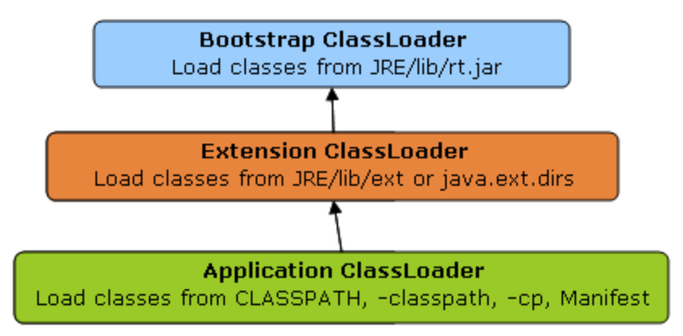
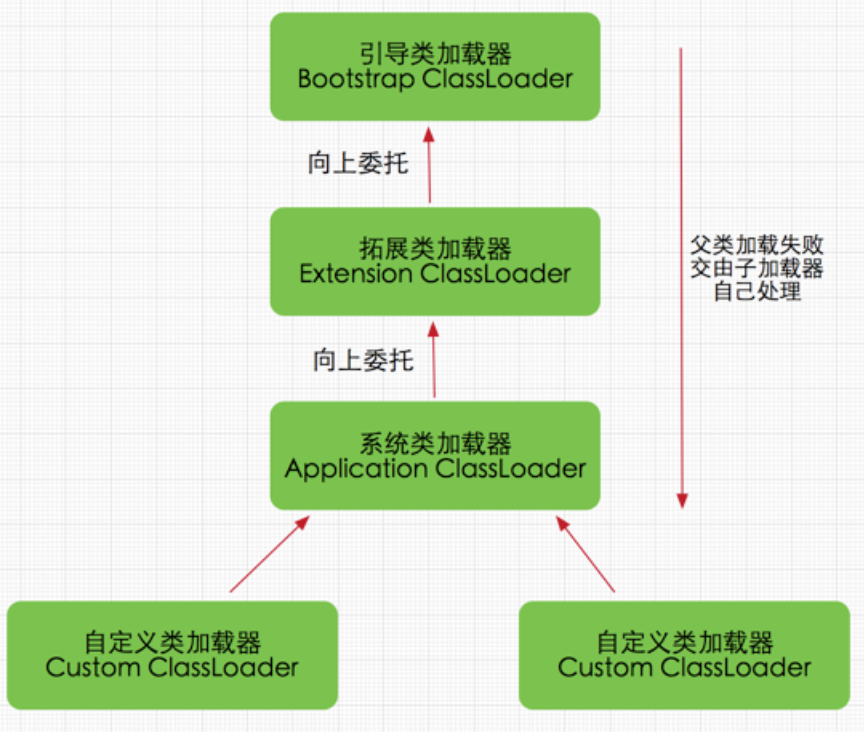
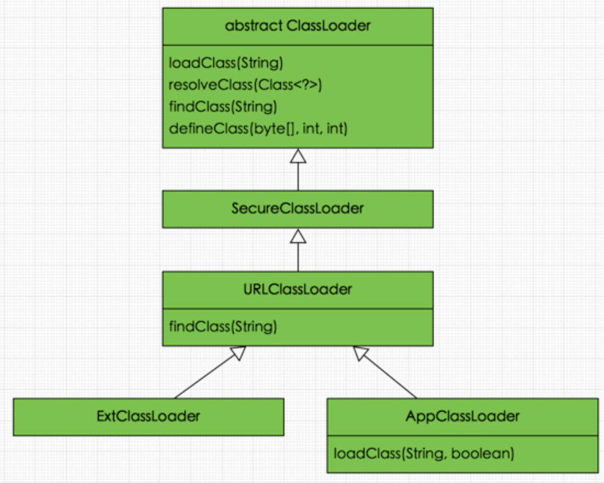
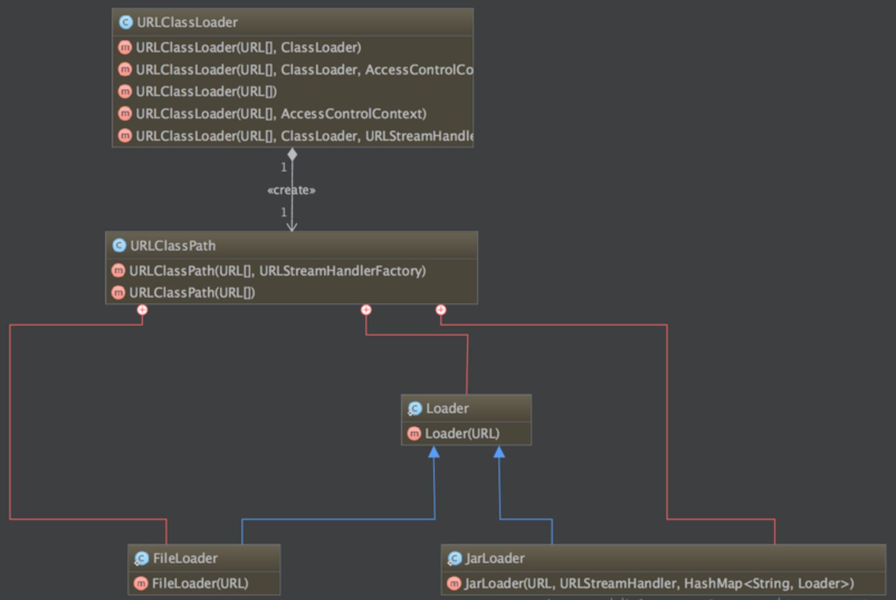
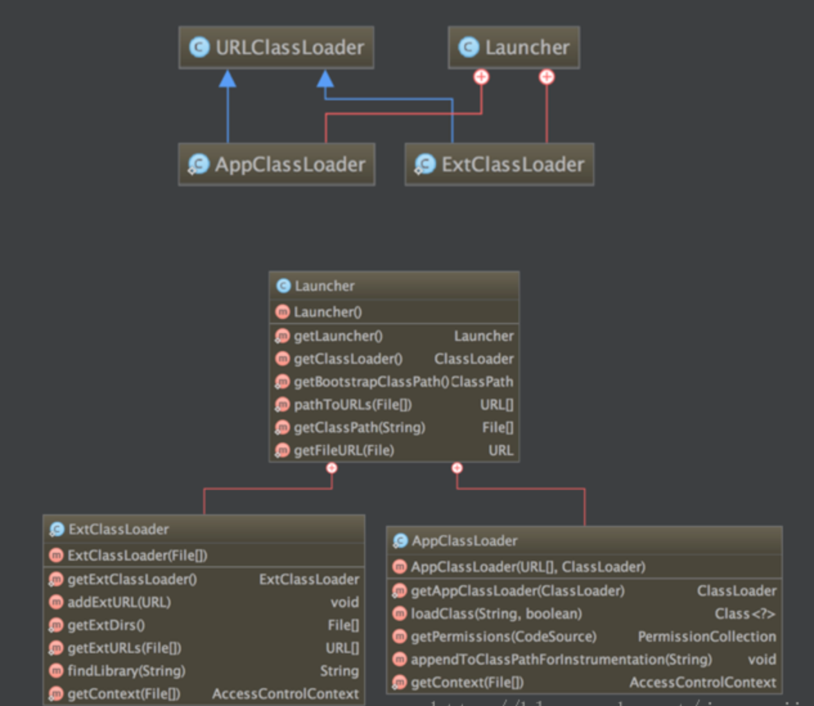
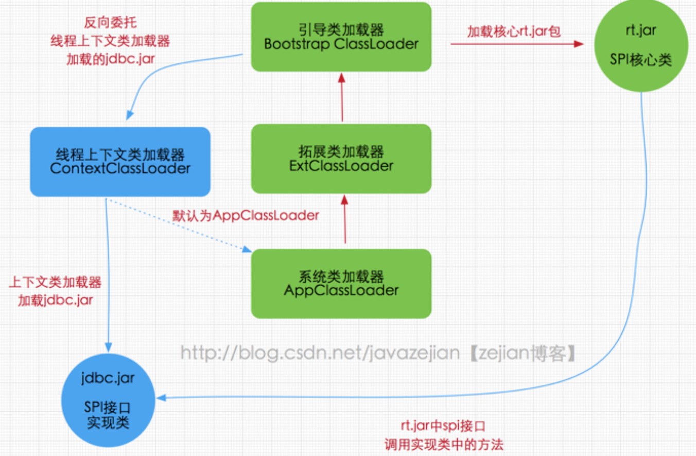
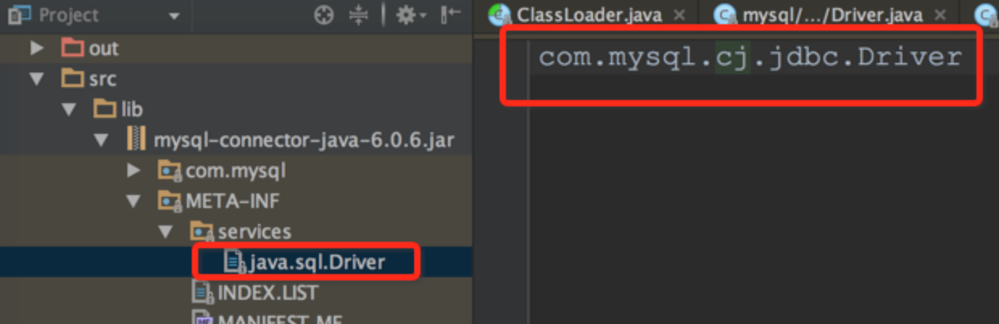

类加载器的工作任务是根据一个类的全限定名加载类的二进制字节流到JVM中，然后转化为一个与目标类对应的java.lang.Class对象实例放入内存方法区。每一个这样的实例代表一个Java类，通过此实例的newInstance()方法可以创建一个类的对象。除此以外，ClassLoader还负责加载Java应用所需要的一些资源文件。

每一个Java类都维护着一个指向定义它的类的类加载器引用，通过getClassLoader()方法可以获取该类加载器。

```java
public class ClassLoaderTree { 
   public static void main(String[] args) { 
       ClassLoader loader = ClassLoaderTree.class.getClassLoader(); 
       while (loader != null) { 
           System.out.println(loader.toString()); 
           loader = loader.getParent(); 
       } 
   } 
}
```

虚拟机请提供了3种类加载器：

- `引导类加载器（bootstrap）`

- `扩展类加载器（Extention）`

- `系统类加载器（System，也成为应用类加载器）。`

### 1、引导类加载器

引导类加载器主要是加载JVM自身需要的类，这个类加载器使用C++语言实现，是虚拟机自身的一部分。它负责将`<JAVA_HOME>/lib下面的核心类库`或者`-Xbootclasspath指定的路径下的jar包`加载到内存中，必须是由虚拟机按照文件名识别的jar包，比如rt.jar包。如果文件名不能被虚拟机识别，即使将jar包丢到该目录下也不会被加载（出于安全考虑，bootstrap加载器只加载java、javax、sun等开头的类）。

### 2、扩展类加载器

扩展类加载器是由SUN公司实现的`sun.misc.Launcher$ExtClasspathLoader`类，由Java语言实现，是Launcher的静态内部类。它负责加载`<JAVA_HOME>\lib\ext目录下或者由系统变量-Djava.ext.dir指定路径的类库，开发者可以直接使用标准扩展类加载器。`

### 3、系统类加载器

系统类加载器也称为应用类加载器，是由SUN公司实现的`sun.misc.Launcher$AppClasspathLoader`，由Java语言实现，它负责加载系统类路径`java -classpath`和`-D java.class.path`指定路径下的类库，也就是我们经常使用的classpath路径，开发者可以直接使用系统类加载器，一般情况下该类加载器是默认的类加载器，通过`ClassLoader.getSystemClassLoader()`方法来获取他它。

在Java的日常应用开发中，类的加载几乎是上述3种类加载器相互配合执行的。在必须要的时候，还可以自定义类加载器，需要注意的是，Java虚拟机对class文件是`按需加载`的方式，也就是说`只有当需要使用该类的时候才会加载class文件到内存生成Class对象，而且加载某个类的class文件时，Java虚拟机采用的是双亲委派模式，即把请求交给父类处理，它是一种委派模式。综上所述，它们之间的关系通过下图清晰的描述：



为什么需要3个类加载器，一方面是分工、一方面是为了实现委托模型。

### 4、双亲委派模式工作原理

双清委派模式要求除了顶层的启动类加载器之外，其余的类加载器都应当有自己的父类加载器。注意的是，双亲委派模式中父子关系并非通常所说的继承关系，而是采用组合方式来复用父类加载器的相关class文件。双亲委派模式工作原理：`：如果一个类加载器收到类加载请求，它并不会自己先去加载，而是把这个加载请求委托给父类加载器去执行，如果父类加载器还存在其父类加载器，依次递归，请求将最终到达启动类加载器，如果父类加载器可以完成加载，则成功返回。倘若父类加载器不能完成加载，子加载器自己才会尝试完成加载。`这就是双亲委派模式。就是每个儿子都很懒，每次有活都是委托给父亲去完成，直到付父亲说自己完成不了，儿子才会自己想办法。。类加载器之间的关系如下图：



### 5、双亲委派模式的优势

采用双亲委派模式的优势是Java类随着它的类加载器一起具备了一种带有优先级的层次关系。

- 通过这种层次关系可以避免类的重复加载，当父加载器已经加载类的情况下，子加载器不需要再加载一次。
- 考虑到安全因素，Java核心api不会被随意替换。

讨论一：假设通过网络传递一个名为`java.lang.Integer`的类，通过双亲委派模式传递到启动类加载器，而启动类加载器在核心api发现这个名字的类，发现该类已被加载，并不会重新加载网络传递来的那个类，直接返回自己已经加载的`Integer.class`类，这样就防止了核心api被篡改替换。

讨论二：假设我们在classpath路径下自定义了一个`java.lang.SingleInteger`类，该类并不存在于`java.lang`包中，经过双亲委派模式，传递到启动类加载器，由于父类加载器路径下没有该类，所以不会加载，将反向委托给子类加载器加载，最终会由系统类加载器加载该类，但是由于`java.lang`是核心api包，需要访问权限，强制加载会报出异常。

```java
java.lang.SecurityException: Prohibited package name: java.lang
```


### 6、类加载器的实现

1. #### ClassLoaderJava中定义的类加载器及其双亲模式的实现，它们的类图如下图：

   

   通过上图可以看出，ClassLoader是顶层类加载器，它是一个抽象类，其后所有类加载器都继承ClassLoader（除了启动类加载器，因为是C++写的）。

   - loadClass(String)

   该方法通过类全限定名加载二进制类型，在JDK1.2之后不再建议用户重写它，但用户可以直接使用它。loadClass()方法是ClassLoader自己实现的，逻辑就是双亲委派模式的实现，resolve参数代表会否生成class对象的同时进行解析相关操作。

   ```java
   protected Class<?> loadClass(String name, boolean resolve)throws ClassNotFoundException{
         synchronized (getClassLoadingLock(name)) {
             // 先从缓存查找该class对象，找到就不用重新加载
             Class<?> c = findLoadedClass(name);
             if (c == null) {
                 long t0 = System.nanoTime();
                 try {
                     if (parent != null) {
                         //如果找不到，则委托给父类加载器去加载
                         c = parent.loadClass(name, false);
                     } else {
                     		//如果没有父类，则委托给启动加载器去加载
                         c = findBootstrapClassOrNull(name);
                     }
                 } catch (ClassNotFoundException e) {
                     // ClassNotFoundException thrown if class not found
                     // from the non-null parent class loader
                 }
                 if (c == null) {
                     // If still not found, then invoke findClass in order
                     // 如果都没有找到，则通过自定义实现的findClass去查找并加载
                     c = findClass(name);
                     // this is the defining class loader; record the stats
                     sun.misc.PerfCounter.getParentDelegationTime().addTime(t1 - t0);
                     sun.misc.PerfCounter.getFindClassTime().addElapsedTimeFrom(t1);
                     sun.misc.PerfCounter.getFindClasses().increment();
                 }
             }
             if (resolve) {//是否需要在加载时进行解析
                 resolveClass(c);
             }
             return c;
         }
     }
   ```

   正如loadClass()方法实现的，当类加载请求到来的时候，先从缓存中查找该对象，如果存在就直接返回，如果不存在就交给该类加载器的父级加载器去加载，倘若没有父加载器，则交给启动类加载器去加载，最后倘若没有找到，就调用findClass()方法去加载。从loadClass()方法实现可以知道如果不想重新定义加载类的实现，也没有复杂的逻辑，只想在运行时加载自己指定的类，可以直接使用`this.getClass().getClassLoader().loadClass("classFullName")`这样就可以直接调用ClassLoader的loadClass方法获取Class对象。

   - findClass(String)

   在JDK1.2之前，自定义类加载器总是重写loadClass()方法。但是`JDK1.2之后，已不再建议用户去覆盖loadClass()方法，而是建议把自定义的类加载逻辑添加到findClass()方法中。从loadClass()方法中看到，findClass()方法是在loadClass()方法中被调用的，当loadClass()中父类加载器加载失败后，会调用findClass()方法来完成类加载，这样就可以保证自定义的类加载器也符合双亲委派模式。`需要注意的`ClassLoader类中并没有findClass()方法的具体实现，而是直接抛出ClassNotFindException异常。同时findClass()方法通常是和defineClass()方法一起使用的。

   ```java
   protected Class<?> findClass(String name) throws ClassNotFoundException {
           throw new ClassNotFoundException(name);
   }
   ```

   - defineClass(byte[ ], int off, int len)

   defineClass()方法是将byte字节流解析成JVM能够识别的Class对象（ClassLoader已经具体实现方法逻辑）。通过这个方法不仅可以通过class文件实例化Class对象，也可以通过其他方式实例化Class对象。defineClass方法和findClass方法一般都是一起使用的，一般情况下，在自定义类加载器会直接覆盖ClassLoader的findClass()方法实现加载逻辑，取得要加载类的字节码转换成流，然后调用defineClass()方法生成了的Class对象。

   ```java
   protected Class<?> findClass(String name) throws ClassNotFoundException {
   	  			//获取类的字节数组
         byte[] classData = getClassData(name);  
         if (classData == null) {
             throw new ClassNotFoundException();
         } else {
   	      	//使用defineClass生成class对象
             return defineClass(name, classData, 0, classData.length);
         }
     }
   ```

   如果直接调用defineClass方法生成类的Class对象，这个类的Class对象并没有解析，可以理解为链接阶段，解析是链接的最后一步，其解析操作需要在初始化阶段完成。

   - resolveClass(Class<?> c)

     使用该方法可以使用类的Class对象创建完成也同时解析，链接阶段主要是对字节码进行验证，为类变量分配内存并设置初始值，同时将字节码中的符号引用转化为直接引用。

2. #### SercureClassLoader

   扩展了ClassLoader，新增了几个与使用相关的代码源（对代码源的位置和证书的验证）和权限定义类验证（主要是对class源码的访问权限）一般情况下不会和这个类直接打交道，而是和它的子类URLClassLoader有所关联。

3. #### URLClassLoader

   ClassLoader类是一个抽象类，很多方法都没有具体实现。URLClassLoader实现了ClassLoader中的很多方法，并新增了URLClassPath协助取得class字节码流等功能，在编写自定义加载器时，如果没有复杂的需求，可以直接继承URLClassLoader，这样可以避免写findClass()及其获取字节码流的底层方法。

   

   - 通过类图可以看出URLClassLoader中存在一个URLClassPath类，通过这个类可以找到要加载的字节码流。也就是说通过URLClassPath负责找到要加载字节码，然后转化为流，最后通过defineClass()方法创建类的Class对象。
   - 从URLClassLoader类结构图可以看出其构造方法都有一个必须传递的参数URL[]，该参数的元素是代表字节码文件的路径，换句话说在创建URLClassLoader对象时必须要指定这个类加载器要到哪个目录下找class文件。同时也应该注意URL[ ]也是URLClassPath类的必传参数，在创建URLClassPath对象时，会根据传递过来的URL数组中的路径判断是文件还是jar包，然后根据不同的路径创建FileLoader或者JarLoader或默认Loader类去加载相应路径下的class文件，而当JVM调用findClass()方法时，就由3个加载器之一将class文件的字节码流加载到内存中，最后利用字节码流创建类的class对象。
   - 如果我们自定义加载器时，选择继承ClassLoader而不是URLClassLoader，就需要自己手工编写findClass()文件的加载逻辑以及获取字节码流的逻辑。

4. AppClassLoader和ExtClassLoader

   这两个类都继承URLClassLoader，是`sun.misc.Launcher`的静态内部类。

   
   
   ExtClassLoader和AppClassLoader都继承了URLClassLoader，这也说明其遵循双亲委派模式。

### 7、加载器间的关系

加载器之间的关系，并非继承关系，主要如下：

- 启动类加载器，C++编写，没有父类
- 扩展类加载器（ExtClassLoader），Java语言编写，父类加载器为null
- 应用类加载器（AppClassLoader），Java语言编写，父类加载器为ExtClassLoader
- 自定义类加载器，父类肯定是应用类加载器AppClassLoader


### 8、线程上下文加载器

在Java应用中存在很多服务提供者接口（Service Provider Interface，SPI）这些接口允许第三方为它提供实现，如常见的SPI有JDBC、JNDI等，这些SPI接口属于Java核心库，一般存在与rt.jar包，由BootStrap类加载器加载，而SPI的第三方实现作为Java应用所依赖的jar包放在了classpath下面。由于SPI接口中的代码经常需要加载第三方的实现类并且使用其中的方法，但SPI的核心接口类是由Bootstrap类加载器加载的，而Bootstrap类加载器无法直接加载SPI的实现类，同时由于双亲委派模式的存在，Bootstrap类加载器无法反向委托AppClassLoader加载SPI的实现类。在这种情况下，就需要一种特殊的类加载器来载入第三方库，线程上下文类加载器就是很好的选择。

线程上下文类加载器是从JDK1.2开始引入的，可以通过`java.lang.Thread`的`getContextClassLoader()`和`setContextClassLoader(ClassLoader cl)`方法来获取和设置线程的上下文，如果没有手动设置，线程将继承其父线程的上下文加载器，初始线程加载器是系统类加载器（AppClassLoader），在线程中运行的代码可以通过此类加载器加载类和资源。



从图中可以看出rt.jar是Bootstrap类加载器载入的，其内包含SPI核心接口类，由于SPI中的类经常需要调用外部实现类的方法，而jdbc.jar在classpath下面，无法通过Bootstrap进行载入，因此只能委托线程上下文类加载器把jdbc.jar中实现类加载到内存以便于SPI相关接口使用，显然这种线程上下文类加载器破坏了双亲委派模式，它在执行过程中抛弃了双亲委派加载链模式，使得程序可以逆向使用类加载器，这使得Java类加载器更加灵活。


为了进一步证实这种场景，不妨看看DriverManager类的源码，DriverManager是Java核心rt.jar包中的类，该类用来管理不同数据库的实现驱动即Driver，它们都实现了Java核心包中的java.sql.Driver接口，如mysql驱动包中的com.mysql.jdbc.Driver，这里主要看看如何加载外部实现类，在DriverManager初始化时会执行如下代码：

```java
//DriverManager是Java核心包rt.jar的类
public class DriverManager {
	//省略不必要的代码
    static {
        loadInitialDrivers();//执行该方法
        println("JDBC DriverManager initialized");
    }

 //loadInitialDrivers方法
 private static void loadInitialDrivers() {
     sun.misc.Providers()
     AccessController.doPrivileged(new PrivilegedAction<Void>() {
            public Void run() {
				//加载外部的Driver的实现类
                ServiceLoader<Driver> loadedDrivers = ServiceLoader.load(Driver.class);
              //省略不必要的代码......
            }
        });
    }
}
```

在DriverManager类初始化时执行了loadInitialDrivers()方法,在该方法中通过ServiceLoader.load(Driver.class);去加载外部实现的驱动类，ServiceLoader类会去读取mysql的jdbc.jar下META-INF文件的内容。如图：



而com.jdbc.mysql.Driver的实现如下：

```java
public class Driver extends com.mysql.cj.jdbc.Driver {
    public Driver() throws SQLException {
        super();
    }
    static {
        System.err.println("The new driver class is `com.mysql.cj.jdbc.Driver'. ");
    }
}
```

新的mysql的jdbc驱动注册代码如下：

```java
String url = "jdbc:mysql://localhost:3306/cm-storylocker?characterEncoding=UTF-8";
// 通过java库获取数据库连接
Connection conn = java.sql.DriverManager.getConnection(url, "root", "root@555");
```

最终会由ServiceLoader会帮助我们处理并最终会通过load()方法实现加载：

```
public static <S> ServiceLoader<S> load(Class<S> service) {
	 //通过线程上下文类加载器加载
      ClassLoader cl = Thread.currentThread().getContextClassLoader();
      return ServiceLoader.load(service, cl);
}
```

很明显了确实通过线程上下文类加载器加载的，实际上核心包的SPI类对外部实现类的加载都是基于线程上下文类加载器执行的，通过这种方式实现了Java核心代码内部去调用外部实现类。线程上下文类加载器默认情况下就是AppClassLoader，那为什么不直接通过getSystemClassLoader()获取类加载器来加载classpath路径下的类的呢？其实是可行的，但这种直接使用getSystemClassLoader()方法获取AppClassLoader加载类有一个缺点，那就是代码部署到不同服务时会出现问题，如把代码部署到Java Web应用服务或者EJB之类的服务将会出问题，因为这些服务使用的线程上下文类加载器并非AppClassLoader，而是Java Web应用服务器自身的类加载器，类加载器不同。所以实际中应该少用getSystemClassLoader()。总之不同的服务使用的可能默认ClassLoader是不同的，但使用线程上下文类加载器总能获取到与当前程序执行相同的ClassLoader，从而避免不必要的问题。

### 9、自定义类加载器

一般来说，自己开发类加载器只需要继承`java.lang.ClassLoader`类，只需要覆盖findClass(String) 方法就行。

JDK1.2以后不建议覆盖loadClass(String)，而覆盖findClass(String)方法就自然实现了双亲委派模式。如下自定义了一个文件类加载器：

```java
public class FileSystemClassLoader extends ClassLoader { 
   private String rootDir; 
   public FileSystemClassLoader(String rootDir) { 
       this.rootDir = rootDir; 
   } 
 
   protected Class<?> findClass(String name) throws ClassNotFoundException { 
       byte[] classData = getClassData(name); 
       if (classData == null) { 
           throw new ClassNotFoundException(); 
       } 
       else { 
           return defineClass(name, classData, 0, classData.length); 
       } 
   } 
   private byte[] getClassData(String className) { 
       String path = classNameToPath(className); 
       try { 
           InputStream ins = new FileInputStream(path); 
           ByteArrayOutputStream baos = new ByteArrayOutputStream(); 
           int bufferSize = 4096; 
           byte[] buffer = new byte[bufferSize]; 
           int bytesNumRead = 0; 
           while ((bytesNumRead = ins.read(buffer)) != -1) { 
               baos.write(buffer, 0, bytesNumRead); 
           } 
           return baos.toByteArray(); 
       } catch (IOException e) { 
           e.printStackTrace(); 
       } 
       return null; 
   } 
   private String classNameToPath(String className) { 
       return rootDir + File.separatorChar + className.replace('.', File.separatorChar) + ".class"; 
   } 
}
```

### 10、类加载器和Web容器

对于运行在Java EE容器中的Web应用来说，类加载器的运行方式和一般的Java应用程序有所不同。不同的Web容器也有差别。以Apache Tomcat为例，一个Tomcat运行实例下部署的每个Web应用都有一个对应的类加载器实例。该类加载器也使用双亲委派模式，所不同的是它是首先尝试去加载某个类，如果找不到再找到父加载器去查找载入，这与一般的加载器顺序刚好相反。这是Java Servlet规范中的推荐做法，其目的是Web应用自己的类优先级高于Web容器提供的类。这个模式的特例是：`Java核心库不在查找查找范围中，这也是保证核心库的类型安全。`

### 11、虚拟机判断类相同的条件

- 类的全名称是否相同
- 加载此类的类加载器是否相同

两个条件缺一不可。即便是相同字节码文件，被不同加载器加载所得到的类也是不同的。如下示例：

```java
package com.example; 
public class Sample { 
   private Sample instance; 
   public void setSample(Object instance) { 
       this.instance = (Sample) instance; 
   } 
}

public void testClassIdentity() { 
   String classDataRootPath = "C:\\workspace\\Classloader\\classData"; 
   FileSystemClassLoader fscl1 = new FileSystemClassLoader(classDataRootPath); 
   FileSystemClassLoader fscl2 = new FileSystemClassLoader(classDataRootPath); 
   String className = "com.example.Sample";    
   try { 
       Class<?> class1 = fscl1.loadClass(className); 
       Object obj1 = class1.newInstance(); 
       Class<?> class2 = fscl2.loadClass(className); 
       Object obj2 = class2.newInstance(); 
       Method setSampleMethod = class1.getMethod("setSample", java.lang.Object.class); 
       setSampleMethod.invoke(obj1, obj2); 
   } catch (Exception e) { 
       e.printStackTrace(); 
   } 
}
```

输出结果如下：

```
java.lang.reflect.InvocationTargetException 
at sun.reflect.NativeMethodAccessorImpl.invoke0(Native Method) 
at sun.reflect.NativeMethodAccessorImpl.invoke(NativeMethodAccessorImpl.java:39) 
at sun.reflect.DelegatingMethodAccessorImpl.invoke(DelegatingMethodAccessorImpl.java:25)
at java.lang.reflect.Method.invoke(Method.java:597) 
at classloader.ClassIdentity.testClassIdentity(ClassIdentity.java:26) 
at classloader.ClassIdentity.main(ClassIdentity.java:9) 
Caused by: java.lang.ClassCastException: com.example.Sample 
cannot be cast to com.example.Sample 
at com.example.Sample.setSample(Sample.java:7) 
... 6 more
```

运行时抛出了 `java.lang.ClassCastException`异常。虽然两个对象 `obj1`和 `obj2`的类的名字相同，但是这两个类是由不同的类加载器实例来加载的，因此不被 Java 虚拟机认为是相同的。

了解了这一点之后，就可以理解代理模式的设计动机了。代理模式是为了保证 Java 核心库的类型安全。所有 Java 应用都至少需要引用 `java.lang.Object`类，也就是说在运行的时候，`java.lang.Object`这个类需要被加载到 Java 虚拟机中。如果这个加载过程由 Java 应用自己的类加载器来完成的话，很可能就存在多个版本的 `java.lang.Object`类，而且这些类之间是不兼容的。通过代理模式，对于 Java 核心库的类的加载工作由引导类加载器来统一完成，保证了 Java 应用所使用的都是同一个版本的 Java 核心库的类，是互相兼容的。

不同的类加载器为相同名称的类创建了额外的名称空间。相同名称的类可以并存在 Java 虚拟机中，只需要用不同的类加载器来加载它们即可。不同类加载器加载的类之间是不兼容的，这就相当于在 Java 虚拟机内部创建了一个个相互隔离的 Java 类空间。