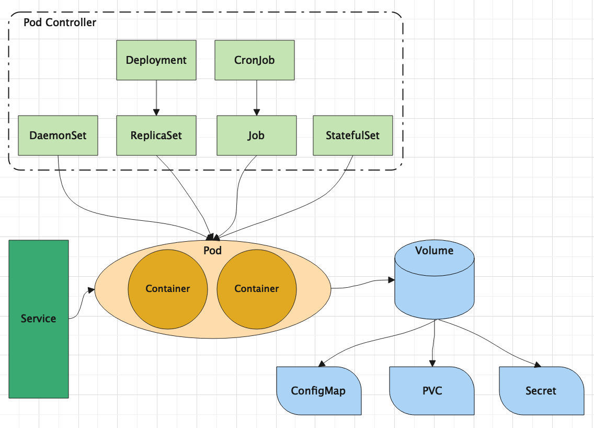

#  资源管理

## 资源管理介绍

在Kubernetes中，所有对象都抽象为资源，用户需要通过操作资源来管理Kubernetes。

> Kubernetes本质上就是一个集群系统，用户在集群中部署各种服务，所谓的部署服务，其实就是在Kubernetes集群中部署一个个容器，并在容器中部署应用程序。
>
> Kubernetes中最小管理单元是Pod而不是容器，所以只能将容器运行在Pod中，而Kubernetes中不会直接直接管理Pod，而是通过**控制器**来管理Pod
>
> Pod可以提供服务之后，就要考虑如何访问Pod中的服务，Kubernetes中提供了**Service**资源来实现这个功能
>
> 如果数据需要持久化，Kubernetes中提供了**存储**系统
>
> 学习Kubernetes的核心，就是学习如何对集群上的**Pod**、**Pod控制器**、**Service**、**存储**等各种资源进行操作



## YAML语言介绍

YAML是一个类似XML、JSON的标记性语言。它强调以**数据**为中心，并不是以标识语言为重点。因而YAML本身的定义非常简单，号称“一种人性化的数据格式语言”。

YAML的语法比较简单，主要有以下几个：

* 大小写敏感
* 使用缩进表示层级关系
* 缩进不允许TAB，只允许空格
* 缩进的的空格数不重要，只要相同层级的元素左对齐即可
* '#'表示行注释
* 如果多个配置文件要写到同一个文件中，需要使用"---"分割

YAML支持以下几种数据类型：

* 纯量：单个的、不可再分的值
* 对象：键值对的集合，又称为映射、字典或哈希
* 数组：一组按次序排序的值，又称为序列或列表

```yaml
#纯量
c1: true		#布尔值
c2: 123456		#整数
c3: 3.14		#浮点数
c4: 2021-05-18 	#日期类型，日期格式必须使用ISO 8601格式，即yyyy-MM-dd
c5: 2021-05-18T21:30:30+08:00 #时间类型，使用ISO 8601格式，日期和时间之间使用T连接，最后使用+代表时区
c6: "hello world"

#数组，形式一
address:
  - 海淀区
  - 昌平区
  - 朝阳区
#数组，形式二
address: [海淀区,昌平区,朝阳区]

#对象，形式一
person:
  name: tanglongan
  age: 18
#对象，形式二
person: {name: tanglongan, age: 18}
```

## 资源管理方式

* 命令式对象管理：

    直接使用命令去操作Kubernetes资源`kubectl run pod --image=nginx `

* 命令式对象配置：

    通过命令配置和配置文件去操作Kubernetes资源`kubectl create/patch -f nginx-pod.yml`

* 声明式对象配置：

    通过apply命令和配置文件去操作Kubernetes资源`kubectl apply -f nginx-pod.yaml`

| 类型           | 操作对象 | 使用环境 | 优点           | 缺点                             |
| -------------- | -------- | -------- | -------------- | -------------------------------- |
| 命令式对象管理 | 对象     | 测试     | 简单           | 只能操作活动对象，无法审计和跟踪 |
| 命令式对象配置 | 文件     | 开发     | 可以审计、跟踪 | 项目大时，配置文件多，操作麻烦   |
| 声明式对象配置 | 目录     | 开发     | 支持目录操作   | 意外情况下难以调试               |

### 命令式对象管理

**Kubectl命令**

kubectl时Kubernetes集群的命令行工具，通过它能够对集群本身进行管理，并能够路在集群上进行容器化应用的安装部署。kubectl命令的语法格式：

```shell
kubectl [command] [type] [name] [flags]
```

* **command**：指定要对资源执行的操作，比如：create、get、delete
* **type**：指定资源类型，比如：deployment、pod、service
* **name**：指定资源的名称，名称大小写敏感
* **flags**：指定额外的可选参数

```shell
#查看所有pod
kubectl get pod

#查看某个Pod详情
kubectl get pod <pod_name>

#查看某个pod，以yaml格式展示结果
kubectl get pod <pod_name> -o yaml
```

**资源类型**

kubernetes中所有的内容都抽象为资源，可以通过如下的命令进行查看：

```shell
kubectl api-resources
```

**常用Command总结**

<table>
	<tr>
		<td>分类</td>
		<td>命令</td>
		<td>说明</td>
	</tr>
	<tr>
		<td rowspan='6'>基本命令</td>
		<td>create</td>
        <td>创建一个资源</td>
	</tr>
    <tr>
		<td>edit</td>
        <td>编辑一个资源</td>
	</tr>
		<td>get</td>
        <td>获取一个资源</td>
	</tr>
    <tr>
		<td>patch</td>
        <td>更新一个资源</td>
	</tr>
    <tr>
		<td>delete</td>
        <td>删除一个资源</td>
	</tr>
    <tr>
		<td>explain</td>
        <td>显示资源文档</td>
	</tr>
	<tr>
		<td rowspan='10'>运行与调试</td>
		<td>run</td>
        <td>在集群中运行一个指定的镜像</td>
	</tr>
    <tr>
		<td>expose</td>
        <td>暴露资源为Service</td>
	</tr>
		<td>describe</td>
        <td>显示资源内部详细信息</td>
	</tr>
    <tr>
		<td>logs</td>
        <td>输出容器在pod中的日志</td>
	</tr>
    <tr>
		<td>attach</td>
        <td>进入运行中的容器里面</td>
	</tr>
    <tr>
		<td>exec</td>
        <td>执行容器中的一个命令</td>
	</tr>
	<tr>
		<td>cp</td>
        <td>在Pod内外复制文件</td>
	</tr>
    <tr>
		<td>rollout</td>
        <td>管理资源的发布，首次展示</td>
	</tr>
    <tr>
		<td>scale</td>
        <td>扩容或缩容Pod的数量</td>
	</tr>
    <tr>
		<td>autoscale</td>
        <td>自动调整Pod的数量</td>
	</tr>
	<tr>
		<td rowspan='2'>高级命令</td>
		<td>apply</td>
        <td>通过文件对资源进行配置</td>
	</tr>
	<tr>
		<td>label</td>
        <td>更新资源上的标签信息</td>
	</tr>
</table>

**常用资源type总结**

<table>
  <tr>
    <td>分类</td>
    <td>命令</td>
    <td>缩写</td>
    <td>说明</td>
  </tr>
  <tr>
    <td rowspan="2">集群级别资源</td>
    <td>nodes</td>
    <td>no</td>
    <td>集群组成部分</td>
  </tr>
  <tr>
    <td>namespaces</td>
    <td>ns</td>
    <td>隔离Pod</td>
  </tr>
  <tr>
    <td>Pod资源</td>
    <td>pods</td>
    <td>po</td>
    <td>装载容器</td>
  </tr>
  <tr>
    <td rowspan="8">Pod资源管理器</td>
    <td>replicationController</td>
    <td>rc</td>
    <td>控制Pod资源</td>
  </tr>
  <tr>
    <td>replicaSets</td>
    <td>rs</td>
    <td>控制Pod资源</td>
  </tr>
  <tr>
    <td>deployments</td>
    <td>deploy</td>
    <td>控制Pod资源</td>
  </tr>
  <tr>
    <td>daemonsets</td>
    <td>ds</td>
    <td>控制Pod资源</td>
  </tr>
  <tr>
    <td>jobs</td>
    <td>jb</td>
    <td>控制Pod资源</td>
  </tr>
  <tr>
    <td>cronjobs</td>
    <td>cj</td>
    <td>控制Pod资源</td>
  </tr>
  <tr>
    <td>horizontalPodAutoScalers</td>
    <td>hpa</td>
    <td>控制Pod资源</td>
  </tr>
  <tr>
    <td>statefulsets</td>
    <td>sts</td>
    <td>控制Pod资源</td>
  </tr>
    <tr>
    <td rowspan="2">服务发现资源</td>
    <td>services</td>
    <td>svc</td>
    <td>统一Pod访问入口</td>
  </tr>
  <tr>
    <td>ingress</td>
    <td>ing</td>
    <td>统一Pod访问入口</td>
  </tr>
   <tr>
    <td rowspan="3">存储资源</td>
    <td>volumeAttachments</td>
    <td>rc</td>
    <td>存储</td>
  </tr>
  <tr>
    <td>persistentVolumes</td>
    <td>pv</td>
    <td>存储</td>
  </tr>
  <tr>
    <td>persistentVolumeClaims</td>
    <td>pvc</td>
    <td>存储</td>
  </tr>
    <tr>
    <td rowspan="2">配置资源</td>
    <td>configMaps</td>
    <td>cm</td>
    <td>配置</td>
  </tr>
  <tr>
    <td>secrets</td>
    <td></td>
    <td>存储</td>
  </tr>
</table>


下面以一个namespace的创建和删除简单演示下命令的使用：

```shell
#创建一个namespace
kubectl create namespace dev

#获取namespace
kubectl get ns

#在此namespace下创建并运行一个nginx的Pod
kubectl run pod --image=nginx -n dev

#查看新创建的Pod
kubectl get pod -n dev

#删除指定的Pod
kubectl delete pod pod-67567887798-pcw7x

#删除指定的namespace
kubectl delete ns dev
```

> 扩展：kubectl可以在node节点上运行吗？
>
> kubectl的运行需要进行配置的，它的配置文件是$HOME/.kube，如果想要在node节点上运行该命令，需要将master节点上的.kube文件复制到node节点上，即在master节点上执行下面操作
>
> mkdir -p $HOME/.kube  																										#在Node节点上执行
>
> sudo scp /etc/kubernetes/admin.conf root@k8snode2:/root/.kube/config  #在Master节点上执行
>
> sudo chown $(id -u):$(id -g) $HOME/.kube/config													#在Node节点上执行

### 命令式对象配置

命令式对象配置方式：**命令 + yaml资源清单文件**

1. 创建一个nginxpod.yaml文件，内容如下：

```yaml
apiVersion: v1
kind: Namespace
metadata:
  name: dev

---

apiVersion: v1
kind: Pod
metadata:
  name: nginxpod
  namespace: dev
spec:
  containers:
    - name: nginx-containers
      image: nginx:1.17.1
```

2. 执行create命令创建资源

```shell
# 根据yaml文件创建定义的资源对象
kubectl create -f nginxpod.yaml
```

3. 执行get命令查看资源

```shell
# 查看yaml文件中定义的所有资源对象
kubectl get -f nginxpod.yaml
```

4. 执行delete命令，删除创建的资源

```shell
# 删除yaml文件中定义的所有资源对象
kubectl delete -f nginxpod.yaml
```

### 声明式对象配置

声明式对象配置与命令式对象配置非常相似，但是它只有一个命令：**apply**

```shell
#第一次执行如下命令，发现创建了资源
kubectl apply -f nginxpod.yaml

#第二次执行如下命令，发现资源没有变动
kubectl apply -f nginxpod.yaml
```

* 声明式对象配置就是使用apply描述一个资源的最终状态（在yaml中声明状态）

* 使用apply操作资源：
    * 如果资源不存在，就新建，等同于**kubectl create**
    * 如果资源已存在，就更新，等同于**kubectl patch**

> 推荐使用的方式
>
> * 创建更新资源：推荐使用声明式对象配置，即kubectl apply -f pod.yaml
> * 删除所有资源：推荐使用命令式对象配置，即kubectl delete -f pod.yaml
> * 查询资源信息：推荐使用命令式对象管理，即kubectl get/describe <resource_name>
