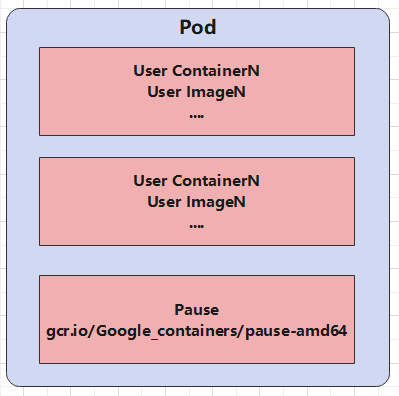
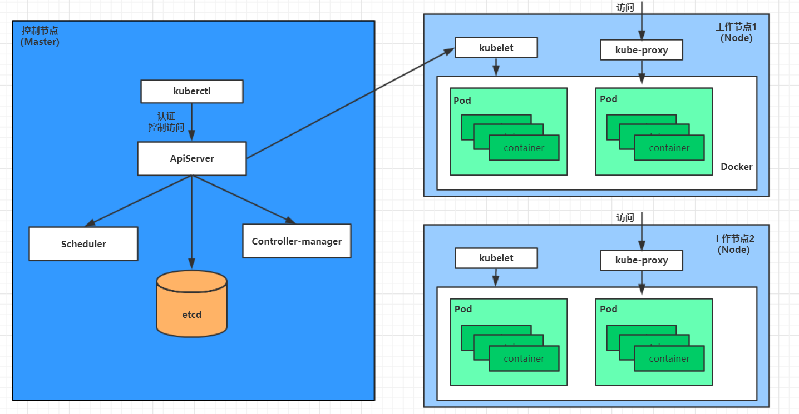
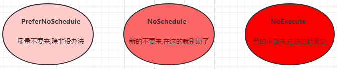

# Pod详解

## Pod介绍

### Pod结构



每个Pod都可以包含一个或多个容器，这些容器可以分为两类：

* 每个用户所在的容器，数量可多可少
* Pause容器，这是每个Pod都会有的**根容器**，它的作用有两个：
    * 可以以它为根据，评估整个Pod的健康状态
    * 可以在跟容器上设置IP地址，其他容器都共享此Pod IP，以实现Pod内部的网络通信。这里是Pod内部的通信，Pod之间的通信采用虚拟二层网络技术实现，当前环境用的是Flannel。

### Pod定义

下面是Pod的资源清单

```yaml
apiVersion: v1                               #版本，v1代表稳定版本，Required
kind: pod                                    #类型，Pod，Required
metadata:                                    #元数据，表示资源的标识信息
  name: String                               #元数据，表示Pod的名称
  namespace: String                          #元数据，表示Pod的名称空间，默认为default
  labels:                                    #元数据，表示Pod的标签列表，以标签的键/值对
    - key: value                             #元数据，标签，以标签的键/值对
  annotations:                               #元数据，表示Pod的注解列表，以注解的键/值对
    - key: value
spec:                                        #Pod中容器的详细定义，Required
  containers:                                #Pod中容器列表，可以有多个容器，Required
    - name: String                           #容器名称，Required
      image: String                          #容器的镜像，Required
      imagePullPolicy: String                #容器的获取策略，可选值：Always|Never|IfNotPresent
      command: [String]                      #容器启动之后执行的命令，不配置时，执行容器内部的命令
      args: [String]                         #容器启动命令的参数列表
      workingDir: String                     #容器的工作目录
      volumeMounts:                          #挂载到容器内部的存储卷
        - name: String                       #引用Pod定义中volume标签下定义的共享存储卷的名称
          mountPath: String                  #存储卷在容器内部挂在的绝对路径
          readonly: boolean                  #存储卷是否只读
      ports:                                 #容器需要暴露的端口列表
      	- name: String                       #端口名称
          containerPort: int                 #容器要暴露的端口
          hostPort: int                      #与容器端口对应映射的宿主机的端口
          protocol: String                   #端口协议，支持TCP/UDP，默认TCP
      env:                                   #容器运行之前需要设置的环境变量列表
        - name: String                       #环境变量名
          value: String                      #环境变量值
      resources:                             #资源限制和请求的设置
        limits:	                             #资源限制
          cpu: String                        #CPU数量限制，容器启动时，用于docker run --cpu-quota参数
          memory: String                     #内存限制，单位可以是MiB/GiB/MB/GB
        requests:                            #资源请求
          cpu: String                        #CPU请求数量，容器启动时，用于docker run --cpu-shares参数
          memory: String                     #内存请求，容器启动时的初始可用数量，单位可以是MiB/GiB/MB/GB
      livenessProbe:                         #Pod中容器健康检查，当探测几次无失败之后就会重启该容器。
        exec:                                #1、exec命令方式检测容器运行健康状态
          command: [String]                  #exec命令方式要执行的脚本或命令
        httpGet:                             #2、HTTP GET请求方式检测各容器健康状态，需要指定path、post
          path: String                       #请求路径
          port: int                          #端口
          host: String                       #主机
          scheme: String                     #协议
          httpHeaders:                       #请求头设置
            - name: String                   #请求头名
              value: String                  #请求头值
        tcpSocket:                            #3、通过tcpSocket方式探测各容器的健康状态
          port: int
        initialDelaySeconds: int              #容器启动之后延迟多少秒再进行探测
        timeoutSeconds: int                   #对容器健康探测的超时时间
        periodSeconds: int                    #两次对容器健康检测的间隔时间
        successThreshold: int
        failureThreshold: int
        securityContext:                      #安全配置
          privileged: false
      restartPolicy: [always|Never|onFailure] #Pod重启策略
      nodeSelector: object                    #节点选择，设置nodeSelector表示将Pod调度到包含这个标签的节点上
      imagePullSecrets: String                #拉取镜像时设置secret，以key:value形式设置
      hostNetwork: false                      #是否使用主机网络模式，默认false；如果设置true，表示使用宿主机网络
  volumes:                                    #在Pod上定义共享存储卷列表
    - name: String                            #存储卷名称
      emptyDir: {}                            #类型为emptyDir的存储卷，与Pod有相同生命周期的临时目录，为空值
      hostPath:                               #类型为hostPath的存储卷，将会挂载Pod所在宿主机的目录
        path: String                          #Pod所在宿主机的目录，该目录将在容器中挂载
      secret:                                 #类型为secret的存储卷，在容器内部挂载集群中预定义的secret对象
        secretName: String
        items:
          - key: String
          - path: String
      configMap:                              #类型为configMap的存储卷，挂载预定义的configMap对象到容器内部
        name: String
        items:
          - key: String
            path: String
```

Kubernetes中基本上所有资源的以及属性都是一样的，主要包含5部分：

* apiVersion ：版本，由系统内部定义，必须可以能通过kubectl api-versions查询到
* kind：类型，由系统内部定义，必须可以能通过kubectl api-resources查询到
* metadata：元数据，主要是资源标识和说明，常用的有name、namespace、labels等
* spec：描述，这是配置中最为重要的一部分，里面对各种资源进行描述
* status：状态信息，里面的内容不需要定义，由kubernetes自动生成

上面的几个一级属性中，spec是接下来要研究的重点，继续看它的常见子属性：

* containers：容器列表，用于定义Pod中的容器
* nodeName：根据nodeName的值将Pod调度到指定的Node节点上
* nodeSelector：根据NodeSelector中定义的信息选择将该Pod调度到哪些节点上，键值对数组
* hostNetwork：是否使用主机网络模式，默认为false，如果为true，标识使用宿主机网络
* volumes：存储卷，用于定义Pod上面挂载的存储信息
* restartPolicy：重启策略，标识Pod在遇到故障时的处理策略

## Pod配置

本小节主要研究**pod.spec.containers**属性，这也是Pod配置中最为关键的一项配置

```shell
[root@node01 ~]> kubectl explain pod.spec.containers
KIND:     Pod
VERSION:  v1
RESOURCE: containers <[]Object>
FIELDS:
    name <string>            # 容器名称
    image <string>           # 容器需要的镜像
    imagePullPolicy <string> # 镜像拉取策略
    command <[]string>       # 容器的启动命令列表，如不指定，使用打包时使用的启动命令
    args <[]string>          # 容器的启动命令需要的参数列表
    env <[]Object>           # 容器的环境变量的配置
    ports                    # 容器需要暴露的端口号列表
    resources <Object>       # 资源显示和资源请求的设置
```

### 基本配置

1. 创建pod-base.yaml，内容如下：

```yaml
apiVersion: v1
kind: Pod
metadata:
  name: pod-base
  namespace: dev
spec:
  containers:
    - name: nginx
      image: nginx:1.17.1
    - name: busybox
      image: busybox:1.30
```

上面定义了一个比较简单的Pod配置，里面有两个容器：

* nginx：用1.17.1版本的nginx镜像创建
* busybox：用1.30版本的busybox镜像创建

2. 创建Pod，观察结果

```shell
#创建Pod
[root@node01]> kubectl create -f pod-base.yaml
pod/pod-base created

#查看Pod列表
[root@node01]> kubectl get pod -n dev
NAME       READY   STATUS     RESTARTS   AGE
pod-base   1/2     NotReady   0          32s		#可以Pod里面两个容器，只有一个运行

#查看Pod详情
kubectl describe pod pod-base -n dev
.....
Events:
  Type     Reason     Age                From               Message
  ----     ------     ----               ----               -------
  Normal   Scheduled  92s                default-scheduler  Successfully assigned dev/pod-base to node02
  Normal   Pulling    91s                kubelet            Pulling image "nginx:1.17.1"
  Normal   Pulled     68s                kubelet            Successfully pulled image "nginx:1.17.1" in 22.5s
  Normal   Created    68s                kubelet            Created container nginx
  Normal   Started    68s                kubelet            Started container nginx
  Normal   Pulling    68s                kubelet            Pulling image "busybox:1.30"
  Normal   Pulled     61s                kubelet            Successfully pulled image "busybox:1.30" in 7.0s
  Normal   Created    18s (x4 over 61s)  kubelet            Created container busybox
  Normal   Started    18s (x4 over 61s)  kubelet            Started container busybox
  Normal   Pulled     18s (x3 over 61s)  kubelet            Container image "busybox:1.30" already present
  Warning  BackOff    3s (x6 over 60s)   kubelet            Back-off restarting failed container

#从Pod详情信息的Events部分，可以看到如下信息：
# 1、Pod是被调度部署在node02节点上
# 2、nginx容器已经创建成功并启动
# 3、busybox容器创建成功，但是启动失败了

#查看Pod状态
[root@node01]# kubectl get pod -n dev
NAME       READY   STATUS             RESTARTS   AGE
pod-base   1/2     CrashLoopBackOff   6          8m12s

#删除pod
[root@node01]# kubectl delete pod pod-base -n dev
pod "pod-base" deleted
```

### 镜像拉取

创建pod-imagepullpolicy.yaml文件，内容如下：

```yaml
apiVersion: v1
kind: Pod
metadata:
  name: pod-imagepullpolicy
  namespace: dev
spec:
  containers:
    - name: nginx
      image: nginx:1.17.1
      imagePullPolicy: Always #镜像拉取策略
    - name: busybox
      image: busybox:1.30
```

imagePullPolicy，用于设置镜像拉取策略，Kubernetes支持配置三种拉取策略：

* Always：总是从远程仓库拉取镜像，即一直从远程获取
* IfNotPresent：本地有则使用本地镜像，本地没有再从远程仓库拉取
* Never：只使用本地仓库，从不去远程仓库拉取，本地没有就报错，即已知使用本地

> 默认值说明：
>
> 如果镜像tag为具体版本号，默认策略是：IfNotPresent
>
> 如果镜像tag是latest，即最新版本，默认策略是Always

```shell
#创建Pod
kubectl create -f pod-imagepullpolicy.yaml 

#查看Pod详情
kubectl get pod pod-imagepullpolicy -n dev
```

### 启动命令

在前面的案例中，一直有一个问题没有解决，就是busybox容器一直没有成功运行，那么到底是什么原因导致的这个容器的故障呢？原来busybox并不是一个程序，而是类似于一个工具类的集合，Kubernetes集群启动管理后，它会自动关闭。解决办法就是让其一直运行，这就用到了command的配置。

创建pod-command.yaml文件，内容如下:

```yaml
apiVersion: v1
kind: Pod
metadata:
  name: pod-command
  namespace: dev
spec:
  containers:
    - name: nginx
      image: nginx:1.17.1
    - name: busybox:1.30
      command:
        [
          "bin/sh",
          "-c",
          "touch /tmp/hello.txt;while true;do /bin/echo hello >> /tmp/hello.txt;sleep 3; done;",
        ]
```

command用于在Pod中的容器初始化完毕之后运行一个命令。操作示例如下：

```shell
[root@node01]> kubectl create -f pod-command.yaml
pod/pod-command created

[root@node01]> kubectl get pod -n dev
NAME          READY   STATUS    RESTARTS   AGE
pod-command   2/2     Running   0          16s  #当busybox容器一直在运行的时候，整个Pod的状态就算是正常了
```

### 环境变量

创建一个pod-env.yaml，内容如下：

```yaml
apiVersion: v1
kind: Pod
metadata:
  name: pod-env
  namespace: dev
spec:
  containers:
    - name: nginx
      image: nginx:1.17.1
    - name: busybox
      image: busybox:1.30
      command:
        [
          "bin/sh",
          "-c",
          "touch /tmp/hello.txt;while true;do /bin/echo hello >> /tmp/hello.txt;sleep 3; done;",
        ]
      env:
        - name: "username"
          value: "admin"
        - name: "password"
          value: "123456"
```

env环境变量，用于在Pod中的容器设置环境变量

```shell
[root@node01]> kubectl apply -f pod-env.yaml
pod/pod-env created

[root@node01]> kubectl get pod -n dev
NAME      READY   STATUS    RESTARTS   AGE
pod-env   2/2     Running   0          6s

#进入Pod的busybox容器，测试设置的环境变量
[root@node01 c5]# kubectl exec pod-env -n dev -c busybox -it /bin/sh
/ # echo $username
admin
```

这种设置环境变量的方式不是很推荐，推荐将这些环境变量存储在配置文件中，后续会进一步了解。

### 端口设置

本小节讲解ports，也就是containers的ports选项，即容器的端口暴露。

**kubectl explain pod.spec.containers.ports**的子选项：

```shell
[root@node01]> kubectl explain pod.spec.containers.ports
KIND:     Pod
VERSION:  v1
RESOURCE: ports <[]Object> #数组，代表可以有多个容器

FIELDS:
   name	<string>           # 端口名称，如果指定，必须保证name在pod中是唯一的
   containerPort <integer> # required 容器要暴露和监听的端口，该端口是暴露在Pod的IP地址上
   hostIP <string>         # 要将外部端口绑定到的主机IP，一般不设置
   hostPort <integer>      # 容器端口要在主机上公开的端口，一般不设置。如果设置，主机上只能运行容器的一个副本
   protocol <string>       # 端口的协议，必须是UDP、TCP、SCTP之一，默认是TCP
```

首先创建一个pod-ports.yaml，内容如下：

```shell
# 创建容器
[root@node01]> kubectl apply -f pod-ports.yaml
pod/pod-ports created

#查看Pod
[root@node01]> kubectl get pod -n dev -o wide
NAME        READY   STATUS    RESTARTS   AGE     IP            NODE     NOMINATED NODE   READINESS GATES
pod-ports   1/1     Running   0          3m35s   10.244.1.13   node02   <none>           <none>

#查看Pod的详情，JSON格式。可以看到容器暴露的端口以及PodIP
[root@node01 c5]> kubectl get pod -n dev pod-ports -o json
{
  "apiVersion": "v1",
  "kind": "Pod",
  "status": {
    "containerStatuses": [
      {
        "containerID": "docker://fb22faca6004ca43e4aa6b71b66963976b3214427c96614b244443677114c0e9",
        "image": "nginx:1.17.1",
        "imageID": "docker-pullable://nginx@sha256:b4b9b3eee194703fc2fa8afa",
        "lastState": {},
        "name": "nginx",
        "ready": true,
        "restartCount": 0,
        "started": true,
        "state": {
          "running": {
            "startedAt": "2021-05-21T06:21:01Z"
          }
        }
      }
    ],
    "hostIP": "172.16.210.11",
    "phase": "Running",
    "podIP": "10.244.1.13",
    "podIPs": [
      {
        "ip": "10.244.1.13"
      }
    ],
    "qosClass": "BestEffort",
    "startTime": "2021-05-21T06:21:00Z"
  }
}

# 访问Nginx的服务  NodeIP:containerPort
[root@node01 c5]# curl http://10.244.1.13:80
<!DOCTYPE html>
<html>
<head>
<title>Welcome to nginx!</title>
<style>
    body {
        width: 35em;
        margin: 0 auto;
        font-family: Tahoma, Verdana, Arial, sans-serif;
    }
</style>
</head>
<body>
<h1>Welcome to nginx!</h1>
<p>If you see this page, the nginx web server is successfully installed and
working. Further configuration is required.</p>

<p>For online documentation and support please refer to
<a href="http://nginx.org/">nginx.org</a>.<br/>
Commercial support is available at
<a href="http://nginx.com/">nginx.com</a>.</p>

<p><em>Thank you for using nginx.</em></p>
</body>
</html>
```

### 资源配额

容器中运行的程序要运行，肯定要占用一定的资源，比如CPU和内存等。如果不对某个容器的资源做限制，那么它就可能吃掉大量资源，导致其他容器无法运行。针对这种情况，Kubernetes提供了对内存和CPU的资源进行配额的机制，这种机制主要通过resources选项实现。

```shell
[root@node01 c5]> kubectl explain pod.spec.containers.resources
KIND:     Pod
VERSION:  v1
RESOURCE: resources <Object>

FIELDS:
   limits <map[string]string>   #用于限制运行时容器的最大占用资源，当容器占用资源超过limits时会被终止，并进行重启
   requests <map[string]string> #用于设置容器需要的最小资源，如果环境资源不够，容器将无法启动
```

可以通过**limits**和**requests**两个选项设置资源的上下限。接下来，编写一个测试案例，创建pod-resources.yaml，内容如下：

```yaml
apiVersion: v1
kind: Pod
metadata:
  name: pod-reqources
  namespace: dev
spec:
  containers:
    - name: nginx
      image: nginx:1.17.1
      resources:       #资源配额
        limits:        #资源限制（上限）
          cpu: "2"     #CPU最多2核
          memory: "2G" #内存最多2G
        requests:      #请求资源（下限）
          cpu: "1"     #CPU最少1核
          memory: "1G" #内存最少1G
```

## Pod生命周期

### 基本流程

一般将Pod对象从创建到终止的这段时间范围称为Pod的生命周期，它主要包含如下的过程：

* Pod创建过程
* 运行初始化容器（init container）过程
* 运行主容器（main container）过程
    * 容器启动后钩子（post start）和容器终止前钩子（pre stop）
    * 容器的存活性探测（liveness probe）、就绪性探测（readiness probe）
* Pod终止状态

整个生命周期中，Pod会出现5种状态，分别如下：

* 挂起（Pending）：apiserver已经创建了Pod资源对象，但它尚未被调度完成或者仍然处于下载镜像的过程中
* 运行中（Running）：Pod已经被调度到至某个节点，并且所有容器都已经被kubectl创建完成
* 成功（Successed）：Pod中所有容器都已经成功终止并且不会被重启
* 失败（Faild）：所有容器都已经被终止，但至少有一个容器终止失败，即容器返回了非0值的退出状态
* 未知（Unknown）：apiserver无法正常获取Pod对象的状态信息，通常由网络通信失败所导致

### 创建与终止

**Pod的创建过程**

1. 用户通过kubectl或其他apiserver客户端提交需要创建的Pod信息给apiServer
2. apiServer开始生成Pod对象的信息，并将信息存入etcd，然后染回确认信息至客户端
3. apiServer开始反映etcd中的Pod对象变化，其他组件使用watch机制来跟踪检查apiServer上的变动
4. scheduler发现有新的Pod需要创建，开始为Pod分配主机并将结果信息更新到apiServer
5. node节点上的kubelet发现有Pod调度过来了，尝试调用Docker创建启动容器，并将结果告知apiServer
6. apiServer将接收到信息保存在etcd中



**Pod的终止过程**

1. 用户向apiServer发送删除pod对象的命令
2. apiServcer中的pod对象信息会随着时间的推移而更新，在宽限期内（默认30s），pod被视为dead
3. 将pod标记为terminating状态
4. kubelet在监控到pod对象转为terminating状态的同时启动pod关闭过程
5. 端点控制器监控到pod对象的关闭行为时将其从所有匹配到此端点的service资源的端点列表中移除
6. 如果当前pod对象定义了preStop钩子处理器，则在其标记为terminating后即会以同步的方式启动执行
7. pod对象中的容器进程收到停止信号
8. 宽限期结束后，若pod中还存在仍在运行的进程，那么pod对象会收到立即终止的信号
9. kubelet请求apiServer将此pod资源的宽限期设置为0从而完成删除操作，此时pod对于用户已不可见

### 初始化容器

**初始化容器是在Pod的主容器启动之前要运行的容器，主要是做一些主容器的前置工作**，它具有两大特征：

* 初始化容器必须运行完成直至结束，若某初始化容器运行失败，那么Kubernetes需要重启它直到成功完成
* 初始化容器必须按照定义的顺序执行，当且仅当一个成功之后，后面的一个才能运行

初始化容器有很多的应用场景，下面列出的是最常见的几个：

* 提供主容器镜像中不具备的工具程序或自定义代码
* 初始化容器要先于应用容器串行启动并运行完成，因此可用于延后应用容器的启动直至其依赖的条件得到满足

接下来做一个案例，模拟下面这个需求：

假设要以主容器来运行Nginx，但是需要在运行Nginx之前先要能够连接上MySQL和Redis所在服务器

为了简化测试，事先规定好MySQL和Redis服务器的地址分别为：172.16.210.10、172.16.210.11

1. 创建pod-initcontainer.yaml，内容如下：

```yaml
apiVersion: v1
kind: Pod
metadata:
  name: pod-initcontainer
  namespace: dev
spec:
  containers:
    - name: main-container
      image: nginx:1.17.1
      ports:
        - name: nginx-port
          containerPort: 80
  initContainers:
    - name: test-mysql
      image: busybox:1.30
      command:
        [
          "sh",
          "-c",
          "until ping 172.16.210.13 -c 1; do echo waiting for mysql...; sleep 2; done;",
        ]
    - name: test-redis
      image: busybox:1.30
      command:
        [
          "sh",
          "-c",
          "until ping 172.16.210.11 -c 1; do echo waiting for redis...; sleep 2; done;",
        ]
```

2. 然后创建Pod，执行命令和输出结果如下：

```shell
# 创建Pod
[root@node01]> kubectl create -f pod-initcontainer.yaml
pod/pod-initcontainer created

# 查看Pod状态
# 发现Pod卡在第一个初始化容器的过程中，后面的容器不会运行“Init:0/2”（当前集群中没有172.16.210.13的主机，所以ping不通，阻塞住了）
[root@node01]> kubectl get pod -n dev
NAME                READY   STATUS     RESTARTS   AGE
pod-initcontainer   0/1     Init:0/2   0          9s

#动态查看Pod
kubectl get pod pod-container -n dev -w

#接下来修改yaml文件，将test-mysql容器command中IP修改为172.16.210.12
#重新创建Pod就可以成功了
kubectl delete pod pod-initcontainer -n dev
kubectl create -f pod-initcontainer.yaml
```

### 钩子函数

钩子函数能够感知自身生命周期中的事件，并在相应的时刻到来时运行用户指定的程序代码。

Kubernetes在主容器的启动之后和停止之前提供了两个钩子函数：

* post start：容器创建之后，如果失败了会重启容器
* Pre stop：容器终止之前，执行完成之后容器将成功终止，在其完成之前会阻塞删除容器的操作

钩子处理器支持使用下面三种定义动作：

* exec 命令：在容器内执行一次命令

```yaml
lifecycle:
  postStart:
    exec:
      command:
        - cat
        - /tmp/healthy
```

* TCPSocket：在当前容器尝试访问容器指定的Socket

```yaml
lifecycle:
  postStart:
    tcpSocket:
      port: 8080
```

* HTTPGet：在当前容器中向某URL发起http请求

```yaml
lifecycle:
  postStart:
    httpGet:
      scheme:  HTTP         #支持的协议 http或https
      host： 172.16.210.12  #主机地址
      port:  80             #端口号
      path:  /              #URI地址
```

**一般来说，exec方式使用较多，HTTPGet次之，TCPSocket最后**。

接下来，exec方式为示例，

1. 首先创建pod-hook-exec.yaml文件，内容如下：

```yaml
apiVersion: v1
kind: Pod
metadata:
  name: pod-hook-exec
  namespace: dev
spec:
  containers:
    - name: main-container
      image: nginx:1.17.1
      ports:
        - name: nginx-port
          containerPort: 80
      lifecycle:
        postStart:
          exec:
            command:
              [
                "/bin/sh",
                "-c",
                "echo postStart... > /usr/share/nginx/html/index.html",
              ]
        preStop:
          exec:
            command: ["/usr/sbin/nginx", "-s", "quit"]
```

2. 创建Pod，观察结果

```shell
# 创建Pod
[root@node01]> kubectl create -f pod-hook-exec.yaml
pod/pod-hook-exec created

# 查看Pod
[root@node01]> kubectl get pod pod-hook-exec -n dev -o wide
NAME            READY   STATUS    RESTARTS   AGE   IP            NODE     NOMINATED NODE   READINESS GATES
pod-hook-exec   1/1     Running   0          32s   10.244.1.17   node02   <none>           <none>

#访问服务
[root@node01]> curl http://10.244.1.17:80
postStart...
```

### 容器探测

容器探测用于检测容器中的应用实例是否正常工作，是保障业务可用性的一种传统机制。如果经过探测，实例的状态不符合预期，那么Kubernetes就会把该问题实例“移除”，不承担业务流量。Kubernetes提供了两种探针来实现容器探针，分别是：

* liveness probe：存活性探测，用于检测应用实例当前是否能够处于正常运行状态，如果不是，k8s会重启容器
* readiness probe：就绪性探测，用于检测应用实例当前是否可以接收请求，如果不能，k8s不会转发流程

**liveness Probe决定是否重启；readiness probe决定了是否转发流量**

上面两种探针目前支持三种探测方式：

* exec命令：在容器内执行一次命令，如果命令执行的退出码是0，则认为程序正常，否则不正常

```yaml
lifecycle:
  exec:
    command:
    - cat
    - /tmp/healthy
```

* TCPSocket：将尝试访问一个用户容器的端口，如果能够建立连接，则认为程序正常，否则不正常

```yaml
lifecycle:
  tcpSocket:
    port: 8080
```

* HTTPGet：调用容器内Web应用的URL，如果返回的状态码是在200和399之间，则认为程序正常，否则不正常

```yaml
lifecycle:
  httpGet:
    scheme:  HTTP
    host： 172.16.210.12
    port:  80
    path:  /
```

**方式一：exec**

1. 创建pod-liveness-exec.yaml文件

```yaml
apiVersion: v1
kind: Pod
metadata:
  name: pod-liveness-exec
  namespace: dev
spec:
  containers:
    - name: main-container
      image: nginx:1.17.1
      ports:
        - name: nginx-port
          containerPort: 80
      livenessProbe:
        exec:
          command: ["/bin/cat", "/tmp/hello.txt"] #执行一个查看文件的命令
```

2. 创建Pod，观察效果：

```shell
[root@node01 c5]> kubectl describe pod pod-liveness-exec -n dev
.........
Events:
  Type     Reason     Age                   From               Message
  ----     ------     ----                  ----               -------
  Normal   Scheduled  2m41s default-scheduler  Successfully assigned dev/pod-liveness-exec to node02
  Normal   Pulled     78s   kubelet    Container image "nginx:1.17.1" already present on machine
  Normal   Created    78s   kubelet    Created container main-container
  Normal   Started    78s   kubelet    Started container main-container
  Normal   Killing    78s   kubelet    Container main-container failed liveness probe, will be restarted
  Warning  Unhealthy  68s   kubelet    Liveness probe failed: /bin/cat: /tmp/hello.txt: No such file or directory
  
# 上面输出结果的最后面部分可以看出，Nginx容器启动之后进行了健康检查
# 检查失败之后，容器再被kill掉，然后尝试进行重启，这是由于重启策略的作用，后面会进一步了解它
# 稍等一会儿，再观察Pod信息，就可以看到RESTARTS不再是0，而是一直增长
[root@node01 c5]> kubectl get pod -n dev
NAME                READY   STATUS             RESTARTS   AGE
pod-liveness-exec   0/1     CrashLoopBackOff   6          6m54s

# 当然接下来，可以修改成一个存在的文件，比如/tmp/hello.txt，再试，结果就正常了......
```

**方式二：TCPSocket**

1. 首先创建pod-liveness-tcpsocket.yaml

```yaml
apiVersion: v1
kind: Pod
metadata:
  name: pod-liveness-tcpsocket
  namespace: dev
spec:
  containers:
    - name: main-container
      image: nginx:1.17.1
      ports:
        - name: nginx-port
          containerPort: 80
      livenessProbe:
        tcpSocket:
          port: 8080
```

2. 创建Pod，观察结果

```shell
# 创建Pod
[root@node01]> kubectl create -f pod-liveness-tcpsocket.yaml
pod/pod-hook-exec created

# 观察Pod
[root@node01]> kubectl describe pod pod-liveness-tcpsocket -n dev
......
Events:
Type     Reason     Age   From               Message
----     ------     ----  ----               -------
Normal   Scheduled  13s   default-scheduler  Successfully assigned dev/pod-liveness-tcpsocket to node02
Normal   Pulled     12s   kubelet   Container image "nginx:1.17.1" already present on machine
Normal   Created    12s   kubelet   Created container main-container
Normal   Started    12s   kubelet   Started container main-container
Warning  Unhealthy  2s    kubelet   Liveness probe failed: dial tcp 10.244.1.20:8080: connect: connection refused
# 观察上面的信息，发现尝试访问8080端口,但是失败了
# 稍等一会之后，再观察pod信息，就可以看到RESTARTS不再是0，而是一直增长
[root@node01]> kubectl get pod -n dev
NAME                     READY   STATUS             RESTARTS   AGE
pod-liveness-tcpsocket   0/1     CrashLoopBackOff   4          2m50s

# 当然接下来，可以修改成一个可以访问的端口，比如80，再试，结果就正常了......
```

**方式三：HTTPGet**

1. 创建pod-livebess-httpget.yaml

```yaml
apiVersion: v1
kind: Pod
metadata:
  name: pod-hook-exec
  namespace: dev
spec:
  containers:
    - name: main-container
      image: nginx:1.17.1
      ports:
        - name: nginx-port
          containerPort: 80
      livenessProbe:
        httpGet: #请求http://localhost:80/hello
          scheme: HTTP
          port: 80
          path: /hello
```

2. 创建Pod，观察结果：

```shell
[root@node01]> kubectl create -f pod-liveness-httpget.yaml
pod/pod-liveness-httpget created

[root@node01]> kubectl get pod -n dev
NAME                   READY   STATUS    RESTARTS   AGE
pod-liveness-httpget   1/1     Running   0          13s


[root@node01]> kubectl describe pod pod-liveness-httpget -n dev
......
Events:
  Type     Reason     Age   From               Message
  ----     ------     ----  ----               -------
  Normal   Scheduled  38s   default-scheduler  Successfully assigned dev/pod-liveness-httpget to node02
  Normal   Pulled     14s   kubelet            Container image "nginx:1.17.1" already present on machine
  Normal   Created    14s   kubelet            Created container main-container
  Normal   Started    14s   kubelet            Started container main-container
  Normal   Killing    14s   kubelet            Container main-container failed liveness probe, will be restarted
  Warning  Unhealthy  4s    kubelet            Liveness probe failed: HTTP probe failed with statuscode: 404

# 观察上面信息，尝试访问路径，但是未找到,出现404错误
# 稍等一会之后，再观察pod信息，就可以看到RESTARTS不再是0，而是一直增长
[root@node01]> kubectl get pod -n dev
NAME                   READY   STATUS    RESTARTS   AGE
pod-liveness-httpget   1/1     Running   5          3m28s
# 当然接下来，可以修改成一个可以访问的路径path，比如/，再试，结果就正常了......
```

至此，已经使用livenessProbe演示了三种探测方式，但是查看livenessProbe的子属性，会发现除了这三种方式还有一些其他的属性：

```shell
[root@node01]> kubectl explain pod.spec.containers.livenessProbe
FIELDS:
   exec <Object>  
   tcpSocket    <Object>
   httpGet      <Object>
   initialDelaySeconds  <integer>  # 容器启动后等待多少秒执行第一次探测
   timeoutSeconds       <integer>  # 探测超时时间。默认1秒，最小1秒
   periodSeconds        <integer>  # 执行探测的频率。默认是10秒，最小1秒
   failureThreshold     <integer>  # 连续探测失败多少次才被认定为失败。默认是3。最小值是1
   successThreshold     <integer>  # 连续探测成功多少次才被认定为成功。默认是1
```

## Pod调度

### 基本介绍

在默认情况下，一个Pod在哪个Node节点上运行，是由Scheduler组件采用相应的算法计算出来的，这个过程是不受人工控制的。但是在实际使用中，这可能不满足需求，因为很多情况下，我们想控制某些Pod到达某些节点上，那么应该怎么做呢？这就要求了解Kubernetes对Pod的调度规则，Kubernetes提供了四大类调度方式：

* **自动调度**：运行在哪个节点上完全由Scheduler经过一系列的算法计算出来
* **定向调度**：NodeName、NodeSelector
* **亲和度调度**：NodeAffinity、PodAffinity、PodAntiAffinity
* **污点（容忍）调度**：Taints、Toleration

### 定向调度

定向调度，指的是利用在Pod上声明nodeName或者nodeSelector，以此将Pod调度到期望的Pod节点上。注意，这里的调度是强制的，这就意味着即使要调度的目标Node不存在，也会向上面进行调度。只不过pod运行失败而已。

**NodeName**

NodeName用于强制约束将Pod调度到指定Name的Node节点上。这种方式，其实就是直接跳过Scheduler的调度计算逻辑，直接将Pod调度到指定的节点。

1. 首先创建一个pod-nodename.yaml

```yaml
apiVersion: v1
kind: Pod
metadata:
  name: pod-nodename
  namespace: dev
spec:
  containers:
    - name: nginx
      image: nginx:1.17.1
  nodename: node03        #指定调度到node03节点上
```

2. 然后创建Pod，观察变化

```shell
[root@node01]> kubectl create -f pod-nodename.yaml
pod/pod-nodename created

#查看Pod的NODE属性，表明Pod被调度到了node03上去了
[root@node01]> kubectl get pod -n dev -o wide
NAME           READY   STATUS    RESTARTS   AGE     IP           NODE     NOMINATED NODE   READINESS GATES
pod-nodename   1/1     Running   0          2m29s   10.244.2.2   node03   <none>           <none>

#删除掉Pod
[root@node01]> kubectl delete pod pod-nodename -n dev
pod "pod-nodename" deleted

#修改yaml文件，将nodeName值修改为node04，这个不存在！
vim pod-nodename.yaml

#创建Pod
[root@node01]> kubectl create -f pod-nodename.yaml
pod/pod-nodename created

#查看Pod调度，由于不存在node04节点，所以pod无法正常创建成功
[root@node01]> kubectl get pod -n dev -o wide
NAME           READY   STATUS    RESTARTS   AGE   IP       NODE     NOMINATED NODE   READINESS GATES
pod-nodename   0/1     Pending   0          17s   <none>   node04   <none>           <none>
```

**NodeSelector**

NodeSelector用于将Pod调度到添加了标签的node节点上。它是通过Kubernetes的label-selector机制实现的。也就是说，在Pod创建之前，会由Scheduler使用MatchNodeSelector调度策略进行label匹配，找出目标node，然后将node调度到目标节点上，该匹配规则是强制约束。

1. 首先分别为node节点添加标签

```shell
#为node02节点添加标签 nodeenv=dev
[root@node01 c5]# kubectl label nodes node02 nodeenv=dev
node/node02 labeled

#为node02节点添加标签 nodeenv=test
[root@node01 c5]# kubectl label nodes node03 nodeenv=test
node/node03 labeled
```

2. 创建一个pod-nodeselector.yaml

```yaml
apiVersion: v1
kind: Pod
metadata:
  name: pod-nodename
  namespace: dev
spec:
  containers:
    - name: nginx
      image: nginx:1.17.1
  nodeSelector:
    nodeenv: dev          #指定调度到具有nodeenv=dev标签的节点上
```

3. 创建Pod，观察变化

```shell
[root@node01]> kubectl create -f pod-nodeselector.yaml
pod/pod-nodename created

#查看Pod信息，可以看到Pod被调度到了node02上
[root@node01]> kubectl get pod -n dev -o wide
NAME           READY   STATUS    RESTARTS   AGE   IP            NODE     NOMINATED NODE   READINESS GATES
pod-nodename   1/1     Running   0          15s   10.244.1.22   node02   <none>           <none>
```

定向调度使用起来非常方便，但是也有一定的问题，那就是如果没有满足条件的Node，那么Pod将不会被运行，即使在集群中还有可用Node列表也不行，这就限制了它的使用场景。

### 亲和性调度

Kubernetes还提供了一种亲和性调度（Affinity）。它在NodeSelector的基础上进行了扩展，可以通过配置的形式，实现优先选择满足条件的Node进行调度，如果没有，也可以调度到不满足条件的节点上，使得调度更加灵活。Affinity主要分为3类：

* **nodeAffinity**：node亲和性，以node为目标，**解决pod可以调度到哪些node的问题**
* **podAffinity**：pod亲和性，以pod为目标，**解决pod可以和哪些已存在的pod部署在同一个拓扑域中的问题**
* **podAntiAffinity**：pod反亲和性，以pod为目标，**解决pod不能和哪些已存在pod部署在同一个拓扑域中的问题**

**使用场景**

* **亲和性**：如果两个应用频繁交互，那就有必要利用亲和性让两个应用的尽可能的靠近，这样可以减少因网络通信而带来的性能损耗
* **反亲和性**：当应用采用多副本部署时，有必要采用反亲和性让各个应用打散分布在各个node上，这样可以提高服务的高可用性

**PodAffinity**

PodAffinity主要实现以运行的Pod为参照，实现让新创建的Pod跟参数Pod在同一个区域的功能。

看一下PodAffinity的子配置项：

```text
pod.spec.affinity.podAffinity
  requiredDuringSchedulingIgnoredDuringExecution  #硬限制
  namespaces                                      #指定参照pod的namespace
  topologyKey                                     #指定调度作用域
  labelSelector                                   #标签选择器
    matchExpressions                              #按节点标签列出的节点选择器要求列表(推荐)
      key                                         #键
      values                                      #值
      operator                                    #关系符 支持In, NotIn, Exists, DoesNotExist.
    matchLabels                                   #指多个matchExpressions映射的内容
  preferredDuringSchedulingIgnoredDuringExecution #软限制
    podAffinityTerm                               #选项
      namespaces      
      topologyKey
      labelSelector
        matchExpressions  
          key
          values
          operator
        matchLabels 
    weight                  #倾向权重，在范围1-100
```

* topologyKey用于指定调度时作用域,例如
    * 指定为kubernetes.io/hostname，那就是以Node节点为区分范围
    * 指定为beta.kubernetes.io/os，那就是以Node节点的操作系统类型来区分

**requiredDuringSchedulingIgnoredDuringExecution**

1. 创建一个参考Pod的yaml，pod-podaffinity-target.yaml

```yml
apiVersion: v1
kind: Pod
metadata:
  name: pod-nodename
  namespace: dev
  labels:
  	podenv: dev
spec:
  containers:
    - name: nginx
      image: nginx:1.17.1
  nodename: node02        #将目标pod明确指定到node02上
```

2. 创建Pod，观察状态

```shell
# 启动目标pod
[root@node01]> kubectl create -f pod-podaffinity-target.yaml
pod/pod-podaffinity-target created

# 查看pod状况
[root@node01]> kubectl get pod -n dev
NAME                     READY   STATUS    RESTARTS   AGE
pod-podaffinity-target   1/1     Running   0          4s
```

3. 创建pod-podaffinity-required.yaml

```yaml
apiVersion: v1
kind: Pod
metadata:
  name: pod-podaffinity-required
  namespace: dev
spec:
  containers:
  - name: nginx
    image: nginx:1.17.1
  affinity:                                           #亲和性设置
    podAffinity:                                      #设置pod亲和性
      requiredDuringSchedulingIgnoredDuringExecution: #硬限制
      - labelSelector:
          matchExpressions:                           #匹配env的值在["xxx","yyy"]中的标签
          - key: podenv
            operator: In
            values: ["xxx","yyy"]
        topologyKey: kubernetes.io/hostname
```

上面配置表达的意思是：新的Pod必须要与拥有标签podenv=xxx或podenv=yyy的Pod在同一个Node上，显然现在没有这样的Pod。

```shell
# 启动pod
[root@node01]> kubectl create -f pod-podaffinity-required.yaml
pod/pod-podaffinity-required created

# 查看pod状态，发现未运行
[root@node01]> kubectl get pods pod-podaffinity-required -n dev
NAME                       READY   STATUS    RESTARTS   AGE
pod-podaffinity-required   0/1     Pending   0          9s

# 查看详细信息
[root@node01]> kubectl describe pods pod-podaffinity-required  -n dev
......
Events:
  Type     Reason            Age        From               Message
  ----     ------            ----       ----               -------
  Warning  FailedScheduling  <unknown>  default-scheduler  0/3 nodes are available: 2 node(s) didn't match pod affinity rules, 1 node(s) had taints that the pod didn't tolerate.

# 接下来修改  values: ["xxx","yyy"]----->values:["pro","yyy"]
# 意思是：新Pod必须要与拥有标签nodeenv=xxx或者nodeenv=yyy的pod在同一Node上
[root@node01]> vim pod-podaffinity-required.yaml

# 然后重新创建pod，查看效果
[root@node01]> kubectl delete -f  pod-podaffinity-required.yaml
pod "pod-podaffinity-required" deleted
[root@node01]> kubectl create -f pod-podaffinity-required.yaml
pod/pod-podaffinity-required created

# 发现此时Pod运行正常
[root@node01]> kubectl get pods pod-podaffinity-required -n dev
NAME                       READY   STATUS    RESTARTS   AGE   LABELS
pod-podaffinity-required   1/1     Running   0          6s    <none>
```

**PodAntiAffinity**

PodAntiAffinity主要实现以运行的Pod为参照，让新创建的Pod和参照Pod不在同一个区域中的功能

它的配置方式和选项跟PodAffinity是一样的。

1. 继续使用上个示例中的目标pod

```shell
[root@node01]> kubectl get pods -n dev -o wide --show-labels
NAME                     READY   STATUS    RESTARTS   AGE     IP            NODE    LABELS
pod-podaffinity-required 1/1     Running   0          3m29s   10.244.1.38   node1   <none>     
pod-podaffinity-target   1/1     Running   0          9m25s   10.244.1.37   node1   podenv=dev
```

2. 创建pod-podantiaffinity-require.yaml

```yaml
apiVersion: v1
kind: Pod
metadata:
  name: pod-podantiaffinity-required
  namespace: dev
spec:
  containers:
  - name: nginx
    image: nginx:1.17.1
  affinity:                                           #亲和性设置
    podAntiAffinity:                                  #设置pod亲和性
      requiredDuringSchedulingIgnoredDuringExecution: # 硬限制
      - labelSelector:
          matchExpressions:                           #匹配podenv的值在["pro"]中的标签
          - key: podenv
            operator: In
            values: ["test"]
        topologyKey: kubernetes.io/hostname
```

上面表达的意思是：新Pod必须要与拥有标签podenv=test的pod不在同一个Node上

```shell
# 创建pod
[root@node01]> kubectl create -f pod-podantiaffinity-required.yaml
pod/pod-podantiaffinity-required created

# 查看pod
# 发现调度到了node02上
[root@node01]> kubectl get pods pod-podantiaffinity-required -n dev -o wide
NAME                           READY   STATUS    RESTARTS   AGE   IP            NODE
pod-podantiaffinity-required   1/1     Running   0          30s   10.244.1.96   node2
```

### 污点和容忍

**污点（Taints）**

前面的调度方式都是站在Pod的角度上，通过在Pod上添加属性，来确定Pod是否要调度到指定的Node上。其实有些时候需要站在Node的角度上，通过在Node上添加**污点**属性，来决定是否允许Pod调度过来。

**Node被设置上污点之后就和Pod之间存在了一种排斥的关系，进而拒绝Pod的调度进来，甚至可以将已经存在的Pod驱逐出去。**

污点的格式为：key=value:effect，key和value是污点的标签，effect是描述污点的作用，有3种作用：

* **PreferNoScheduler**：k8s将尽量避免把Pod调度到具有该污点的Node上，除非没有其他节点可调度
* **NoScheduler**：k8s将不会把Pod调度到具有该污点的Node上，但不会影响当前Node上已存在的Pod
* **NoExecute**：k8s将不会把Pod调度到具有该污点的Node上，同时会将Node上已存在的Pod驱离



使用kubectl设置和去除污点的命令示例如下：

```shell
#设置污点
kubectl taint nodes node01 key=value:effect

#去除污点
kubectl taint nodes node01 key:effect-

#去除所有污点
kubectl taint nodes node01 ley-
```

污点示例过程

1. 准备节点node1，先停止node2节点
2. 为node1节点设置一个污点：tag=hello:PreferNoScheduler；然后创建pod1，pod1成功
3. 修改node1节点的污点为：tag=hello:NoSchedule；然后创建Pod2，此时Pod1正常，pod2失败
4. 修改node1节点的污点为：tag=hello:NoExecute，然后创建Pod3，3个Pod全部失败

```shell
# 为node1设置污点(PreferNoSchedule)
[root@node01]> kubectl taint nodes node1 tag=heima:PreferNoSchedule

# 创建pod1
[root@node01]> kubectl run taint1 --image=nginx:1.17.1 -n dev
[root@node01]> kubectl get pods -n dev -o wide
NAME                      READY   STATUS    RESTARTS   AGE     IP           NODE   
taint1-7665f7fd85-574h4   1/1     Running   0          2m24s   10.244.1.59   node1    

# 为node1设置污点(取消PreferNoSchedule，设置NoSchedule)
[root@node01]> kubectl taint nodes node1 tag:PreferNoSchedule-
[root@node01]> kubectl taint nodes node1 tag=heima:NoSchedule

# 创建pod2
[root@node01]> kubectl run taint2 --image=nginx:1.17.1 -n dev
[root@node01]> kubectl get pods taint2 -n dev -o wide
NAME                      READY   STATUS    RESTARTS   AGE     IP            NODE
taint1-7665f7fd85-574h4   1/1     Running   0          2m24s   10.244.1.59   node1 
taint2-544694789-6zmlf    0/1     Pending   0          21s     <none>        <none>   

# 为node1设置污点(取消NoSchedule，设置NoExecute)
[root@node01]> kubectl taint nodes node1 tag:NoSchedule-
[root@node01]> kubectl taint nodes node1 tag=heima:NoExecute

# 创建pod3
[root@node01]> kubectl run taint3 --image=nginx:1.17.1 -n dev
[root@node01]> kubectl get pods -n dev -o wide
NAME                      READY   STATUS    RESTARTS   AGE   IP       NODE     NOMINATED 
taint1-7665f7fd85-htkmp   0/1     Pending   0          35s   <none>   <none>   <none>
taint2-544694789-bn7wb    0/1     Pending   0          35s   <none>   <none>   <none>
taint3-6d78dbd749-tktkq   0/1     Pending   0          6s    <none>   <none>   <none>
```

使用kubeadm搭建的集群，默认就会给Master节点添加一个污点标记，所以Pod就不会调度到Master节点上。

**容忍（Toleration）**

上面介绍了污点的作用，可以在node上添加污点用于拒绝Pod调度过来，但是如果就是想将一个Pod调度到一个有污点的Node上去，这时候应该怎么做呢？这就是使用**容忍**。

**污点就是拒绝，容忍就是忽略，Node通过污点拒绝Pod调度上去，Pod通过容忍忽略拒绝。**

容忍的的选项配置

```shell
[root@node01]> kubectl explain pod.spec.tolerations
......
FIELDS:
   key                # 对应着要容忍的污点的键，空意味着匹配所有的键
   value              # 对应着要容忍的污点的值
   operator           # key-value的运算符，支持Equal和Exists（默认）
   effect             # 对应污点的effect，空意味着匹配所有影响
   tolerationSeconds  # 容忍时间, 当effect为NoExecute时生效，表示pod在Node上的停留时间
```

下面通过一个示例观察结果：

* 上一小节，已经在node1节点上打了NoExecute的污点，此时Pod是调度不上去的。

* 这个小节，可以通过给Pod添加容忍，然后将其调度上去

1. 创建pod-toleration.yaml

```yaml
apiVersion: v1
kind: Pod
metadata:
  name: pod-toleration
  namespace: dev
spec:
  containers:
  - name: nginx
    image: nginx:1.17.1
  tolerations:            # 添加容忍
  - key: "tag"            # 要容忍的污点的key
    operator: "Equal"     # 操作符
    value: "hello"        # 容忍的污点的value
    effect: "NoExecute"   # 添加容忍的规则，这里必须和标记的污点规则相同
```

2. 观察结果

```shell
# 添加容忍之前的pod
[root@node01]> kubectl get pods -n dev -o wide
NAME             READY   STATUS    RESTARTS   AGE   IP       NODE     NOMINATED 
pod-toleration   0/1     Pending   0          3s    <none>   <none>   <none>

# 添加容忍之后的pod
[root@node01]> kubectl get pods -n dev -o wide
NAME             READY   STATUS    RESTARTS   AGE   IP            NODE    NOMINATED
pod-toleration   1/1     Running   0          3s    10.244.1.62   node1   <none>
```

