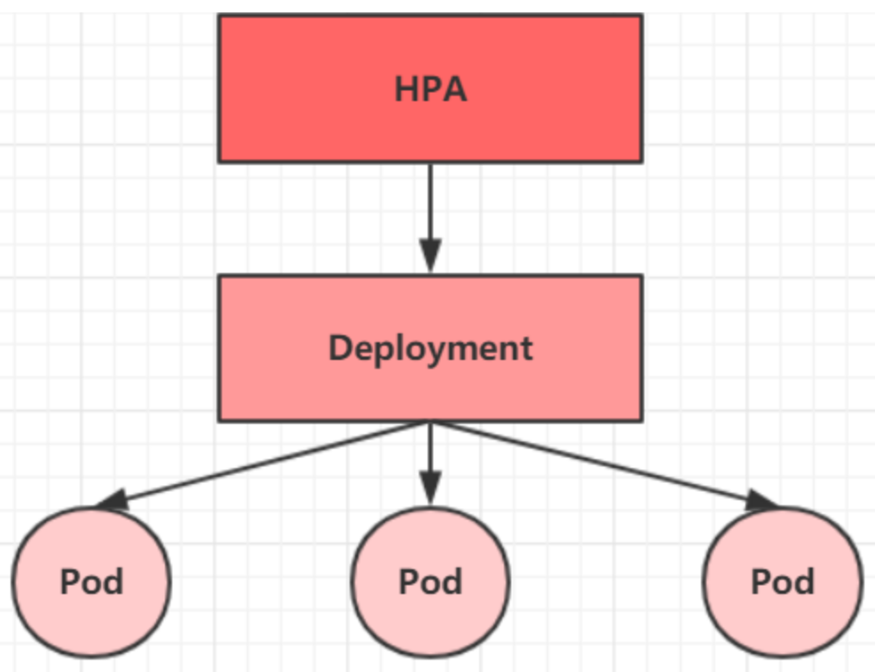
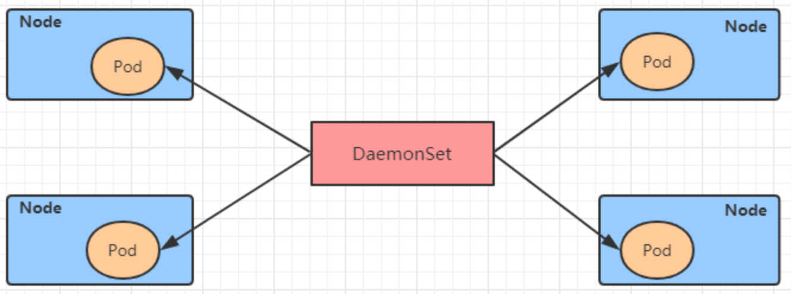

Pod是Kubernetes的最小管理单元，在Kubernetes中，按照Pod的创建方式可以将其分为两类：

* **自主式Pod**：Kubernetes直接创建出来的Pod，这种Pod删除后就没有了，也不会重建
* **控制器创建的Pod**：Kubernetes通过控制器创建的Pod，这种Pod删除了之后还会自动创建，维持到预期的副本数

Pod控制器是管理Pod的中间层，使用Pod控制器之后，只需要告诉Pod控制器，想要几个什么样的Pod就可以了，它会创建出满足条件的Pod并确保每一个Pod资源处于用户期望的目标状态。如果Pod资源在运行中出现故障，它会基于指定策略重新编排Pod。


# ReplicaSet（RS）

ReplicaSet的主要作用是**保证一定数量的Pod正常运行**，它会持续监控这些Pod的运行状态，一旦Pod发生故障，就会重启或重建。同时它还支持对Pod数量的扩容缩容和镜像版本的升降级。


## 资源清单

```yaml
apiVersion: apps/v1
kind: ReplicaSet              #资源类型
metadata:                     #元数据
  name:                       #元数据，控制器名称
  namespace:                  #元数据，控制器名称空间
  labels:                     #元数据，控制器的标签
    controller: rs
spec:                         #资源规格
  replicas: 3                 #副本数量
  selector:                   #选择器，通过它指定该控制器应该管理哪些Pod
    matchLabels:              #Labels的匹配规则
      app: nginx-pod
    matchExpressions:         #Expression的匹配规则
      - key: app
        operator: In
        values:
          - nginx-pod
  template:                   #Pod模板，如果Pod副本个数不足时，会根据这里的模板创建Pod
    metadata:
      name: nginx-pod
      namespace: dev
      labels:
        app: nginx-replicaset
    spec:
      containers:
        - name: nginx
          image: nginx:1.17.1
          ports:
            - containerPort: 80
```

在这里需要关注的是spec下面的几个配置项：

* **Replicas**：Pod副本数量，其实就是当前RS创建出来之后的Pod数量，默认为1。
* **selector**：选择器，主要作用就是建立Pod控制器和Pod之间的关联关系，采用的是Label Selector机制，在Pod模板上定义label，在控制器上定义控制器，就可以表明当前控制器能管理哪些Pod了。
* **template**：模板，就是当前控制器创建Pod所使用的的模板，其实就是Pod定义。

## RS创建

1. 创建pc-replicaset.yaml，内容如下：

```yaml
apiVersion: apps/v1
kind: ReplicaSet
metadata:
  name: pc-replicaset
  namespace: dev
spec:
  replicas: 2
  selector:
    matchLabels:
      app: nginx-pod
  template:
    metadata:
      labels:
        app: nginx-pod
    spec:
      containers:
        - name: nginx
          image: nginx:1.17.1
```

2. 部署应用

```shell
#创建rs
[root@node01]> kubectl create -f pc-replicaset.yaml
replicaset.apps/pc-replicaset created

#查看rs
[root@node01]> kubectl get rs -n dev -o wide
NAME            DESIRED   CURRENT   READY   AGE   CONTAINERS   IMAGES         SELECTOR
pc-replicaset   2         2         2       49s   nginx        nginx:1.17.1   app=nginx-pod

#查看当前控制器创建出来的pod列表
#可以看出，Pod控制器名称是在控制器名称后面拼接了-xxxxxx随机码
[root@node01]> kubectl get pod -n dev
NAME                  READY   STATUS    RESTARTS   AGE
pc-replicaset-crrjp   1/1     Running   0          2m7s
pc-replicaset-fcrjz   1/1     Running   0          2m7s
```

## 弹性伸缩

RS能够对部署的Pod数量进行弹性伸缩：

```shell
#修改rs的副本数量（spec.replicas: 4）
[root@node01]> kubectl edit rs pc-replicaset -n dev
replicaset.apps/pc-replicaset edited

[root@node01]> kubectl get pod -n dev
NAME                  READY   STATUS    RESTARTS   AGE
pc-replicaset-crrjp   1/1     Running   0          4m53s
pc-replicaset-fcrjz   1/1     Running   0          4m53s
pc-replicaset-lgptf   1/1     Running   0          30s
pc-replicaset-vrjp8   1/1     Running   0          30s

# 当然也可以直接通过命令修改实现
# 使用scale命令实现扩缩容，后面--replicas=n直接指定目标数量即可
[root@node01]> kubectl scale rs pc-replicaset --replicas=2 -n dev
replicaset.apps/pc-replicaset scaled

#查看Pod列表
[root@node01]# kubectl get pod -n dev -o wide
NAME                  READY   STATUS    RESTARTS   AGE     IP            NODE     NOMINATED NODE   READINESS
pc-replicaset-crrjp   1/1     Running   0          7m29s   10.244.1.23   node02   <none>           <none>
pc-replicaset-fcrjz   1/1     Running   0          7m29s   10.244.2.3    node03   <none>           <none>
```

## 镜像更新

RS能够提供在线的镜像版本更新操作

```shell
#编辑rs的容器镜像 -image: nginx:1.17.2
[root@node01]> kubectl edit rs pc-replicaset -n dev
replicaset.apps/pc-replicaset edited

#查看rs，可以看出镜像版本更新了
[root@node01]> kubectl get rs -n dev -o wide
NAME            DESIRED   CURRENT   READY   AGE   CONTAINERS   IMAGES         SELECTOR
pc-replicaset   2         2         2       10m   nginx        nginx:1.17.2   app=nginx-pod

# 类似的，也可以通过命令直接完成更新操作
[root@node01]> kubectl set image rs pc-replicaset nginx=nginx:1.17.1 -n dev
replicaset.apps/pc-replicaset image updated

#再次查看，发现镜像版本更新了
[root@node01 pod-ctl]# kubectl get rs -n dev -o wide
NAME            DESIRED   CURRENT   READY   AGE   CONTAINERS   IMAGES         SELECTOR
pc-replicaset   2         2         2       11m   nginx        nginx:1.17.1   app=nginx-pod
```

## 删除RS

以下是删除RS的操作

```shell
#使用kubectl delete命令删除此rs以及它管理的Pod
#在Kubernetes删除RS之前，会将RS的replicasscaler调整为0，等待所有的Pod被删除之后，再执行RS对象的删除
kubectl delete rs pc-replicaset -n dev

#查看Pod列表
kubectl get pod -n dev - o wide

#如果仅仅希望只删除RS对象并保留Pod，可以使用Kuberctl delete命令时添加 --cascade=false选项（不推荐）
kubectl delete rs pc-replicaset -n dev --cascade=false

#查看Pod列表
kubectl get pod -n dev - o wide

#也可以通过yaml直接删除(推荐)
[root@node01]> kubectl delete -f pc-replicaset.yaml
replicaset.apps "pc-replicaset" deleted
```

# Deployment（Deploy）

为了更好的解决服务编排的问题，Kubernetes在V1.2版本开始，引入了Deployment控制器。值得一提的是，这个控制器并不直接管理Pod，而是通过管理ReplicaSet来间接管理Pod，也就是说，Deployment管理ReplicaSet，ReplicaSet管理Pod，Deployment比ReplicaSet还有一些更强大的功能。


Deployment的主要功能：

* 支持ReplicaSet的所有功能
* 支持发布的停止、继续
* 支持版本滚动和回滚

## 资源清单

```yaml
apiVersion: apps/v1              #版本号
kind: Deployment                 #资源类型
metadata:                        #元数据
  name:
  namespace:
  labels:
    controller: deploy
spec:                            #规格详情
  replicas: 4                    #副本数量
  revisionHistoryLimit: 3        #保留历史版本个数
  paused: false                  #暂停部署。默认是false
  progressDeadlineSeconds: 600   #部署超时时间（s），默认是600
  strategy:                      #策略
    type: RollingUpdate          #滚动更新策略
    rollingUpdate:               #滚动更新
      maxSurge: 30%              #最大额外可以存在的副本数，可以为百分比，也可以为整数
      maxUnavailable: 30%        #最大不可用状态的Pod的最大值，可以为百分比，也可以为整数
  selector:                      #选择器。通过它指定该控制器管理哪些Pod
    matchLabels:                 #Labels匹配规则
      app: nginx-pod
    matchExpressions:            #Expression匹配规则
      - {key: app, operator: In, values:[nginx-pod]}
  template:                      #模板，当副本数量不足时，会根据模板创建Pod副本
    metadata:
      labels:
        app: nginx-pod
    spec:
      containers:
        - name:  nginx
          image:  nginx:1.17.1
          ports:
          - containerPort: 80
```

## deploy创建

1. 创建pc-deployment.yaml

```yaml
apiVersion: apps/v1
kind: Deployment
metadata:
  name: pc-deployment
  namespace: dev
spec:
  replicas: 2
  selector:
    matchLabels:
      app: nginx-pod
  template:
    metadata:
      labels:
        app: nginx-pod
    spec:
      containers:
        - name: nginx
          image: nginx:1.17.1
```

2. 部署应用

```shell
# 创建Deployment
[root@node01]> kubectl create -f pc-deployment.yaml
deployment.apps/pc-deployment created

#查看deploy
# UP-TO-DATE：最新版本的Pod数量、AVAILABLE：可用的Pod数量
[root@node01]> kubectl get deploy pc-deployment -n dev -o wide
NAME            READY   UP-TO-DATE   AVAILABLE   AGE     CONTAINERS   IMAGES         SELECTOR
pc-deployment   2/2     2            2           3m36s   nginx        nginx:1.17.1   app=nginx-pod

#查看rs
#可以看到rs的名称是在原来Deployment的名字后面添加了一个10个字符的随机串
[root@node01]> kubectl get rs -n dev
NAME                       DESIRED   CURRENT   READY   AGE
pc-deployment-5d9c9b97bb   2         2         2       4m

#查看Pod
[root@node01]> kubectl get pod -n dev -o wide
NAME                             READY   STATUS    RESTARTS   AGE     IP            NODE     NOMINATED
pc-deployment-5d9c9b97bb-cwzs6   1/1     Running   0          6m54s   10.244.2.4    node03   <none>           
pc-deployment-5d9c9b97bb-hln2g   1/1     Running   0          6m54s   10.244.1.26   node02   <none>           
```

## 弹性伸缩

Deploy通过RS能够对部署的Pod数量进行弹性伸缩

```shell
#变更副本数量为4个
[root@node01]> kubectl scale deploy pc-deployment --replicas=4 -n dev
deployment.apps/pc-deployment scaled

#查看Deploy列表
[root@node01]> kubectl get deploy -n dev
NAME            READY   UP-TO-DATE   AVAILABLE   AGE
pc-deployment   4/4     4            4           15m

#查看Pod列表，发现已经调整为4个Pod副本
[root@node01]> kubectl get pod -n dev
NAME                             READY   STATUS    RESTARTS   AGE
pc-deployment-5d9c9b97bb-44847   1/1     Running   0          8s
pc-deployment-5d9c9b97bb-4hk9t   1/1     Running   0          8s
pc-deployment-5d9c9b97bb-cwzs6   1/1     Running   0          13m
pc-deployment-5d9c9b97bb-hln2g   1/1     Running   0          13m

#编辑deployment的副本数量，修改spec.replicas: 2即可
[root@node01] kubectl edit deploy pc-deployment -n dev
deployment.apps/pc-deployment edited

#再次查看deploy列表
[root@node01]> kubectl get deploy -n dev
NAME            READY   UP-TO-DATE   AVAILABLE   AGE
pc-deployment   2/2     2            2           17m

#查看Pod列表
[root@node01]> kubectl get pod -n dev
NAME                             READY   STATUS    RESTARTS   AGE
pc-deployment-5d9c9b97bb-cwzs6   1/1     Running   0          17m
pc-deployment-5d9c9b97bb-hln2g   1/1     Running   0          17m
```

## 镜像更新

deployment支持两种更新策略：

* 重建更新和滚动更新
* 可以通过strategy指定策略类型，支持两个属性

```yaml
strategy:           #指定新的Pod替换旧的Pod的策略， 支持两个属性：
  type:             #指定策略类型，支持两种策略
    Recreate:       #在创建出新的Pod之前会先杀掉所有已存在的Pod
    RollingUpdate:  #滚动更新，就是杀死一部分，就启动一部分，在更新过程中，存在两个版本Pod
  rollingUpdate:    #当type为RollingUpdate时生效，用于为RollingUpdate设置参数，支持两个属性：
    maxUnavailable: #用来指定在升级过程中不可用Pod的最大数量，默认为25%。
    maxSurge:       #用来指定在升级过程中可以超过期望的Pod的最大数量，默认为25%。
```

### 重建更新

1. 修改pc-deployment.yaml文件，在spec节点下添加更新策略

```yaml
apiVersion: apps/v1
kind: Deployment
metadata:
  name: pc-deployment
  namespace: dev
spec:
  strategy:
    type: Recreate
  replicas: 2
  selector:
    matchLabels:
      app: nginx-pod
  template:
    metadata:
      labels:
        app: nginx-pod
    spec:
      containers:
        - name: nginx
          image: nginx:1.17.1
```

2. 使用deploy进行验证

```shell
#创建Pod
[root@node01]> kubectl create -f pc-deployment.yaml
deployment.apps/pc-deployment created
#查看Pod列表
[root@node01]> kubectl get pod -n dev
NAME                             READY   STATUS    RESTARTS   AGE
pc-deployment-5d9c9b97bb-29j4n   1/1     Running   0          9s
pc-deployment-5d9c9b97bb-mnccw   1/1     Running   0          9s

#变更镜像
[root@node01]> kubectl set image deploy pc-deployment nginx=nginx:1.17.2 -n dev
deployment.apps/pc-deployment image updated

#观察升级过程
[root@node01]> kubectl get pods -n dev -w
NAME                             READY   STATUS        RESTARTS   AGE
pc-deployment-5d9c9b97bb-29j4n   0/1     Terminating   0          66m
pc-deployment-5d9c9b97bb-29j4n   0/1     Terminating   0          66m
pc-deployment-5d9c9b97bb-29j4n   0/1     Terminating   0          66m
pc-deployment-7c7477c7ff-m259r   0/1     Pending       0          0s
pc-deployment-7c7477c7ff-5pdtn   0/1     Pending       0          0s
pc-deployment-7c7477c7ff-m259r   0/1     Pending       0          0s
pc-deployment-7c7477c7ff-5pdtn   0/1     Pending       0          0s
pc-deployment-7c7477c7ff-m259r   0/1     ContainerCreating   0          0s
pc-deployment-7c7477c7ff-5pdtn   0/1     ContainerCreating   0          0s
pc-deployment-7c7477c7ff-5pdtn   1/1     Running             0          3s
pc-deployment-7c7477c7ff-m259r   1/1     Running             0          4s

#查看Pod列表
[root@node01]> kubectl get pod -n dev
NAME                             READY   STATUS    RESTARTS   AGE
pc-deployment-7c7477c7ff-5pdtn   1/1     Running   0          49s
pc-deployment-7c7477c7ff-m259r   1/1     Running   0          49s
```

### 滚动更新

1. 修改pc-deployment.yaml文件，注意spec节点下的配置

```yaml
apiVersion: apps/v1
kind: Deployment
metadata:
  name: pc-deployment
  namespace: dev
spec:
  strategy:
    type: RollingUpdate
    rollingUpdate:
      maxSurge: 25
      maxUnavailable: 25
  replicas: 2
  selector:
    matchLabels:
      app: nginx-pod
  template:
    metadata:
      labels:
        app: nginx-pod
    spec:
      containers:
        - name: nginx
          image: nginx:1.17.1
```

2. 创建Pod进行验证

```shell
#变更镜像
[root@node01]> kubectl set image deploy pc-deployment nginx=nginx:1.17.3 -n dev
deployment.apps/pc-deployment image updated

#查看现有的Pod
[root@node01 pod-ctl]# kubectl get pod -n dev
NAME                             READY   STATUS    RESTARTS   AGE
pc-deployment-5d9c9b97bb-7w2lv   1/1     Running   0          6s
pc-deployment-5d9c9b97bb-mq6xr   1/1     Running   0          6s

#变更镜像
[root@node01 pod-ctl]# kubectl set image deployment pc-deployment -n dev nginx=nginx:1.17.2
deployment.apps/pc-deployment image updated

#查看镜像列表，发现镜像版本已变更
[root@node01 pod-ctl]# kubectl get deployment -n dev -o wide
NAME            READY   UP-TO-DATE   AVAILABLE   AGE     CONTAINERS   IMAGES         SELECTOR
pc-deployment   2/2     2            2           2m37s   nginx        nginx:1.17.2   app=nginx-pod

#可以看到Pod也更新了
[root@node01 pod-ctl]# kubectl get pod -n dev -w
NAME                             READY   STATUS    RESTARTS   AGE
pc-deployment-7c7477c7ff-hcd8t   1/1     Running   0          10s
pc-deployment-7c7477c7ff-qhtcd   1/1     Running   0          8s
```


镜像中rs的更新变化

```shell
# 查看rs,发现原来的rs的依旧存在，只是pod数量变为了0，而后又新产生了一个rs，pod数量为4
# 其实这就是deployment能够进行版本回退的奥妙所在，后面会详细解释
[root@node01]> kubectl get rs -n dev
NAME                       DESIRED   CURRENT   READY   AGE
pc-deployment-6696798b78   0         0         0       7m37s
pc-deployment-6696798b11   0         0         0       5m37s
pc-deployment-c848d76789   4         4         4       72s
```

## 版本回退

Deployment支持版本升级过程中的暂停、继续功能以及版本回退的诸多功能。

kubectl rollout：版本升级相关功能，支持以下的选项：

* status：显示当前升级状态
* history：显示升级历史记录
* pause：暂停版本升级过程
* resume：继续已暂停的版本升级过程
* restart：重启版本升级过程
* undo：回滚到上一个版本，可以通过--to-revision回滚到指定版本

```shell
#查看当前升级版本的状态
kubectl rollout status deploy pc-deployment -n dev

#查看升级历史记录
kubeclt rollout history deploy pc-deployment -n dev

#版本回滚
kubectl undo deployment pc-deployment --to-revision=1 -n dev

#查看Deployment列表
kubectl get deploy -n -dev -o wide

#查看rs
kubectl get rs -n dev
```

## 删除Deploy

以下是删除deploy的操作

```shell
#删除deployment，其下的RS和Pod也将删除
kubectl delete -f pc-deployment.yaml
```

# Horizontal Pod Autoscale（HPA）

前面都是通过手工执行kubectl scale命令实现Pod扩容或缩容，但是显然这不符合Kubernetes的定位目标：自动化与智能化。

* 主要作用：**Kubernetes期望可以通过检测Pod的使用情况，实现Pod数量的自动调整。**于是就有了HPA这种控制器的诞生。
* 基本原理：HPA可以获取每个Pod的资源利用率，然后和HPA中预设的指标进行对比，同时计算出需要伸缩的具体值，最后实现Pod数量的调整。HPA和之前Deployment一样，也属于Kubernetes的资源对象，通过追踪分析RC控制的所有Pod数量的负载变化，来确定是否需要针对性的调整目标Pod的副本数。



收集Pod的资源利用情况需要通过metrice-server的Pod应用，因此需要安装配置它

## 安装metrice-server

```shell
# 下载安装包，此处使用0.3.7版本，兼容性更好一点
wget https://github.com/kubernetes-sigs/metrics-server/archive/refs/heads/release-0.3.zip

# 解压并重命名目录为 metrics-server-0.3.7
unzip release-0.3.zip -d . && mv metrics-server-release-0.3 metrics-server-0.3.7

# 修改yaml配置文件
cd ./metrics-server-0.3.7/deploy/1.8+ && vim metrics-server-deployment.yaml

#修改内容项
hostNetwork: true
args:
- --kubelet-insecure-tls
- --kubelet-preferred-address-types=InternalIP,Hostname,InternalDNS,ExternalDNS,ExternalIP
```


部署metrice-server组件

```shell
# 部署metrice-server组件，它是以Pod方式运行的
[root@node01 1.8+]> kubectl apply -f ./
clusterrole.rbac.authorization.k8s.io/system:aggregated-metrics-reader created
clusterrolebinding.rbac.authorization.k8s.io/metrics-server:system:auth-delegator created
rolebinding.rbac.authorization.k8s.io/metrics-server-auth-reader created
Warning: apiregistration.k8s.io/v1beta1 APIService is deprecated in v1.19+, unavailable in v1.22+; use apiregistration.k8s.io/v1 APIService
apiservice.apiregistration.k8s.io/v1beta1.metrics.k8s.io created
serviceaccount/metrics-server created
deployment.apps/metrics-server created
service/metrics-server created
clusterrole.rbac.authorization.k8s.io/system:metrics-server created
clusterrolebinding.rbac.authorization.k8s.io/system:metrics-server created

#查看系统名称空间的Pod列表，metric-server的Pod已经运行起来了
[root@node01 1.8+]> kubectl get pod -n kube-system
NAME                              READY   STATUS    RESTARTS   AGE
coredns-6d56c8448f-478tx          1/1     Running   10         13d
coredns-6d56c8448f-wl2d6          1/1     Running   10         13d
etcd-node01                       1/1     Running   10         13d
kube-apiserver-node01             1/1     Running   10         13d
kube-controller-manager-node01    1/1     Running   15         13d
kube-flannel-ds-7wpvv             1/1     Running   8          7d1h
kube-flannel-ds-jchzn             1/1     Running   8          7d1h
kube-flannel-ds-wlc2b             1/1     Running   8          7d1h
kube-proxy-4hcmb                  1/1     Running   8          7d1h
kube-proxy-fblcj                  1/1     Running   10         13d
kube-proxy-qmjrh                  1/1     Running   10         13d
kube-scheduler-node01             1/1     Running   15         13d
metrics-server-7c84897d56-x26jm   1/1     Running   0          23s

#使用 kubectl top node 查看资源使用情况
[root@node01 1.8+]> kubectl top node
NAME     CPU(cores)   CPU%   MEMORY(bytes)   MEMORY%
node01   284m         14%    1069Mi          63%
node02   83m          4%     423Mi           25%
node03   48m          4%     362Mi           53%

[root@node01 1.8+]> kubectl top node -n kube-system
NAME     CPU(cores)   CPU%   MEMORY(bytes)   MEMORY%
node01   297m         14%    1027Mi          60%
node02   77m          3%     424Mi           25%
node03   51m          5%     362Mi           53%
```

##  部署应用

准备部署deploy和service

```shell
#创建deployment
kubectl run nginx --image=nginx:latest --requests=cpu=100m -n dev

#创建Service
kubectl expose deployment nginx --type=NodePort --port=80 -n dev

#查看
kubectl get deployment,pod,svc -n dev
```

## 部署HPA

1. 创建pc-hpa.yaml

```yaml
apiVersion: v1
kind: HorizontalPodAutoscaler
metadata:
  name: pc-hpa
  namespace: dev
spec:
  minReplicas: 1                    # 最小Pod数量
  maxReplicas: 10                   # 最大Pod数量
  targetCPUUtilizationPercentage: 3 # CPU使用率指标
  scaleTargetRef:                   # 指定要控制的Pod信息，这里是上面启动的nginx服务Pod
    apiVersion: apps/v1
    kind: Deployment
    name: nginx
```

2. 部署应用

```shell
#创建Pod
kubectl create -f pc-hpa.yaml

#查看hpa
kubectl get hpa -n dev
```

3. 功能测试

使用Postman工具，对service的http:NodeIP:servicePort进行访问，然后开启多个控制台窗口观察Pod变化

# DaemonSet（DS）

DaemonSet控制器可以保证集群中每一个节点都运行一个副本。一般用于日志收集、节点监控等场景。也就是说，如果一个Pod 提供的功能是节点级别的（每个节点需要且只需要一个Pod），那么这种类型就适合用DaemonSet类型的控制器创建。



DaemonSet控制器的特点：

* 每当向集群中添加一个节点时，指定的Pod副本也将添加到该节点上
* 当节点从集群中移除时，节点上Pod也将被回收

## 资源清单

```yaml
apiVersion: apps/v1
kind: DaemonSet                   #资源类型
metadata:                         #元数据
  name:                           #RS名称
  namespace:                      #名称空间
  labels:
    controller: daemonset         #标签
spec:
  selector:                       #选择器
    matchLabels:                  #Labels匹配规则
      app: nginx-pod
    matchExpressions:             #表达式匹配规则
      - { key: app, operator: In, values: [nginx-pod] }
  template:                       #Pod模板，当Pod数量不足时，根据模板创建Pod副本
    metadata:                     #Pod元数据
      labels:                     #Pod标签
        app: nginx-pod            #Pod别名
    spec:
      containers:
        - name: nginx              #容器别名
          image: nginx:1.17.1      #镜像名
          ports:                   #暴露的端口
            - name: nginx-pod-port #端口别名
              port: 80             #端口
              protocol: TCP        #端口访问协议
```

## 部署应用

1. 创建pc-daemonset.yaml

```yaml
apiVersion: apps/v1
kind: DaemonSet
metadata:
  name: pc-deamonset
  namespace: dev
spec:
  selector:
    matchLabels:
      app: nginx-pod
  template:
    metadata:
      labels:
        app: nginx-pod
    spec:
      containers:
        - name: nginx-pod
          image: nginx:1.17.1
```

2. 创建Pod，观察变化

```shell
#创建Pod
kubectl create -f pc-daemonset.yaml

#查看daemonset列表
kubectl get ds -n dev

#查看Pod，发现每个Node上都运行一个Pod
kubectl get pod -n dev -o wide

#删除daemonset
kubectl delete -f pc-daemonset.yaml
```

# Job

**Job主要用于负责批量处理短暂的一次性任务。**Job的特点如下：

* **批量处理**：一次要处理指定数量的任务；**一次性任务**：每个任务只执行一次
* 当Job创建的Pod执行成功时，Job将记录成功执行的Pod数量
* 当成功执行的Pod数量达到指定的数量时，Job完成执行


## 资源清单

```yaml
apiVersion: batch/v1           # 版本号
kind: Job                      # 类型       
metadata:                      # 元数据
  name:                        # rs名称 
  namespace:                   # 所属命名空间 
  labels:                      #标签
    controller: job
spec:                          # 详情描述
  completions: 1               # 指定job需要成功运行Pods的次数。默认值: 1
  parallelism: 1               # 指定job在任一时刻应该并发运行Pods的数量。默认值: 1
  activeDeadlineSeconds: 30    # 指定job可运行的时间期限，超过时间还未结束，系统将会尝试进行终止。
  backoffLimit: 6              # 指定job失败后进行重试的次数。默认是6
  manualSelector: true         # 是否可以使用selector选择器选择pod，默认是false
  selector:                    # 选择器，通过它指定该控制器管理哪些pod
    matchLabels:               # Labels匹配规则
      app: counter-pod
    matchExpressions:          # Expressions匹配规则
      - {key: app, operator: In, values: [counter-pod]}
  template:                    # 模板，当副本数量不足时，会根据下面的模板创建pod副本
    metadata:
      labels:
        app: counter-pod
    spec:
      restartPolicy: Never     # 重启策略只能设置为Never或者OnFailure
      containers:
      - name: counter
        image: busybox:1.30
        command: ["bin/sh","-c","for i in 9 8 7 6 5 4 3 2 1; do echo $i;sleep 2;done"]
```

关于重启策略的说明：

* OnFailure：Job会在Pod出现故障时重启Pod，而不是创建Pod，fail次数不变
* Never：Job会在出现故障时创建新的Pod，并且故障Pod不会消失，不会重启，fail次数加1
* Always：一直重启，Job任务会重复执行了，当然不对，所以不能设置为Always

## 部署应用

1. 创建pc-job.yaml

```yaml
apiVersion: batch/v1
kind: Job
metadata:
  name: pc-job
  namespace: dev
spec:
  manualSelector: true
  selector:
    matchLabels:
      app: counter-pod
  template:
    metadata:
      labels:
        app: counter-pod
    spec:
      containers:
        - name: MYAPP
          image: busybox:1.30
          command:
            [
              "bin/sh",
              "-c",
              "for i in 9 8 7 6 5 4 3 2 1; do echo $i; sleep 3; done",
            ]
      restartPolicy: Never
```

2. 创建Pod，观察变化

```shell
#创建Pod
kubectl create -f pc-job.yaml

#查看Job
kubectl get job -n dev -o wide -w

#查看Pod（最好是在新的终端）,Pod运行完毕之后就会变成Completed状态
kubectl get pod -n dev -w

#删除Job
kubectl delete -f pc-job.yaml
```

# CronJob（CJ）

CronJob是以Job控制器资源为管控对象，并借助它管理Pod资源对象，Job控制器在其定义的作业任务在其控制器资源创建之后会立即执行，但是CronJob控制器定义的作业任务会在类似于Linux系统的周期性任务计划方式一样控制任务的**执行时间点**和**重复运行**的方式。

## 资源清单

```yaml
apiVersion: batch/v1beta1     #版本号
kind: CronJob                 #类型
metadata:                     #元数据
  name:                       #RS名称
  namespace:                  #名称空间
  labels:                     #标签
    controller: cronjob
spec:                         #规格详情
  schedule:                   #Cron的时间表达式
  concurrencyPolicy:          #并发执行策略
  failedJobHistoryLimit:      #为失败的任务执行保留的历史记录数，默认为1
  successfulJobHistoryLimit:  #为成功的任务执行保留的历史记录数，默认为3
  startingDeadlineSeconds:    #启动作业错误的超时时长
  jobTemplate:                #Job控制器模板，用于为CronJob控制器生成job对象
    metadata:                 #Job的元数据
    spec:                     #Job的Pod定义
      completions: 1
      parallelism: 1
      activeDeadlineSeconds: 30
      backoffLimit: 6
      manualSelector: true
      selector:
        matchLabels:
          app: counter-pod
        matchExpressions: #规则
          - { key: app, operator: In, values: [counter-pod] }
      template:
        metadata:
          labels:
            app: counter-pod
        spec:
          restartPolicy: Never
          containers:
            - name: counter
              image: busybox:1.30
              command:
                [
                  "bin/sh",
                  "-c",
                  "for i in 9 8 7 6 5 4 3 2 1; do echo $i;sleep 20;done",
                ]
```

> 需要重点解释的几个选项：
> **schedule** : cron表达式，用于指定任务的执行时间
>     */1    *      *    *     *   # <分钟> <小时> <日> <月份> <星期>
>
> * 分钟：0~59
> * 小时：0~23
> * 日：131
> * 月 ：1：12
> * 星期：0~6。0 代表星期日
> * 多个时间可以用逗号隔开； 范围可以用连字符给出；*可以作为通配符； /表示每隔
>
> **concurrencyPolicy**:
>     Allow:   允许Jobs并发运行(默认)
>     Forbid:  禁止并发运行，如果上一次运行尚未完成，则跳过下一次运行
>     Replace: 替换，取消当前正在运行的作业并用新作业替换它

## 部署应用

1. 创建pc-cronjob.yaml

```yaml
apiVersion: batch/v1beta1
kind: CronJob
metadata:
  name: pc-cronjob
  namespace: dev
spec:
  schedule: "*/1 * * * *"
  jobTemplate:
    spec:
      template:
        spec:
          containers:
            - name: counter
              image: busybox
              args:
                [
                  "/bin/sh",
                  "-c",
                  "for i in 9 8 7 6 5 4 3 2 1; do echo $i;sleep 3;done",
                ]
          restartPolicy: Never
```

2. 创建Pod，观察变化

```shell
#创建cronjob
kubectl create -f pc-cronjob.yaml

#查看cronjob
kubectl get cronjob -n dev

#查看job
kubectl get jobs -n dev

#查看Pod
kubectl get pod -n dev

#删除CronJob
kubectl delete -f pc-cronjob.yaml
```


