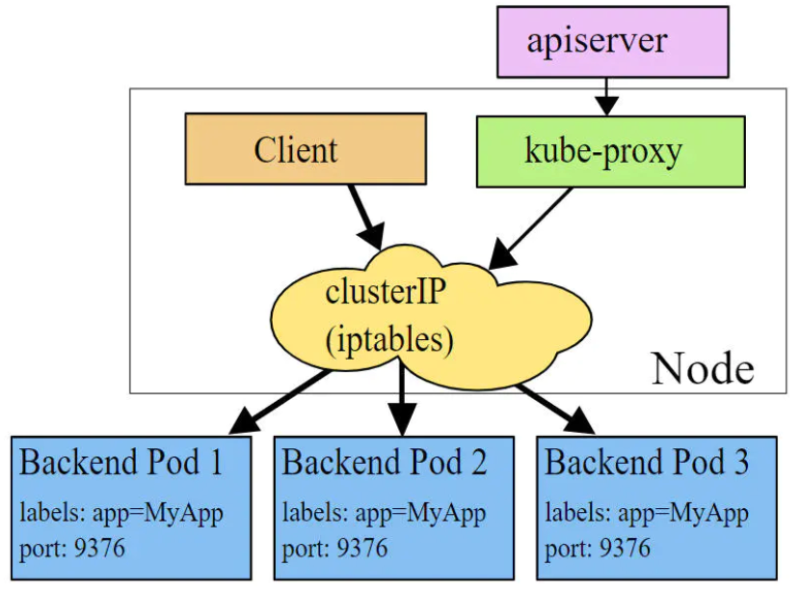

# 基础介绍

## 功能介绍

在Kubernetes中，Pod是应用程序的载体，我们可以通过Pod的IP来访问应用程序，但是Pod的IP地址不是固定的，这意味着不方便通过Pod的IP访问应用程序。

为了解决这个问题，Kubernetes提供了Service资源对象，Service会对提供一个服务的Pod进行聚合，并且提供一个统一的入口地址，通过Service的入口地址，就可以访问后面的Pod服务，并且不需要关心Pod的IP变化。


Service在很多情况下只是一个概念，真正起作用的是kube-proxy服务进程，每个Node节点上都运行这一个kube-proxy进程。当创建Service的时候会向api-server发送创建service的信息，而kube-proxy会通过监听机制发现这种Service的变动，然后它会将Service信息转化为对应的访问规则。


```shell
# 10.97.97.97:80 是service提供的访问入口
# 当访问这个入口的时候，可以发现后面有三个pod的服务在等待调用，
# kube-proxy会基于rr（轮询）的策略，将请求分发到其中一个pod上去
# 这个规则会同时在集群内的所有节点上都生成，所以在任何一个节点上访问都可以。
[root@node1]> ipvsadm -Ln
IP Virtual Server version 1.2.1 (size=4096)
Prot LocalAddress:Port Scheduler Flags
  -> RemoteAddress:Port           Forward Weight ActiveConn InActConn
TCP  10.97.97.97:80 rr
  -> 10.244.1.39:80               Masq    1      0          0
  -> 10.244.1.40:80               Masq    1      0          0
  -> 10.244.2.33:80               Masq    1      0          0
```

**Kube-proxy目前支持3种工作模式：userspace、iptables、ipvs。**

##  userspace

* 在userspace模式下，Kubernetes集群会每个Service创建一个监听端口，发向ClusterIP的请求会被iptables重定向到kube-proxy监听的端口上，kube-proxy会根据LB算法选择一个提供服务的Pod并和其建立连接，然后将请求转发到Pod上。

* 该模式下，kube-proxy充当了一个四层负载均衡器的角色。由于kube-proxy运行在userspace中，在进行转发处理时会增加用户和内核空间之间的数据拷贝，虽然比较稳当，但是效率比较低。


## iptables

* 在iptables模式下，kube-proxy会为Service后端每个Pod创建iptables规则，直接将发向ClusterIP的请求转发给其中一个Pod IP。
* 在该模式下，kube-proxy不再充当四层负载均衡器的角色，只负责创建iptables规则。优点：相比userspace模式效率更高；缺点：不能提供灵活的LB策略，而且当后端Pod服务不可用时无法进行重试。



## ipvs

* ipvs和iptables类似，kube-proxy监听Pod变化并创建相应的ipvs规则。

* 优点：ipvs相比iptables模式转发效率更高；ipvs支持更多的LB算法


```shell
# 此模式必须安装ipvs内核模块，否则会降级为iptables
# 开启ipvs
[root@node01]> kubectl edit cm kube-proxy -n kube-system
[root@node01]> kubectl delete pod -l k8s-app=kube-proxy -n kube-system
[root@node01]> ipvsadm -Ln
IP Virtual Server version 1.2.1 (size=4096)
Prot LocalAddress:Port Scheduler Flags
  -> RemoteAddress:Port           Forward Weight ActiveConn InActConn
TCP  10.97.97.97:80 rr
  -> 10.244.1.39:80               Masq    1      0          0
  -> 10.244.1.40:80               Masq    1      0          0
  -> 10.244.2.33:80               Masq    1      0          0
```

# Service类型

Service的资源清单文件

```yaml
apiVersion: v1            #api版本号
kind: Service             #资源类型
metadata:                 #元数据
  name: service
  namespace: dev
spec:                     #详细配置
  selector:               #标签选择器。用于确定当前service代理哪些pod
    app: nginx
  type: ClusterIP         #Service类型，指定service的访问方式
  ports:                  #端口配置
    - name: servicr-port  #Service端口别名
      port: 3017          #Service端口
      targetPort: 5003    #Pod端口
      nodePort: 31122     #主机端口
      protocol: TCP
```

# Service使用


