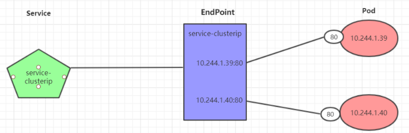
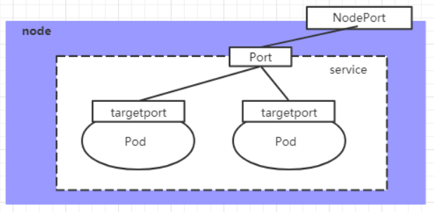
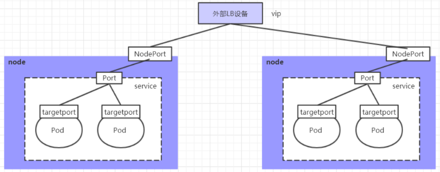
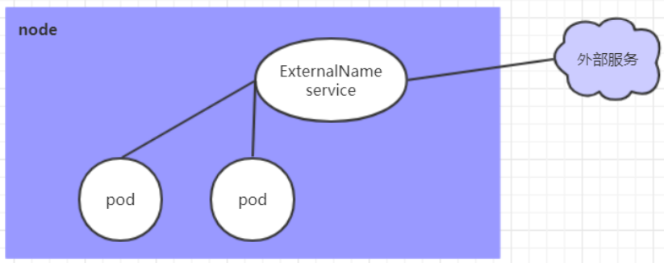

# 基础介绍

## 功能介绍

在Kubernetes中，Pod是应用程序的载体，我们可以通过Pod的IP来访问应用程序，但是Pod的IP地址不是固定的，这意味着不方便通过Pod的IP访问应用程序。

为了解决这个问题，Kubernetes提供了Service资源对象，Service会对提供一个服务的Pod进行聚合，并且提供一个统一的入口地址，通过Service的入口地址，就可以访问后面的Pod服务，并且不需要关心Pod的IP变化。


Service在很多情况下只是一个概念，真正起作用的是kube-proxy服务进程，每个Node节点上都运行这一个kube-proxy进程。当创建Service的时候会向api-server发送创建service的信息，而kube-proxy会通过监听机制发现这种Service的变动，然后它会将Service信息转化为对应的访问规则。


```shell
# 10.97.97.97:80 是service提供的访问入口
# 当访问这个入口的时候，可以发现后面有三个pod的服务在等待调用，
# kube-proxy会基于rr（轮询）的策略，将请求分发到其中一个pod上去
# 这个规则会同时在集群内的所有节点上都生成，所以在任何一个节点上访问都可以。
[root@node1]> ipvsadm -Ln
IP Virtual Server version 1.2.1 (size=4096)
Prot LocalAddress:Port Scheduler Flags
  -> RemoteAddress:Port           Forward Weight ActiveConn InActConn
TCP  10.97.97.97:80 rr
  -> 10.244.1.39:80               Masq    1      0          0
  -> 10.244.1.40:80               Masq    1      0          0
  -> 10.244.2.33:80               Masq    1      0          0
```

**Kube-proxy目前支持3种工作模式：userspace、iptables、ipvs。**

##  userspace

* 在userspace模式下，Kubernetes集群会每个Service创建一个监听端口，发向ClusterIP的请求会被iptables重定向到kube-proxy监听的端口上，kube-proxy会根据LB算法选择一个提供服务的Pod并和其建立连接，然后将请求转发到Pod上。

* 该模式下，kube-proxy充当了一个四层负载均衡器的角色。由于kube-proxy运行在userspace中，在进行转发处理时会增加用户和内核空间之间的数据拷贝，虽然比较稳当，但是效率比较低。


## iptables

* 在iptables模式下，kube-proxy会为Service后端每个Pod创建iptables规则，直接将发向ClusterIP的请求转发给其中一个Pod IP。
* 在该模式下，kube-proxy不再充当四层负载均衡器的角色，只负责创建iptables规则。优点：相比userspace模式效率更高；缺点：不能提供灵活的LB策略，而且当后端Pod服务不可用时无法进行重试。


## ipvs

* ipvs和iptables类似，kube-proxy监听Pod变化并创建相应的ipvs规则。

* 优点：ipvs相比iptables模式转发效率更高；ipvs支持更多的LB算法


```shell
# 此模式必须安装ipvs内核模块，否则会降级为iptables
# 开启ipvs
[root@node01]> kubectl edit cm kube-proxy -n kube-system
[root@node01]> kubectl delete pod -l k8s-app=kube-proxy -n kube-system
[root@node01]> ipvsadm -Ln
IP Virtual Server version 1.2.1 (size=4096)
Prot LocalAddress:Port Scheduler Flags
  -> RemoteAddress:Port           Forward Weight ActiveConn InActConn
TCP  10.97.97.97:80 rr
  -> 10.244.1.39:80               Masq    1      0          0
  -> 10.244.1.40:80               Masq    1      0          0
  -> 10.244.2.33:80               Masq    1      0          0
```

# Service类型

Service的资源清单文件

```yaml
apiVersion: v1            #api版本号
kind: Service             #资源类型
metadata:                 #元数据
  name: service
  namespace: dev
spec:                     #详细配置
  selector:               #标签选择器。用于确定当前service代理哪些pod
    app: nginx
  type: ClusterIP         #Service类型，指定service的访问方式
  ports:                  #端口配置
    - name: servicr-port  #Service端口别名
      port: 3017          #Service端口
      targetPort: 5003    #Pod端口
      nodePort: 31122     #主机端口
      protocol: TCP
```

# Service使用

## 环境准备

在创建Service之前，先通过Deployment创建3个Pod，注意3个Pod的标签都有app=nginx-pod的标签

1. 创建Pod的控制器deployment.yaml

```yaml
apiVersion: apps/v1
kind: Deployment
metadata:
  name: pc-deployment
  namespace: dev
spec:
  replicas: 3
  selector:
    matchLabels:
      app: nginx-pod
  template:
    metadata:
      labels:
        app: nginx-pod
    spec:
      containers:
        - name: nginx
          image: nginx:1.17.1
          ports:
            - containerPort: 80
```

2. 创建Pod

```shell
[root@node01]> kubectl create -f deployment.yaml
deployment.apps/pc-deployment created

# 查看pod详情
[root@node01]> kubectl get pods -n dev -o wide --show-labels
NAME                             READY   STATUS     IP            NODE        LABELS
pc-deployment-66cb59b984-8p84h   1/1     Running    10.244.1.40   node02    app=nginx-pod
pc-deployment-66cb59b984-vx8vx   1/1     Running    10.244.1.33   node03    app=nginx-pod
pc-deployment-66cb59b984-wnncx   1/1     Running    10.244.1.39   node02    app=nginx-pod

# 为了方便后面的测试，修改下三台nginx的index.html页面（三台修改的IP地址不一致）
# kubectl exec -it pc-deployment-66cb59b984-8p84h -n dev /bin/sh
# echo "10.244.1.40" > /usr/share/nginx/html/index.html

#修改完毕之后，访问测试
[root@node01]> curl 10.244.1.40
10.244.1.40
[root@node01]> curl 10.244.2.33
10.244.2.33
[root@node01]# curl 10.244.1.39
10.244.1.39
```

## ClusterIP类型的Service

1. 创建service-clusterip.yaml

```yaml
apiVersion: v1
kind: Service
metadata:
  name: service-clusterip
  namespace: dev
spec:
  selector:
    app: nginx-pod
  type: ClusterIP
  clusterIP: 10.98.98.98 #Service的IP地址。如果指定，默认会生成一个
  ports:
    - port: 80           #Service端口
      targetPort: 80     #Pod端口
```

2. 创建Service

```yaml
# 创建service
[root@node01]> kubectl create -f service-clusterip.yaml
service/service-clusterip created

# 查看service
[root@node01]> kubectl get svc -n dev -o wide
NAME                TYPE        CLUSTER-IP    EXTERNAL-IP   PORT(S)   AGE   SELECTOR
service-clusterip   ClusterIP   10.97.97.97   <none>        80/TCP    13s   app=nginx-pod

# 查看service的详细信息
# 在这里有一个Endpoints列表，里面就是当前service可以负载到的服务入口
[root@node01]> kubectl describe svc service-clusterip -n dev
Name:              service-clusterip
Namespace:         dev
Labels:            <none>
Annotations:       <none>
Selector:          app=nginx-pod
Type:              ClusterIP
IP:                10.97.97.97
Port:              <unset>  80/TCP
TargetPort:        80/TCP
Endpoints:         10.244.1.39:80,10.244.1.40:80,10.244.2.33:80
Session Affinity:  None
Events:            <none>

# 查看ipvs的映射规则
[root@node01]> ipvsadm -Ln
TCP  10.97.97.97:80 rr
  -> 10.244.1.39:80               Masq    1      0          0
  -> 10.244.1.40:80               Masq    1      0          0
  -> 10.244.2.33:80               Masq    1      0          0

# 访问10.97.97.97:80观察效果
[root@node01]> curl 10.97.97.97:80
10.244.2.33
```

**Endpoint**

Endpoint是Kubernetes中的资源对象，存储在etcd中，用来记录一个service对应的所有Pod的访问地址，它是根据service配置文件中selector描述产生的。

一个service由一组Pod组成，这些Pod通过Endpoints暴露出来，**Endpoint是实现实际服务的端点集合。**换句话说，service和Pod之间的联系就是通过Endpoint实现的。



**负载分发策略**

对Service的访问被分发到了后端的Pod上去，目前Kubernetes提供了两种负载分发策略：

* 如果不定义，默认使用kube-proxy的策略，即随机、轮询
* 基于客户端地址的会话保持模式，即来自同一个客户端发起的请求都会转发到固定的一个Pod上。此模式可以在spec中添加`sessionAffinity:ClientIP`选项

```shell
# 查看ipvs的映射规则【rr 轮询】
[root@master ~]# ipvsadm -Ln
TCP  10.97.97.97:80 rr
  -> 10.244.1.39:80               Masq    1      0          0
  -> 10.244.1.40:80               Masq    1      0          0
  -> 10.244.2.33:80               Masq    1      0          0

# 循环访问测试
[root@master ~]# while true;do curl 10.97.97.97:80; sleep 5; done;
10.244.1.40
10.244.1.39
10.244.2.33
10.244.1.40
10.244.1.39
10.244.2.33

# 修改分发策略----sessionAffinity:ClientIP

# 查看ipvs规则【persistent 代表持久】
[root@master ~]# ipvsadm -Ln
TCP  10.97.97.97:80 rr persistent 10800
  -> 10.244.1.39:80               Masq    1      0          0
  -> 10.244.1.40:80               Masq    1      0          0
  -> 10.244.2.33:80               Masq    1      0          0

# 循环访问测试
[root@master ~]# while true;do curl 10.97.97.97; sleep 5; done;
10.244.2.33
10.244.2.33
10.244.2.33
  
# 删除service
[root@master ~]# kubectl delete -f service-clusterip.yaml
service "service-clusterip" deleted
```

## NodePort类型的Service

在之前的样例中，创建Service的IP地址只有集群内部才可以访问，如果希望将Service暴露给集群外部使用，那么就要用到另外一种类型的Service，成为NodePort类型。NodePort的工作原理其实就是**将Service的端口映射到Node的一个端口上**，然后就可以通过Node IP:NodePort来访问service了。



1. 创建service-nodeport.yaml

```yaml
apiVersion: v1
kind: Service
metadata:
  name: service-nodeport
  namespace: dev
spec:
  selector:
    app: nginx-pod
  type: NodePort         #Service类型
  ports:
    - port: 80
      targetPort: 80
      nodePort: 30002
```

2. 创建Service

```shell
# 创建service
[root@master ~]# kubectl create -f service-nodeport.yaml
service/service-nodeport created

# 查看service
[root@master ~]# kubectl get svc -n dev -o wide
NAME               TYPE       CLUSTER-IP      EXTERNAL-IP   PORT(S)       SELECTOR
service-nodeport   NodePort   10.105.64.191   <none>        80:30002/TCP  app=nginx-pod

# 接下来可以通过电脑主机的浏览器去访问集群中任意一个nodeip的30002端口，即可访问到pod
```

## LoadBalance类型的Service

LoadBalance和NodePort很相似，目的都是向外部暴露一个端口，区别在于LoadBalance会在集群的外部再来做一个负载均衡设备，而这个设备需要外部环境的支持，外部服务发送到这个设备上的请求，会被设备负载之后转发到集群中。



ExternalName类型的Service

ExternalName类型的Service用于引入集群外部的服务，它通过externalName属性指定外部的一个服务的地址，然后在集群内部访问此Service就可以访问到外部的服务了。



1. 创建service-externalname.yaml

```yaml
apiVersion: v1
kind: Service
metadata:
  name: service-externalname
  namespace: dev
spec:
  type: ExternalName           # service类型
  externalName: www.baidu.com  #改成ip地址也可以
```

2. 创建Service

```shell
# 创建service
[root@master ~]# kubectl  create -f service-externalname.yaml
service/service-externalname created

# 域名解析
[root@master ~]# dig @10.96.0.10 service-externalname.dev.svc.cluster.local
service-externalname.dev.svc.cluster.local. 30 IN CNAME www.baidu.com.
www.baidu.com.          30      IN      CNAME   www.a.shifen.com.
www.a.shifen.com.       30      IN      A       39.156.66.18
www.a.shifen.com.       30      IN      A       39.156.66.14
```


