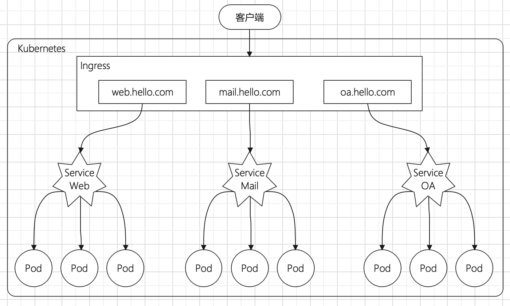
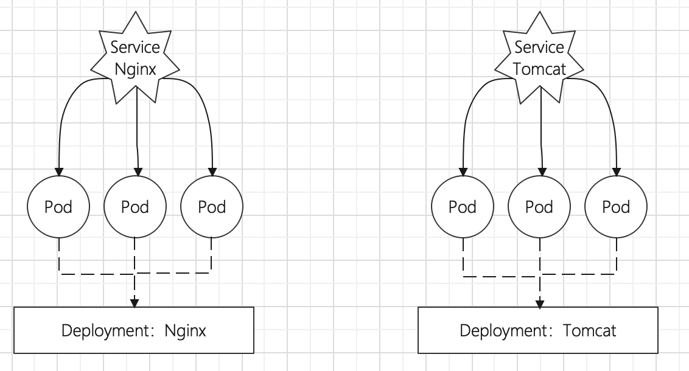

# 基础概述

Service对于集群之外暴露服务的主要方式有两种：NodePort和LoadBalancer，但是这两种方式，都有一定的缺点：

* NodePort方式的缺点是会占用很多集群的端口，当集群服务变多的时候，这个缺点就会越发明显
* LB方式的缺点是每个Service需要一个LB，浪费资源，并且需要Kubernetes之外设备的支持

基于这种现状，Kubernetes提供了Ingress资源对象，Ingress只需要一个NodePort或一个LB就可以满足暴露多个Service的需求。



# 工作原理

实际上，Ingress相当于一个**七层负载均衡器**，是Kubernetes对反向代理的一个抽象，它的工作原理类似于Nginx，可以理解成**在Ingress里建立诸多映射规则，Ingress Controller通过监听这些配置规则并转化为Nginx的反向代理配置，然后对外部提供服务。**在这里有两个概念：

* **Ingress**：Kubernetes中的一个对象，作用是定义请求如何转发到Service的规则
* **Ingress Controller**：具体实现反向代理及负载均衡器的程序，对Ingress定义的规则进行解析，根据配置的规则来实现请求转发，实现的方式有很多，比如Nginx、Contour、Haproxy等等。

Ingress（以nginx为例）的工作原理如下：

1. 用户编写Inggress规则，说明哪个域名对应Kubernetes集群中的哪个Service
2. Ingress控制器动态感知Ingress服务规则的变化，然后生成一段对应的Ngixn反向代理配置
3. Ingress控制器会将生成的额Nginx配置写入到一个运行着的Nginx服务器中，并动态更新
4. 到此为止，其实真正在工作的就是一个Nginx，内部配置了用户定义的请求转发规则


# Ingress使用

## Ingress环境

搭建Ingress环境

```shell
# 创建文件夹
[root@node01]> mkdir ingress
[root@node01]> cd ingress/

# 获取ingress-nginx，本次案例使用的是0.30版本
[root@node01]> wget https://raw.githubusercontent.com/kubernetes/ingress-nginx/nginx-0.30.0/deploy/static/mandatory.yaml
[root@node01]> wget https://raw.githubusercontent.com/kubernetes/ingress-nginx/nginx-0.30.0/deploy/static/provider/baremetal/service-nodeport.yaml

# 修改mandatory.yaml文件中的仓库可以加速访问
# 将quay.io/kubernetes-ingress-controller/nginx-ingress-controller:0.30.0
# 改为quay-mirror.qiniu.com/kubernetes-ingress-controller/nginx-ingress-controller:0.30.0

# 创建ingress-nginx
[root@node01]> kubectl apply -f ./

# 查看ingress-nginx
[root@node01]> kubectl get pod -n ingress-nginx -o wide
NAME                                        READY   STATUS    RESTARTS   AGE   IP            NODE
nginx-ingress-controller-54b86f8f7b-gsx92   1/1     Running   0          64s   10.244.1.45   node02

# 查看service
[root@node01]> kubectl get svc -n ingress-nginx
NAME            TYPE       CLUSTER-IP      EXTERNAL-IP   PORT(S)                      AGE
ingress-nginx   NodePort   10.96.180.100   <none>        80:30726/TCP,443:31853/TCP   118s
```

## 准备Service和Pod

为了实验方便，创建如下图的模型



1. 创建service-nginx.yaml

```yaml
apiVersion: apps/v1
kind: Deployment
metadata:
  name: nginx-deployment
  namespace: dev
spec:
  replicas: 3
  selector:
    matchLabels:
      app: nginx-pod
  template:
    metadata:
      labels:
        app: nginx-pod
    spec:
      containers:
        - name: nginx
          image: nginx:1.17.1
          ports:
            - containerPort: 80

---
apiVersion: apps/v1
kind: Deployment
metadata:
  name: tomcat-deployment
  namespace: dev
spec:
  replicas: 3
  selector:
    matchLabels:
      app: tomcat-pod
  template:
    metadata:
      labels:
        app: tomcat-pod
    spec:
      containers:
        - name: tomcat
          image: tomcat:8.5-jre10-slim
          ports:
            - containerPort: 8080

---
apiVersion: v1
kind: Service
metadata:
  name: nginx-service
  namespace: dev
spec:
  selector:
    app: nginx-pod
  clusterIP: None
  type: ClusterIP
  ports:
    - port: 80
      targetPort: 80

---
apiVersion: v1
kind: Service
metadata:
  name: tomcat-service
  namespace: dev
spec:
  selector:
    app: tomcat-pod
  clusterIP: None
  type: ClusterIP
  ports:
    - port: 8080
      targetPort: 8080
```

2. 创建资源对象

```shell
# 创建
[root@node01]> kubectl create -f tomcat-nginx.yaml

# 查看Service、Pod列表
[root@node01 ingress]# kubectl get svc,pod -n dev -o wide
NAME                           TYPE           CLUSTER-IP   EXTERNAL-IP     PORT(S)    AGE   SELECTOR
service/nginx-service          ClusterIP      None         <none>          80/TCP     99s   app=nginx-pod
service/tomcat-service         ClusterIP      None         <none>          8080/TCP   99s   app=tomcat-pod

NAME                                     READY   STATUS    RESTARTS   AGE   IP            NODE  
pod/nginx-deployment-5ffc5bf56c-9fp7k    1/1     Running   0          99s   10.244.2.17   node03
pod/nginx-deployment-5ffc5bf56c-q9s5f    1/1     Running   0          99s   10.244.1.48   node02
pod/nginx-deployment-5ffc5bf56c-xdv2m    1/1     Running   0          99s   10.244.1.46   node02
pod/tomcat-deployment-7db86c59b7-4twrg   1/1     Running   0          99s   10.244.1.47   node02
pod/tomcat-deployment-7db86c59b7-7kg69   1/1     Running   0          99s   10.244.2.18   node03
pod/tomcat-deployment-7db86c59b7-hn56f   1/1     Running   0          99s   10.244.1.49   node02
```

## HTTP代理

1. 创建ingress-http.yaml

```yaml
apiVersion: extensions/v1beta1
kind: Ingress
metadata:
  name: ingress-http
  namespace: dev
spec:
  rules:
    - host: nginx.hello.com
      http:
        paths:
          - path: /
            backend:
              serviceName: nginx-service
              servicePort: 80
    - host: tomcat.itheima.com
      http:
        paths:
          - path: /
            backend:
              serviceName: tomcat-service
              servicePort: 8080
```

2. 创建Ingress

```shell
# 创建
[root@node01]> kubectl create -f ingress-http.yaml
ingress.extensions/ingress-http created

# 查看
[root@node01]> kubectl get ing ingress-http -n dev
NAME           CLASS    HOSTS                              ADDRESS   PORTS   AGE
ingress-http   <none>   nginx.hello.com,tomcat.hello.com             80      18s

# 查看详情
[root@node01]> kubectl describe ing ingress-http  -n dev
Name:             ingress-http
Namespace:        dev
Address:          
Default backend:  default-http-backend:80 (<error: endpoints "default-http-backend" not found>)
Rules:
  Host              Path  Backends
  ----              ----  --------
  nginx.hello.com   /   nginx-service:80 (10.244.1.46:80,10.244.1.48:80,10.244.2.17:80)
  tomcat.hello.com  /   tomcat-service:8080 (10.244.1.47:8080,10.244.1.49:8080,10.244.2.18:8080)
Annotations:        <none>
Events:
  Type    Reason  Age   From                      Message
  ----    ------  ----  ----                      -------
  Normal  CREATE  48s   nginx-ingress-controller  Ingress dev/ingress-http

# 接下来,在本地电脑上配置host文件,解析上面的两个域名到172.16.210.10(master)上
# 然后,就可以分别访问tomcat.hello.com:32240和nginx.hello.com:32240
```

## HTTPS代理

1. 创建证书

```shell
# 生成证书
openssl req -x509 -sha256 -nodes -days 365 -newkey rsa:2048 -keyout tls.key -out tls.crt -subj "/C=CN/ST=BJ/L=BJ/O=nginx/CN=itheima.com"

# 创建密钥
kubectl create secret tls tls-secret --key tls.key --cert tls.crt
```

2. 创建ingress-https.yaml

```yaml
apiVersion: extensions/v1beta1
kind: Ingress
metadata:
  name: ingress-https
  namespace: dev
spec:
  tls:
    - hosts:
        - nginx.hello.com
        - tomcat.hello.com
      secretName: tls-secret # 指定秘钥
  rules:
    - host: nginx.hello.com
      http:
        paths:
          - path: /
            backend:
              serviceName: nginx-service
              servicePort: 80
    - host: tomcat.hello.com
      http:
        paths:
          - path: /
            backend:
              serviceName: tomcat-service
              servicePort: 8080
```

3. 创建Ingress

```shell
# 创建
[root@node01]> kubectl create -f ingress-https.yaml
ingress.extensions/ingress-https created

# 查看
[root@node01]> kubectl get ing ingress-https -n dev
NAME            HOSTS                                  ADDRESS         PORTS     AGE
ingress-https   nginx.hello.com,tomcat.hello.com   10.104.184.38   80, 443   2m42s

# 查看详情
[root@node01]> kubectl describe ing ingress-https -n dev
...
TLS:
  tls-secret terminates nginx.hello.com,tomcat.hello.com
Rules:
Host              Path Backends
----              ---- --------
nginx.hello.com  /  nginx-service:80 (10.244.1.97:80,10.244.1.98:80,10.244.2.119:80)
tomcat.hello.com /  tomcat-service:8080(10.244.1.99:8080,10.244.2.117:8080,10.244.2.120:8080)

#通过浏览器访问https://nginx.hello.com:31335 和 https://tomcat.hello.com:31335来查看了
```


