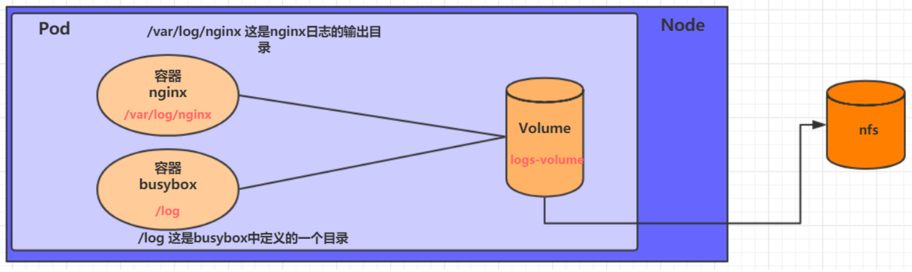

容器的生命周期可能很短，会被频繁的创建和销毁。那么容器在销毁时，保存在容器中的数据也会被清除。这种结果在某些情况下是符合用户需求的，有些情况下则不行。为了持久化保存用户的数据，Kubernetes引入了Volume的概念。

Volume是Pod中能够被多个容器访问的共享目录，它被定义在Pod上，然后被一个Pod里的多个容器挂载到具体的目录下，Kubernetes通过Volume实现同一个Pod中不同容器之间的的数据共享和数据持久化存储。Volume的生命周期不与Pod中单个容器的生命周期关联，当容器重启或终止时，Volume中的数据也不会丢失。

Kubernetes中的Volume支持多种数据类型，比较常见的有如下几个：


# 基本存储

## EmptyDir

EmptyDir是最基础的Volume类型，一个EmptyDir就是一个空目录。

EmptyDir是Pod被分配到Node时创建的，它的初始内容为空，并且无需指定宿主机的目录文件。因为Kubernetes会自动分配一个目录，当Pod销毁时，EmptyDir中的数据也会被永久删除。EmptyDir用途如下：

* 临时空间，比如某些应用程序运行时所需的临时目录，且无需永久保留。
* 一个容器要从另一个容器中获取数据的目录（多容器共享目录）


接下来通过一个容器之间共享文件的示例，使用一下EmptyDir。

在一个Pod中准备两个容器：Nginx和Busybox，然后声明一个Volume挂载到两个容器的目录中，接下来Nginx负责向Volume写数据，Busybox负责从Volume读数据，busybox通过命令将日志文件内容读取出来显示。

1. 创建volume-emptydir.yaml文件

```yaml
apiVersion: v1
kind: Pod
metadata:
  name: volume-emptydir
  namespace: dev
spec:
  containers:
    - name: nginx
      image: nginx:1.17.1
      ports:
        - containerPort: 80
      volumeMounts:
        - name: logs-volume
          mountPath: /var/log/nginx  #将logs-volume挂载到nginx容器，对应目录为/var/log/nginx。nginx默认写日志目录。
    - name: busybox
      image: busybox:1.30
      command: ["/bin/sh", "-c", "tail -f /logs/access.log"]
      valumeMounts:
        - name: logs-name
          mountPath: /logs           #将logs-volume挂载到busybox容器，对应目录为/logs
  volumes:                           #声明volume，名称为logs-name，类型为emptydir
    - name: logs-volume
      emptydir: {}
```

2. 创建Pod，观察变化

```shell
kubectl create -f volume-emptydir.yaml
kubectl get pod  -n dev -o wide
kubectl logs -f volume-emptydir -n dev -c busybox
curl 172.16.210.10:80
```

## HostPath

EmptyDir中数据不会被持久化，它会随着Pod的结束而销毁。如果想要简单地将数据持久化到主机，可以选择HostPath。

HostPath就是将主机的实际目录挂载到Pod中，以供容器使用。这样的设计就可以保证Pod销毁了，但是数据依然在Node主机上。


1. 创建volume-hostpath.yaml

```yaml
apiVersion: v1
kind: Pod
metadata:
  name: volume-hostpath
  namespace: dev
spec:
  containers:
    - name: nginx
      image: nginx:1.17.1
      ports:
        - containerPort: 80
      volumeMounts:
        - name: logs-volume
          mountPath: /var/log/nginx
    - name: busybox
      image: busybox:1.30
      command: ["/bin/sh", "-c", " taild -f /logs/access.log"] #从数据卷读取数据
      volumeMounts:
        - name: logs-volume                                    #挂载数据卷
          mountPath: /logs                                     #数据卷挂载到容器的目录
  volumes:
    - name: logs-volume
      hostPath:
        path: /root/logs        # Node节点的/root/logs作为volume
        type: DirectoryOrCreate # 目录存在就使用，否则先创建再使用
```

关于hostPath的type属性的值：

* DirectoryOrCreate：目录存在就使用，否则先创建再使用
* Directory：目录必须存在
* FileOrCreate：文件存在就使用，否则先创建再使用
* File：文件必须存在
* Socket：Unix套接字必须存在
* CharDevice：字符设备必须存在
* BlockDevice：块设备必须存在

2. 创建Pod，观察变化

```yaml
kubectl create -f  valume-hostpath.yaml
kubectl get pod -n dev -o wide
curl 171.16.210.10:80
ls /root/logs
```

## NFS

HostPath可以解决数据持久化问题，但是一旦Node节点故障了，Pod被转移到了其他节点上了又会出现问题了。此时需要单独的网络存储系统。比较常用的有NFS、CIFS。

NFS是一个网络文件存储系统，可以搭建一台NFS服务器，然后将Pod的存储直接挂载到NFS系统上。这样的话，无论Pod怎样转移，只要Node和NFS的连接没有问题，数据就可以访问。



1. 首先要准备NFS的服务器，这里为了简单，直接是Master节点的NFS服务器。

```shell
# 在master上安装nfs服务
[root@node01]# yum install nfs-utils -y

# 准备一个共享目录
[root@node01]# mkdir /root/data/nfs -pv

# 将共享目录以读写权限暴露给192.168.109.0/24网段中的所有主机
[root@node01]# vim /etc/exports
[root@node01]# more /etc/exports
/root/data/nfs 192.168.109.0/24(rw,no_root_squash)

# 启动nfs服务
[root@node01]# systemctl start nfs
```

2. 接下来在每个Node上都安装NFS，这样的目的是为了Node可以驱动NFS设备

```shell
# 在node上安装nfs服务，注意不需要启动
[root@node02]# yum install nfs-utils -y

[root@node03]# yum install nfs-utils -y
```

3. 然后创建volume-nfs.yaml

```yaml
apiVersion: v1
kind: Pod
metadata:
  name: volume-nfs
  namespace: dev
spec:
  containers:
    - name: nginx
      image: nginx:1.17.1
      ports:
        - containerPort: 80
      volumeMounts:
        - name: logs-volume
          mountPath: /var/log/nginx
    - name: busybox
      image: busybox:1.30
      command: ["/bin/sh", "-c", " taild -f /logs/access.log"]
      volumeMounts:
        - name: logs-volume
          mountPath: /logs
  volumes:
    - name: logs-volume
      server: 172.16.210.10
      nfs: /root/data/nfs
```

4. 创建Pod，观察变化

```shell
# 创建pod
[root@master ~]# kubectl create -f volume-nfs.yaml
pod/volume-nfs created

# 查看pod
[root@master ~]# kubectl get pods volume-nfs -n dev
NAME                  READY   STATUS    RESTARTS   AGE
volume-nfs        2/2     Running   0          2m9s

# 查看nfs服务器上的共享目录，发现已经有文件了
[root@master ~]# ls /root/data/
access.log  error.log
```

# 高级存储


