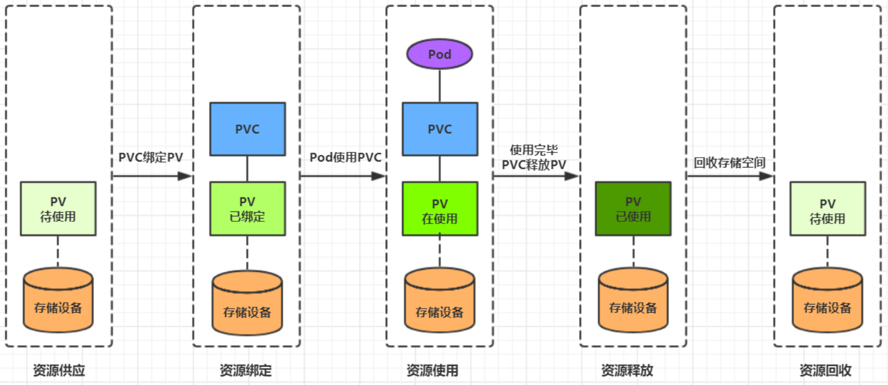

容器的生命周期可能很短，会被频繁的创建和销毁。那么容器在销毁时，保存在容器中的数据也会被清除。这种结果在某些情况下是符合用户需求的，有些情况下则不行。为了持久化保存用户的数据，Kubernetes引入了Volume的概念。

Volume是Pod中能够被多个容器访问的共享目录，它被定义在Pod上，然后被一个Pod里的多个容器挂载到具体的目录下，Kubernetes通过Volume实现同一个Pod中不同容器之间的的数据共享和数据持久化存储。Volume的生命周期不与Pod中单个容器的生命周期关联，当容器重启或终止时，Volume中的数据也不会丢失。

Kubernetes中的Volume支持多种数据类型，比较常见的有如下几个：


# 基本存储

## EmptyDir

EmptyDir是最基础的Volume类型，一个EmptyDir就是一个空目录。

EmptyDir是Pod被分配到Node时创建的，它的初始内容为空，并且无需指定宿主机的目录文件。因为Kubernetes会自动分配一个目录，当Pod销毁时，EmptyDir中的数据也会被永久删除。EmptyDir用途如下：

* 临时空间，比如某些应用程序运行时所需的临时目录，且无需永久保留。
* 一个容器要从另一个容器中获取数据的目录（多容器共享目录）


接下来通过一个容器之间共享文件的示例，使用一下EmptyDir。

在一个Pod中准备两个容器：Nginx和Busybox，然后声明一个Volume挂载到两个容器的目录中，接下来Nginx负责向Volume写数据，Busybox负责从Volume读数据，busybox通过命令将日志文件内容读取出来显示。

1. 创建volume-emptydir.yaml文件

```yaml
apiVersion: v1
kind: Pod
metadata:
  name: volume-emptydir
  namespace: dev
spec:
  containers:
    - name: nginx
      image: nginx:1.17.1
      ports:
        - containerPort: 80
      volumeMounts:
        - name: logs-volume
          mountPath: /var/log/nginx  #将logs-volume挂载到nginx容器，对应目录为/var/log/nginx。nginx默认写日志目录。
    - name: busybox
      image: busybox:1.30
      command: ["/bin/sh", "-c", "tail -f /logs/access.log"]
      valumeMounts:
        - name: logs-name
          mountPath: /logs           #将logs-volume挂载到busybox容器，对应目录为/logs
  volumes:                           #声明volume，名称为logs-name，类型为emptydir
    - name: logs-volume
      emptydir: {}
```

2. 创建Pod，观察变化

```shell
kubectl create -f volume-emptydir.yaml
kubectl get pod  -n dev -o wide
kubectl logs -f volume-emptydir -n dev -c busybox
curl 172.16.210.10:80
```

## HostPath

EmptyDir中数据不会被持久化，它会随着Pod的结束而销毁。如果想要简单地将数据持久化到主机，可以选择HostPath。

HostPath就是将主机的实际目录挂载到Pod中，以供容器使用。这样的设计就可以保证Pod销毁了，但是数据依然在Node主机上。


1. 创建volume-hostpath.yaml

```yaml
apiVersion: v1
kind: Pod
metadata:
  name: volume-hostpath
  namespace: dev
spec:
  containers:
    - name: nginx
      image: nginx:1.17.1
      ports:
        - containerPort: 80
      volumeMounts:
        - name: logs-volume
          mountPath: /var/log/nginx
    - name: busybox
      image: busybox:1.30
      command: ["/bin/sh", "-c", " taild -f /logs/access.log"] #从数据卷读取数据
      volumeMounts:
        - name: logs-volume                                    #挂载数据卷
          mountPath: /logs                                     #数据卷挂载到容器的目录
  volumes:
    - name: logs-volume
      hostPath:
        path: /root/logs        # Node节点的/root/logs作为volume
        type: DirectoryOrCreate # 目录存在就使用，否则先创建再使用
```

关于hostPath的type属性的值：

* DirectoryOrCreate：目录存在就使用，否则先创建再使用
* Directory：目录必须存在
* FileOrCreate：文件存在就使用，否则先创建再使用
* File：文件必须存在
* Socket：Unix套接字必须存在
* CharDevice：字符设备必须存在
* BlockDevice：块设备必须存在

2. 创建Pod，观察变化

```yaml
kubectl create -f  valume-hostpath.yaml
kubectl get pod -n dev -o wide
curl 171.16.210.10:80
ls /root/logs
```

## NFS

HostPath可以解决数据持久化问题，但是一旦Node节点故障了，Pod被转移到了其他节点上了又会出现问题了。此时需要单独的网络存储系统。比较常用的有NFS、CIFS。

NFS是一个网络文件存储系统，可以搭建一台NFS服务器，然后将Pod的存储直接挂载到NFS系统上。这样的话，无论Pod怎样转移，只要Node和NFS的连接没有问题，数据就可以访问。


1. 首先要准备NFS的服务器，这里为了简单，直接是Master节点的NFS服务器。

```shell
# 在master上安装nfs服务
[root@node01]# yum install nfs-utils -y

# 准备一个共享目录
[root@node01]# mkdir /root/data/nfs -pv

# 将共享目录以读写权限暴露给192.168.109.0/24网段中的所有主机
[root@node01]# vim /etc/exports
[root@node01]# more /etc/exports
/root/data/nfs 192.168.109.0/24(rw,no_root_squash)

# 启动nfs服务
[root@node01]# systemctl start nfs
```

2. 接下来在每个Node上都安装NFS，这样的目的是为了Node可以驱动NFS设备

```shell
# 在node上安装nfs服务，注意不需要启动
[root@node02]# yum install nfs-utils -y

[root@node03]# yum install nfs-utils -y
```

3. 然后创建volume-nfs.yaml

```yaml
apiVersion: v1
kind: Pod
metadata:
  name: volume-nfs
  namespace: dev
spec:
  containers:
    - name: nginx
      image: nginx:1.17.1
      ports:
        - containerPort: 80
      volumeMounts:
        - name: logs-volume
          mountPath: /var/log/nginx
    - name: busybox
      image: busybox:1.30
      command: ["/bin/sh", "-c", " taild -f /logs/access.log"]
      volumeMounts:
        - name: logs-volume
          mountPath: /logs
  volumes:
    - name: logs-volume
      server: 172.16.210.10
      nfs: /root/data/nfs
```

4. 创建Pod，观察变化

```shell
# 创建pod
[root@master ~]# kubectl create -f volume-nfs.yaml
pod/volume-nfs created

# 查看pod
[root@master ~]# kubectl get pods volume-nfs -n dev
NAME                  READY   STATUS    RESTARTS   AGE
volume-nfs        2/2     Running   0          2m9s

# 查看nfs服务器上的共享目录，发现已经有文件了
[root@master ~]# ls /root/data/
access.log  error.log
```

# 高级存储

## PV & PVC

由于Kubernetes支持的存储系统很多，为了屏蔽底层存储系统实现的细节，方便用户使用，Kubernetes引入了PV和PVC两种资源对象。

* PV（Persistent Volume）：是持久卷的意思，是对底层的共享存储的一种抽象。一般情况下，PV由Kubernetes管理员进行创建和配置，它与底层具体的共享存储技术有关，并通过插件完成与共享存储的对接。
* PVC（Persistent Volume Claim）：是持久卷的意思，是用户对于存储需求的一种声明。换句话说，PVC其实就是用户向Kubernetes系统发出的一种资源需求申请。


使用PV和PVC之后，工作可以得到进一步的细分：

* 存储：存储工程师维护
* PV：Kubernetes管理员维护
* PVC：Kubernetes用户维护

## PV

PV是存储资源的抽象，下面是资源清单的文件：

```yaml
apiVersion: v1
kind: PersistentVolume
metadata:
  name: pv2
spec:
  nfs:                           # 存储类型，与底层真正存储对应
  capacity:                      # 存储能力，目前只支持存储空间的设置
    storage: 2Gi
  accessModes:                   # 访问模式
  storageClassName:              # 存储类别
  persistentVolumeReclaimPolicy: # 回收策略
```

PV的关键配置参数说明：

* 存储类型：底层实机存储的类型，Kubernetes支持多种存储类型，每种存储类型的配置都有所差异
* 存储能力：目前只支持存储空间的设置storage，不过未来可能会支持IOPS、吞吐量等指标的配置
* 访问模式：用于描述用户应用对存储西苑的访问权限，访问权限包括下面几种方式：
    * ReadWriteOnce（RWO）：读写权限，但是只能被单个节点挂载
    * ReadOnlyOnce（ROX）：只读权限，可以被多个节点挂载
    * ReadWriteMany（RWX）：读写权限，可以被多个节点挂载
* 回收策略：当PV不再被使用之后，对其的处理方式。目前支持三种策略：
    * Retain（保留）：保留数据，需要管理员手工清理数据
    * Recycle（回收）：清除PV中的数据，效果相当于 rm -rf /thevolume/*
    * Delete（删除）：与PV相连的后端存储完成volume的删除操作，当然这常见于云服务上的存储服务
* 存储类别：PV可以通过storageClassName参数指定一个存储类别
    * 具有特定类别的PV只能与请求了该类别的PVC进行绑定
    * 未设定类别的PV则只能与不请求任何类别的PVC进行绑定
* 状态：一个PV的生命周期中，可能会处于4种不同的阶段：
    * Available（可用）：表示可用状态，还未被任何PVC绑定
    * Bound（已绑定）：表示PV已经被PVC绑定
    * Released（已释放）：表示PVC被删除，但是资源还未被集群重新声明
    * Failed（失败）：表示该PV的自动回收失败

## PV实验

使用NFS作为存储，来演示PV的使用，创建3个PV，对应NFS中的3个暴露的路径。

1. 准备NFS环境

```shell
# 创建目录
[root@master ~]# mkdir /root/data/{pv1,pv2,pv3} -pv

# 暴露服务
[root@master ~]# more /etc/exports
/root/data/pv1     192.168.109.0/24(rw,no_root_squash)
/root/data/pv2     192.168.109.0/24(rw,no_root_squash)
/root/data/pv3     192.168.109.0/24(rw,no_root_squash)

# 重启服务
[root@master ~]#  systemctl restart nfs
```

2. 创建pv.yaml

```yaml
apiVersion: v1
kind: PersistentVolume
metadata:
  name: pv1
spec:
  capacity:
    storage: 1Gi
  accessModes:
    - ReadWriteMany
  persistentVolumeReclaimPolicy: Retain
  nfs:
    path: /root/data/pv1
    server: 192.168.109.100

---
apiVersion: v1
kind: PersistentVolume
metadata:
  name: pv2
spec:
  capacity:
    storage: 2Gi
  accessModes:
    - ReadWriteMany
  persistentVolumeReclaimPolicy: Retain
  nfs:
    path: /root/data/pv2
    server: 192.168.109.100

---
apiVersion: v1
kind: PersistentVolume
metadata:
  name: pv3
spec:
  capacity:
    storage: 3Gi
  accessModes:
    - ReadWriteMany
  persistentVolumeReclaimPolicy: Retain
  nfs:
    path: /root/data/pv3
    server: 192.168.109.100
```

3. 应用pv.yaml

```yaml
# 创建 pv
[root@master ~]# kubectl create -f pv.yaml
persistentvolume/pv1 created
persistentvolume/pv2 created
persistentvolume/pv3 created

# 查看pv
[root@master ~]# kubectl get pv -o wide
NAME   CAPACITY   ACCESS MODES  RECLAIM POLICY  STATUS      AGE   VOLUMEMODE
pv1    1Gi        RWX            Retain        Available    10s   Filesystem
pv2    2Gi        RWX            Retain        Available    10s   Filesystem
pv3    3Gi        RWX            Retain        Available    9s    Filesystem
```

## PVC

PVC是资源的申请，用来声明对存储空间、访问模式、存储类别需求信息。下面是资源清单文件：

```yaml
apiVersion: v1
kind: PersistentVolumeClaim
metadata:
  name: pvc
  namespace: dev
spec:
  accessModes:        # 访问模式
  selector:           # 采用标签对PV选择
  storageClassName:   # 存储类别
  resources:          # 请求空间
    requests:
      storage: 5Gi
```

PVC的关键配置参数说明

* accessModes：访问模式，用于描述用户应用对存储资源的范根权限
* selector：选择器，通过Label Selector的设置，可使PVC对于系统中已存在的PV进行筛选
* storageClassName：存储类别，PVC在定义时可以设定需要的后端存储类别的类别，只有设置了该class的PV才能被系统选出
* resources：描述对存储资源的请求

## PVC实验

1. 创建pvc.yaml

```yaml
apiVersion: v1
kind: PersistentVolumeClaim
metadata:
  name: pvc1
  namespace: dev
spec:
  accessModes:
    - ReadWriteMany
  resources:
    requests:
      storage: 1Gi

---
apiVersion: v1
kind: PersistentVolumeClaim
metadata:
  name: pvc2
  namespace: dev
spec:
  accessModes:
    - ReadWriteMany
  resources:
    requests:
      storage: 1Gi

---
apiVersion: v1
kind: PersistentVolumeClaim
metadata:
  name: pvc3
  namespace: dev
spec:
  accessModes:
    - ReadWriteMany
  resources:
    requests:
      storage: 1Gi
```

2. 申请PV

```shell
# 创建pvc
[root@master ~]# kubectl create -f pvc.yaml
persistentvolumeclaim/pvc1 created
persistentvolumeclaim/pvc2 created
persistentvolumeclaim/pvc3 created

# 查看pvc
[root@master ~]# kubectl get pvc  -n dev -o wide
NAME   STATUS   VOLUME   CAPACITY   ACCESS MODES   STORAGECLASS   AGE   VOLUMEMODE
pvc1   Bound    pv1      1Gi        RWX                           15s   Filesystem
pvc2   Bound    pv2      2Gi        RWX                           15s   Filesystem
pvc3   Bound    pv3      3Gi        RWX                           15s   Filesystem

# 查看pv
[root@master ~]# kubectl get pv -o wide
NAME  CAPACITY ACCESS MODES  RECLAIM POLICY  STATUS    CLAIM       AGE     VOLUMEMODE
pv1    1Gi        RWx        Retain          Bound    dev/pvc1    3h37m    Filesystem
pv2    2Gi        RWX        Retain          Bound    dev/pvc2    3h37m    Filesystem
pv3    3Gi        RWX        Retain          Bound    dev/pvc3    3h37m    Filesystem
```

3. 创建pod.yaml

```yaml
apiVersion: v1
kind: Pod
metadata:
  name: pod1
  namespace: dev
spec:
  containers:
    - name: busybox
      image: busybox:1.30
      command:
        [
          "/bin/sh",
          "-c",
          "while true;do echo pod1 >> /root/out.txt; sleep 10; done;",
        ]
      volumeMounts:
        - name: volume
          mountPath: /root/
  volumes:
    - name: volume
      persistentVolumeClaim:
        claimName: pvc1
        readOnly: false
---
apiVersion: v1
kind: Pod
metadata:
  name: pod2
  namespace: dev
spec:
  containers:
    - name: busybox
      image: busybox:1.30
      command:
        [
          "/bin/sh",
          "-c",
          "while true;do echo pod2 >> /root/out.txt; sleep 10; done;",
        ]
      volumeMounts:
        - name: volume
          mountPath: /root/
  volumes:
    - name: volume
      persistentVolumeClaim:
        claimName: pvc2
        readOnly: false
```

4. 创建Pod

```shell
# 创建pod
[root@master ~]# kubectl create -f pods.yaml
pod/pod1 created
pod/pod2 created

# 查看pod
[root@master ~]# kubectl get pods -n dev -o wide
NAME   READY   STATUS    RESTARTS   AGE   IP            NODE   
pod1   1/1     Running   0          14s   10.244.1.69   node1   
pod2   1/1     Running   0          14s   10.244.1.70   node1  

# 查看pvc
[root@master ~]# kubectl get pvc -n dev -o wide
NAME   STATUS   VOLUME   CAPACITY   ACCESS MODES      AGE   VOLUMEMODE
pvc1   Bound    pv1      1Gi        RWX               94m   Filesystem
pvc2   Bound    pv2      2Gi        RWX               94m   Filesystem
pvc3   Bound    pv3      3Gi        RWX               94m   Filesystem

# 查看pv
[root@master ~]# kubectl get pv -n dev -o wide
NAME   CAPACITY   ACCESS MODES   RECLAIM POLICY   STATUS   CLAIM       AGE     VOLUMEMODE
pv1    1Gi        RWX            Retain           Bound    dev/pvc1    5h11m   Filesystem
pv2    2Gi        RWX            Retain           Bound    dev/pvc2    5h11m   Filesystem
pv3    3Gi        RWX            Retain           Bound    dev/pvc3    5h11m   Filesystem

# 查看nfs中的文件存储
[root@master ~]# more /root/data/pv1/out.txt
node1
node1
[root@master ~]# more /root/data/pv2/out.txt
node2
node2
```

## 生命周期

PVC和PV是一一对应的，PV和PVC之间的相互作用遵循一下的生命周期：

* **资源供应**：管理员手工创建底层存储和PV
* **资源绑定**：用户创建PVC，Kubernetes负责根据PVC的声明去寻找PV，并绑定。在用户定义好PVC之后，系统根据PVC对存储资源的请求在已经存在的PV中选择一个满足条件的。
    * 一旦找到，就将PV与用户定义的PVC进行绑定，用户的应用就可以使用这个PVC了。
    * 如果找不到，PVC就会无限期处于Pending状态，直到系统管理员创建了一个符合其要求的PV。
    * PV一旦与某个PVC绑定了，就会被这个PVC独占，不能再与其他PVC绑定了
* **资源使用**：用户可在Pod中像volume一样使用PV。Pod使用Volume的定义，将PVC挂载到容器内某个路径进行使用
* **资源释放**：用户删除PVC来释放PV。当存储资源使用完毕后，用户可以删除PVC，与该PVC绑定的PV将会被标记为“已释放”，但还不能立刻与其他PVC进行绑定。通过之前PVC写入的数据可能还被留在存储设备上，只有在清除之后该PV才能再次使用。
* **资源回收**：Kubernetes根据PV设置的回收策略进行资源的回收。对于PV，管理员可以设置回收策略，用于设置与之绑定的PVC释放资源之后如何处理遗留数据的问题。只有PV的存储空间完成回收，才能供新的PVC绑定和使用。



# 配置存储

## ConfigMap

ConfigMap是一种特殊的存储卷，它的主要作用就是存储配置信息的。

1. 创建configMap.yaml

```yaml
apiVersion: v1
kind: ConfigMap
metadata:
  name: configmap
  namespace: dev
data:
  info:
    username: admin
    password: 123456
```

2. 接下来使用该配置文件创建configmap

```shell
# 创建configmap
[root@node01]> kubectl create -f configmap.yaml
configmap/configmap created

# 查看configmap详情
[root@node01]> kubectl describe cm configmap -n dev
Name:         configmap
Namespace:    dev
Labels:       <none>
Annotations:  <none>

Data
====
info:
----
username:admin
password:123456

Events:  <none>
```

3. 创建pod-configmap.yaml，通过volume将configmap挂在进去

```yaml
apiVersion: v1
kind: Pod
metadata:
  name: pod-configmap
  namespace: dev
spec:
  containers:
    - name: nginx
      image: nginx:1.17.1
      volumeMounts:
        - name: config
          mountPath: /configmap/config
  volumes:
    - name: config
      configMap:
        name: configmap
```

4. 创建Pod

```shell
# 创建pod
[root@node01]> kubectl create -f pod-configmap.yaml
pod/pod-configmap created

# 查看pod
[root@node01]> kubectl get pod pod-configmap -n dev
NAME            READY   STATUS    RESTARTS   AGE
pod-configmap   1/1     Running   0          6s

#进入容器
[root@node01]> kubectl exec -it pod-configmap -n dev /bin/sh
# cd /configmap/config/
# ls
info
# more info
username:admin
password:123456

# 可以看到映射已经成功，每个configmap都映射成了一个目录
# key--->文件     value---->文件中的内容
# 此时如果更新configmap的内容, 容器中的值也会动态更新
```

## Secret

在Kubernetes中，还有一种非常类似于ConfigMap的资源对象，称为Secret，它主要用于存储敏感信息，例如密码、密钥、证书等。

1. 首先使用Base64对数据进行加密

```shell
[root@node01]> echo -n 'admin' | base64   #准备username
YWRtaW4=
[root@node01]> echo -n '123456' | base64  #准备password
MTIzNDU2
```

2. 创建Secret.yaml

```yaml
apiVersion: v1
kind: Secret
metadata:
  name: secret
  namespace: dev
type: Opaque
data:
  username: YWRtaW4=
  password: MTIzNDU2
```

3. 创建Secret资源对象

```shell
# 创建secret
[root@master ~]# kubectl create -f secret.yaml
secret/secret created

# 查看secret详情
[root@master ~]# kubectl describe secret secret -n dev
Name:         secret
Namespace:    dev
Labels:       <none>
Annotations:  <none>
Type:  Opaque
Data
====
password:  6 bytes
username:  5 bytes
```

4. 定义Pod，将Secret资源对象挂载进去

```yaml
apiVersion: v1
kind: Pod
metadata:
  name: pod-secret
  namespace: dev
spec:
  containers:
    - name: nginx
      image: nginx:1.17.1
      volumeMounts:
        - name: config
          mountPath: /secret/config
  volumes:
    - name: config
      secret:
        secretName: secret
```

5. 创建Pod

```shell
# 创建pod
[root@node01]> kubectl create -f pod-secret.yaml
pod/pod-secret created

# 查看pod
[root@node01]> kubectl get pod pod-secret -n dev
NAME            READY   STATUS    RESTARTS   AGE
pod-secret      1/1     Running   0          2m28s

# 进入容器，查看secret信息，发现已经自动解码了
[root@node01]> kubectl exec -it pod-secret /bin/sh -n dev
/ # ls /secret/config/
password  username
/ # more /secret/config/username
admin
/ # more /secret/config/password
123456
```

至此，通过Secret实现了信息的编码


