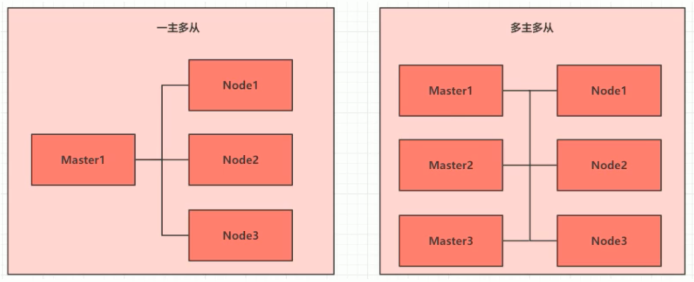

# 第一章：kubernetes基础

## 介绍

Kubernetes是一个全新的基于容器的分布式架构领先方案，是谷歌Brog系统的一个开源版本，于2014年9月发布第一个版本，2015年7月发布第一个正式版本。

Kubernetes本质上是`` 一组服务器集群``，它可以在集群的每个节点上运行特定的程序，来对节点中部署的容器进行管理。

目的是``实现资源管理的自动化``。主要提供了如下的功能：

* **自我修复**：一旦某个容器崩溃，能够在1秒之内迅速启动新的容器
* **弹性伸缩**：可以根据需要，自动对集群中正在运行的容器数量进行调整
* **服务发现**：服务可以通过自动发现的形式找到它所依赖的服务
* **负载均衡**：如果一个服务启动了多个容器，能够自动实现请求的负载均衡
* **版本回退**：如果发现新版本的程序有问题，可以立即回退到原来的版本
* **存储编排**：可以根据容器自身需求自动创建存储卷


## 组件

一个Kubernetes集群主要由控制节点（Master）、工作节点（Node）构成，每个节点上都会安装不同的组件。

**Master：集群的控制控制平面，负责集群的决策和管理**

> **ApiServer**：资源操作的唯一入口，接口用户输入的命令，提供认证、授权、API注册和发现等机制
>
> **Scheduler**：负责集群的资源调度，按照预定的调度决策将Pod调度到相应Node节点上
>
> **ControllerManager**：负责维护集群的状态，比如程序的部署安排、故障检测、自动扩展、滚动更新等
>
> **etcd**：负责存储集群的各种资源对象的信息

**Node：集群的数据平台，负责为容器提供运行环境（真正干活）**

> **kubelet**：负责维护容器的生命周期，即通过控制Docker来创建、更新、销毁容器
>
> **kubeproxy**：负责提供集群内部的服务发现和负责均衡
>
> **containerRuntime**：负责节点上容器的各种操作


下面部署一个Nginx服务来说明Kubernetes系统各个组件之间的调用关系：

1. 首先要明确，一旦Kubernetes环境启动之后，Master和Node节点都会将自身信息存储到etcd数据库中
2. 一个Nginx服务的安装请求会首先被发送到Master节点的ApiServer组件
3. ApiServer组件会调用Scheduler组件来决定到底应该把服务安装部署到哪个Node上，此时会从etcd数据库中获取所有Node信息，经过一定算法决策选择，并将结果告知ApiServer
4. ApiServer调用ControllerManager去调度Node节点安装Nginx服务
5. kubelet接收到命令之后通知Dcoker，由Docker来启动一个Nginx的Pod，Pod是Kubernetes的最小操作单元，容器必须运行在Pod中
6. 一个Nginx服务运行之后，如果需要访问Nginx，就需要通过kube-proxy来对Pod产生访问的代理，这样外界用户就可以访问集群中的Nginx服务了。

## 概念

**Master**：集群控制节点，每个集群需要至少一个Master节点负责集群的管控

**Node**：工作负载节点，由Master节点分配容器到这些Node工作节点上，然后Node上的Docker负责容器的运行

**Pod**：Kubernetes的最小控制单元，容器都是运行在Pod中，一个Pod中可以有一个或多个容器

**Controller**：控制器，通过它来实现对Pod的管理，比如启动Pod，停止Pod，伸缩Pod的数量等

**Service**：Pod对外服务的统一入口，同一类Pod会拥有相同的标签

**Label**：标签，用于对Pod的分类，同一类Pod有相同的标签

**Namespace**：命名空间，用来隔离Pod的运行环境

# 第二章：集群环境搭建

##  准备

### 集群类型

Kubernetes集群大体上分为两类：一主多从和多主多从

* **一主多从**：一台Master和多台Node节点，搭建简单，但有单机故障风险，使用与测试环境
* **多主多从**：多台Master和多台Node节点，搭建麻烦，可靠性高，使用于生产环境



### 安装方式

Kubernetes有多种部署方式，目前主流的方式有kubeadm、minikube、二进制包

* minikube：一个用于快速搭建单节点Kuberetes的工具，适用于开发测试环境
* kubeadm：一个用于快速搭建Kubernetes集群的工具，通常也都是使用这种方式，适用于生产环境
* 二进制包：从官网下载每个组件的二进制包，按照顺序安装，该方式对于理解Kubernetes组件更加有效

### 环境要求

Kubernetes部署环境要求

> - 一台或多态机器
> - 硬件要求：内存2GB或2GB+，CPU 2核或CPU 2核+ Required
> - 集群内各个机器之间能互相通信 Required
> - 集群内各个机器可以访问外网，需要拉取镜像，非必须要求 Optional
> - 禁止swap分区 Required

PS：swap分区指的是虚拟内存分区，它的作用是在物理内存使用完之后，将磁盘空间虚拟成内存来使用，启用swap社会对系统#的性能产生非常负面的影响，因此Kubernetes要求每个节点都要禁用swap分区，但是如果因为某些原因确实不能关闭#swap分区的，就需要在集群安装过程中通过明确的参数进行配置说明。

### 主机规划

|  作用  |    IP地址     |  操作系统  |         配置         |
| :----: | :-----------: | :--------: | :------------------: |
| Master | 192.168.8.134 | CentOS 8.3 | 2CPUs、2GMem、50GVol |
| Node1  | 192.168.8.136 | CentOS 8.3 | 2CPUs、2GMem、50GVol |
| Node2  | 192.168.8.137 | CentOS 8.3 | 2CPUs、2GMem、50GVol |

本次环境搭建使用一主两从结构，使用CentOS 8.3操作系统，然后在每台机器上安装如下软件包：

* docker：19.03.13
* kubeadm：1.19.4
* kubelet：1.19.4
* kubectl：1.19.4

## 搭建

### 系统参数

```shell
#关闭和禁用防火墙
systemctl stop firewalld
systemctl disable firewalld

#关闭SELinux
sed -i 's/enforcing/disabled/' /etc/selinux/config

#关闭swap，k8s禁止虚拟内存以提高性能
swapoff -a 													#临时关闭
sed -ri 's/.*swap.*/#&/' /etc/fstab #永久关闭

#在每个节点上添加hosts
cat >>/etc/hosts << EOF
172.16.210.10 k8smaster
172.16.210.11 k8snode1
172.16.210.12 k8snode2
EOF

#设置网桥参数，允许iptables过滤网桥流量
cat > /etc/sysctl.d/k8s.conf <<EOF
net.bridge.bridge-nf-call-ip6tables=1
net.bridge.bridge-nf-call-iptables=1
EOF

#时间同步
rpm -ivh http://mirrors.wlnmp.com/centos/wlnmp-release-centos.noarch.rpm
dnf  install wntp -y
ntpdate time.windows.com
```

### 安装docker

```shell
#删除已有的docker或podman
yum remove podman*
yum remove docker-ce -y
yum remove runc-1.0.0-70.rc92.module_el8.3.0+699+d61d9c41.x86_64 -y

#更新docker的yum源
curl https://mirrors.aliyun.com/docker-ce/linux/centos/docker-ce.repo -o /etc/yum.repos.d/docker-ce.repo

#安装指定版本的Docker
yum install docker-ce-19.03.13 -y

#6.配置docker随系统启动，运行docker服务及查看docker服务状态
systemctl start docker
systemctl enable docker.service
=======

#更新docker的yum源
curl https://mirrors.aliyun.com/docker-ce/linux/centos/docker-ce.repo -o /etc/yum.repos.d/docker-ce.repo

#安装指定版本的Docker
yum install docker-ce-19.03.13 -y

#6.配置docker随系统启动，运行docker服务及查看docker服务状态
systemctl start docker
systemctl enable docker.service
```

### 安装kubernetes

添加阿里云的yum源，安装会更快

```shell
#添加yum源
cat > /etc/yum.repos.d/kubernetes.repo <<EOF
[kubernetes]
name=Kubernetes
baseurl=https://mirrors.aliyun.com/kubernetes/yum/repos/kubernetes-el7-x86_64/
enabled=1
gpgcheck=1
repo_gpgcheck=1
gpgkey=https://mirrors.aliyun.com/kubernetes/yum/doc/yum-key.gpg https://mirrors.aliyun.com/kubernetes/yum/doc/rpm-package-key.gpg
EOF
```

安装kubenetes工具组件

```shell
#安装 kubeadm、kubectl、kubelet
yum install kubelet-1.19.4 kubeadm-1.19.4 kubectl-1.19.4 -y

#配置开启启动
systemctl enable kubelet.service

#验证安装
yum list installed | grep kubelet
yum list installed | grep kubeadm
yum list installed | grep kubectl

#查看安装的版本
kubelet --version
```

* **kubeadm**：用于初始化cluster

* **kubelet**：运行在集群中所有节点上，负责启动Pod和容器

* **kubectl**：用来与集群通信的命令行工具，通过kubectl可以部署和管理应用，查看各种资源、创建、删除和更新组件

上述几个步骤完成之后，重启系统，这样确保配置项都生效了

初始化master

```shell
#在Master节点的机器上执行初始化
kubeadm init \
--apiserver-advertise-address=172.16.210.10 \
--image-repository registry.aliyuncs.com/google_containers \
--kubernetes-version v1.19.4 \
--service-cidr=10.96.0.0/12 \
--pod-network-cidr=10.244.0.0/16
```

- `--apiserver-advertise-address` ：api-server的广播地址，即Master节点的地址
- `--image-repository` ：容器的镜像仓库地址
- `--kubernetes-version` ：Kubernetes的版本号
- `--service-cidr=10.96.0.0/12` ：Pod网络
- `--pod-network-cidr=10.244.0.0/16` ：k8s支持多种网络组件，比如Flannel、Weave、Calico等，我们后续使用kube-flannel网络组件，所以必须要设置这个参数，10.244.0.0.0/16是Flannel的默认网段，可以自定义修改。

service-CIDR的选取不能和Podcidr及本机网络有重叠或冲突，一般可以选择一个本机网络和PodCIDR都没有用到的私有网络地址段，网络无重叠冲突即可。初始化命令执行完毕之后，**先不要clear输出结果**，如下会用到输出里的部分内容，如下图：

```Text
[root@node01 ~]# kubeadm init \
> --apiserver-advertise-address=172.16.210.10 \
> --image-repository registry.aliyuncs.com/google_containers \
> --kubernetes-version v1.19.4 \
> --service-cidr=10.96.0.0/12 \
> --pod-network-cidr=10.244.0.0/16
W0512 10:36:35.475889    1634 configset.go:348] WARNING: kubeadm cannot validate component configs for API groups [kubelet.config.k8s.io kubeproxy.config.k8s.io]
[init] Using Kubernetes version: v1.19.4
[preflight] Running pre-flight checks
	[WARNING IsDockerSystemdCheck]: detected "cgroupfs" as the Docker cgroup driver. The recommended driver is "systemd". Please follow the guide at https://kubernetes.io/docs/setup/cri/
	[WARNING FileExisting-tc]: tc not found in system path
[preflight] Pulling images required for setting up a Kubernetes cluster
[preflight] This might take a minute or two, depending on the speed of your internet connection
[preflight] You can also perform this action in beforehand using 'kubeadm config images pull'
[certs] Using certificateDir folder "/etc/kubernetes/pki"
[certs] Generating "ca" certificate and key
[certs] Generating "apiserver" certificate and key
[certs] apiserver serving cert is signed for DNS names [kubernetes kubernetes.default kubernetes.default.svc kubernetes.default.svc.cluster.local node01] and IPs [10.96.0.1 172.16.210.10]
[certs] Generating "apiserver-kubelet-client" certificate and key
[certs] Generating "front-proxy-ca" certificate and key
[certs] Generating "front-proxy-client" certificate and key
[certs] Generating "etcd/ca" certificate and key
[certs] Generating "etcd/server" certificate and key
[certs] etcd/server serving cert is signed for DNS names [localhost node01] and IPs [172.16.210.10 127.0.0.1 ::1]
[certs] Generating "etcd/peer" certificate and key
[certs] etcd/peer serving cert is signed for DNS names [localhost node01] and IPs [172.16.210.10 127.0.0.1 ::1]
[certs] Generating "etcd/healthcheck-client" certificate and key
[certs] Generating "apiserver-etcd-client" certificate and key
[certs] Generating "sa" key and public key
[kubeconfig] Using kubeconfig folder "/etc/kubernetes"
[kubeconfig] Writing "admin.conf" kubeconfig file
[kubeconfig] Writing "kubelet.conf" kubeconfig file
[kubeconfig] Writing "controller-manager.conf" kubeconfig file
[kubeconfig] Writing "scheduler.conf" kubeconfig file
[kubelet-start] Writing kubelet environment file with flags to file "/var/lib/kubelet/kubeadm-flags.env"
[kubelet-start] Writing kubelet configuration to file "/var/lib/kubelet/config.yaml"
[kubelet-start] Starting the kubelet
[control-plane] Using manifest folder "/etc/kubernetes/manifests"
[control-plane] Creating static Pod manifest for "kube-apiserver"
[control-plane] Creating static Pod manifest for "kube-controller-manager"
[control-plane] Creating static Pod manifest for "kube-scheduler"
[etcd] Creating static Pod manifest for local etcd in "/etc/kubernetes/manifests"
[wait-control-plane] Waiting for the kubelet to boot up the control plane as static Pods from directory "/etc/kubernetes/manifests". This can take up to 4m0s
[apiclient] All control plane components are healthy after 14.004274 seconds
[upload-config] Storing the configuration used in ConfigMap "kubeadm-config" in the "kube-system" Namespace
[kubelet] Creating a ConfigMap "kubelet-config-1.19" in namespace kube-system with the configuration for the kubelets in the cluster
[upload-certs] Skipping phase. Please see --upload-certs
[mark-control-plane] Marking the node node01 as control-plane by adding the label "node-role.kubernetes.io/master=''"
[mark-control-plane] Marking the node node01 as control-plane by adding the taints [node-role.kubernetes.io/master:NoSchedule]
[bootstrap-token] Using token: 2wl1mh.n5q5kw40gkcj6saq
[bootstrap-token] Configuring bootstrap tokens, cluster-info ConfigMap, RBAC Roles
[bootstrap-token] configured RBAC rules to allow Node Bootstrap tokens to get nodes
[bootstrap-token] configured RBAC rules to allow Node Bootstrap tokens to post CSRs in order for nodes to get long term certificate credentials
[bootstrap-token] configured RBAC rules to allow the csrapprover controller automatically approve CSRs from a Node Bootstrap Token
[bootstrap-token] configured RBAC rules to allow certificate rotation for all node client certificates in the cluster
[bootstrap-token] Creating the "cluster-info" ConfigMap in the "kube-public" namespace
[kubelet-finalize] Updating "/etc/kubernetes/kubelet.conf" to point to a rotatable kubelet client certificate and key
[addons] Applied essential addon: CoreDNS
[addons] Applied essential addon: kube-proxy

Your Kubernetes control-plane has initialized successfully!

To start using your cluster, you need to run the following as a regular user:

  mkdir -p $HOME/.kube
  sudo cp -i /etc/kubernetes/admin.conf $HOME/.kube/config
  sudo chown $(id -u):$(id -g) $HOME/.kube/config

You should now deploy a pod network to the cluster.
Run "kubectl apply -f [podnetwork].yaml" with one of the options listed at:
  https://kubernetes.io/docs/concepts/cluster-administration/addons/

Then you can join any number of worker nodes by running the following on each as root:

kubeadm join 192.168.8.134:6443 --token 2wl1mh.n5q5kw40gkcj6saq \
    --discovery-token-ca-cert-hash sha256:f2bca0e2d2616b586d725f921dd578d70e4281356b0fa123eca0595cf4d3eb5d
```

上面输出结果中最下面已有加入Node节点的命令，后面继续使用。如果希望在所有节点上都能访问Kubernetes的API server，需要执行如下的命令进行配置

```shell
# Master节点配置
sudo cp -i /etc/kubernetes/admin.conf $HOME/.kube/config
sudo chown $(id -u):$(id -g) $HOME/.kube/config
sudo scp /etc/kubernetes/admin.conf root@k8snode1:/root/.kube/config  #将文件传送到k8snode1节点，先创建/root/.kube目录
sudo scp /etc/kubernetes/admin.conf root@k8snode2:/root/.kube/config  #将文件传送到k8snode2节点，先创建/root/.kube目录

#工作节点
mkdir -p $HOME/.kube
sudo chown $(id -u):$(id -g) $HOME/.kube/config
```

接下来就要把Node节点加入Kubernetes Master中，如下命令是**在Node节点上执行：**

```shell
#将当前Node节点添加到集群中
kubeadm join 172.16.210.10:6443 --token 2wl1mh.n5q5kw40gkcj6saq \
--discovery-token-ca-cert-hash sha256:f2bca0e2d2616b586d725f921dd578d70e4281356b0fa123eca0595cf4d3eb5d

#查看已加入k8s集群的节点
kubectl get nodes

#****************************************************************************
#默认情况下，token创建24小时之后就过期了，在Master节点上执行如下命令来重新生成token和hash
#重新获取token
kubeadm token create					#普通token，24小时过期
kubeadm token create --ttl 0	#永不失效的token

#重新获取hash
openssl x509 -pubkey -in /etc/kubernetes/pki/ca.crt | openssl rsa -pubin -outform der 2>/dev/null | openssl dgst -sha256 -hex | sed 's/^.* //'

#将Node节点添加到k8s集群的命令（master-host是Master节点的IP地址，一般使用默认端口6443）
kubeadm join <master-host>:6443 --token <token> --discovery-token-ca-cert-hash sha256:<hash>
```

### 安装kube-flannel插件

在 `kubectl get nodes`之后，可以看到节点状态是NotReady，这是因为节点没有彼此感知，需要安装网络查件。配置kube-flanne网络插件。首先在**Master**节点上应用网络插件：

```shell
#下载并应用网络插件的kube-flannel.yml文件
kubectl apply -f https://raw.githubusercontent.com/coreos/flannel/master/Documentation/kube-flannel.yml
#查看节点状态
kubectl get nodes
#查看运行时容器Pod
kubectl get pods -n kube-system
```

上面的命令执行结束之后，可以看到节点状态已经是Ready了，输出结果如下：

```shell
#集群环境中应用网络查件
[root@node01 ~]# kubectl apply -f https://raw.githubusercontent.com/coreos/flannel/master/Documentation/kube-flannel.yml
podsecuritypolicy.policy/psp.flannel.unprivileged created
clusterrole.rbac.authorization.k8s.io/flannel created
clusterrolebinding.rbac.authorization.k8s.io/flannel created
serviceaccount/flannel created
configmap/kube-flannel-cfg created
daemonset.apps/kube-flannel-ds created

#可以看到现在所有节点都已经Ready
[root@node01 ~]# kubectl get nodes
NAME       STATUS   ROLES    AGE   VERSION
k8smaster  Ready    master   49m   v1.19.4
k8snode1   Ready    <none>   43m   v1.19.4
k8snode2   Ready    <none>   45m   v1.19.4

#查看kube-system命名空间内的Pod，可以看到每个Pod里面都是只有一个容器
[root@node01 ~]# kubectl get pods -n kube-system
NAME                             READY   STATUS    RESTARTS   AGE
coredns-6d56c8448f-478tx         1/1     Running   0          52m
coredns-6d56c8448f-wl2d6         1/1     Running   0          52m
etcd-node01                      1/1     Running   0          52m
kube-apiserver-node01            1/1     Running   0          52m
kube-controller-manager-node01   1/1     Running   0          52m
kube-flannel-ds-dwxmz            1/1     Running   0          3m23s
kube-flannel-ds-zq5qt            1/1     Running   0          3m23s
kube-proxy-fblcj                 1/1     Running   0          46m
kube-proxy-qmjrh                 1/1     Running   0          52m
kube-scheduler-node01            1/1     Running   0          52m
```

# 第三章：资源管理

## 资源管理介绍

在Kubernetes中，所有对象都抽象为资源，用户需要通过操作资源来管理Kubernetes。

> Kubernetes本质上就是一个集群系统，用户在集群中部署各种服务，所谓的部署服务，其实就是在Kubernetes集群中部署一个个容器，并在容器中部署应用程序。
>
> Kubernetes中最小管理单元是Pod而不是容器，所以只能将容器运行在Pod中，而Kubernetes中不会直接直接管理Pod，而是通过**控制器**来管理Pod
>
> Pod可以提供服务之后，就要考虑如何访问Pod中的服务，Kubernetes中提供了**Service**资源来实现这个功能
>
> 如果数据需要持久化，Kubernetes中提供了**存储**系统
>
> 学习Kubernetes的核心，就是学习如何对集群上的**Pod**、**Pod控制器**、**Service**、**存储**等各种资源进行操作


## YAML语言介绍

YAML是一个类似XML、JSON的标记性语言。它强调以**数据**为中心，并不是以标识语言为重点。因而YAML本身的定义非常简单，号称“一种人性化的数据格式语言”。

YAML的语法比较简单，主要有以下几个：

* 大小写敏感
* 使用缩进表示层级关系
* 缩进不允许TAB，只允许空格
* 缩进的的空格数不重要，只要相同层级的元素左对齐即可
* '#'表示行注释
* 如果多个配置文件要写到同一个文件中，需要使用"---"分割

YAML支持以下几种数据类型：

* 纯量：单个的、不可再分的值
* 对象：键值对的集合，又称为映射、字典或哈希
* 数组：一组按次序排序的值，又称为序列或列表

```yaml
#纯量
c1: true		#布尔值
c2: 123456		#整数
c3: 3.14		#浮点数
c4: 2021-05-18 	#日期类型，日期格式必须使用ISO 8601格式，即yyyy-MM-dd
c5: 2021-05-18T21:30:30+08:00 #时间类型，使用ISO 8601格式，日期和时间之间使用T连接，最后使用+代表时区
c6: "hello world"

#数组，形式一
address:
  - 海淀区
  - 昌平区
  - 朝阳区
#数组，形式二
address: [海淀区,昌平区,朝阳区]

#对象，形式一
person:
  name: tanglongan
  age: 18
#对象，形式二
person: {name: tanglongan, age: 18}
```

## 资源管理方式

* 命令式对象管理：

  直接使用命令去操作Kubernetes资源`kubectl run pod --image=nginx `

* 命令式对象配置：

  通过命令配置和配置文件去操作Kubernetes资源`kubectl create/patch -f nginx-pod.yml`

* 声明式对象配置：

  通过apply命令和配置文件去操作Kubernetes资源`kubectl apply -f nginx-pod.yaml`

| 类型           | 操作对象 | 使用环境 | 优点           | 缺点                             |
| -------------- | -------- | -------- | -------------- | -------------------------------- |
| 命令式对象管理 | 对象     | 测试     | 简单           | 只能操作活动对象，无法审计和跟踪 |
| 命令式对象配置 | 文件     | 开发     | 可以审计、跟踪 | 项目大时，配置文件多，操作麻烦   |
| 声明式对象配置 | 目录     | 开发     | 支持目录操作   | 意外情况下难以调试               |

### 命令式对象管理

**Kubectl命令**

kubectl时Kubernetes集群的命令行工具，通过它能够对集群本身进行管理，并能够路在集群上进行容器化应用的安装部署。kubectl命令的语法格式：

```shell
kubectl [command] [type] [name] [flags]
```

* **command**：指定要对资源执行的操作，比如：create、get、delete
* **type**：指定资源类型，比如：deployment、pod、service
* **name**：指定资源的名称，名称大小写敏感
* **flags**：指定额外的可选参数

```shell
#查看所有pod
kubectl get pod

#查看某个Pod详情
kubectl get pod <pod_name>

#查看某个pod，以yaml格式展示结果
kubectl get pod <pod_name> -o yaml
```

**资源类型**

kubernetes中所有的内容都抽象为资源，可以通过如下的命令进行查看：

```shell
kubectl api-resources
```

**常用Command总结**

<table>
	<tr>
		<td>分类</td>
		<td>命令</td>
		<td>说明</td>
	</tr>
	<tr>
		<td rowspan='6'>基本命令</td>
		<td>create</td>
        <td>创建一个资源</td>
	</tr>
    <tr>
		<td>edit</td>
        <td>编辑一个资源</td>
	</tr>
		<td>get</td>
        <td>获取一个资源</td>
	</tr>
    <tr>
		<td>patch</td>
        <td>更新一个资源</td>
	</tr>
    <tr>
		<td>delete</td>
        <td>删除一个资源</td>
	</tr>
    <tr>
		<td>explain</td>
        <td>显示资源文档</td>
	</tr>
	<tr>
		<td rowspan='10'>运行与调试</td>
		<td>run</td>
        <td>在集群中运行一个指定的镜像</td>
	</tr>
    <tr>
		<td>expose</td>
        <td>暴露资源为Service</td>
	</tr>
		<td>describe</td>
        <td>显示资源内部详细信息</td>
	</tr>
    <tr>
		<td>logs</td>
        <td>输出容器在pod中的日志</td>
	</tr>
    <tr>
		<td>attach</td>
        <td>进入运行中的容器里面</td>
	</tr>
    <tr>
		<td>exec</td>
        <td>执行容器中的一个命令</td>
	</tr>
	<tr>
		<td>cp</td>
        <td>在Pod内外复制文件</td>
	</tr>
    <tr>
		<td>rollout</td>
        <td>管理资源的发布，首次展示</td>
	</tr>
    <tr>
		<td>scale</td>
        <td>扩容或缩容Pod的数量</td>
	</tr>
    <tr>
		<td>autoscale</td>
        <td>自动调整Pod的数量</td>
	</tr>
	<tr>
		<td rowspan='2'>高级命令</td>
		<td>apply</td>
        <td>通过文件对资源进行配置</td>
	</tr>
	<tr>
		<td>label</td>
        <td>更新资源上的标签信息</td>
	</tr>
</table>
**常用资源type总结**

<table>
  <tr>
    <td>分类</td>
    <td>命令</td>
    <td>缩写</td>
    <td>说明</td>
  </tr>
  <tr>
    <td rowspan="2">集群级别资源</td>
    <td>nodes</td>
    <td>no</td>
    <td>集群组成部分</td>
  </tr>
  <tr>
    <td>namespaces</td>
    <td>ns</td>
    <td>隔离Pod</td>
  </tr>
  <tr>
    <td>Pod资源</td>
    <td>pods</td>
    <td>po</td>
    <td>装载容器</td>
  </tr>
  <tr>
    <td rowspan="8">Pod资源管理器</td>
    <td>replicationController</td>
    <td>rc</td>
    <td>控制Pod资源</td>
  </tr>
  <tr>
    <td>replicaSets</td>
    <td>rs</td>
    <td>控制Pod资源</td>
  </tr>
  <tr>
    <td>deployments</td>
    <td>deploy</td>
    <td>控制Pod资源</td>
  </tr>
  <tr>
    <td>daemonsets</td>
    <td>ds</td>
    <td>控制Pod资源</td>
  </tr>
  <tr>
    <td>jobs</td>
    <td>jb</td>
    <td>控制Pod资源</td>
  </tr>
  <tr>
    <td>cronjobs</td>
    <td>cj</td>
    <td>控制Pod资源</td>
  </tr>
  <tr>
    <td>horizontalPodAutoScalers</td>
    <td>hpa</td>
    <td>控制Pod资源</td>
  </tr>
  <tr>
    <td>statefulsets</td>
    <td>sts</td>
    <td>控制Pod资源</td>
  </tr>
    <tr>
    <td rowspan="2">服务发现资源</td>
    <td>services</td>
    <td>svc</td>
    <td>统一Pod访问入口</td>
  </tr>
  <tr>
    <td>ingress</td>
    <td>ing</td>
    <td>统一Pod访问入口</td>
  </tr>
   <tr>
    <td rowspan="3">存储资源</td>
    <td>volumeAttachments</td>
    <td>rc</td>
    <td>存储</td>
  </tr>
  <tr>
    <td>persistentVolumes</td>
    <td>pv</td>
    <td>存储</td>
  </tr>
  <tr>
    <td>persistentVolumeClaims</td>
    <td>pvc</td>
    <td>存储</td>
  </tr>
    <tr>
    <td rowspan="2">配置资源</td>
    <td>configMaps</td>
    <td>cm</td>
    <td>配置</td>
  </tr>
  <tr>
    <td>secrets</td>
    <td></td>
    <td>存储</td>
  </tr>
</table>

下面以一个namespace的创建和删除简单演示下命令的使用：

```shell
#创建一个namespace
kubectl create namespace dev

#获取namespace
kubectl get ns

#在此namespace下创建并运行一个nginx的Pod
kubectl run pod --image=nginx -n dev

#查看新创建的Pod
kubectl get pod -n dev

#删除指定的Pod
kubectl delete pod pod-67567887798-pcw7x

#删除指定的namespace
kubectl delete ns dev
```

> 扩展：kubectl可以在node节点上运行吗？
>
> kubectl的运行需要进行配置的，它的配置文件是$HOME/.kube，如果想要在node节点上运行该命令，需要将master节点上的.kube文件复制到node节点上，即在master节点上执行下面操作
>
> mkdir -p $HOME/.kube  																										#在Node节点上执行
>
> sudo scp /etc/kubernetes/admin.conf root@k8snode2:/root/.kube/config  #在Master节点上执行
>
> sudo chown $(id -u):$(id -g) $HOME/.kube/config													#在Node节点上执行

### 命令式对象配置

命令式对象配置方式：**命令 + yaml资源清单文件**

1. 创建一个nginxpod.yaml文件，内容如下：

```yaml
apiVersion: v1
kind: Namespace
metadata:
  name: dev

---

apiVersion: v1
kind: Pod
metadata:
  name: nginxpod
  namespace: dev
spec:
  containers:
    - name: nginx-containers
      image: nginx:1.17.1
```

2. 执行create命令创建资源

```shell
# 根据yaml文件创建定义的资源对象
kubectl create -f nginxpod.yaml
```

3. 执行get命令查看资源

```shell
# 查看yaml文件中定义的所有资源对象
kubectl get -f nginxpod.yaml
```

4. 执行delete命令，删除创建的资源

```shell
# 删除yaml文件中定义的所有资源对象
kubectl delete -f nginxpod.yaml
```

### 声明式对象配置

声明式对象配置与命令式对象配置非常相似，但是它只有一个命令：**apply**

```shell
#第一次执行如下命令，发现创建了资源
kubectl apply -f nginxpod.yaml

#第二次执行如下命令，发现资源没有变动
kubectl apply -f nginxpod.yaml
```

* 声明式对象配置就是使用apply描述一个资源的最终状态（在yaml中声明状态）

* 使用apply操作资源：
    * 如果资源不存在，就新建，等同于**kubectl create**
    * 如果资源已存在，就更新，等同于**kubectl patch**

> 推荐使用的方式
>
> * 创建更新资源：推荐使用声明式对象配置，即kubectl apply -f pod.yaml
> * 删除所有资源：推荐使用命令式对象配置，即kubectl delete -f pod.yaml
> * 查询资源信息：推荐使用命令式对象管理，即kubectl get/describe <resource_name>

# 第四章：实战入门

本章将在Kubernetes集群中部署一个Nginx服务，并且在外部能够访问它。

## Namespace

Namespace是Kubernetes中非常重要的资源，它的主要作用就是**用来实现多套环境的资源隔离**或者**多租户的资源隔离**

* 默认情况下，Kubernetes集群中所有的Pod都是可以互相访问的。但是实际中可能不想让两个Pod之间进行互相访问，那么此时就可以将两个Pod划分到不同的Namespace下。Kubernetes通过将不同Pod划分到不同的Namespace，形成逻辑上的“组”，以便于将不同组的资源进行隔离和使用。
* 可以通过Kubernetes的授权机制，将不同的Namespace授权给不同的租户进行管理，这样就形成了不同租户之间资源的隔离。此时还能结合Kubernetes的资源配额机制，限定不同租户能占用的资源，例如使用CPU使用量，内存使用量等来实现租户的资源管理。


Kubernetes集群在启动之后会创建几个默认的namespace

```shell
[root@node01 ~]# kubectl get namespace
NAME              STATUS   AGE
default           Active   7d3h		# 默认命名空间，所有未指定namespace的对象都会被分配到默认命名空间中
kube-node-lease   Active   7d3h		# 集群节点之间的心跳维护，v1.13版本加入
kube-public       Active   7d3h		# 此命名空间下的所有资源都可以被任何用户访问到，包括未认证用户
kube-system       Active   7d3h		# 所有由Kubernetes创建的系统资源都在这个命名空间下
```

**常用操作**

```shell
# 创建命名空间
[root@node01 ~]# kubectl create ns dev
namespace/dev created

# 查看所有命名空间，可以看到刚刚创建dev
[root@node01 ~]# kubectl get ns
NAME              STATUS   AGE
dev               Active   10s
default           Active   7d3h
kube-node-lease   Active   7d3h
kube-public       Active   7d3h
kube-system       Active   7d3h

#指定输出格式，-o 参数执行输出格式，常用格式有：wide、json、yaml
[root@node01 ~]# kubectl get ns -n dev -o yaml
apiVersion: v1
items:
- apiVersion: v1
  kind: Namespace
  metadata:
    creationTimestamp: "2021-05-12T02:38:26Z"
    managedFields:
    - apiVersion: v1
      fieldsType: FieldsV1
      fieldsV1:
        f:status:
          f:phase: {}
      manager: kube-apiserver
      operation: Update
      time: "2021-05-12T02:38:26Z"
    name: default
    resourceVersion: "161"
    selfLink: /api/v1/namespaces/default
    uid: 72b05d32-5825-4574-982d-a7b3ed164672
  spec:
    finalizers:
    - kubernetes
  status:
    phase: Active
- apiVersion: v1
  kind: Namespace
  metadata:
    creationTimestamp: "2021-05-19T06:13:34Z"
    managedFields:
    - apiVersion: v1
      fieldsType: FieldsV1
      fieldsV1:
        f:status:
          f:phase: {}
      manager: kubectl-create
      operation: Update
      time: "2021-05-19T06:13:34Z"
    name: dev
    resourceVersion: "86679"
    selfLink: /api/v1/namespaces/dev
    uid: 1a9a2829-a802-4603-ba56-b5b737789f27
  spec:
    finalizers:
    - kubernetes
  status:
    phase: Active
- apiVersion: v1
  kind: Namespace
  metadata:
    creationTimestamp: "2021-05-12T02:38:25Z"
    managedFields:
    - apiVersion: v1
      fieldsType: FieldsV1
      fieldsV1:
        f:status:
          f:phase: {}
      manager: kube-apiserver
      operation: Update
      time: "2021-05-12T02:38:25Z"
    name: kube-node-lease
    resourceVersion: "43"
    selfLink: /api/v1/namespaces/kube-node-lease
    uid: ca8a76ea-017b-4680-8a1b-bfd503a39f0b
  spec:
    finalizers:
    - kubernetes
  status:
    phase: Active
- apiVersion: v1
  kind: Namespace
  metadata:
    creationTimestamp: "2021-05-12T02:38:25Z"
    managedFields:
    - apiVersion: v1
      fieldsType: FieldsV1
      fieldsV1:
        f:status:
          f:phase: {}
      manager: kube-apiserver
      operation: Update
      time: "2021-05-12T02:38:25Z"
    name: kube-public
    resourceVersion: "38"
    selfLink: /api/v1/namespaces/kube-public
    uid: 15331503-01cd-4dfd-b55d-ee8b8c52a224
  spec:
    finalizers:
    - kubernetes
  status:
    phase: Active
- apiVersion: v1
  kind: Namespace
  metadata:
    creationTimestamp: "2021-05-12T02:38:25Z"
    managedFields:
    - apiVersion: v1
      fieldsType: FieldsV1
      fieldsV1:
        f:status:
          f:phase: {}
      manager: kube-apiserver
      operation: Update
      time: "2021-05-12T02:38:25Z"
    name: kube-system
    resourceVersion: "11"
    selfLink: /api/v1/namespaces/kube-system
    uid: 14a96976-e57a-47b4-ba64-778746e974d0
  spec:
    finalizers:
    - kubernetes
  status:
    phase: Active
kind: List
metadata:
  resourceVersion: ""
  selfLink: ""

#查看命名空间详情
kubectl describe ns <ns_name>

#删除命名空间
kubectl delete ns <ns_name>
[root@node01 ~]# kubectl delete ns dev
namespace "dev" deleted
```

**配置方式**

首先准备一个yaml文件：ng-dev.yaml

```yaml
apiVersion: v1
kind: Namespace
metadata:
  name: dev
```

然后执行对应命令就可以创建和删除了

```shell
# 通过yaml文件创建ns
[root@node01 ~]# kubectl create -f ns-dev.yaml
namespace/dev created

#查询所有ns
[root@node01 ~]# kubectl get ns
NAME              STATUS   AGE
dev               Active   18s
default           Active   7d3h
kube-node-lease   Active   7d3h
kube-public       Active   7d3h
kube-system       Active   7d3h

#删除通过指定yaml创建ns
[root@node01 ~]# kubectl delete -f ns-dev.yaml
namespace "dev" deleted
```

## Pod

现在已经知道，程序要运行，必须运行在容器中，而容器是运行在Pod中。

Pod是Kubernetes最小的调度单元，Pod可以认为是对容器包装，一个Pod里面包含一个或多个容器。


Kubernetes集群启动之后，集群的各个组件也是以Pod形式运行的，可以通过下面命令查看：

```shell
[root@node01 ~]# kubectl get pod -n kube-system
NAME                             READY   STATUS    RESTARTS   AGE
coredns-6d56c8448f-478tx         1/1     Running   3          7d3h
coredns-6d56c8448f-wl2d6         1/1     Running   3          7d3h
etcd-node01                      1/1     Running   3          7d3h
kube-apiserver-node01            1/1     Running   3          7d3h
kube-controller-manager-node01   1/1     Running   5          7d3h
kube-flannel-ds-7wpvv            1/1     Running   1          28h
kube-flannel-ds-jchzn            1/1     Running   1          28h
kube-flannel-ds-wlc2b            1/1     Running   1          28h
kube-proxy-4hcmb                 1/1     Running   1          28h
kube-proxy-fblcj                 1/1     Running   3          7d3h
kube-proxy-qmjrh                 1/1     Running   3          7d3h
kube-scheduler-node01            1/1     Running   5          7d3h
```

**创建并运行**

Kubernetes没有提供直接操作Pod的命令，而是通过**Pod控制器**来进行操作的

命令格式：kubectl run <pod_controller_name> [args]

常用参数：

* **--image**：指定Pod镜像
* **--port**：指定端口
* **--namespace**：指定名称空间

```shell
#先准备名称空间
[root@node01 ~]# kubectl create ns dev
namespace/dev created

#创建Pod
[root@node01 ~]# kubectl run nginx --image=nginx --port=80 --namespace dev
pod/nginx created

#查看指定名称空间下的Pod列表
[root@node01 ~]# kubectl get pod -n dev
NAME    READY   STATUS    RESTARTS   AGE
nginx   1/1     Running   0          2m11s

#查看指定Pod详情
[root@node01 ~]# kubectl describe pod nginx
Name:         nginx-6799fc88d8-qj924
Namespace:    default
Priority:     0
Node:         node02/172.16.210.11
Start Time:   Fri, 14 May 2021 10:13:25 +0800
Labels:       app=nginx
              pod-template-hash=6799fc88d8
Annotations:  <none>
Status:       Running
IP:           10.244.1.4
IPs:
  IP:           10.244.1.4
Controlled By:  ReplicaSet/nginx-6799fc88d8
Containers:
  nginx:
    Container ID:   docker://2d6487f53e47a2eae7fb888e39af72f8bc16c6d6feabaf643fd61dce238830ef
    Image:          nginx
    Image ID:       docker-pullable://nginx@sha256:df13abe416e37eb3db4722840dd479b00ba193ac6606e7902331dcea50f4f1f2
    Port:           <none>
    Host Port:      <none>
    State:          Running
      Started:      Wed, 19 May 2021 13:45:18 +0800
    Last State:     Terminated
      Reason:       Completed
      Exit Code:    0
      Started:      Tue, 18 May 2021 09:49:12 +0800
      Finished:     Tue, 18 May 2021 13:44:37 +0800
    Ready:          True
    Restart Count:  2
    Environment:    <none>
    Mounts:
      /var/run/secrets/kubernetes.io/serviceaccount from default-token-g65t8 (ro)
Conditions:
  Type              Status
  Initialized       True
  Ready             True
  ContainersReady   True
  PodScheduled      True
Volumes:
  default-token-g65t8:
    Type:        Secret (a volume populated by a Secret)
    SecretName:  default-token-g65t8
    Optional:    false
QoS Class:       BestEffort
Node-Selectors:  <none>
Tolerations:     node.kubernetes.io/not-ready:NoExecute op=Exists for 300s
                 node.kubernetes.io/unreachable:NoExecute op=Exists for 300s
```

**访问Pod服务**

```shell
#查看Pod部署信息（其中可以看到部署的节点、节点IP、运行状态等）
[root@node01 ~]# kubectl get pods -n dev -o wide
NAME    READY   STATUS    RESTARTS   AGE     IP           NODE     NOMINATED NODE
nginx   1/1     Running   0          4m50s   10.244.1.5   node02   <none>    <none>

#访问Pod中的Nginx容器服务
[root@node01 ~]# curl http://10.244.1.5:80
<!DOCTYPE html>
<html>
<head>
<title>Welcome to nginx!</title>
<style>
    body {
        width: 35em;
        margin: 0 auto;
        font-family: Tahoma, Verdana, Arial, sans-serif;
    }
</style>
</head>
<body>
<h1>Welcome to nginx!</h1>
<p>If you see this page, the nginx web server is successfully installed and
working. Further configuration is required.</p>

<p>For online documentation and support please refer to
<a href="http://nginx.org/">nginx.org</a>.<br/>
Commercial support is available at
<a href="http://nginx.com/">nginx.com</a>.</p>

<p><em>Thank you for using nginx.</em></p>
</body>
</html>
```

**删除Pod**

由于当前Pod是通过Pod控制器创建和监控的，一旦发现Pod死亡，会立即重建，因此想要删除Pod，就需要删除控制器

```shell
# 查看存在的Pod
[root@node01 ~]# kubectl get pod -n dev -o wide
NAME  READY STATUS  RESTARTS AGE IP           NODE   NOMINATED
nginx 1/1   Running 0        22m 10.244.1.5   node02 <none>

# 查看Pod相关的控制器
[root@node01 ~]# kubectl get deployments
NAME    READY   UP-TO-DATE   AVAILABLE   AGE
nginx   1/1     1            1           5d4h

# 删除Pod对应的控制器，它管理的所有Pod也会自动关联删除
[root@node01 ~]# kubectl delete deployment nginx
deployment.apps "nginx" deleted

# 查看dev名称空间下的名为nginx的Pod
[root@node01 ~]# kubectl get pod -n dev
```

**基于配置的操作**

首先新建Pod定义文件，pod-nginx.yaml

```yaml
apiVersion: v1
kind: Pod
metadata:
  name: nginx
  namespace: dev
spec:
  containers:
    - name: pod
      image: nginx
      imagePullPolicy: IfNotPresent
      ports:
        - name: nginx-port
          containerPort: 80
          protocol: TCP
```

然后使用命令创建和删除Pod

```shell
kubectl create -f pod-nginx.yaml
kubectl delete -f pod-nginx.yaml
```

## Label

Label是Kubernetes系统中的一个重要概念。它的主要作用就是在资源上添加标识，用来对它们进行区分和选择。

**标签特性**

* 一个Label会以Key:Value的形式附加到各种对象上，如Node、Pod、Service等
* 一个资源对象可以定义任意数量的Label，同一个Label也可以添加到任意数量的资源对象上去
* Label通常在资源对象定义时确定，当然也可以在对象创建后动态添加或删除

> 一些常用的Label如下：
>
> * 版本标签："version":"release"、"version":"stable"
> * 环境标签："environment":"dev"、"environment":"test"、"environment":"prod"
> * 架构标签："tier":"fontend"、"tier":"backend"

标签定义完毕之后，还要考虑到标签的选择，这就要使用Label Selector，即：

* Label用于给某个资源对象定义标识
* Label Selector用于查询和筛选拥有某些标签的资源对象

**标签选择**

当前有两种Label Selector：

* 基于等式的Label Selector：
  * name = slave：选择所有包含label中的key="name"且value="slave"的对象
  * env != production：选择所有包含Label中的key="env"且value="production"的对象
* 基于集合的Label Selector：
  * name in (master, slave)：选择所有包含Label中的key="name"且value="master"或的value="slave"对象
  * name not in (frontend)：选择所有包含Label中的key="name"且value=不等于"frontend"对象

标签的选择可以使用多个，此时将多个Label Selector进行组合，使用逗号","进行分割即可。例如：

```Text
name = slave,env != production
name not in(frontend), env!=production
```

**命令方式**

```shell
#为Pod添加标签
kubectl label pod <pod_name> [k1=v1 kn=vn]
#为Pod更新标签
kubectl label pod <pod_name> [k1=v1 kn=vn] --overwrite=true
#查看Pod上的标签
kubectl get pod <pod_name> --show-labels
#通过标签筛选Pod
kubectl get pod  -l [k1=v1 kn=vn] --show-labels
```

以上面的pod-nginx.yaml为基础操作实践如下：

```shell
#通过yaml创建Pod
[root@node01 ~]# kubectl create -f pod-nginx.yaml
pod/nginx created

#查看Pod
[root@node01 ~]# kubectl get pod -n dev
NAME    READY   STATUS    RESTARTS   AGE
nginx   1/1     Running   0          16s

#为Pod添加标签  version=1.0
[root@node01 ~]# kubectl label pod nginx version=1.0 -n dev
pod/nginx labeled

#查看Pod上的标签
[root@node01 ~]# kubectl get pod nginx -n dev --show-labels
NAME    READY   STATUS    RESTARTS   AGE   LABELS
nginx   1/1     Running   0          38s   version=1.0

#更新Pod上的标签值
[root@node01 ~]# kubectl label pod nginx version=2.8 -n dev --overwrite=true
pod/nginx labeled

#查看Pod上的标签
[root@node01 ~]# kubectl get pod nginx -n dev --show-labels
NAME    READY   STATUS    RESTARTS   AGE     LABELS
nginx   1/1     Running   0          4m47s   version=2.8

#通过标签筛选Pod
[root@node01 ~]# kubectl get pod -n dev -l version=2.8 --show-labels
NAME    READY   STATUS    RESTARTS   AGE    LABELS
nginx   1/1     Running   0          6m6s   version=2.8

#删除标签
kubectl label pod nginx version -n dev
```

**配置方式**

yaml文件中增加Label部分，这部分直接给Pod上增加标签

```yaml
apiVersion: v1
kind: Pod
metadata:
  name: nginx
  namespace: dev
  labels:
  	version: "3.0"
  	env: "test"
spec:
  containers:
    - name: pod
      image: nginx
      imagePullPolicy: IfNotPresent
      ports:
        - name: nginx-port
          containerPort: 80
          protocol: TCP
```

然后执行对应的更新命令：kubectl apply -f  pod-nginx.yaml

## Deployment

在Kubernetes中，Pod是最小的控制单元，但是Kubernetes很少直接控制Pod，一般都是通过Pod控制器来完成的。

Pod控制器用于Pod管理，确保Pod资源符合预期的状态，当Pod的资源出现故障时，会尝试进行重启或重建Pod。

在Kubernetes中Pod控制器的种类有很多，这里暂时只介绍Deployment。


**命令操作**

语法格式：kubectl run deploy_name [arg]

* --image：指定Pod的镜像
* --port：指定端口
* --replicas：指定Podcast副本数量
* --namespace：指定namespace

```shell
#创建一个Nginx的Pod，有3个副本，端口80
kubectl run nginx --image=nginx:1.17.1 --port=80 --replicas=3 -n dev

#查看创建的Pod
kubectl get pod -n dev

#查看deploy的信息
kubectl get deploy -n dev
kubectl get deploy -n dev -o wide

#查看deploy的详细信息
kubectl describe deploy nginx -n dev

#删除deploy（关联的pod也会删除）
kubectl delete deploy nginx -n dev
```

**配置操作**

首先创建deploy-nginx.yaml文件，内容如下

```yaml
apiVersion: app/v1
kind: Deployment
metadata:
  name: nginx
  namespace: dev
spec:
  replicas: 3
  selector:
    matchLabels:
      run: nginx

  template:
    metadata:
      labels:
        run: nginx
    spec:
      containers:
        - name: pod
          image: nginx
          imagePullPolicy: IfNotPresent
          ports:
            - name: nginx-port
              containerPort: 80
              protocol: TCP
```

然后通过对应的命令创建deployment

```shell
#通过deploy-nginx.yaml文件创建资源对象
kubectl create -f deploy-nginx.yaml

#删除以deploy-nginx.yaml文件定义而创建的所有资源对象
kubectl delete -f deploy-nginx.yaml
```

## Service

通过上面的学习，已经能够利用Deployment来创建提供具有高可用性的服务。

虽然每个Pod都会分配一个单独的Pod IP。然而却存在如下几个问题：

1. Pod IP会随着Pod的重建产生变化
2. Pod IP仅仅是集群内部可见的虚拟IP，外部无法访问

Kubenetes通过Service来解决这些问题。Service可以看作是一组同类Pod的**对外的访问入口**。借助Service，应用可以方便地实现**服务发现**和**负载均衡**。


**命令方式**

* **创建集群内部可以访问的Service**

```shell
#暴露Service
#这里产生一个ClusterIP，就是Service的IP，在Service的生命周期内，这个IP是不会变化的
kubectl expose deploy nginx --image=nginx:1.17.1 --name=nginx-svc1 --type=ClusterIP --port=80 --target-port=80 -n dev

#查看Service
kubectl get svc svc-nginx -n dev -o wide

curl http://NodeIP:80
```

* **创建集群外部可以访问的Service**

```shell
#上面创建Service的type类型是ClusterIP，这个ip地址只能在集群内部访问
#如果需要在集群外部可以访问，就需要将type设置为NodePort
kubectl expose deploy nginx --image=nginx:1.17.1 --name=nginx-svc1 --type=NodePort --port=80 --target-port=80 -n dev

#此时查看，会发现NodePort类型的Service，而且有一对Port
kubectl get svc svc-nginx1 -n dev -o wide

#在k8s集群之外的主机上访问
http://NodeIP:NodePort
```

* **删除Service**

```shell
kubectl delete svc svc-nginx1 -n dev
```

**配置方式**

首先创建一个svc-nginx.yaml，内容如下：

```yaml
apiVersion: v1
kind: Service
metadata:
  name: svc-nginx
  namespace: dev
spec:
  clusterIP: 172.16.210.134 #这一行可写可不写，因为下面指定了ClusterIP类型。如果不指定就系统分配一个IP
  ports:
    - port: 80
      protocol: TCP
      targetPort: 80
  selector:
    run: nginx
  type: ClusterIP
```

然后通过命令创建/删除Service

```shell
kubectl apply -f svc-nginx.yaml
kubectl delete -f svc-nginx.yaml
```

# 第五章：Pod详解

## Pod介绍

### Pod结构


每个Pod都可以包含一个或多个容器，这些容器可以分为两类：

* 每个用户所在的容器，数量可多可少
* Pause容器，这是每个Pod都会有的**根容器**，它的作用有两个：
  * 可以以它为根据，评估整个Pod的健康状态
  * 可以在跟容器上设置IP地址，其他容器都共享此Pod IP，以实现Pod内部的网络通信。这里是Pod内部的通信，Pod之间的通信采用虚拟二层网络技术实现，当前环境用的是Flannel。

### Pod定义

下面是Pod的资源清单

```yaml
apiVersion: v1				#版本，v1代表稳定版本，Required
kind: pod					#类型，Pod，Required
metadata:					#元数据，表示资源的标识信息
  name: String				#元数据，表示Pod的名称
  namespace: String			#元数据，表示Pod的名称空间，默认为default
  labels:					#元数据，表示Pod的标签列表，以标签的键/值对
    - key: value			#元数据，标签，以标签的键/值对
  annotations:				#元数据，表示Pod的注解列表，以注解的键/值对
    - key: value
spec:						#Pod中容器的详细定义，Required
  containers:				#Pod中容器列表，可以有多个容器，Required
    - name: String			#容器名称，Required
      image: String			#容器的镜像，Required
      imagePullPolicy: [Always|Never|IfNotPresent]	#容器的获取策略
      command: [String]		#容器启动之后执行的命令，不配置时，执行容器内部的命令
      args: [String]		#容器启动命令的参数列表
      workingDir: String	#容器的工作目录
      volumeMounts:			#挂在到容器内部的存储卷
        - name: String		#引用Pod定义中volume标签下定义的共享存储卷的名称
          mountPath: String	#存储卷在容器内部挂在的绝对路径
          readonly: boolean	#存储卷是否只读
      ports:				#容器需要暴露的端口列表
      	- name: String			#端口名称
        	containerPort: int	#容器要暴露的端口
        	hostPort: int		#与容器端口对应映射的宿主机的端口
        	protocol: String	#端口协议，支持TCP/UDP，默认TCP
      env:						#容器运行之前需要设置的环境变量列表
        - name: String			#环境变量名
          value: String			#环境变量值
      resources:				#资源限制和请求的设置
        limits:					#资源限制
          cpu: String			#CPU数量限制，容器启动时，用于docker run --cpu-quota参数
          memory: String		#内存限制，单位可以是MiB/GiB/MB/GB
        requests:				#资源请求
          cpu: String			#CPU请求数量，容器启动时，用于docker run --cpu-shares参数
          memory: String		#内存请求，容器启动时的初始可用数量，单位可以是MiB/GiB/MB/GB
      livenessProbe:			#Pod中容器健康检查，当探测几次无失败之后就会重启该容器。
        exec:					#1、exec命令方式检测容器运行健康状态
          command: [String]		#exec命令方式要执行的脚本或命令
        httpGet:			    #2、HTTP GET请求方式检测各容器健康状态，需要指定path、post
          path: String
          port: int
          host: String
          scheme: String
          httpHeaders:
            - name: String
              value: String
        tcpSocket:				#3、通过tcpSocket方式探测各容器的健康状态
          port: int
        initialDelaySeconds: int	#容器启动之后延迟多少秒再进行探测
        timeoutSeconds: int			#对容器健康探测的超时时间
        periodSeconds: int			#两次对容器健康检测的间隔时间
        successThreshold: int
        failureThreshold: int
        securityContext:						#安全配置
          privileged: false
      restartPolicy: [always|Never|onFailure]	#Pod重启策略
      nodeSelector: object	    #节点选择，设置nodeSelector表示将Pod调度到包含这个标签的节点上
      imagePullSecrets: String	#拉取镜像时设置secret，以key:value形式设置
      hostNetwork: false   #是否使用主机网络模式，默认false；如果设置true，表示使用宿主机网络
  volumes:				   #在Pod上定义共享存储卷列表
    - name: String		   #存储卷名称
      emptyDir: {}		   #类型为emptyDir的存储卷，与Pod有相同生命周期的临时目录，为空值
      hostPath:			   #类型为hostPath的存储卷，将会挂载Pod所在宿主机的目录
        path: String	   #Pod所在宿主机的目录，该目录将在容器中挂载
      secret:			   #类型为secret的存储卷，在容器内部挂载集群中预定义的secret对象
        secretName: String
        items:
          - key: String
          - path: String
      configMap:			#类型为configMap的存储卷，挂载预定义的configMap对象到容器内部
        name: String
        items:
          - key: String
            path: String
```

Kubernetes中基本上所有资源的以及属性都是一样的，主要包含5部分：

* apiVersion ：版本，由系统内部定义，必须可以能通过kubectl api-versions查询到
* kind：类型，由系统内部定义，必须可以能通过kubectl api-resources查询到
* metadata：元数据，主要是资源标识和说明，常用的有name、namespace、labels等
* spec：描述，这是配置中最为重要的一部分，里面对各种资源进行描述
* status：状态信息，里面的内容不需要定义，由kubernetes自动生成

上面的几个一级属性中，spec是接下来要研究的重点，继续看它的常见子属性：

* containers：容器列表，用于定义Pod中的容器
* nodeName：根据nodeName的值将Pod调度到指定的Node节点上
* nodeSelector：根据NodeSelector中定义的信息选择将该Pod调度到哪些节点上，键值对数组
* hostNetwork：是否使用主机网络模式，默认为false，如果为true，标识使用宿主机网络
* volumes：存储卷，用于定义Pod上面挂载的存储信息
* restartPolicy：重启策略，标识Pod在遇到故障时的处理策略

## Pod配置

本小节主要研究**pod.spec.containers**属性，这也是Pod配置中最为关键的一项配置

```shell
[root@node01 ~]# kubectl explain pod.spec.containers
KIND:     Pod
VERSION:  v1
RESOURCE: containers <[]Object>
FIELDS:
      name 	<string> 						#	容器名称
      image	<string> 						#	容器需要的镜像
      imagePullPolicy <string> 	#	镜像拉取策略
      command <[]string> 				# 容器的启动命令列表，如不指定，使用打包时使用的启动命令
      args		<[]string> 				# 容器的启动命令需要的参数列表
      env			<[]Object> 				# 容器的环境变量的配置
      ports											# 容器需要暴露的端口号列表
      resources <Object>  			# 资源显示和资源请求的设置
```

### 基本配置

创建pod-base.yaml，内容如下：

```yaml
apiVersion: v1
kind: Pod
metadata:
  name: pod-base
  namespace: dev
spec:
  containers:
    - name: nginx
      image: nginx:1.17.1
    - name: busybox
      image: busybox:1.30
```

上面定义了一个比较简单的Pod配置，里面有两个容器：

* nginx：用1.17.1版本的nginx镜像创建
* busybox：用1.30版本的busybox镜像创建

```shell
#创建Pod
[root@node01]# kubectl create -f pod-base.yaml
pod/pod-base created

#查看Pod列表
[root@node01]# kubectl get pod -n dev
NAME       READY   STATUS     RESTARTS   AGE
pod-base   1/2     NotReady   0          32s		#可以Pod里面两个容器，只有一个运行

#查看Pod详情
kubectl describe pod pod-base -n dev
.....
Events:
  Type     Reason     Age                From               Message
  ----     ------     ----               ----               -------
  Normal   Scheduled  92s                default-scheduler  Successfully assigned dev/pod-base to node02
  Normal   Pulling    91s                kubelet            Pulling image "nginx:1.17.1"
  Normal   Pulled     68s                kubelet            Successfully pulled image "nginx:1.17.1" in 22.5s
  Normal   Created    68s                kubelet            Created container nginx
  Normal   Started    68s                kubelet            Started container nginx
  Normal   Pulling    68s                kubelet            Pulling image "busybox:1.30"
  Normal   Pulled     61s                kubelet            Successfully pulled image "busybox:1.30" in 7.0s
  Normal   Created    18s (x4 over 61s)  kubelet            Created container busybox
  Normal   Started    18s (x4 over 61s)  kubelet            Started container busybox
  Normal   Pulled     18s (x3 over 61s)  kubelet            Container image "busybox:1.30" already present
  Warning  BackOff    3s (x6 over 60s)   kubelet            Back-off restarting failed container

#从Pod详情信息的Events部分，可以看到如下信息：
# 1、Pod是被调度部署在node02节点上
# 2、nginx容器已经创建成功并启动
# 3、busybox容器创建成功，但是启动失败了

#查看Pod状态
[root@node01]# kubectl get pod -n dev
NAME       READY   STATUS             RESTARTS   AGE
pod-base   1/2     CrashLoopBackOff   6          8m12s

#删除pod
[root@node01]# kubectl delete pod pod-base -n dev
pod "pod-base" deleted
```

### 镜像拉取

创建pod-imagepullpolicy.yaml文件，内容如下：

```yaml
apiVersion: v1
kind: Pod
metadata:
  name: pod-imagepullpolicy
  namespace: dev
spec:
  containers:
    - name: nginx
      image: nginx:1.17.1
      imagePullPolicy: Always #镜像拉取策略
    - name: busybox
      image: busybox:1.30
```

imagePullPolicy，用于设置镜像拉取策略，Kubernetes支持配置三种拉取策略：

* Always：总是从远程仓库拉取镜像，即一直从远程获取
* IfNotPresent：本地有则使用本地镜像，本地没有再从远程仓库拉取
* Never：只使用本地仓库，从不去远程仓库拉取，本地没有就报错，即已知使用本地

> 默认值说明：
>
> 如果镜像tag为具体版本号，默认策略是：IfNotPresent
>
> 如果镜像tag是latest，即最新版本，默认策略是Always

```shell
#创建Pod
kubectl create -f pod-imagepullpolicy.yaml 

#查看Pod详情
kubectl get pod pod-imagepullpolicy -n dev
```

### 启动命令

在前面的案例中，一直有一个问题没有解决，就是busybox容器一直没有成功运行，那么到底是什么原因导致的这个容器的故障呢？原来busybox并不是一个程序，而是类似于一个工具类的集合，Kubernetes集群启动管理后，它会自动关闭。解决办法就是让其一直运行，这就用到了command的配置。

创建pod-command.yaml文件，内容如下:

```yaml
apiVersion: v1
kind: Pod
metadata:
  name: pod-command
  namespace: dev
spec:
  containers:
    - name: nginx
      image: nginx:1.17.1
    - name: busybox:1.30
      command: ['bin/sh', '-c','touch /tmp/hello.txt;while true;do /bin/echo hello >> /tmp/hello.txt;sleep 3; done;' ]
```

command用于在Pod中的容器初始化完毕之后运行一个命令。操作示例如下：

```shell
[root@node01]# kubectl create -f pod-command.yaml
pod/pod-command created

[root@node01]# kubectl get pod -n dev
NAME          READY   STATUS    RESTARTS   AGE
pod-command   2/2     Running   0          16s  #当busybox容器一直在运行的时候，整个Pod的状态就算是正常了
```

### 环境变量

创建一个pod-env.yaml，内容如下：

```yaml
apiVersion: v1
kind: Pod
metadata:
  name: pod-env
  namespace: dev
spec:
  containers:
    - name: nginx
      image: nginx:1.17.1
    - name: busybox
      image: busybox:1.30
      command: [ 'bin/sh', '-c','touch /tmp/hello.txt;while true;do /bin/echo hello >> /tmp/hello.txt;sleep 3; done;' ]
      env:
        - name: "username"
          value: "admin"
        - name: "password"
          value: "123456"
```

env环境变量，用于在Pod中的容器设置环境变量

```shell
[root@node01]# kubectl apply -f pod-env.yaml
pod/pod-env created

[root@node01]# kubectl get pod -n dev
NAME      READY   STATUS    RESTARTS   AGE
pod-env   2/2     Running   0          6s

#进入Pod的busybox容器，测试设置的环境变量
[root@node01 c5]# kubectl exec pod-env -n dev -c busybox -it /bin/sh
/ # echo $username
admin
```

这种设置环境变量的方式不是很推荐，推荐将这些环境变量存储在配置文件中，后续会进一步了解。

### 端口设置

本小节讲解ports，也就是containers的ports选项，即容器的端口暴露。

**kubectl explain pod.spec.containers.ports**的子选项：

```shell
[root@node01]# kubectl explain pod.spec.containers.ports
KIND:     Pod
VERSION:  v1
RESOURCE: ports <[]Object>  #数组，代表可以有多个容器

FIELDS:
	 name	<string>						# 端口名称，如果指定，必须保证name在pod中是唯一的
   containerPort	<integer> # required 容器要暴露和监听的端口，该端口是暴露在Pod的IP地址上
   hostIP	<string>					# 要将外部端口绑定到的主机IP，一般不设置
   hostPort	<integer> 			# 容器端口要在主机上公开的端口，一般不设置。如果设置，主机上只能运行容器的一个副本
   protocol	<string> 				# 端口的协议，必须是UDP、TCP、SCTP之一，默认是TCP
```

首先创建一个pod-ports.yaml，内容如下：

```shell
# 创建容器
[root@node01]# kubectl apply -f pod-ports.yaml
pod/pod-ports created

#查看Pod
[root@node01]# kubectl get pod -n dev -o wide
NAME        READY   STATUS    RESTARTS   AGE     IP            NODE     NOMINATED NODE   READINESS GATES
pod-ports   1/1     Running   0          3m35s   10.244.1.13   node02   <none>           <none>

#查看Pod的详情，JSON格式。可以看到容器暴露的端口以及PodIP
[root@node01 c5]# kubectl get pod -n dev pod-ports -o json
{
  "apiVersion": "v1",
  "kind": "Pod",
  "status": {
    "containerStatuses": [
      {
        "containerID": "docker://fb22faca6004ca43e4aa6b71b66963976b3214427c96614b244443677114c0e9",
        "image": "nginx:1.17.1",
        "imageID": "docker-pullable://nginx@sha256:b4b9b3eee194703fc2fa8afa",
        "lastState": {},
        "name": "nginx",
        "ready": true,
        "restartCount": 0,
        "started": true,
        "state": {
          "running": {
            "startedAt": "2021-05-21T06:21:01Z"
          }
        }
      }
    ],
    "hostIP": "172.16.210.11",
    "phase": "Running",
    "podIP": "10.244.1.13",
    "podIPs": [
      {
        "ip": "10.244.1.13"
      }
    ],
    "qosClass": "BestEffort",
    "startTime": "2021-05-21T06:21:00Z"
  }
}

# 访问Nginx的服务  NodeIP:containerPort
[root@node01 c5]# curl http://10.244.1.13:80
<!DOCTYPE html>
<html>
<head>
<title>Welcome to nginx!</title>
<style>
    body {
        width: 35em;
        margin: 0 auto;
        font-family: Tahoma, Verdana, Arial, sans-serif;
    }
</style>
</head>
<body>
<h1>Welcome to nginx!</h1>
<p>If you see this page, the nginx web server is successfully installed and
working. Further configuration is required.</p>

<p>For online documentation and support please refer to
<a href="http://nginx.org/">nginx.org</a>.<br/>
Commercial support is available at
<a href="http://nginx.com/">nginx.com</a>.</p>

<p><em>Thank you for using nginx.</em></p>
</body>
</html>
```

### 资源配额

容器中运行的程序要运行，肯定要占用一定的资源，比如CPU和内存等。如果不对某个容器的资源做限制，那么它就可能吃掉大量资源，导致其他容器无法运行。针对这种情况，Kubernetes提供了对内存和CPU的资源进行配额的机制，这种机制主要通过resources选项实现。

```shell
[root@node01 c5]# kubectl explain pod.spec.containers.resources
KIND:     Pod
VERSION:  v1
RESOURCE: resources <Object>

FIELDS:
   limits	<map[string]string>   # 用于限制运行时容器的最大占用资源，当容器占用资源超过limits时会被终止，并进行重启
   requests	<map[string]string> # 用于设置容器需要的最小资源，如果环境资源不够，容器将无法启动
```

可以通过**limits**和**requests**两个选项设置资源的上下限。接下来，编写一个测试案例，创建pod-resources.yaml，内容如下：

```yaml
apiVersion: v1
kind: Pod
metadata:
  name: pod-reqources
  namespace: dev
spec:
  containers:
    - name: nginx
      image: nginx:1.17.1
      resources:					#资源配额
        limits:						#资源限制（上限）
          cpu: "2"				#CPU最多2核
          memory: "2G"		#内存最多2G
        requests:					#请求资源（下限）
          cpu: "1"				#CPU最少1核
          memory: "1G"		#内存最少1G
```


