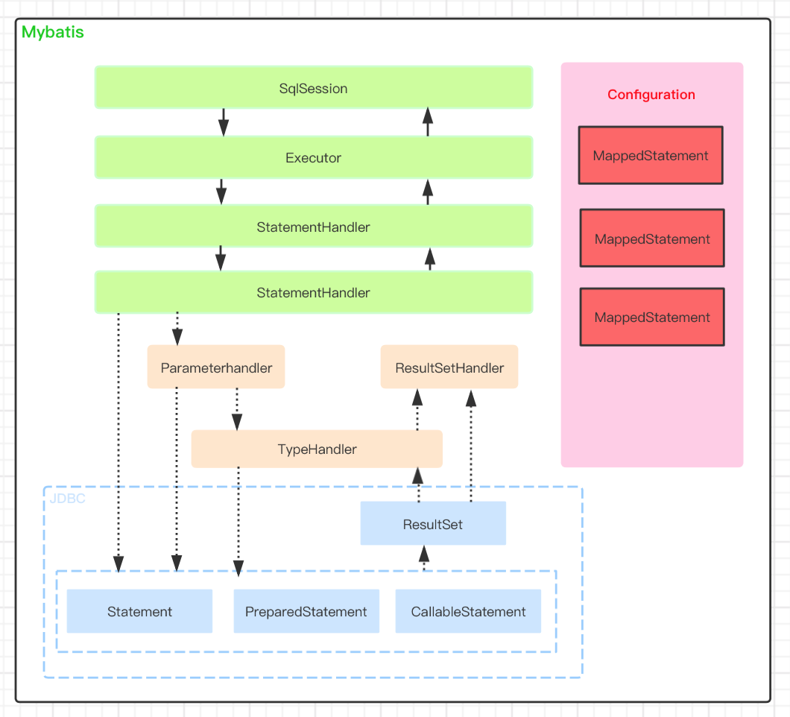

Mybatis核心组件

- Configuration：用于描述Mybatis的主要配置信息，其他组件需要获取配置信息时，直接通过Configuration对象获取。除此以外，MyBatis启动是将Mapper配置信息、类型别名、TypeHandler等注册到Configuration组件中，其他组件需要这些信息时，也可以从Configuration对象中获取。
- MappedStatement：用于描述Mapper中的SQL配置信息，是对Mapper XML中<select|update|delete|insert>等标签或者@Select/@Update注解配置信息的封装。
- SqlSession：Mybatis提供的面向用户的API，表示和数据库交互时的会话对象，用于完成数据库的增删改查操作。SqlSession是对Executor组件的外观包装，目的是提供易于理解和使用的数据库操作。
- Executor：Executor是Mybatis的SQL执行器，Mybatis中对数据库的增删改查操作都是通过它来实现的。
- StatementHandler：对JDBC Statement对象的操作。
- ParameterHandler：当Mybatis框架使用Statement类型为CallableStatement和preparedStatement时，ParameterHandler用于对Statement对象参数占位符设置值。
- ResultSetHandler：ResultSetHandler封装对JDBC中ResultSet对象的操作，用于将查询结果转化为Java对象。
- TypeHandler：类型处理器，用于处理Java类型和JDBC类型之间的映射。它的主要作用体现在能够根据Java类型调用CallableStatement或PreparedStatement对象对应的setXXX()方法为Statement对象设置值，而且能够根据Java类型调用ResultSet对象对应的getXXX()获取SQL执行结果。

Configuration

Configuration对象是Mybatis中最重要的组件，主要有3个作用：

- 用于描述Mybatis配置信息。比如<settings>标签配置的参数信息。
- 作为容器注册Mybatis的组件信息。比如TypeHandler、ParameterHandler等。
- 提供工厂方法，创建ResultSetHandler、StatementHandler、Executor、ParameterHandler等组件实例。

