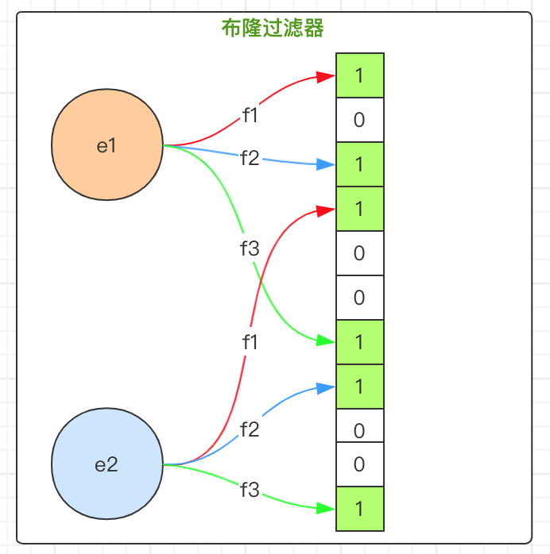

Redis中有一个数据结构叫布隆过滤器，**布隆过滤器可以用于检索一个集合一个元素是否在集合中。**

布隆过滤器（Bloom Filter）是由Howard Bloom在1970年提出的一种比较巧妙的概率型数据结构，它可以告诉你某种东西**一定不存在**或者**可能存在**。**当布隆过滤器说，某种东西存在时，这种东西可能不存在；当布隆过滤器说，某种东西不存在时，那么这种东西一定不存在。**

布隆过滤器相对于Set、Map 等数据结构来说，它可以更高效地插入和查询，并且占用空间更少，它也有缺点，就是判断某种东西是否存在时，可能会被误判。但是只要参数设置的合理，它的精确度也可以控制的相对精确，只会有小小的误判概率。

### 1、向布隆过滤器添加元素

当加入一个元素的时候，会进行如下操作：

- 使用K个哈希函数对元素值进行K次计算，得到K个哈希值
- 根据得到的哈希值，在位数组中把对应下表的值设置为1。

举个例子，假设布隆过滤器有3个哈希函数f1、f2、f3和一个位数组array，现在要把元素“abc”字符串插入布隆过滤器。

- 对值进行3次哈希计算，得到3个哈希值n1、n2、n3。
- 把位数组中三个元素 arr[n1], arr[n2], arr[3] 置为 1。

### 2、判断元素是否存在

当要判断一个值是否在布隆过滤器中，对元素再次进行哈希计算，得到值之后判断位数组中的每个元素是否都为 1，如果值都为 1，那么说明这个值很可能在布隆过滤器中，如果存在一个值不为 1，说明该元素一定不在布隆过滤器中。



向布隆过滤器中添加元素时，会使用多个无偏哈希函数对元素进行哈希，算出一个整数索引值，然后对位数组长度进行取模运算得到一个位置，每个无偏哈希函数都会得到一个不同的位置。再把位数组的这几个位置都设置为1，这就完成了`bf.add`命令的操作。向布隆过滤器查询元素是否存在时，和添加元素一样，也会把哈希的几个位置算出来，然后看看位数组中对应的几个位置是否都为1，只要有一个位为0，那么就说明布隆过滤器里不存在这个元素。如果这几个位置都为1，并不能完全说明这个元素就一定存在其中，有可能这些位置为1是因为其他元素的存在，这就是布隆过滤器会出现误判的原因。简单来说：

- 布隆过滤器说某个元素在，可能会被误判。
- 布隆过滤器说某个元素不在，那么一定不在。

### 3、Redis中的布隆过滤器基本用法

Redis中布隆过滤器有2个基本命令，分别是：

- `bf.add`：添加一个元素到布隆过滤器中，类似于集合的`sadd`命令。一次添加多个元素时可以使用`bf.madd`命令。
- `bf.exists`：判断一个元素是否存在于过滤器中，类似于集合的`sismember`命令。一次判断多个值是否存在时可以用`bf.mexists`命令。

```shell
> bf.add one-more-filter fans1
(integer) 1
> bf.add one-more-filter fans2
(integer) 1
> bf.add one-more-filter fans3
(integer) 1
> bf.exists one-more-filter fans1
(integer) 1
> bf.exists one-more-filter fans2
(integer) 1
> bf.exists one-more-filter fans3
(integer) 1
> bf.exists one-more-filter fans4
(integer) 0
> bf.madd one-more-filter fans4 fans5 fans6
1) (integer) 1
2) (integer) 1
3) (integer) 1
> bf.mexists one-more-filter fans4 fans5 fans6 fans7
1) (integer) 1
2) (integer) 1
3) (integer) 1
4) (integer) 0
```

上面的例子中，没有发现误判的情况，是因为元素数量比较少。当元素比较多时，可能就会发生误判，怎么才能减少误判呢？

### 4、Redis中的布隆过滤器高级用法

上面的例子中使用的布隆过滤器只是默认参数的布隆过滤器，它在我们第一次使用`bf.add`命令时自动创建的。Redis还提供了自定义参数的布隆过滤器，想要尽量减少布隆过滤器的误判，就要设置合理的参数。在使用`bf.add`命令添加元素之前，使用`bf.reserve`命令创建一个自定义的布隆过滤器。`bf.reserve`命令有三个参数，分别是：

- `key`：键
- `error_rate`：期望错误率，期望错误率越低，需要的空间就越大。
- `capacity`：初始容量，当实际元素的数量超过这个初始化容量时，误判率上升。

```shell
>  bf.reserve my-bloom-filter 0.0001 1000000
OK
```

如果对应的key已经存在时，在执行`bf.reserve`命令就会报错。如果不使用`bf.reserve`命令创建，而是使用Redis自动创建的布隆过滤器，默认的`error_rate`是 0.01，`capacity`是 100。布隆过滤器的`error_rate`越小，需要的存储空间就越大，对于不需要过于精确的场景，`error_rate`设置稍大一点也可以。布隆过滤器的`capacity`设置的过大，会浪费存储空间，设置的过小，就会影响准确率，所以在使用之前一定要尽可能地精确估计好元素数量，还需要加上一定的冗余空间以避免实际元素可能会意外高出设置值很多。总之，`error_rate`和 `capacity`都需要设置一个合适的数值。

### 5、布隆过滤器的实际应用

#### 5.1、解决缓存击穿的问题

- 缓存击穿问题：一般情况下，先查询缓存是否有该条数据，缓存中没有时，再查询数据库。当数据库也不存在该条数据时，每次查询都要访问数据库，这就是缓存穿透。缓存穿透带来的问题是，当有大量请求查询数据库不存在的数据时，就会给数据库带来压力，甚至会拖垮数据库。

- 解决方案：可以使用布隆过滤器解决缓存穿透的问题，把已存在数据的key存在布隆过滤器中。当有新的请求时，先到布隆过滤器中查询是否存在，如果不存在该条数据直接返回；如果存在该条数据再查询缓存查询数据库。

#### 5.2、黑名单系统检查

发现存在黑名单中的，就执行特定操作。比如：识别垃圾邮件，只要是邮箱在黑名单中的邮件，就识别为垃圾邮件。假设黑名单的数量是数以亿计的，存放起来就是非常耗费存储空间的，布隆过滤器则是一个较好的解决方案。把所有黑名单都放在布隆过滤器中，再收到邮件时，判断邮件地址是否在布隆过滤器中即可。

