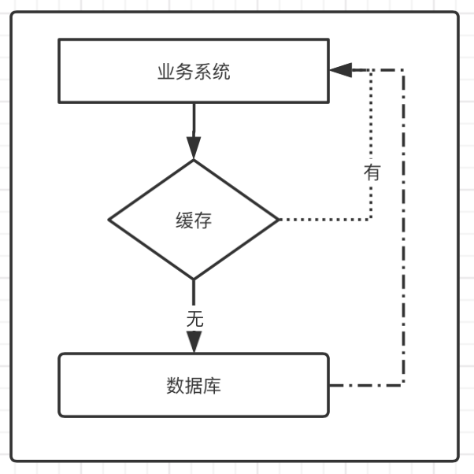
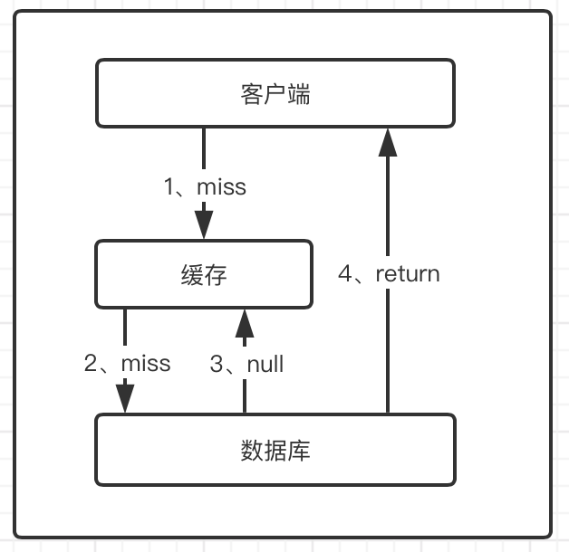
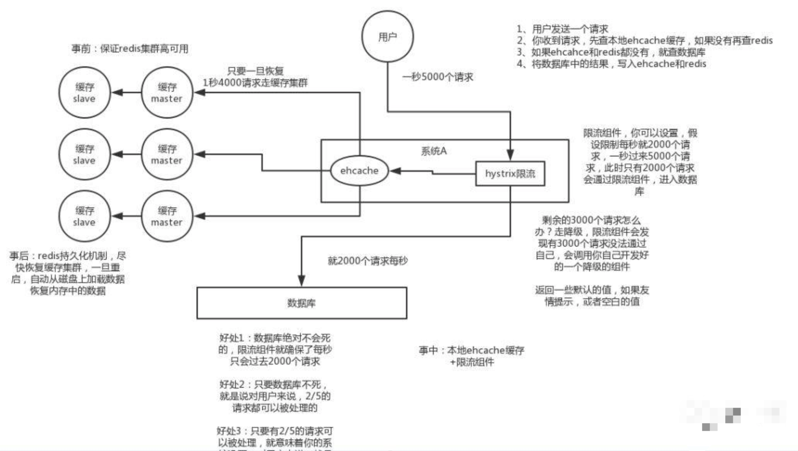
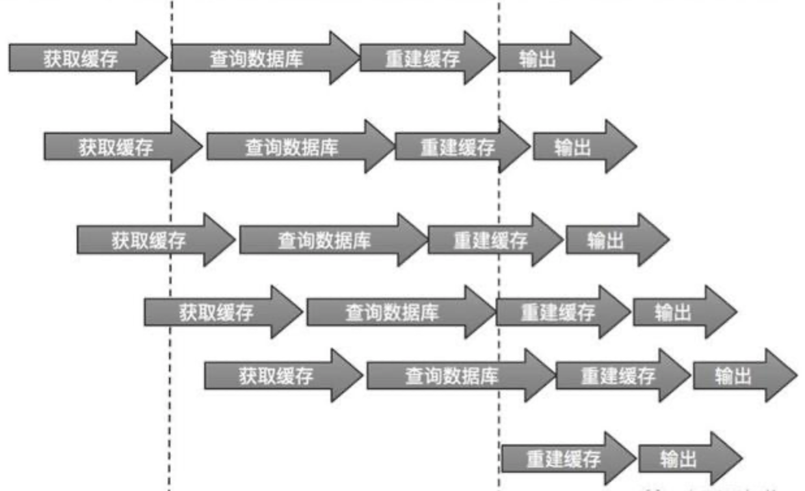
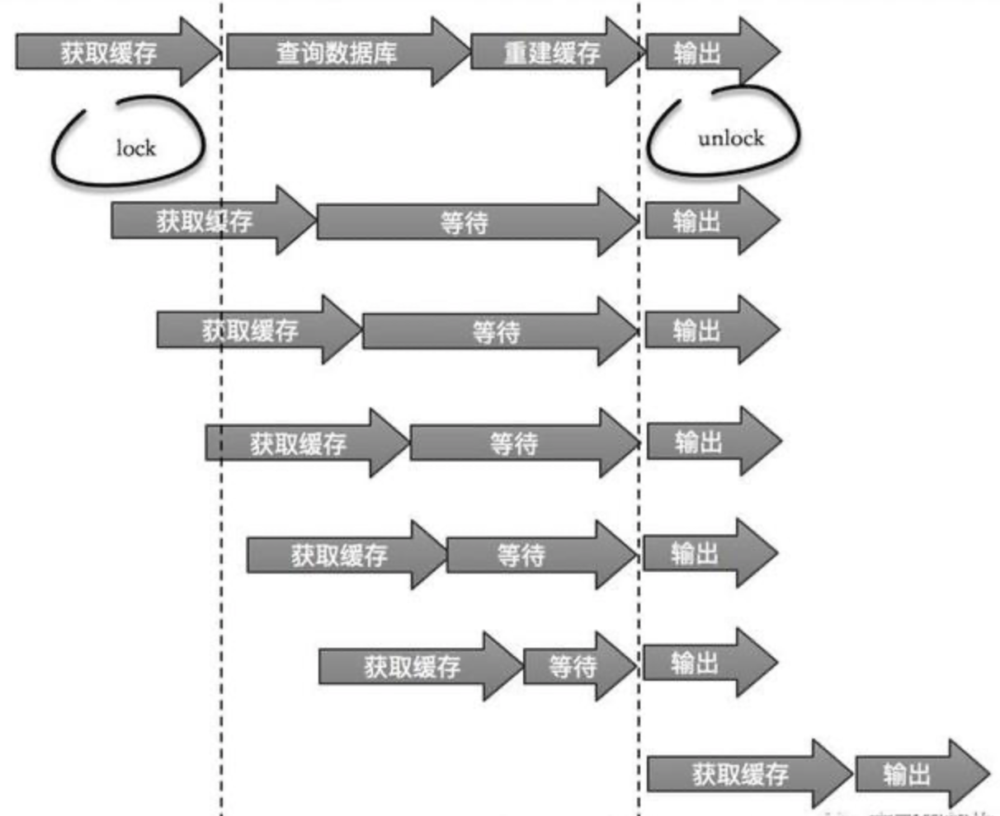
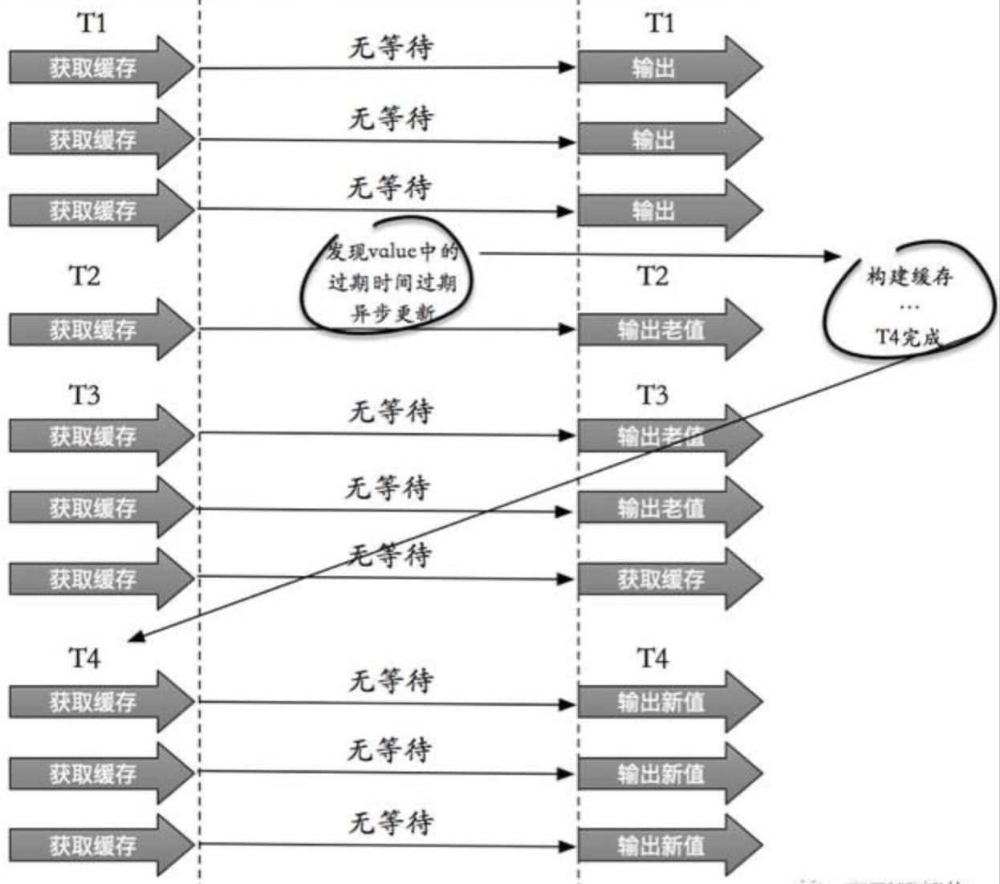

使用缓存的业务系统架构如下图。但是当我们查询一条数据时，先去查询缓存，如果缓存有就直接返回，如果没有就去查询数据库，然后返回。这种情况下就可能会出现一些现象。

## 1、缓存穿透

### 1.1、现象描述

**缓存和数据库都不存在数据，但是每次请求最终都会打到数据库去。**现象：业务系统要查询的数据根本就存在！当业务系统发起查询时，首先会前往缓存中查询，由于缓存中不存在，然后再前往数据库中查询。由于该数据压根就不存在，因此数据库也返回空。这就是缓存穿透。恶意攻击，故意制造大量不存在的请求服务，由于缓存中并不存在这些数据，因此海量请求均落在数据库中，从而可能会导致数据库崩溃。

### 1.2、解决方案

- **缓存空对象**

    之所以发生缓存穿透，是因为缓存中没有存储这些空数据的key，导致这些请求全都打到数据库上。那么，我们可以稍微修改一下业务系统的代码，将数据库查询结果为空的key也存储在缓存中。当后续又出现该key的查询请求时，缓存直接返回null，而无需查询数据库。

    

    ​    缓存空对象有两个问题：

    - 空值做了缓存，意味着缓存层中存了很多键，需要更多的内存空间。这种可以设置一个较短的过期时间，让其自动删除。
    - 缓存层和存储层的数据会有一段时间窗口的不一致，可能会对业务有一定影响。例如过期时间设置为 5 分钟，如果此时存储层添加了这个数据，那此段时间就会出现缓存层和存储层数据的不一致，此时可以利用消息系统或者其他方式清除掉缓存层中的空对象。

- **布隆过滤器**

    布隆过滤器在缓存之前加一道屏障，里面存储数据库中存在的所有key。当业务系统有查询请求的时候，首先去布隆过滤器BloomFilter中查询key是否存在，如果不存在，说明数据库中也不存在，就不用去查询数据库了，直接返回null。若存在，就继续执行后续流程，先去缓存中查询，缓存中没有的话再去数据库中查询。这种使用于命中率不高，数据相对固定实时性低的场景，通常是数据集较大的场景，代码维护较为复杂，但是缓存空间少。

## 2、缓存雪崩

### 2.1、现象描述

缓存起到了一个保护数据库的角色，它帮助数据库抵挡住了大量的请求，从而避免了数据库压力过大。如果缓存因为某种原因宕机，那么原本被缓存抵挡的海量请求就会直接打到数据库上，如果数据库抵挡不了就会崩溃，这就是缓存雪崩。

### 2.2、解决方案

缓存雪崩可以去避免，具体可以从两个方面实施：

- **使用缓存集群，保证缓存的高可用性。使用Redis的Sentinel和Cluster可以实现高可用。**

- **ehcache本地缓存 + Hystrix限流&降级,避免数据库被打死**

    使用 ehcache 本地缓存的目的也是考虑在 Redis Cluster 完全不可用的时候，ehcache 本地缓存还能够支撑一阵。

    Hystrix是一个Java类库，它采用命令模式设计，每一项服务处理请求都会有各自对应的处理器。

    - `熔断`：所有请求都要经过各自处理器，处理器会记录当前服务的请求失败率。一旦发现服务的请求失败率达到了预设的值，Hystrix将会拒绝随后对该服务的所有请求，直接返回一个预设的结果。
    - `限流`：当经过一段时间后，Hystrix会放行该服务的一部分请求，再次统计它的失败率，如果请求失败率符合预设值，则完全打开限流开关；如果请求失败率仍然很高，那么继续拒绝该服务的随后请求。
    - `降级`：Hystrix向那些被拒绝的请求直接返回一个预设的结果，就被称为降级。

- 

## 3、缓存击穿

### 3.1、现象描述

一般都会给缓存设定一个失效时间，过了失效时间后，该数据库会被缓存直接删除，从而一定程度上保证数据的实时性。但是，对于一些请求量极高的热点数据而言，一旦过了有效时间，此刻将会有大量请求落在数据库上，从而可能会导致数据库崩溃。其过程如下图所示。

如果某一个热点数据失效，那么当再次有该数据的查询请求[req-1]时就会前往数据库查询。但是，从请求发往数据库，到该数据更新到缓存中的这段时间中，由于缓存中仍然没有该数据，因此这段时间内到达的查询请求都会落到数据库上，这将会对数据库造成巨大的压力。此外，当这些请求查询完成后，都会重复更新缓存。

### 3.2、解决方案

- 互斥锁

此方法只允许一个线程重建缓存，其他线程等待重建缓存的线程执行完，重新从缓存获取数据即可，整个过程如图。

1. 当第一个数据库查询请求发起后，就将缓存中该数据上锁；此时到达缓存的其他查询请求将无法查询该字段，从而被阻塞等待；当第一个请求完成数据库查询，并将数据更新值缓存后，释放锁；此时其他被阻塞的查询请求将可以直接从缓存中查到该数据。
2. 当某一个热点数据失效后，只有第一个数据库查询请求发往数据库，其余所有的查询请求均被阻塞，从而保护了数据库。但是，由于采用了互斥锁，其他请求将会阻塞等待，此时系统的吞吐量将会下降。这需要结合实际的业务考虑是否允许这么做。
3. 互斥锁可以避免某一个热点数据失效导致数据库崩溃的问题，而在实际业务中，往往会存在一批热点数据同时失效的场景。那么，对于这种场景该如何防止数据库过载呢？设置不同的失效时间。当我们向缓存中存储这些数据的时候，可以将他们的缓存失效时间错开。这样能够避免同时失效。如：在一个基础时间上加/减一个随机数，从而将这些缓存的失效时间错开。

- 热点数据永远不过期

    “永远不过期”包含两层意思：

    - 从缓存层面：确实没有设置过期时间，所以不会出现热点 key 过期后产生的问题，也就是“物理”不过期。 
    - 从功能层面：为每个 value 设置一个逻辑过期时间，当发现超过逻辑过期时间后，会使用单独的线程去构建缓存。 

此方法有效杜绝了热点 key 产生的问题，但唯一不足的就是重构缓存期间，会出现数据不一致的情况，这取决于应用方是否容忍这种不一致。

- 两种方案的比较
    - `互斥锁 (mutex key)`：这种方案思路比较简单，但是存在一定的隐患，如果构建缓存过程出现问题或者时间较长，可能会存在死锁和线程池阻塞的风险，但是这种方法能够较好的降低后端存储负载并在一致性上做的比较好。
    - `永远不过期 `：这种方案由于没有设置真正的过期时间，实际上已经不存在热点 key 产生的一系列危害，但是会存在数据不一致的情况，同时代码复杂度会增大。

