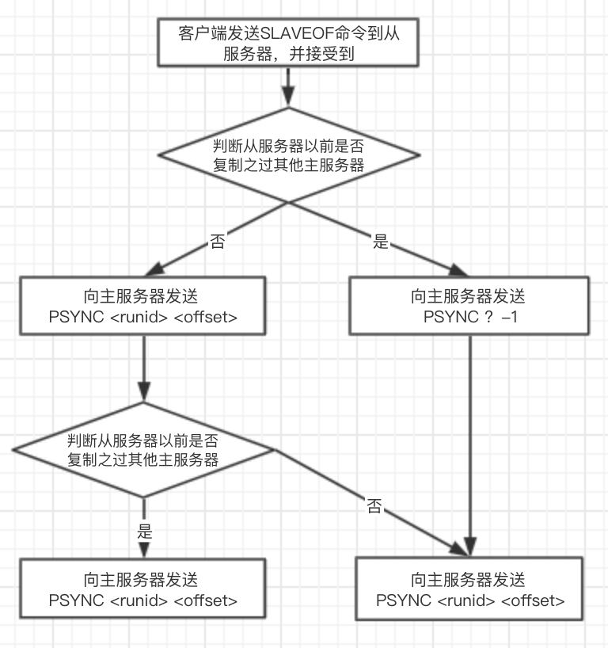
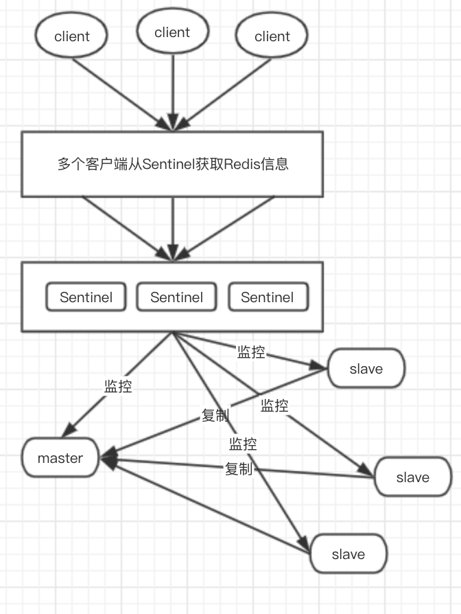

## 主从复制模式

在Redis中通过SLAVEOF命令或者配置文件设置slaveof选项，可以让一台服务器去复制另一台服务器，其中被复制的服务器叫主服务器（master），对服务器进行复制的服务器叫从服务器（slave）。

#### 作用

- 为一个数据提供多个副本，使得高可用、分布式称为可能
- 扩展Redis的读性能，可以实现读写分离

#### 要点

- 一个master可以有多个slave
- 一个slave只能属于一个master
- 数据传递是单向的，从master到slave
- 除了主服务器可以有从服务器之外，从服务器也可以有自己的从服务器，多个服务器之间可以构成网结构。
- 如果主节点B称为另一个主节点A的从节点，那么主节点B之前保存的数据会被清除，而同步A节点的数据，数据库状态将于主节点A保持一致。

#### 复制过程步骤

1. 通过SLAVEOF命令设置主服务器的IP和port。
2. 主从服务器之间建立套接字连接。
3. 从服务器向主服务器发送`PING`命令。
4. 根据从服务器的配置决定是否进行身份验证。
5. 从服务器向主服务器发送端口信息。
6. 从服务器向主服务器发送`PSYNC`命令完成同步功能。
7. 主从服务器之间进行命令传播，进而维持数据库状态的一致性。

#### PSYNC命令的实现过程

- 如果从服务器之前没有复制过任何主服务器，或者执行过取消复制的命令`SLAVEOF no one`，那么从服务器在与主服务器正常连接的情况下，在开始一次新的复制时，从服务器向主服务器发送`PSYNC ? -1`命令，主动请求主服务器执行全量同步操作，此时不能执行部分同步操作。
- 如果主服务器已经复制过某台主服务器，那么从服务器在开始一次新的复制时，会向主服务器发送`PSYNC <runid> <offset>`命令，其中`runid`是上一次复制的主服务器的运行ID，保存在从服务器中；`offset`是从服务器当前的复制偏移量。主服务器在接收到从服务器发送过来的命令时，会通过`runid`和`offset`判断应该对从服务器执行哪种同步操作。
- 主服务器在接收到`PSYNC <runid> <offset>`命令时，会根据`PSYNC`命令的参数进行判断，然后向从服务器返回以下3种响应回复中的一种：
  - 主服务器向从服务器返回`+FULLRESYNC <runid> <offset>`，即主服务器对从服务器执行全量同步操作。
  - 主服务器向服务器返回`+CONTINUE`，表示主服务器将对从服务器执行部分同步操作。
  - 主服务器向服务器返回`-ERR`，表示主服务器的版本低于Redis2.8，不能识别PSYNC命令，通过SYNC同步

#### Redis读写分离

通常的做法是让`master`执行写操作，让`slave`执行读操作。这样一方面减轻`master`的压力提高性能；另一方面扩展了`Redis`的读能力，适用于`读多写少`的场景。

读写分离也会有一定的问题，具体总结如下：

1. 复制数据的延迟。
2. 读到一些过期数据。
3. 在底鞋分离的过程中，发生节点故障。

#### 主从复制的问题

- 主从复制的写能力和存储能力受限，写操作只能在一个节点上，其他都是数据节点副本。
- 当master节点出现故障之后，需要手工处理故障。

因此Redis引入了高可用的哨兵模式。

## 哨兵模式

#### 典型的哨兵模式架构

哨兵模式是由一个或多个哨兵组成的哨兵系统，主要用于监控任意多台主服务器是否发生故障，以及监控这些主服务器的从服务器。当主服务器发生故障时，它会通过投票选举的方式所有从服务器选举一台新的主服务器，让这台新的主服务器代替之前的主服务器继续处理命令请求以及完成相关工作，从而实现故障转移，无须手工操作，达到了热部署、高可用的目的。

哨兵的作用：

- 监控管理多台Redis服务器，判断是否故障
- 通知管理员或应用程序发送故障通知
- 自动故障转移

## 集群