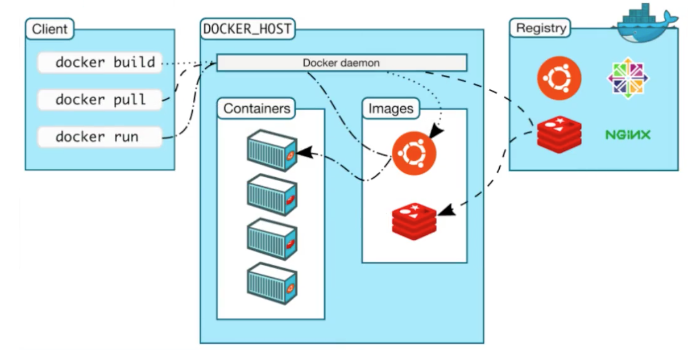
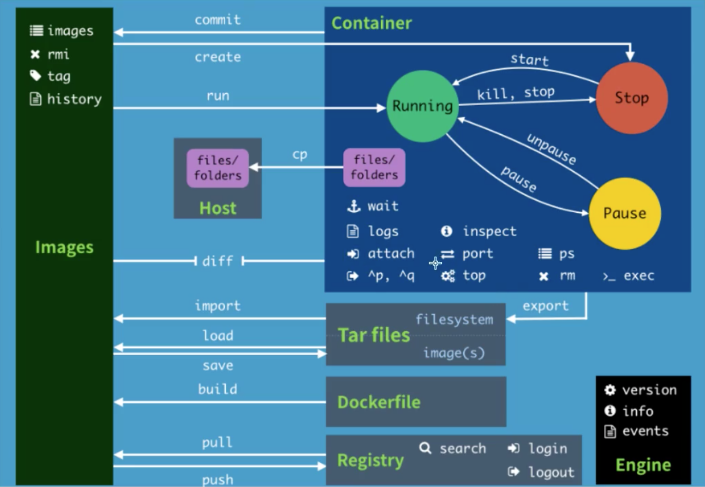

### Docker的基本组成



- 镜像（Image）：Docker镜像就好比是一个模板，可以通过这个模板创建容器服务。一个镜像可以创建过个容器，服务或项目运行在容器中。
- 容器（Container）：可以独立运行一个或一组应用，通过镜像来创建
- 仓库（Repository）：存放镜像的地方。国内有阿里云、华为云、网易云的容器服务仓库


## 1、常用命令

### 1.1、帮助命令

```shell
docker version 	#查看docker版本
docker info 	#docker详细信息
docker <command> --help #查看具体命令的帮助文档
```

### 1.2、镜像命令

#### 1.2.1、查看本地镜像

**docker images** 查看本地所有的镜像文件

```shell
~ % docker images
REPOSITORY          TAG                 IMAGE ID            CREATED             SIZE
rabbitmq            management          43f79d83563f        2 days ago          187MB
redis               latest              235592615444        2 weeks ago         104MB

#解释
REPOSITORY	#镜像仓库源
TAG			#镜像标签
IMAGE ID	#镜像ID
CREATED		#创建时间
SIZE		#镜像大小

# 可选项
-a,--all 	#显示所有镜像
-q,--quiet	#只显示镜像ID
```

#### 1.2.2、搜索镜像 

**docker search** 搜索Docker镜像

```shell
~ % docker search mysql
NAME           DESCRIPTION                                     STARS               OFFICIAL            AUTOMATED
mysql          MySQL is a widely used, open-source relation…   9682                [OK]                
mariadb        MariaDB is a community-developed fork of MyS…   3523                [OK]   

#可选项
--filters=starts=3000 #过滤条件，表示满足starts不小于3000的镜像
```

#### 1.2.3、下载镜像

**docker pull imageName [:TAG]** 下载指定版本TAG的docker镜像，如果不指定版本号TAG，默认都是最新版

```shell
~ % docker pull mysql
Using default tag: latest
latest: Pulling from library/mysql
8559a31e96f4: Already exists 
d51ce1c2e575: Pull complete #docker分层下载，docker的核心，联合文件系统
c2344adc4858: Pull complete 
fcf3ceff18fc: Pull complete 
16da0c38dc5b: Pull complete 
b905d1797e97: Pull complete 
4b50d1c6b05c: Pull complete 
c75914a65ca2: Pull complete 
1ae8042bdd09: Pull complete 
453ac13c00a3: Pull complete 
9e680cd72f08: Pull complete 
a6b5dc864b6c: Pull complete 
Digest: sha256:8b7b328a7ff6de46ef96bcf83af048cb00a1c86282bfca0cb119c84568b4caf6	#文件校验码
Status: Downloaded newer image for mysql:latest
docker.io/library/mysql:latest
```

#### 1.2.4、删除镜像

**docker rmi -f  imageId | imageName** 删除指定ID或Name的镜像文件

```shell
~ % docker images
REPOSITORY          TAG                 IMAGE ID            CREATED             SIZE
rabbitmq            management          43f79d83563f        2 days ago          187MB
redis               latest              235592615444        2 weeks ago         104MB
mysql               latest              be0dbf01a0f3        2 weeks ago         541MB
~ % docker rmi -f be0dbf01a0f3
Untagged: mysql:latest
Untagged: mysql@sha256:8b7b328a7ff6de46ef96bcf83af048cb00a1c86282bfca0cb119c84568b4caf6
Deleted: sha256:be0dbf01a0f3f46fc8c88b67696e74e7005c3e16d9071032fa0cd89773771576
Deleted: sha256:086d66e8d1cb0d52e9337eabb11fb9b95960e2e1628d90100c62ea5e8bf72306
Deleted: sha256:f37c61ee1973b18c285d0d5fcf02da4bcdb1f3920981499d2a20b2858500a110
Deleted: sha256:e40b8bca7dc63fc8d188a412328e56caf179022f5e5d5b323aae57d233fb1069
Deleted: sha256:339f6b96b27eb035cbedc510adad2560132925a835f0afddbcc1d311c961c14b
Deleted: sha256:d38b06cdb26a5c98857ddbc6ef531d3f57b00e325c0c314600b712efc7ff6ab0
Deleted: sha256:09687cd9cdf4c704fde969fdba370c2d848bc614689712bef1a31d0d581f2007
Deleted: sha256:b704a4a65bf536f82e5d8b86e633d19185e26313de8380162e778feb2852011a
Deleted: sha256:c37206160543786228aa0cce738e85343173851faa44bb4dc07dc9b7dc4ff1c1
Deleted: sha256:12912c9ec523f648130e663d9d4f0a47c1841a0064d4152bcf7b2a97f96326eb
Deleted: sha256:57d29ad88aa49f0f439592755722e70710501b366e2be6125c95accc43464844
Deleted: sha256:b17c024283d0302615c6f0c825137da9db607d49a83d2215a79733afbbaeb7c3
```

删除命令小结

```shell
docker rmi -f 镜像ID 				   #删除指定ID的镜像文件
docker rmi -f 镜像ID 镜像ID 镜像ID 	#删除多个指定ID的镜像文件
docker rmi -f $(docker images -aq) 	#删除所有镜像文件
```

### 1.3、容器命令

#### 1.3.1、删除容器

```shell
docker rm -f $(docker ps -aq) 		#删除所有容器
docker ps -a -q |xargs docker rm 	#删除所有容器（类似linux的方式）
```

#### 1.3.2、启动和停止容器操作

```shell
docker start <容器ID>
docker restart <容器ID>
docker stop <容器ID>
docker kill <容器ID>
```

### 1.4、常用的其他命令

```shell
docker run -d <镜像名>   				#后台服务方式启动容器
docker ps -a 						  #加上-a选项才能查看到后台服务方式的进程
docker logs -tf  -tail 10 <容器ID> 	 #实时查看容器的最新10行日志
docker top <容器ID> 					 #查看容器中的进程信息
docker inspect <容器ID>				 #查看容器的元数据

docker exec -it <容器ID>  --bashshell  #进入运行中的某个容器中（进入容器后，开启一个新的终端）
docker attach <容器ID>				 #进入指定容器（进入容器后，进入正在运行中的终端）

```

## 2、命令小结



