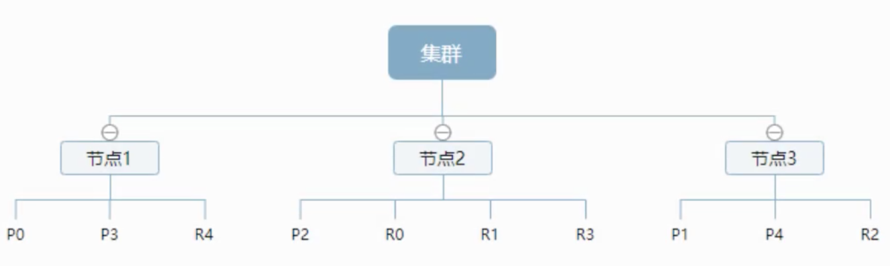
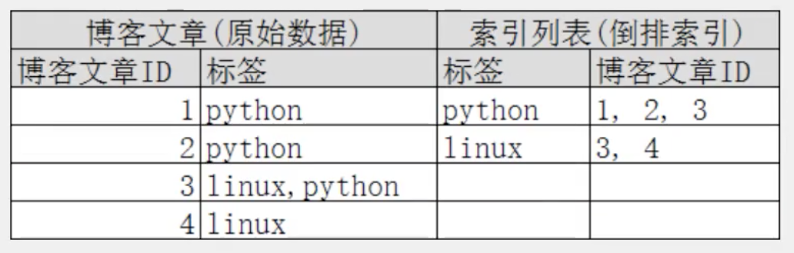

## 集群设计

一个集群至少有一个节点，而一个节点就是一个elasticseach进程，节点可以有多个索引默认的。如果你创建索引，那么索引将会有5个分片（primary shared，又称为主分片）构成，每个主分片会有一个副本（replica shard，又称为复制分片）。



 可以看到主分片和对应的复制分片都不会在一个节点内，这样有利于某个节点挂掉之后，不会丢失数据。实际上，一个分片就是一个Lucene索引，一个包含==倒排索引==的文件目录，倒排索引的结构使得elasticsearch在不扫描全部文档的情况下就能告诉你哪些文档包含特定关键字。

## 倒排索引

elasticsearch使用一种倒排索引的数据结构，采用Lucene倒排索引作为底层。这种结构用于快速的全文搜索。一个索引由文档中所有不重复的列表构成。对于每一个词都有一个包含它的文档列表。例如，现在有两个文档，每个文档如下内容：

```
study every day, good good up for forever #文档1包含的内容
To forever ,study every day, good good up #文档2包含的内容
```

为了创建倒排索引，我们首先要将每个文档，拆分成独立的词（称为词条或token），然后创建一个包含所有不重复的词条的排序列表，接下来列出每个词条出现在哪个文档中。

| term    | doc_1 | doc_2 |
| ------- | ----- | ----- |
| Study   | √     | ×     |
| To      | ×     | √     |
| every   | √     | √     |
| forever | √     | √     |
| day     | √     | √     |
| study   | √     | √     |
| good    | √     | √     |
| every   | √     | √     |
| to      | ×     | ×     |
| up      | √     | √     |

比如现在要搜索 to forever，只需要查看包含每个词条的文档

| term    | doc_1 | doc_2 |
| ------- | ----- | ----- |
| to      | √     | ×     |
| forever | √     | √     |
| TOTAL   | 2     | 1     |

两个文档都匹配，但是第一个文档匹配度比第二个要高。如果没有别的条件，现在这两个包含关键字的文档都将返回。再来看一个示例，比如我们通过博客标签搜索博客文章，那么倒排索引就是如下这个结构：



如果要搜索包含python的文章，那些相对于查找原始数据而言，查找倒排索引后的数据会快很多。只需要查看标签这一栏，然后获得相关文档ID即可。

## REST风格说明

一种软件架构风格，而不是标准。只是提供了一组设计原则和约束条件。它主要用于客户端和服务端交互类的软件。基于这个风格设计的软件可以简洁，更有层次，易于实现缓存机制。基本的REST命令说明。

| METHOD | URL地址                                         | 描述                   |
| ------ | ----------------------------------------------- | ---------------------- |
| PUT    | localhost:9200/索引名称/类型名称/文档ID         | 创建文档（指定文档ID） |
| POST   | localhost:9200/索引名称/类型名称                | 创建文档（随机文档ID） |
| POST   | localhost:9200/索引名称/类型名称/文档ID/_update | 修改文档               |
| DELETE | localhost:9200/索引名称/类型名称/文档ID         | 删除文档               |
| GET    | localhost:9200/索引名称/类型名称/文档ID         | 通过ID查询文档         |
| POST   | localhost:9200/索引名称/类型名称/文档ID/_search | 查询所有数据           |

