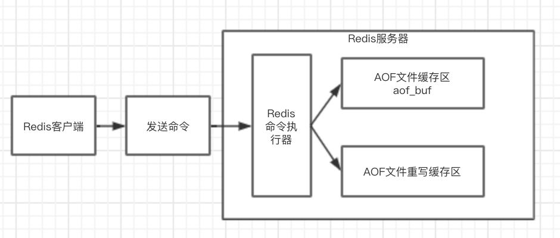
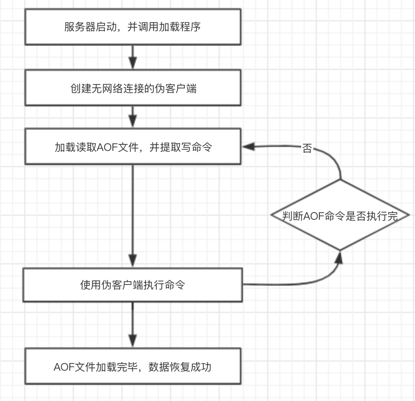
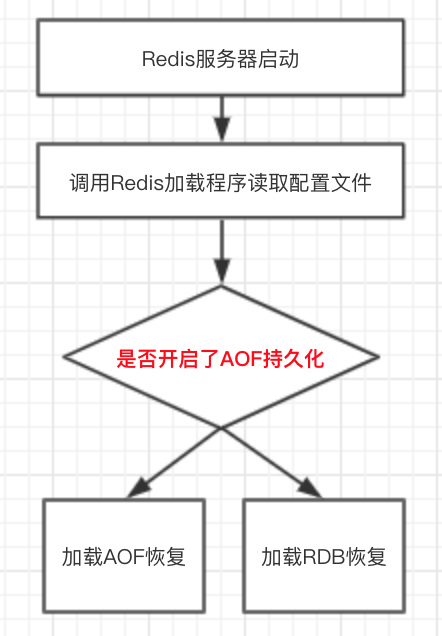

## Redis持久化方式

- `AOF`：将每次执行的写操作命令及时写入到硬盘中，实时性更好，意外退出时丢失数据更少。

- `RDB`：根据指定的规则“定时”将内存中数据保存在硬盘中。

#### 1、AOF

AOF（Append Only File）持久化保存服务器执行的命令到单独的日志文件中，在服务器重启时，通过加载日志文件中这些命令并执行来恢复数据。Redis以Redis协议方式来保存AOF文件中的命令，新命令会被追加到文件尾部。在服务器后台AOF文件还会被重写（Rewrite），使得AOF文件的体积不会大于保存数据集状态所需的实际大小。

##### 1.1、AOF持久化配置

AOF持久化方式默认是关闭的。

- `appendonly no/yes`：是否开启AOF持久化，默认为no，不开启。
- `appendfilename "appendonly.aof"`：AOF持久化文件名，可修改。
- `dir ./`：持久化文件保存目录
- `appendfsysnc everysec`：持久化策略。
- `no-appendfsync-no-rewrite no`：是否禁止fsync。如开启，则可以减轻重写AOF文件时CPU和硬盘的负载，但同时可能丢失重写AOF文件过程中的数据；需要在负载和安全性之间进行平衡。
- `auto-aof-rewrite-percentage 100`：重写AOF文件的条件，默认100，它会对比上次生成的AOF文件大小。如果当前AOF文件增长量大于上次AOF文件的100%，就会触发重写；设置为0，不会触发重写。
- `auto-aof-rewrite-min-size 64mb`：重发重写AOF文件的大小，默认64M。如当前AOF文件大小低于该值，此时就算当前文件的增量比例达到`auto-aof-rewrite-percentage`的条件，也不会触发重写。也就是说只有达到上面两个条件才会触发重写条件。
- `auto-load-truncated yes`：当AOF文件尾部遭到破坏时，Redis启动时是否仍然加载AOF文件。

`appendfsync`参数有3个值：

- always：将缓存区aof_buf所有内容同步写到AOF文件中，但硬盘IO负载大。
- no：将缓存区aof_buf所有内容写入AOF文件中，但不会同步AOF文件，同步时机取决于操作系统。
- everysec：会将缓存区aof_buf写入AOF文件中，而AOF文件同步操作则有一个专门文件同步线程负责执行一次。如果上次同步AOF文件的事件距离现在超过了1秒，同步线程就会再次对AOF文件进行同步。

##### 1.2、AOF重写

- Redis的AOF文件重写程序放在一个子进程中进行，这样做得好处是：
  - 子进程在执行AOF文件重写的过程中，Redis服务器进程可以继续处理新的命令请求。
  - 子进程带有服务器进程的数据副本，使用子进程可以在使用锁的情况下，保证数据安全性。

- 子进程在执行AOF文件重写过程中，服务器进程的执行过程如下：
  - 服务器接收来自客户端的命令请求，并成功执行。
  - 服务器将执行后的写命令转化为对应的协议格式，然后追加到AOF文件缓存区aof_buf中。
  - 服务器再将执行后的写命令追加到AOF文件重写缓存区中。
- 使用子进程会导致数据库状态不一致
  - 原因：当子进程进行AOF文件重写的时候，Redis服务器可以继续执行客户端的命令请求，就会有新的命令对现有数据库状态进行修改，进而使得服务器当前状态和重写的AOF文件所保存的数据状态不一致。
  - 解决：为了解决这个问题，Redis在子进程启动的时候设置了一个`AOF文件重写缓冲区`。Redis服务器成功执行完成一条命令之后会将命令同时发送给了`AOF文件缓冲区`和`AOF文件重写缓冲区`。

- 父进程后续工作

  子进程完成了AOF文件重写工作后，它会发送一个信号给父进程，父进程之后会调用信号处理函数，继续执行的工作如下：

  - 将AOF文件重写缓冲区中的所有内容写入新的AOF文件中。新的AOF文件的数据状态与数据库状态一致。
  - 使用新的AOF文件将覆盖旧的AOF文件。

##### 1.3、AOF文件处理

Redis服务器启动的时候，会首先加载AOF文件来恢复数据库数据，过程如下：

1. 创建一个不带网络连接的伪客户端，用于执行AOF文件中的写命令，因为只能在客户端中执行Redis命令。
2. 读取AOF文件中的数据，分析并提取出AOF文件中写命令。
3. 使用伪客户端执行被读取出来的写命令。
4. 重复执行步骤（2）和（3）直到所有AOF中命令被执行完毕。

##### 1.4、AOF优点

- AOF可以更好地保护数据不丢失或者少丢失。
- AOF日志文件以append-only模式写入磁盘，因此写入性能非常高。
- AOF日志即使过大的时候，在后台重写日志文件的操作是不会影响客户端请求命令的执行。

##### 1.5、AOF缺点

- 对于同一份数据的备份文件，AOF日志文件通常比RDB文件更大，恢复起来速度很慢。
- AOF开启后，支持写的QPS比RDB支持的写QPS低，因为AOF一般会配置为每秒fsync，当然这样性能也不错。
- AOF文件的个别命令，可能会在加载时失败，从而无法进行数据恢复。

#### 2、RDB

在指定的时间间隔内，Redis会将内存中所有数据生成一份数据副本并存储在硬盘上，这个过程就是“快照”。

##### 2.1、快照条件

- 根据Redis配置文件redis.conf中配置自动触发快照。
- 用户在客户端执行SAVE或BGSAVE命令会触发快照。
- 用户为Redis设置了主从复制模式，主节点执行BGSAVE命令，从节点接收主节点RDB文件完成快照。

##### 2.2、快照过程

- Redis调用执行fork函数复制一份当前进程（父进程）的副本（子进程），所以存在父进程和子进程。
- 父子进程分工协作，父进程继续处理来自客户端的命令请求，子进程将内存中的数据写入硬盘上的RDB文件。
- 当子进程把所有数据写完后，表示快照完成，此时用新的RDB文件替换旧的文件，旧的RDB文件会被删掉。

##### 2.3、RDB文件

- RDB文件是一个经过压缩的二进制文件。

- RDB文件可以直接使用SAVE和BGSAVE可以生成。
  - SAVE：执行时会阻塞服务器进程，此时Redis服务器将不能继续执行其他命令。
  - BGSAVE：先创建一个子进程，交给子进程创建RDB文件，父进程仍然可以接收客户端的命令请求。

##### 2.4、RDB持久化配置

- `save m n`：表示时间m内被修改的键的个数大于n时，会触发BGSAVE命令的执行。
- `rbdcompression yes`：是否开启RDB压缩文件，默认是开启的。
- `rdbchecksum yes`：是否开启RDB文件的校验，在服务器进行RDB文件读写时会用到它，默认开启。
- `dbfilename dump.rdb`：用于设置RDB文件名，可以通过命令修改。
- `dir ./`：RDB和AOF文件所在目录。
- `stop-writes-on-bgsave-error yes`：当执行写命令出现错误时，Redis是否终止执行写命令。yes表示当硬盘出现问题时，服务器可以及时发现，及时避免大量数据丢失；no时就算BGSAVE执行错误，服务器也将继续执行写命令；当Redis设置了监控时，建议设置为no。

##### 2.5、Redis启动加载机制

在启动Redis服务器的时候，会执行一个加载程序，这个加载程序会根据Redis配置文件中是否开启了AOF持久化来判断加载AOF还是RDB文件。如果在Redis配置文件中开启了AOF持久化，那么启动就加载AOF文件来还原数据库状态，否则就加载RDB文件来还原数据状态。

在通常情况下，AOF文件的更新频率会比RDB文件更新频率高效和数据完整性更好，因此AOF持久化恢复数据机制优先。

##### 2.6、RDB优点

- RDB文件是经过压缩的二进制文件，体积小，适合数据库备份。
- RDB持久化适用于灾难恢复，而且恢复速度比AOF快。
- Redis使用RDB持久化可以提升性能。父进程在保存RDB文件时启动一个子进程，将所有与RDB文件保存相关的功能交给子进程处理，而父进程可以继续处理其他操作。

##### 2.7、RDB缺点

- RDB持久化方式不能实现实时或者秒级持久化。服务器异常时可能会丢失比较多的数据
- 当数据量非常庞大时，在保存RDB文件的时候，服务器启动一个子进程完成保存操作。这个才做会比较耗时耗CPU资源，影响服务器性能。

#### 3、AOF和RDB的选择

一般情况下，建议同时使用AOF和RDB持久化方式。

1. 如果仅开启RDB，Redis能定期生成快照便于数据库备份，同时能提供服务器性能让，而且RDB恢复数据速度快于AOF恢复数据的速度；但是需要承担服务器故障时丢失部分数据的风险。
2. 如果仅开启AOF，因为AOF文件体积较大，在恢复数据时速度慢，会严重影响服务器性能。

