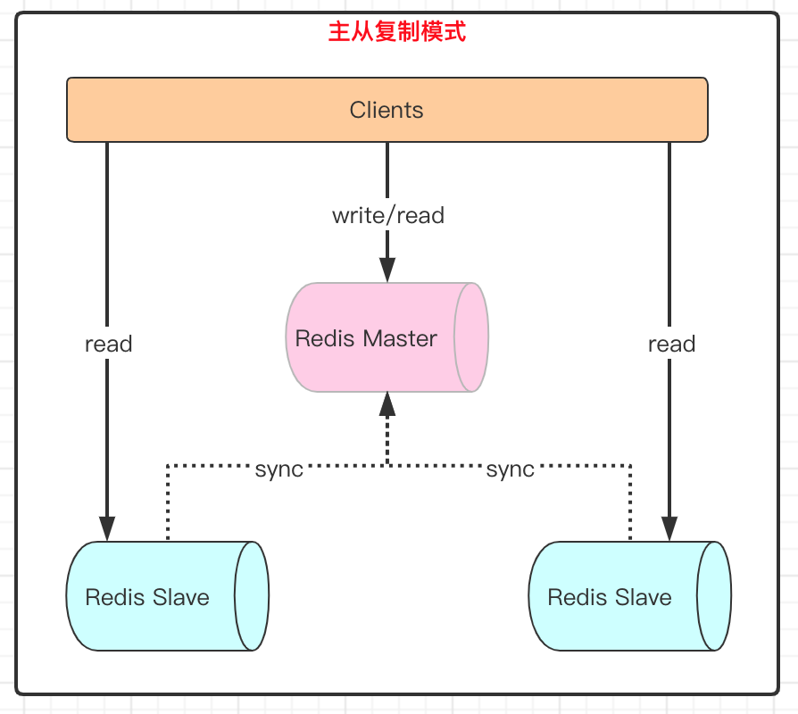

为了使实现Redis的高可用性，Redis支持3种集群方案

- 主从复制模式
- 哨兵模式
- Cluster模式

## 1、主从复制模式

主从复制模式种包含了一个主数据库(master)与一个或多个从数据库(slave)，如下图所示，**客户端对主数据库进行读写操作，对从数据库读操作**，主数据库写入的数据会实时同步给从数据库。在Redis中通过SLAVEOF命令或者配置文件设置slaveof选项，可以让一台服务器去复制另一台服务器，其中被复制的服务器叫主服务器（master），对主服务器进行数据复制的服务器叫从服务器（slave）。

### 1.1、作用

- 为一个数据提供多个副本，使得高可用、分布式成为可能。
- 扩展Redis的读性能，可以实现读写分离。

### 1.2、要点

- 一个master可以有多个slave
- 一个slave只能属于一个master
- 数据传递是单向的，从master到slave
- 除了主服务器可以有从服务器之外，从服务器也可以有自己的从服务器，多个服务器之间可以构成网结构。
- 如果主节点B成为另一个主节点A的从节点，那么主节点B之前保存的数据会被清除，而同步A节点的数据，数据库状态将于主节点A保持一致。

### 1.3、工作机制

1. slave启动后向master发送SYNC命令，master接到SYNC命令后通过bgsave保存RDB快照，并使用缓冲区记录保存快照这段时间内执行的写命令。
2. master将保存的快照文件发送给slave，并继续记录执行的写命令。
3. slave接收到快照文件后，加载快照文件，载入数据。
4. master快照发送完后开始向slave发送缓冲区的写命令，slave接收命令并执行，完成复制初始化。
5. 此后master每次执行一个写命令都会同步发送给slave，保持master与slave之间数据的一致性。

### 1.4、Redis读写分离

通常的做法是让`master`执行写操作，让`slave`执行读操作。这样一方面减轻`master`的压力提高性能；另一方面扩展了`Redis`的读能力，适用于`读多写少`的场景。读写分离也会有一定的问题，具体总结如下：

1. 复制数据的延迟。
2. 读到一些过期数据。
3. 在读写分离的过程中，发生节点故障。

### 1.6、主从复制优缺点

- #### 优点

    - master能自动将数据同步到slave，可以进行读写分离，分担master的读压力
    - master和slave之间是以非阻塞方式进行的，同步期间，客户端仍然可以进行读写操作。

- #### 缺点

    - 主从复制的写能力和存储能力受限，写操作只能在一个节点上，其他都是数据节点副本。
    - 当master节点出现故障之后，如果数据没有同步完成，切换节点之后会出现数据不一致的问题。
    - **不具备自动容错和恢复的能力，master和slave都有可能导致客户端请求失败，需要手工重启才能恢复。**
    - 难以支持在线扩容，Redis容量受制于单机配置。

因此Redis引入了高可用的哨兵模式。

## 2、哨兵模式

### 2.1、典型的哨兵模式架构

哨兵模式是由一个或多个哨兵组成的哨兵系统，主要用于监控任意多台主服务器是否发生故障，以及监控这些主服务器的从服务器。当主服务器发生故障时，它会通过投票选举的方式所有从服务器选举一台新的主服务器，让这台新的主服务器代替之前的主服务器继续处理命令请求以及完成相关工作，从而实现故障转移，无须手工操作，达到了热部署、高可用的目的。

### 2.2、作用

- 监控管理多台Redis服务器，判断是否故障
- 通知管理员或应用程序发送故障通知
- 自动故障转移

## 3、集群

