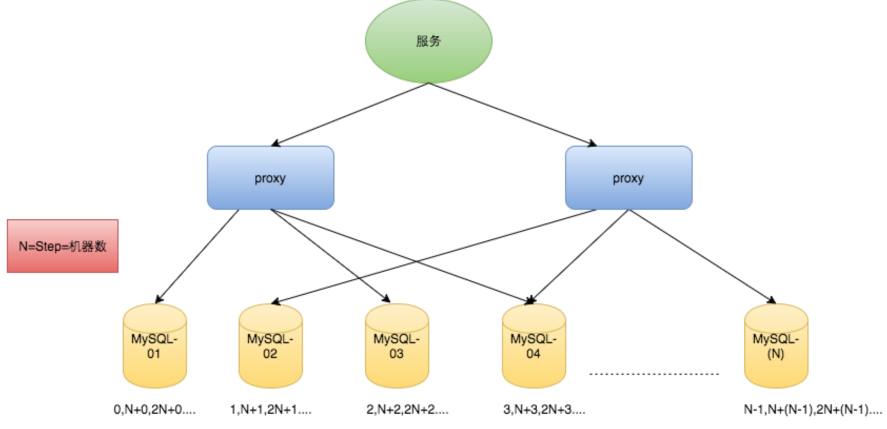

### 1、数据库自增ID原理解释

在分布式里面，数据库的自增ID机制的主要原理是：`数据库自增ID和mysql数据库的replace_into()函数实现的。这里的replace数据库自增ID和mysql数据库的replace_into()函数实现的。`这里的replace into跟insert功能类似，不同点在于：replace into首先尝试插入数据列表中，如果发现表中已经有此行数据（根据主键或唯一索引判断）则先删除，再插入。否则直接插入新数据。

### 2、单机MySQL数据库自增ID示例

```sql
create table t_test(
    id bigint(20) unsigned not null auto_increment PRIMARY KEY,
    stub char(1) not null default '',
    unique key stub (stub)
)
```

然后我们插入的sql语句和查询的语句如下所示

```sql
replace into t_test (stub) values('b');
select last_insert_id();				--返回刚刚插入的ID值是1
```


### 3、分布式ID在数据库里面的实现过程

既然是分布式id，那么最少要使用两个数据库，这里我们使用3台来讲解，为了保证每一台数据库里面的ID自增的时候不会重复，那么我们就要给每一台数据库设置auto-increment-increment和auto-increment-offset这两个属性值(auto-increment-increment表示每一台数据库的起始id值，然后auto-increment-offset表示每一台数据库每一次的增加数字)，设置值如下所示

```properties
#Server1：
auto-increment-increment = 1
auto-increment-offset = 3

#Server2：
auto-increment-increment = 2
auto-increment-offset = 3

#Server3：
auto-increment-increment = 3
auto-increment-offset = 3
```

那么如果我们有n台数据库的话，那么上面的auto-increment-increment和auto-increment-offset这两个属性值应该怎么设计呢，我们给每一台数据库设置初始值分别为1,2,3…N，然后每一台数据库自增步长为机器的台数N。



### 4、数据库自增ID是否适合做分布式ID？

那数据库自增ID机制适合作分布式ID吗？答案是不太适合，为什么呢，我总结了下面两个原因

> - 系统水平扩展比较困难，比如定义好了步长和机器台数之后，如果要添加机器该怎么做？假设现在只有一台机器发号是1,2,3,4,5（步长是1），这个时候需要扩容机器一台。可以这样做：把第二台机器的初始值设置得比第一台超过很多，比如14（注意这里设置14的前提是：在扩容期间第一台机器的ID不可能增加到14），同时设置步长为2，那么这台机器下发的号码都是14以后的偶数。然后把第一台机器的ID值保留为奇数，比如7，然后修改第一台的步长为2。让它符合我们定义的号段标准。扩容方案看起来复杂吗？貌似还好，现在想象一下如果我们线上有100台机器，这个时候要扩容该怎么做？简直是噩梦。所以系统水平扩展方案复杂难以实现。
> - 数据库压力还是很大，每次获取ID都得读写一次数据库，非常影响性能，不符合分布式ID里面的延迟低和要高QPS的规则，在高并发下，如果都去数据库里面获取id，那是非常影响性能的。

