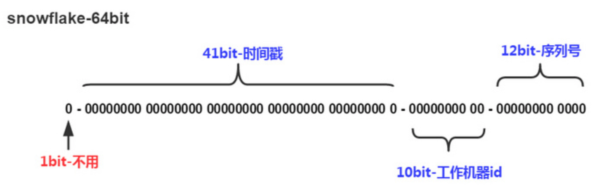

SnowFlake算法是国际大公司Twitter的采用的一种生成分布式自增id的策略。

### Redis分布式ID组成部分

雪花算法核工程的ID是一个64bit大小的整数。它的结构图如下



- 整数的时候第一位必须是0，所以最大的数值就是63位的。
- 41位二进制11111111111111111111111111111111111111111转换成10进制的毫秒就是2199023255551，然后我们把 2199023255551转换成时间就是2039-09-07，也就是说可以用很多年的。
- 12位二进制111111111111作为Redis节点个数，即最多可以支持4095个redis节点。
- 10位二进制1111111111作为每一个Redis节点可以每一毫秒最多可以生成1013个不重复的值。

由于在Java中64bit的整数是long类型，所以在Java中SnowFlake算法生成的id就是long来存储的。

### Java版本的实现

```java
package com.tanglongan.snowflake;

import java.text.SimpleDateFormat;
import java.util.Date;

public class SnowFlake01 {

    private final long twepoch = 0L;							//开始时间戳(1970-01-01)
    private final long workerIdBits = 5L;						//机器ID所占位数
    private final long datacenterIdBits = 5L;					//数据位数所占位数
    private final long maxWorkerId = ~(-1L << workerIdBits);	//支持的最大机器ID
    private final long maxDatacenterId = ~(-1L << workerIdBits);//支持的最大数据标识ID
    private final long sequenceBits = 12L;						//序列在ID中占用的位数
    private final long workerIdShift = sequenceBits;		//机器ID向左移12位
    private final long datacenterIdShift = sequenceBits + workerIdBits;//数据标识id向左移17位(12+5)
    private final long timestampLeftShift = sequenceBits + workerIdBits + datacenterIdBits;//时间截向左移22位(5+5+12)
    private final long sequenceMask = ~(-1L << sequenceBits);	//生成序列的掩码，这里为4095 (0b111111111111=0xfff=4095)
    private long workerId;										//工作机器ID(0~31)
    private long datacenterId;									//数据中心ID(0~31)
    private long sequence = 0L;									//毫秒内序列(0~4095)
    private long lastTimestamp = -1L;							//上次生成ID的时间截

    public SnowFlake01(long workerId, long datacenterId) {
        if (workerId > maxWorkerId || workerId < 0) {
            throw new IllegalArgumentException("worker Id can't be greater than "+maxWorkerId+" or less than 0");
        }
        if (datacenterId > maxDatacenterId || datacenterId < 0) {
            throw new IllegalArgumentException("datacenter Id can't be greater than "+maxDatacenterId+" or less than 0");
        }
        this.workerId = workerId;
        this.datacenterId = datacenterId;
    }


    private synchronized long nextId() {
        long timestamp = timeGen();

        //1、如果当前时间小于上次ID生成的时间戳，说明时钟回退过，这个时候应该抛出异常
        if (timestamp < lastTimestamp) {
           throw new RuntimeException("Clock backwards.Refusing to generate id for "+(lastTimestamp-timestamp)));
        }

        //2、如果是同一时间生成，则进行毫秒内序列
        if (timestamp == lastTimestamp) {
            sequence = (sequence + 1) & sequenceMask;
            //毫秒内序列溢出
            if (sequence == 0) {
                //阻塞到下一秒，获取新的时间戳
                timestamp = tilNextMillis(lastTimestamp);
            }
        } else {
            //时间戳改变，毫秒内序列重置
            sequence = 0L;
        }

        //记录上一次生成ID的时间戳
        lastTimestamp = timestamp;
        //     时间戳部分 数据中心部分 机器标识部分 序列号部分
        return ((timestamp - twepoch) << timestampLeftShift)
                | (datacenterId << datacenterIdShift)
                | (workerId << workerIdShift)
                | sequence;
    }


    /**
     * 当前时间
     */
    private long timeGen() {
        return System.currentTimeMillis();
    }


    /**
     * 阻塞到下一个毫秒，直到获得新的时间戳
     *
     * @param lastTimestamp 上次生成ID的时间戳
     * @return 当前时间戳
     */
    private long tilNextMillis(long lastTimestamp) {
        long timestamp = timeGen();
        while (timestamp < lastTimestamp) {
            timestamp = timeGen();
        }
        return timestamp;
    }

    private static void parseId(long id) {
        long miliSecond = id >>> 22;
        long shardId = (id & (0xFFF << 10)) >> 10;
        System.err.println("分布式id-"+id+"生成的时间是："+new SimpleDateFormat("yyyy-MM-dd").format(new Date(miliSecond)));
    }

    public static void main(String[] args) {
        SnowFlake01 idWorker = new SnowFlake01(0, 0);
        for (int i = 0; i < 10; i++) {
            long id = idWorker.nextId();
            System.out.println(id);
            parseId(id);
        }
    }
}
```

### 时间回拨问题的解决

- 第一种：可以利用扩展位

    由于Snowflake算法的极限是每毫秒的每一个节点生成4059个ID值，也就是说每毫秒的极限是生成023*4059=4 152 357个id值，这对于中小公司来说根本就是浪费，所以我们可以把这里的位数给减少一些，就比如把12位的序列号变成10位，留两位给时间回拨，这样就很容易的解决了时间回拨问题，如果发生时间回拨，那么就直接给当前ID加1

- 第二种：采用zookeeper的临时顺序节点的方式

- 第二种：在容忍时间差范围内，使用LockSupport.parkNanos()阻塞几秒；否则就抛出异常。

    

