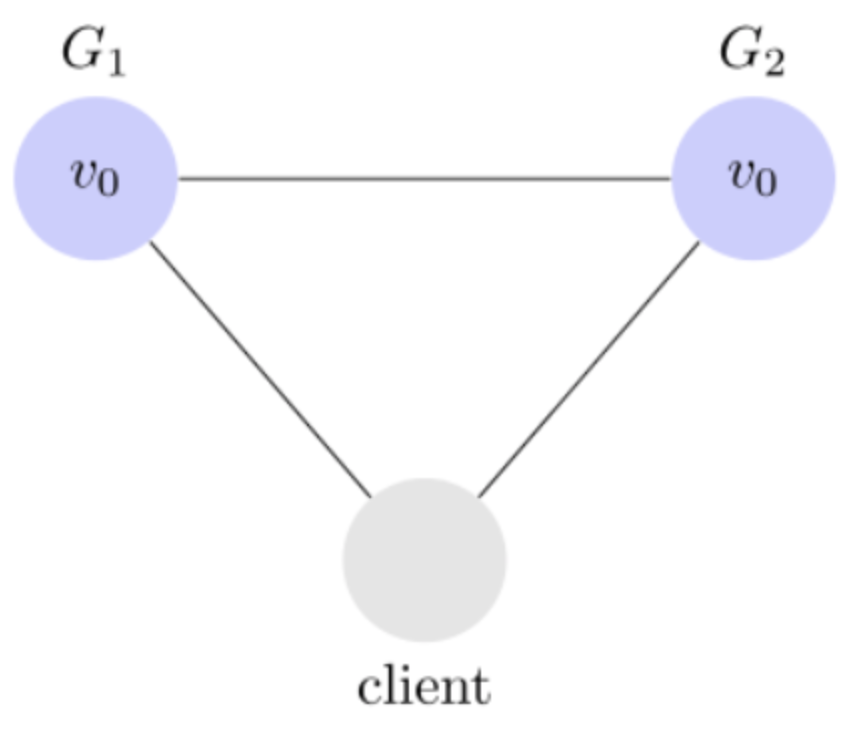
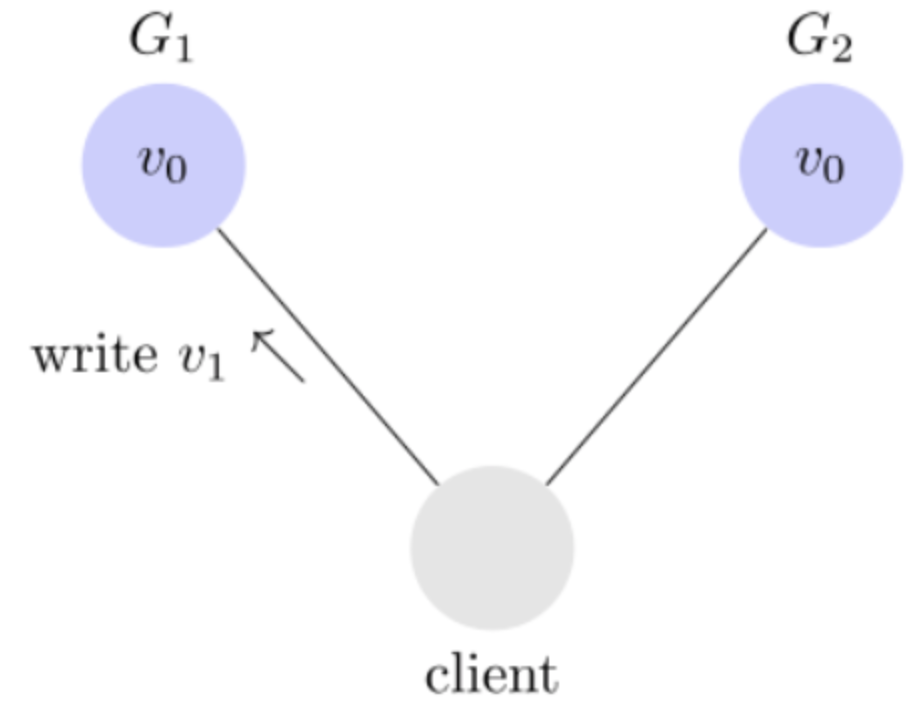
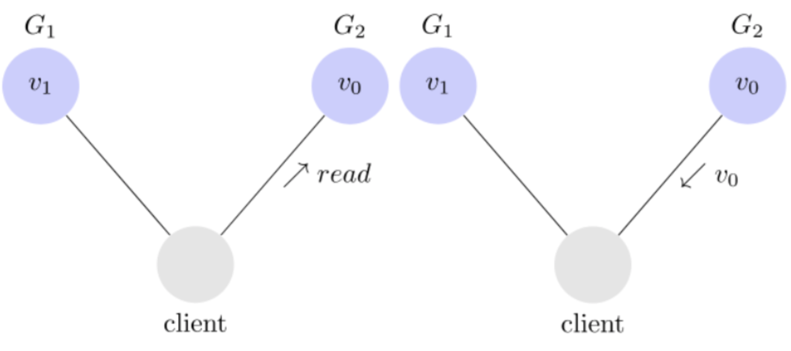
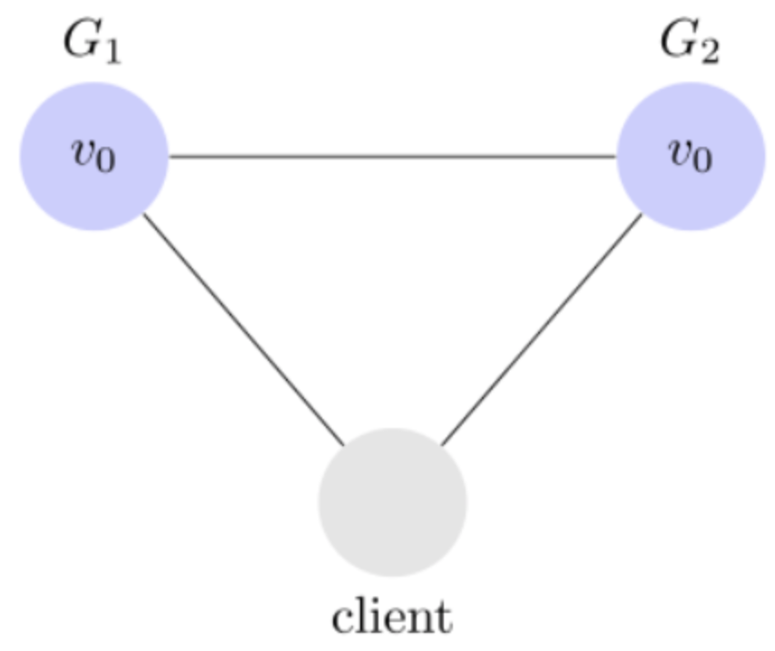

### 1、什么叫做CAP原理？

CAP指的是一致性、可用性和分区容错性。维基百科的解释如下：

- **一致性**
    - 含义：客户端每次读取数据，要么读到的是最新数据，要么读取失败。
    - 解释：要么我返回一个绝对正确一致的数据，要么就返回一个错误。强调的是数据正确。
- **可用性**
    - 含义：任何客户端的请求都能够响应，不会出现响应异常。
    - 解释：一定会返回响应数据，不会返回错误，但不保证数据正确性。强调的是不出错。

- **分区容错性**
    - 含义：由于分布式系统是通过网络通信的，而网络是不可靠的。当发生消息丢失或延迟到达时，系统仍然会继续提供服务，不会挂掉。
    - 解释：系统会一直运行，不管我内部出现了哪些数据同步问题，强调的是不挂掉。

### 2、分区容错性

大多数分布式系统都是分布在多个子网络，每个网络就叫一个区，分区容错的意思是网络分区之间可能通信异常。比如，一台服务器放在中国，另一台服务器放在美国，这就是两个区，它们之间可能无法通信。如下图，G1和G2是两台跨区域的服务器。G1向G2发送一个消息，G2可能无法收到。所以在系统设计的时候应该考虑这种情况。一般来说，分区容错性不可避免，因为网络的不可靠性。因此可以认为CAP理论中P总是需要保证的。

### 3、一致性

一致性讲的是，写操作之后的读操作，必须返回修改后的最新值。举例来说，某条记录是v0，客户端向G1发送一个更新操作，将其修改成了v1，但是此时G2里面的值是v0，而不是v1。

- 当客户端向G1获取数据的时候，返回值为最新的v1，这样是没有问题的。
- 当客户端向G2获取数据的时候，此时记录是旧值v0，这样就有问题了，因为用户在两个服务获取的数据不一致。这就是不一致性。

怎么样解决数据不一致性的问题？

**可以在向G1写数据的时候，锁定G2的读操作和写操作。只有G1完成了写操作并且把修改的数据同步到G2之后，G2才能重新开放操作。**

### 4、可用性

可用性的意思是只要收到客户端请求，系统必须给出响应。

### 5、为什么可用性和一致性无法同时使用？

如下图，分为两个方面解释

- 如果保证G2的一致性，那么必须在G1写操作的时候，锁定G2的读操作和写操作。只有G1和G2把修改后的数据同步之后，才能让G2服务开放操作。但是在G2服务节点锁定期间，G2是无法对外提供服务的。因此可用性是不可能实现的。
- 如果保证G2的可用性，那么肯定是不能锁定G2的读操作和写操作，所以此时数据一致性就无法保证。

