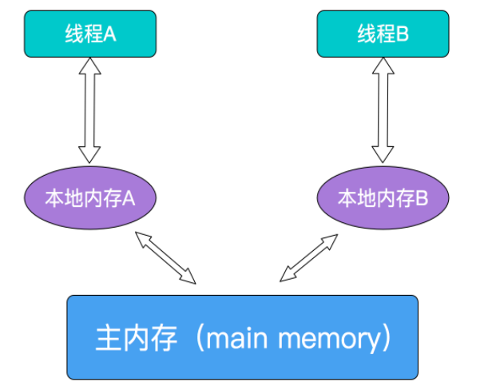

Java语言包含了两种内置的同步机制

- synchronized同步块或方法
- volatile变量

相比于synchronized（synchronized通常称为重量级锁），volatile更加轻量级，因为它不会引起线程上下文切换和调度。volatile是Java提供的一种轻量级的同步机制，但是volatile变量的同步性较差，而且其使用也更容易出错。

## 1、并发编程三个要点

- 原子性
    - 定义：**一个操作或多个操作，要么全部执行成功并且执行过程中不会被任何因素打断，要么全部不执行。**
    - 原子性是拒绝多线程操作的，不论是单核还是多核，具有原子性的变量，同一时刻只能有一个线程对它进行操作。简而言之，在整个操作过程中不会被线程调度器中断，都可以认为是具有原子性。例如 a=1是原子性操作，但是a++和a +=1就不是原子性操作。
    - Java中常见的原子性操作
        - 基本数据类型的读取和赋值，且赋值是直接赋值给变量，变量之间的相互赋值不具备原子性。
        - 所有引用reference的赋值操作
        - 在java.concurrenct.atomic.*下面的原子类的操作
- 可见性
    - 定义：当多个线程访问同一个变量时，一个线程修改了变量的值，其他线程能够立即看到修改后的值
    - 在多线程环境下，一个线程对共享变量的操作对于其他线程是不可见的。Java提供了volatile关键字来保证可见性，当一个变量被volatile修饰后表示线程本地内存无效，当一个线程修改共享变量后，它会立即被刷新到主内存中，其他线程读取共享变量时，会直接从主内存中获取。
    - synchronized和Lock都可以保证可见性。synchronized和Lock能保证同一时刻只有一个线程获取到锁然后执行代码，并且在释放锁之前将对变量的修改刷新到主内存中。因此可以保证可见性。
- 有序性
    - 定义：程序执行的顺序按照代码的顺序执行
    - 在Java内存模型中，为了效率是允许编译器和处理器对指令进行重排序，当然重排序不会影响单线程的运行结果，但是对多线程会有影响。Java提供volatile来保证一定的有序性。最著名的例子就是单例模式里面的DCL（双重检查锁）。
    - synchronized和Lock来保证有序性，synchronized和Lock保证每个时刻是有一个线程执行同步代码，相当于是让线程顺序执行同步代码，自然就保证了有序性。

## 2、Java的内存模型JMM

JMM决定了一个线程对共享变量的写入何时对另一个线程可见，JMM定义了线程和内存之间的抽象关系：**共享变量存储在主内存中，每一个线程都有一个私有的本地内存，本地内存保证了被该线程使用到的主内存的副本拷贝，线程对变量的操作都必须在工作内存中，而不能直接读写主内存的变量**




对于普通的共享变量来说，线程A将其修改为某个值发生在线程A的工作内存中，此时还未同步到主内存中；而线程B已经缓存了该变量的旧值，所以就导致了共享变量的值不一致。解决这种共享变量在多线程环境下的不可见性问题，较粗暴的方式就是加锁，但是太重量级了，影响程序性能，比较合理的方式就是使用volatile关键字修饰。需注意的是，JMM是个抽象的内存模型，所以所谓的本地内存，主内存都是抽象概念，并不一定就真实的对应cpu缓存和物理内存。

## 3、volatile变量的特点

### 3.1、保证可见性，不保证原子性

- 当写一个volatile变量时，JMM会把该线程本地内存中这个变量刷新到主内存中

- 这个写操作会导致其他线程中的缓存无效，就是直接从主内存中获取新值

    ```java
    public class TestVolatile {
        private volatile int inc = 0;
        // inc++ 这样的操作不是一个原子性操作，可以拆分成读取、加、赋值的3个操作，所以结果并不能达到预期的10000。
        private void increase() {
            inc++;
        }
        public static void main(String[] args) {
            final TestVolatile test = new TestVolatile();
            for (int i = 0; i < 10; i++) {
                new Thread(() -> {
                    for (int j = 0; j < 1000; j++) {
                        test.increase();
                    }
                }).start();
            }
    
            while (Thread.activeCount() > 0) {
                Thread.yield();
            }
            System.out.println(test.inc);
        }
    }
    ```

    

### 3.2、禁止指令重排序

​			重排序是指编译器和处理器为了优化程序性能而对指令序列进行排序的一种手段。重排序需要遵守一定规则：

- **重排序操作不会对存在数据依赖关系的操作进行重排序。**

    比如：a=1; b=a;  这个指令序列，由于第二个操作依赖于第一个操作，所以在编译时和处理器运行时这两个操作不会被重排序。

- **重排序是为了优化性能，但是不管怎么重排序，单线程下程序的执行结果不能被改变**

    比如：a=1;b=2;c=a+b这三个操作，第一步（a=1)和第二步(b=2)由于不存在数据依赖关系， 所以可能会发生重排序，但是c=a+b这个操作是不会被重排序的，因为需要保证最终的结果一定是c=a+b=3。重排序在单线程下一定能保证结果的正确性，但是在多线程环境下，可能发生重排序，影响结果，下例中的1和2由于不存在数据依赖关系，则有可能会被重排序，先执行status=true再执行a=2。而此时线程B会顺利到达4处，而线程A中a=2这个操作还未被执行，所以b=a+1的结果也有可能依然等于2。

    ```java
    public class TestVolatile {
        int a = 1;
        boolean status = false;
        public void changeStatus() {
            a = 2;			// 1
            status = true;  // 2
        }
        
        public void run(){
            if(status){		// 3	
                int b = a+1;// 4
                System.out.println(b);
            }
        }
    }
    ```

    使用volatile关键字修饰共享变量便可以禁止这种重排序。若用volatile修饰共享变量，在编译时，会在指令序列中插入内存屏障来禁止特定类型的处理器重排序,volatile禁止指令重排序也有一些规则：

    a.当程序执行到volatile变量的读操作或者写操作时，在其前面的操作的更改肯定全部已经进行，且结果已经对后面的操作可见；在其后面的操作肯定还没有进行；

    b.在进行指令优化时，不能将在对volatile变量访问的语句放在其后面执行，也不能把volatile变量后面的语句放到其前面执行。

    **即执行到volatile变量时，其前面所有语句都执行完，后面所有语句都未执行。且前面语句的结果对volatile变量及其后面语句可见。**

## 4、volatile原理

volatile可以保证线程可见性且提供了一定的有序性，但是无法保证原子性。在JVM底层volatile是采用“内存屏障”来实现的。观察加入volatile关键字和没有加入volatile关键字时所生成的汇编代码发现，加入volatile关键字时，会多出一个lock前缀指令，lock前缀指令实际上相当于一个内存屏障（也成内存栅栏），内存屏障会提供3个功能：

- **它确保指令重排序时不会把其后面的指令排到内存屏障之前的位置，也不会把前面的指令排到内存屏障的后面；即在执行到内存屏障这句指令时，在它前面的操作已经全部完成；**

- **它会强制将对缓存的修改操作立即写入主存；**

- **如果是写操作，它会导致其他CPU中对应的缓存行无效。**

## 5、volatile的使用场景

- 适用于对变量的写操作不依赖于当前值，对变量的读取操作不依赖于非volatile变量
- 适用于读多写少的场景
- 可以用作状态标志的场景

JDK中volatile的使用：

- JDK中ConcurrentHashMap的Entry的value和next被声明为volatile
- AtomicLong中的value被声明为volatile。AtomicLong通过CAS操作保证了原子性。