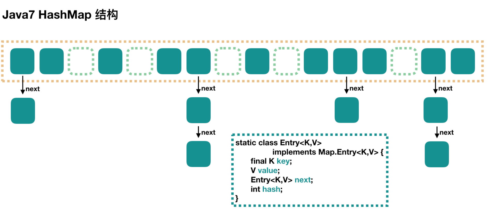

### 1、数据结构和属性

JDK7 HashMap是最简单的，因为不支持并发操作，源码比较简单。

首先用下面这个示意图可以形象地展示HashMap的数据结构



总体来看，HashMap是一个数组，然后数组里面每个元素都是一个列表的表头元素。上图中，每个绿色的块就是内部类Entry的实例，Entry包含了4个属性：key、value、hash、next。

HashMap中有3个重要的属性：

- capacity：当前数组的容量，始终保持2^N，可以扩容，扩容时时扩容之前的2倍。
- loadFactor：负载因子，默认是0.75。
- threshold：扩容的阈值（capcaticy * loadFactor）。

### 2、put方法分析

put操作的过程比较简单

```java
public V put(K key, V value) {
    // 当插入第一个元素的时候，需要先初始化数组大小
    if (table == EMPTY_TABLE) {
        inflateTable(threshold);
    }
    // 1、key为null时会将这个entry放到table[0]中
    if (key == null){
        return putForNullKey(value);
    }
    // 2、计算key的hash值
    int hash = hash(key);
    // 3、 找到对应的数组下标
    int i = indexFor(hash, table.length); // 本质上通过 hash & (length-1)与操作
    // 4、遍历一下对应下标处的链表，看是否有重复的 key 已经存在，如果有，直接覆盖，put 方法返回旧值就结束了
    for (Entry<K,V> e = table[i]; e != null; e = e.next) {
        Object k;
        if (e.hash == hash && ((k = e.key) == key || key.equals(k))) {
            V oldValue = e.value;
            e.value = value;
            e.recordAccess(this);
            return oldValue;
        }
    }
    modCount++;
    // 4. 不存在重复的key，将此entry添加到链表中
    addEntry(hash, key, value, i);
    return null;
}
```

### 3、数组初始化

在第一个元素插入的时候，做一次数组初始化，即先确定数组大小，并计算数组扩容的阈值。

```java
private void inflateTable(int toSize) {
    // 保证数组大小一定是2的 n 次方。比如这样初始化：new HashMap(20)，那么处理成初始数组大小是32
    int capacity = roundUpToPowerOf2(toSize);
    // 计算扩容阈值：capacity * loadFactor
    threshold = (int) Math.min(capacity * loadFactor, MAXIMUM_CAPACITY + 1);
    // 算是初始化数组吧
    table = new Entry[capacity];
    initHashSeedAsNeeded(capacity); //ignore
}
```

将数组大小保持为 2 的 n 次方的做法，Java7 和 Java8 的 HashMap 和 ConcurrentHashMap 都有相应的要求，只是实现的代码稍微有些不同。

### 4、计算数组具体位置

我们也可以使用key的hash值对数组长度length进行取模运算即可。但是使用位运算，对CPU来说效率更高。简单说就是取 hash 值的低 n 位。如在数组长度为 32 的时候，其实取的就是 key 的 hash 值的低 5 位，作为它在数组中的下标位置。

```java
static int indexFor(int hash, int length) {
    return hash & (length-1);
}
```

### 5、添加节点到链表中

找到数组下标后，会先进行 key 判重，如果没有重复，就准备将新值放入到链表的**表头**。

```java
/**
 * 将实体添加到集合中。如达到实体个数达到阈值，就进行扩容操作
 */
void addEntry(int hash, K key, V value, int bucketIndex) {
    // 如果当前HashMap大小已经达到了阈值，并且新值要插入的数组位置已经有元素了，那么要扩容
    if ((size >= threshold) && (null != table[bucketIndex])) {
        resize(2 * table.length);					// 扩容操作
        hash = (null != key) ? hash(key) : 0;		// 扩容以后，重新计算 hash 值
        bucketIndex = indexFor(hash, table.length);	// 重新计算扩容后的新的下标
    }
    createEntry(hash, key, value, bucketIndex);
}

/**
 * 在数组的指定位置处，将实体插入到链接的表头，集合中中实体个数加1
 */
void createEntry(int hash, K key, V value, int bucketIndex) {
    Entry<K,V> e = table[bucketIndex];
    table[bucketIndex] = new Entry<>(hash, key, value, e);
    size++;
}
```

### 6、扩容

扩容操作针对的数组。在插入新值的时候，如果**当前的 size 已经达到了阈值，并且要插入的数组位置上已经有元素**，那么就会触发扩容，扩容后，数组大小为原来的2倍。

```java
void resize(int newCapacity) {
    Entry[] oldTable = table;
    int oldCapacity = oldTable.length;
    if (oldCapacity == MAXIMUM_CAPACITY) {
        threshold = Integer.MAX_VALUE;
        return;
    }
    //创建新数组，newCapacity是原先的2倍
    Entry[] newTable = new Entry[newCapacity]; 
    //将原数组中的值迁移到新的数组中，新数组替换旧数组，阈值更新
    transfer(newTable, initHashSeedAsNeeded(newCapacity));
    table = newTable;
    threshold = (int)Math.min(newCapacity * loadFactor, MAXIMUM_CAPACITY + 1);
}
```

由于是双倍扩容，迁移过程中，会将原来 table[i] 中的链表的所有节点，分拆到新的数组的 newTable[i] 和 newTable[i + oldLength] 位置上。如原来数组长度是 16，那么扩容后，原来 table[0] 处的链表中的所有元素会被分配到新数组中 newTable[0] 和 newTable[16] 这两个位置。

### 7、get方法分析

相对于 put 过程，get 过程是非常简单的：

1. 根据 key 计算 hash 值。
2. 找到相应的数组下标：hash & (length - 1)。
3. 遍历该数组位置处的链表，直到找到相等(==或equals)的 key。

```java
public V get(Object key) {
    //key为null 的话，会被放到 table[0]；只要遍历下 table[0] 处的链表就可以了
    if (key == null){
        return getForNullKey();
    }
    Entry<K,V> entry = getEntry(key);
    return null == entry ? null : entry.getValue();
}

/**
 * 确定bucket位置，遍历链表
 */
final Entry<K,V> getEntry(Object key) {
    if (size == 0) {
        return null;
    }
    int hash = (key == null) ? 0 : hash(key);
    //确定数组下标，然后从头开始遍历链表，直到找到为止
    for (Entry<K,V> e = table[indexFor(hash, table.length)]; e != null; e = e.next) {
        Object k;
        if (e.hash == hash &&((k = e.key) == key || (key != null && key.equals(k)))){
            return e;
        }
    }
    return null;
}
```

