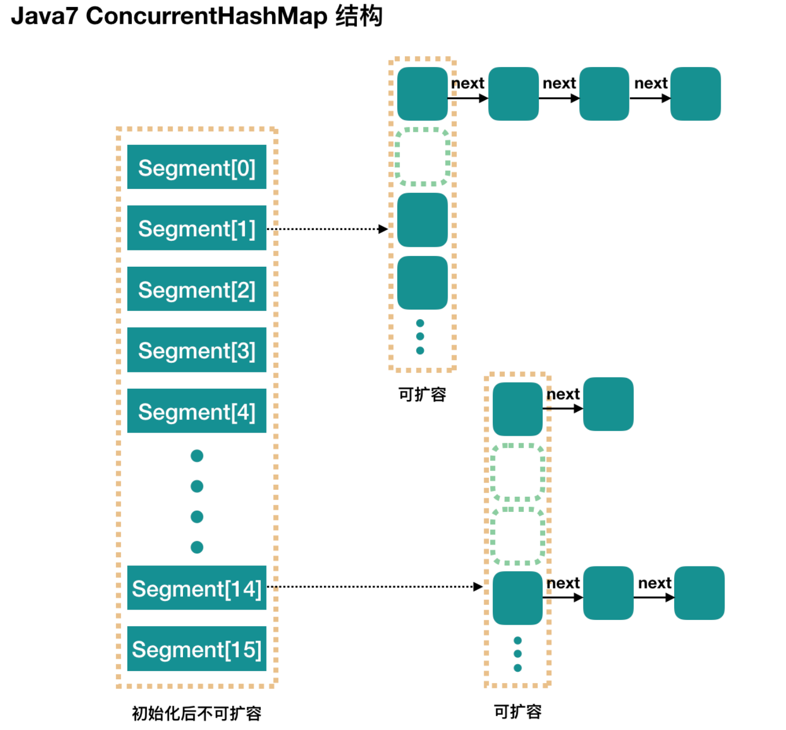

### 1、ConcurrentHashMap数据结构

ConcurrentHashMap 和 HashMap 思路是差不多的，但是因为它支持并发操作，所以要复杂一些。整个 ConcurrentHashMap 由一个个 Segment 组成，Segment 代表”部分“或”一段“的意思，所以很多地方都会将其描述为**分段锁**，也可以称为“**槽**”。

简单的来说

ConcurrentHashMap 是一个 Segment 数组，`Segment 通过继承 ReentrantLock 来进行加锁，所以每次需要加锁的操作锁住的是一个 segment`，这样只要保证每个 Segment 是线程安全的，也就实现了全局的线程安全。



**concurrencyLevel**：称为并发数或Segment 数，默认是 16，也就是说 ConcurrentHashMap 有 16 个 Segments，所以理论上，这个时候，最多可以同时支持 16 个线程并发写，只要它们的操作分别分布在不同的 Segment 上。这个值可以在初始化的时候设置为其他值，但是`一旦初始化以后，它是不可以扩容的`。再具体到每个 Segment 内部，其实每个 Segment元素中就是普通的 HashMap。

### 2、初始化

- initialCapacity：初始容量，指的是整个 ConcurrentHashMap 的初始容量，实际操作的时候需要平均分给每个 Segment。
- loadFactor：负载因子Segment 数组不可以扩容，所以这个负载因子是给每个Segment内部对应的那个数组使用的。

```java
public ConcurrentHashMap(int initialCapacity, float loadFactor, int concurrencyLevel) {
    //构造参数校验
    if (!(loadFactor > 0) || initialCapacity < 0 || concurrencyLevel <= 0){
        throw new IllegalArgumentException();
    }
    if (concurrencyLevel > MAX_SEGMENTS){
        concurrencyLevel = MAX_SEGMENTS;
    }
    //计算并发数ssize，同样也要保证并发数是2的n次幂（因为这样后续定位位置的时候使用位运算会更高效）
    int sshift = 0;
    int ssize = 1;
    while (ssize < concurrencyLevel) {
        ++sshift;
        ssize <<= 1;
    }
    
    //此处分析时，暂时只考虑用默认值，concurrencyLevel为16，sshift为4
    //那么计算出segmentShift为28，segmentMask为15，其他方法中计算位置时会使用到这两个值
    this.segmentShift = 32 - sshift; //将来hashCode值的二进制向右移动的位数，移动后hashCode的的高4位和下面的掩码做与运算
    this.segmentMask = ssize - 1;	 //掩码值
    if (initialCapacity > MAXIMUM_CAPACITY){
        initialCapacity = MAXIMUM_CAPACITY;
    }
    
    //initialCapacity 是设置整个 map 初始的大小，根据 initialCapacity 计算 Segment 数组中每个位置可以分到的大小
    //如 initialCapacity 为 64，那么每个Segment或称之为"槽"可以分到4个
    int c = initialCapacity / ssize;
    if (c * ssize < initialCapacity){
        ++c;
    }
    //默认MIN_SEGMENT_TABLE_CAPACITY是2，这个值也有讲究的，因为这样的话，对于具体的槽上，插入一个元素不扩容，插入第二个才会扩容
    int cap = MIN_SEGMENT_TABLE_CAPACITY; 
    while (cap < c){
        cap <<= 1;
    }
    //创建 Segment 数组，并创建数组的第一个元素 segment[0]
    Segment<K,V> s0 = new Segment<K,V>(loadFactor, (int)(cap * loadFactor),(HashEntry<K,V>[])new HashEntry[cap]);
    Segment<K,V>[] ss = (Segment<K,V>[])new Segment[ssize];
    //往数组写入segment[0]
    UNSAFE.putOrderedObject(ss, SBASE, s0); // ordered write of segments[0]
    this.segments = ss;
}
```

初始化完成，我们得到了一个 Segment 数组。

我们就当是用 new ConcurrentHashMap() 无参构造函数进行初始化的，那么初始化完成后：

- Segment 数组默认长度为16，不可以扩容。
- Segment[i] 的默认大小为 2，负载因子是 0.75，得出初始阈值为 1.5，即以后插入第一个元素不会触发扩容，插入第二个会。
- 这里初始化了 segment[0]，其他位置还是 null，至于为什么要初始化 segment[0]，后面的代码分析会介绍
- 当前 segmentShift 的值为 32 - 4 = 28，segmentMask 为 16 - 1 = 15，可以将他们理解为**移位数**和**掩码**。

### 3、put过程分析

put方法内部过程

```java
public V put(K key, V value) {
    Segment<K,V> s;
    if (value == null){
        throw new NullPointerException();
    }
    // 1. 计算 key 的 hash 值
    int hash = hash(key);
    // 2. 根据hash值找到Segment数组中的位置j。hash是32位，无符号右移 segmentShift(28) 位，剩下高4位。
    //	  然后和segmentMask(15，二进制为1111)进行与操作，也就是说j是hash值的高4位，也就是槽的数组下标
    int j = (hash >>> segmentShift) & segmentMask;
    // 初始化的时候初始化了segment[0]，但是其他位置还是null；ensureSegment(j)对segment[j] 进行初始化
    if ((s = (Segment<K,V>) UNSAFE.getObject(segments, (j << SSHIFT) + SBASE)) == null){ //重新检查
        s = ensureSegment(j);
    }
    // 3. 插入新值到槽s中
    return s.put(key, hash, value, false);
}
```

第一层操作很简单，根据hash的计算就确定了Segment下标位置，之后就是 Segment 内部的put操作了。Segment内部是由**数组+链表** 组成的。

```java
/**
 * 往槽对应的HashMap中添加键值对
 * onlyIfAbsent：key已存在时，是否覆盖旧值
 */
final V put(K key, int hash, V value, boolean onlyIfAbsent) {
    //在往该segment写入前，需要先获取该segment的独占锁
    HashEntry<K,V> node = tryLock() ? null : scanAndLockForPut(key, hash, value);
    V oldValue;
    try {
        HashEntry<K,V>[] tab = table;				//这里的table是segment内部的数组
        int index = (tab.length - 1) & hash;		//再利用hash值，求应该放置的数组下标
        HashEntry<K,V> first = entryAt(tab, index);	//first是数组index下标处的链表头节点
        
        for (HashEntry<K,V> e = first;;) {
            //1、数组处已存在元素，遍历链表
            if (e != null) {
                K k;
                if ((k = e.key) == key ||(e.hash == hash && key.equals(k))) {
                    oldValue = e.value;
                    if (!onlyIfAbsent) {
                        e.value = value; //覆盖旧值
                        ++modCount;
                    }
                    break;
                }
                e = e.next;// 继续顺着链表走
            }
            //2、数组处没有链表
            else {
                // 不为null，直接设置为链表表头；如果null，初始化并设置为链表表头。
                if (node != null){
                    node.setNext(first);
                } else {
                    node = new HashEntry<K,V>(hash, key, value, first);
                }
                int c = count + 1;
                // 如果超过了该 segment 的阈值，这个 segment 需要扩容
                if (c > threshold && tab.length < MAXIMUM_CAPACITY){
                    rehash(node); // 扩容后面也会具体分析
                }
                else{
                   // 没有达到阈值，将 node 放到数组 tab 的 index 位置，
                   // 其实就是将新的节点设置成原链表的表头
                   setEntryAt(tab, index, node); 
                } 
                ++modCount;
                count = c;
                oldValue = null;
                break;
            }
        }
    } finally {
        //释放segment的锁
        unlock();
    }
    return oldValue;
}
```

整体流程还是比较简单的，由于有独占锁的保护，所以 segment 内部的操作并不复杂。put 操作就这样，接下来分析其中几步关键的操作。

### 4、初始化槽ensureSegment

ConcurrentHashMap 初始化的时候会初始化第一个槽 segment[0]，对于其他槽来说，在插入第一个值的时候进行初始化。这里需要考虑并发，因为很可能会有多个线程同时进来初始化同一个槽 segment[k]，不过只要有一个成功了就可以。

```java
private Segment<K,V> ensureSegment(int k) {
    final Segment<K,V>[] ss = this.segments;
    long u = (k << SSHIFT) + SBASE; // raw offset
    Segment<K,V> seg;
    if ((seg = (Segment<K,V>) UNSAFE.getObjectVolatile(ss, u)) == null) {
        // 这里看到为什么之前要初始化 segment[0] 了，
        // 使用当前 segment[0] 处的数组长度和负载因子来初始化 segment[k]
        // 为什么要用“当前”，因为 segment[0] 可能早就扩容过了
        Segment<K,V> proto = ss[0];
        int cap = proto.table.length;
        float lf = proto.loadFactor;
        int threshold = (int)(cap * lf);

        // 初始化 segment[k] 内部的数组
        HashEntry<K,V>[] tab = (HashEntry<K,V>[])new HashEntry[cap];
        if ((seg = (Segment<K,V>)UNSAFE.getObjectVolatile(ss, u))== null) { // 再次检查一遍该槽是否被其他线程初始化了
            Segment<K,V> s = new Segment<K,V>(lf, threshold, tab);
            // 使用 while 循环，内部用 CAS，当前线程成功设值或其他线程成功设值后，退出
            while ((seg = (Segment<K,V>)UNSAFE.getObjectVolatile(ss, u)) == null) {
                if (UNSAFE.compareAndSwapObject(ss, u, null, seg = s)) break;
            }
        }
    }
    return seg;
}
```

ensureSegment(int k) 比较简单，并发操作使用 CAS 进行控制。最后用一个while循环是因为当前线程 CAS 失败，while 循环是为了将 seg 赋值返回。

### 5、获取写入锁scanAndLockForPut

在前面可以看到，在向某个segment中put的时候，首先会调用 **node = tryLock() ? null : scanAndLockForPut(key, hash, value)**，也就是说先进行一次 tryLock() 快速获取该 segment 的独占锁，如果失败，那么进入到 scanAndLockForPut 这个方法来获取锁。接下来分析这个方法。

```java
private HashEntry<K,V> scanAndLockForPut(K key, int hash, V value) {
    HashEntry<K,V> first = entryForHash(this, hash);
    HashEntry<K,V> e = first;
    HashEntry<K,V> node = null;
    int retries = -1;
    // 没有获取到锁的时候就“自旋”地获取锁
    while (!tryLock()) {
        HashEntry<K,V> f;
        if (retries < 0) {
            if (e == null) {
                if (node == null){ //数组该位置的是空链表
                    node = new HashEntry<K,V>(hash, key, value, null);
                }
                retries = 0;
            } else if (key.equals(e.key)){
                retries = 0;
            } else {
                // 顺着链表往下走
                e = e.next;
            }
        }
        //重试次数如果超过 MAX_SCAN_RETRIES，那么不抢了，进入到阻塞队列等待锁；    
        else if (++retries > MAX_SCAN_RETRIES) {
            //lock()是阻塞方法，直到获取锁后返回
            lock();
            break;
        } else if ((retries & 1) == 0 && (f = entryForHash(this, hash)) != first) {
            // 这个时候是有大问题了，那就是有新的元素进到了链表，成为了新的表头
            // 所以这边的策略是，相当于重新走一遍这个 scanAndLockForPut 方法
            e = first = f; 
            retries = -1;
        }
    }
    return node;
}
```

这个方法有两个出口，一个是 tryLock() 成功了，循环终止；一个是重试次数超过了 MAX_SCAN_RETRIES，进到 lock() 方法，此方法会阻塞等待，直到成功拿到独占锁。这个方法就是看似复杂，但是其实就是做了一件事，那就是**获取该 segment 的独占锁**，如果需要的话顺便实例化了一下 node。

### 6、扩容rehash

`segment 数组不能扩容，扩容是segment 数组某个位置内部的数组 HashEntry<K,V>[] 进行扩容`，扩容后容量为原来的2 倍。首先，我们要回顾一下触发扩容的地方，put 的时候，如果判断该值的插入会导致该 segment 的元素个数超过阈值，那么先进行扩容，再插值，可以回去 put 方法看一眼。该方法不需要考虑并发，因为到这里的时候，是持有该 segment 的独占锁的。

```java
/**
 * 方法参数上的node是这次扩容后，需要添加到新的数组中的数据。
 */
private void rehash(HashEntry<K,V> node) {
    HashEntry<K,V>[] oldTable = table;
    int oldCapacity = oldTable.length;
    int newCapacity = oldCapacity << 1;// 2 倍
    threshold = (int)(newCapacity * loadFactor);
    // 创建新数组
    HashEntry<K,V>[] newTable = (HashEntry<K,V>[]) new HashEntry[newCapacity];
    // 新的掩码，如从16扩容到32，那么sizeMask为31，对应二进制‘000...00011111’
    int sizeMask = newCapacity - 1;

    // 遍历原数组，将原数组下标i处的链表拆分到新数组位置i和i+oldCap 两个位置
    for (int i = 0; i < oldCapacity ; i++) {
        // e 是链表的第一个元素
        HashEntry<K,V> e = oldTable[i];
        if (e != null) {
            HashEntry<K,V> next = e.next;
            // 计算应该放置在新数组中的位置
            // 假设原数组长度为16，e在oldTable[3]处，那么idx只可能是3或者是19（3 + 16）
            int idx = e.hash & sizeMask;
            if (next == null)   // 该位置处只有一个元素
                newTable[idx] = e;
            else {
                //e是链表表头
                HashEntry<K,V> lastRun = e;
                //idx是当前链表的头结点e的新位置
                int lastIdx = idx;
                // 下面这个for循环会找到一个lastRun节点，这个节点之后的所有元素是将要放到一起的
                for (HashEntry<K,V> last = next; last != null; last = last.next) {
                    int k = last.hash & sizeMask;
                    if (k != lastIdx) {
                        lastIdx = k;
                        lastRun = last;
                    }
                }
                // 将 lastRun 及其之后的所有节点组成的子链表放到 lastIdx 这个位置
                newTable[lastIdx] = lastRun;
                // 下面的操作是处理 lastRun 之前的节点，
                // 这些节点可能分配在另一个链表中，也可能分配到上面的那个链表中
                for (HashEntry<K,V> p = e; p != lastRun; p = p.next) {
                    V v = p.value;
                    int h = p.hash;
                    int k = h & sizeMask;
                    HashEntry<K,V> n = newTable[k];
                    newTable[k] = new HashEntry<K,V>(h, p.key, v, n);
                }
            }
        }
    }
    // 将新来的node放到新数组中刚刚的 两个链表之一的头部
    int nodeIndex = node.hash & sizeMask; // add the new node
    node.setNext(newTable[nodeIndex]);
    newTable[nodeIndex] = node;
    table = newTable;
}
```

这里的扩容过程中，上面有两个挨着的 for 循环，第一个 for 有什么用呢？如果没有第一个 for 循环，也是可以工作的，但是，这个 for 循环下来，如果 lastRun 的后面还有比较多的节点，那么第一个for循环就是值得的。因为我们只需要移动lastRun 前面的节点，后面的一串节点跟着 lastRun 走就是了，不需要做任何操作。Doug Lea 的这个想法也是挺有意思的，不过比较坏的情况就是每次 lastRun 都是链表的最后一个元素或者很靠后的元素，那么这次遍历就有点浪费了。**不过 Doug Lea 也说了，根据统计，如果使用默认的阈值，大约只有 1/6 的节点需要克隆**。

### 7、get过程分析

相对于 put 来说，get执行过程非常简单。

1. 计算 hash 值，找到 segment 数组中的具体位置，或我们前面用的“槽”
2. 槽中也是一个数组，根据 hash 找到数组中具体的位置
3. 到这里是链表了，顺着链表进行查找即可

```java
public V get(Object key) {
    Segment<K,V> s; // manually integrate access methods to reduce overhead
    HashEntry<K,V>[] tab;
    // 1. hash 值
    int  h = hash(key);
    long u = (((h >>> segmentShift) & segmentMask) << SSHIFT) + SBASE;
    // 2. 根据 hash 找到对应的 segment
    if ((s = (Segment<K,V>)UNSAFE.getObjectVolatile(segments, u)) != null &&
        (tab = s.table) != null) {
        // 3. 找到segment 内部数组相应位置的链表，遍历
        for (HashEntry<K,V> e = (HashEntry<K,V>) UNSAFE.getObjectVolatile
                 (tab, ((long)(((tab.length - 1) & h)) << TSHIFT) + TBASE);
             e != null; e = e.next) {
            K k;
            if ((k = e.key) == key || (e.hash == h && key.equals(k)))
                return e.value;
        }
    }
    return null;
}
```

### 8、并发问题分析

现在我们已经说完了 put 过程和 get 过程，我们可以看到 get 过程中是没有加锁的，那自然我们就需要去考虑并发问题。添加节点的操作 put 和删除节点的操作 remove 都是要加 segment 上的独占锁的，所以它们之间自然不会有问题，我们需要考虑的问题就是 get 的时候在同一个 segment 中发生了 put 或 remove 操作。

- put操作的线程安全性。
    - 初始化槽，使用了 CAS 来初始化 Segment 中的数组。
    - 添加节点到链表的操作是插入到表头的，所以如果此时get操作在链表遍历的过程已经到了中间，是不会影响的。另一个并发问题就是get操作在 put 之后，需要保证刚刚插入表头的节点被读取，这个依赖于 setEntryAt 方法中使用的 UNSAFE.putOrderedObject。
    - 扩容。扩容是新创建了数组，然后进行迁移数据，最后将newTable设置给属性 table。所以如果get操作此时也在进行，那么也没关系，如果get 先行，那么是在旧的 table 上做查询操作；而 put先行，那么put操作的可见性保证就是 table 使用了 volatile 关键字。

- remove操作的线程安全性。
    - get 操作需要遍历链表，但是 remove 操作会"破坏"链表。
    - 如果 remove 破坏的节点 get 操作已经过去了，那么这里不存在任何问题。
    - 如果 remove 先破坏了一个节点，分两种情况考虑。  1、如果此节点是头结点，那么需要将头结点的 next 设置为数组该位置的元素，table 虽然使用了 volatile 修饰，但是 volatile 并不能提供数组内部操作的可见性保证，所以源码中使用了 UNSAFE 来操作数组，请看方法 setEntryAt。2、如果要删除的节点不是头结点，它会将要删除节点的后继节点接到前驱节点中，这里的并发保证就是 next 属性是 volatile 的。

