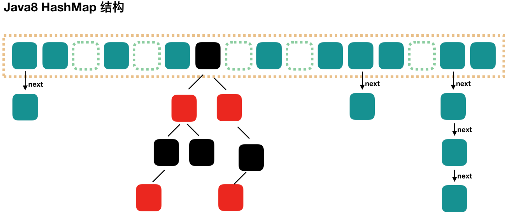

Java8对HashMap做了一些优化，最大的不同是使用了红黑树，因此是通过**数组 + 链表 + 红黑树**组成。

在JDK7 HashMap中，查找的时候，先根据key计算出Hash值定位到数组的位置，然后遍历链表中元素，时间复杂度为O(n)。

`为了降低这一部分的时间开销，在Java8中，当链表的元素个数达到8个时，会将链表转化为红黑树，这些位置上的查找的时间复杂度将降低为O(logN)`。



上面的图知识为了描述数据结构，不会达到图中所示的状态，因为在此之前已经扩容了。下面通过源码进行分析。

Java7 中使用Entry来代表每个HashMap中的数据节点，Java8中使用Node，基本上没有区别，都是使用key、value、hash、next这4个属性。

只不过Node只能用于链表，红黑树的情况时使用TreeNode。

#### put过程分析

```java
public V put(K key, V value) {
    return putVal(hash(key), key, value, false, true);
}


final V putVal(int hash, K key, V value, boolean onlyIfAbsent, boolean evict) {
    Node<K,V>[] tab; Node<K,V> p; int n, i;
    // 第一次 put 值的时候，会触发下面的 resize()，类似 java7 的第一次 put 也要初始化数组长度
    // 第一次 resize 和后续的扩容有些不一样，因为这次是数组从null初始化到默认的16，或自定义的初始容量
    if ((tab = table) == null || (n = tab.length) == 0){
        n = (tab = resize()).length;
    }
    
    // 找到具体的数组下标，如果此位置没有值，那么直接初始化一下Node并放置在这个位置就可以了
    if ((p = tab[i = (n - 1) & hash]) == null){
        tab[i] = newNode(hash, key, value, null);
    } else {// 数组该位置有数据
        Node<K,V> e; K k;
        // 首先，判断该位置的第一个数据和我们要插入的数据，key 是不是"相等"，如果是，取出这个节点
        if (p.hash == hash && ((k = p.key) == key || (key != null && key.equals(k)))){
            e = p;
        } else if (p instanceof TreeNode){ //如果该节点是代表红黑树的节点，调用红黑树的插值方法
            e = ((TreeNode<K,V>)p).putTreeVal(this, tab, hash, key, value);
        } else { //到这里，说明数组该位置上是一个链表
            for (int binCount = 0; ; ++binCount) {
                // 插入到链表的最后面(Java7是插入到链表的最前面)
                if ((e = p.next) == null) {
                    p.next = newNode(hash, key, value, null);
                    //TREEIFY_THRESHOLD为8,如果新插入的值是链表中的第8个会触发下面的 treeifyBin，即将链表转换为红黑树
                    if (binCount >= TREEIFY_THRESHOLD - 1){
                        treeifyBin(tab, hash);
                    }
                    break;
                }
                // 如果在该链表中找到了"相等"的 key(== 或 equals)
                if (e.hash == hash && ((k = e.key) == key || (key != null && key.equals(k))))
                    // 此时 break，那么 e 为链表中[与要插入的新值的 key "相等"]的 node
                    break;
                p = e;
            }
        }
        // e!=null 说明存在旧值的key与要插入的key"相等"，下面其实就是进行 "值覆盖"，然后返回旧值
        if (e != null) {
            V oldValue = e.value;
            if (!onlyIfAbsent || oldValue == null){
                e.value = value;
            }
            afterNodeAccess(e);
            return oldValue;
        }
    }
    ++modCount;
    // 如果 HashMap 由于新插入这个值导致size已经超过了阈值，需要进行扩容
    if (++size > threshold){
        resize();
    }
    afterinsertion(evict);
    return null;
}
```

和 Java7 稍微有点不一样的地方就是，Java7 是先扩容后插入新值的，Java8 先插值再扩容。

#### 数组扩容

resize()方法用于初始化数组或者扩容，每次扩容后，容量为原来的2倍，扩容过程会进行数据迁移。

```java
final Node<K,V>[] resize() {
    Node<K,V>[] oldTab = table;
    int oldCap = (oldTab == null) ? 0 : oldTab.length;
    int oldThr = threshold;
    int newCap, newThr = 0;
    if (oldCap > 0) {		// 对应数组扩容
        if (oldCap >= MAXIMUM_CAPACITY) {
            threshold = Integer.MAX_VALUE;
            return oldTab;
        }
        // 将数组大小扩大一倍
        else if ((newCap = oldCap << 1) < MAXIMUM_CAPACITY && oldCap >= DEFAULT_INITIAL_CAPACITY){
            newThr = oldThr << 1; //将阈值扩大一倍
        }
    } else if (oldThr > 0){ //对应使用new HashMap(int initialCapacity)初始化后，第一次put的时候
        newCap = oldThr;
    } else {				//对应使用new HashMap() 初始化后，第一次put的时候
        newCap = DEFAULT_INITIAL_CAPACITY;
        newThr = (int)(DEFAULT_LOAD_FACTOR * DEFAULT_INITIAL_CAPACITY);
    }

    if (newThr == 0) {
        float ft = (float) newCap * loadFactor;
        newThr = (newCap < MAXIMUM_CAPACITY && ft < (float)MAXIMUM_CAPACITY ? (int)ft : Integer.MAX_VALUE);
    }
    threshold = newThr;

    
    Node<K,V>[] newTab = (Node<K,V>[])new Node[newCap]; // 创建新数组
    table = newTab; // 如果是初始化数组，到这里就结束了，返回 newTab 即可

    if (oldTab != null) {
        // 开始遍历原数组，进行数据迁移。
        for (int j = 0; j < oldCap; ++j) {
            Node<K,V> e;
            if ((e = oldTab[j]) != null) {
                oldTab[j] = null;
                // 如果该数组位置上只有单个元素，那就简单了，简单迁移这个元素就可以了
                if (e.next == null)
                    newTab[e.hash & (newCap - 1)] = e;
                // 如果是红黑树，具体我们就不展开了
                else if (e instanceof TreeNode)
                    ((TreeNode<K,V>)e).split(this, newTab, j, oldCap);
                else { 
                    // 这块是处理链表的情况，
                    // 需要将此链表拆成两个链表，放到新的数组中，并且保留原来的先后顺序
                    // loHead、loTail 对应一条链表，hiHead、hiTail 对应另一条链表，代码还是比较简单的
                    Node<K,V> loHead = null, loTail = null;
                    Node<K,V> hiHead = null, hiTail = null;
                    Node<K,V> next;
                    do {
                        next = e.next;
                        if ((e.hash & oldCap) == 0) {
                            if (loTail == null)
                                loHead = e;
                            else
                                loTail.next = e;
                            loTail = e;
                        }
                        else {
                            if (hiTail == null)
                                hiHead = e;
                            else
                                hiTail.next = e;
                            hiTail = e;
                        }
                    } while ((e = next) != null);
                    if (loTail != null) {
                        loTail.next = null;
                        // 第一条链表
                        newTab[j] = loHead;
                    }
                    if (hiTail != null) {
                        hiTail.next = null;
                        // 第二条链表的新的位置是 j + oldCap，这个很好理解
                        newTab[j + oldCap] = hiHead;
                    }
                }
            }
        }
    }
    return newTab;
}
```

#### get过程分析

相对put来说，get过程很简单，就如下几步：

1. 计算 key 的 hash 值，根据 hash 值找到对应数组下标: hash & (length-1)
2. 判断数组该位置处的元素是否刚好就是我们要找的，如果不是，走第三步
3. 判断该元素类型是否是 TreeNode，如果是，用红黑树的方法取数据，如果不是，走第四步
4. 遍历链表，直到找到相等(==或equals)的 key。

```java
public V get(Object key) {
    Node<K,V> e;
    return (e = getNode(hash(key), key)) == null ? null : e.value;
}

final Node<K,V> getNode(int hash, Object key) {
    Node<K,V>[] tab; Node<K,V> first, e; int n; K k;
    if ((tab = table) != null && (n = tab.length) > 0 &&
        (first = tab[(n - 1) & hash]) != null) {
        // 判断第一个节点是不是就是需要的
        if (first.hash == hash && // always check first node
            ((k = first.key) == key || (key != null && key.equals(k))))
            return first;
        if ((e = first.next) != null) {
            // 判断是否是红黑树
            if (first instanceof TreeNode)
                return ((TreeNode<K,V>)first).getTreeNode(hash, key);

            // 链表遍历
            do {
                if (e.hash == hash &&
                    ((k = e.key) == key || (key != null && key.equals(k))))
                    return e;
            } while ((e = e.next) != null);
        }
    }
    return null;
}
```


