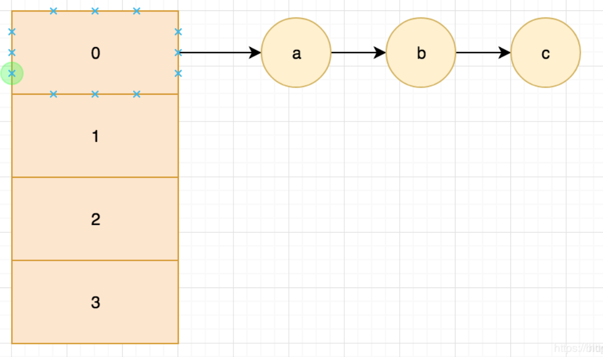
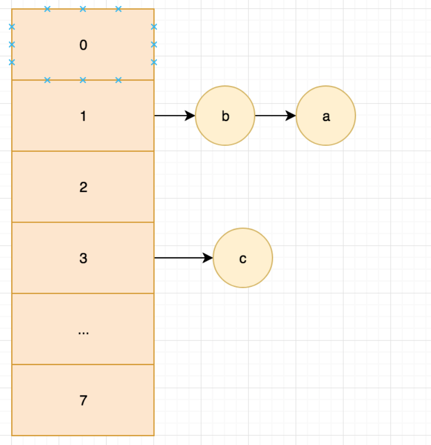
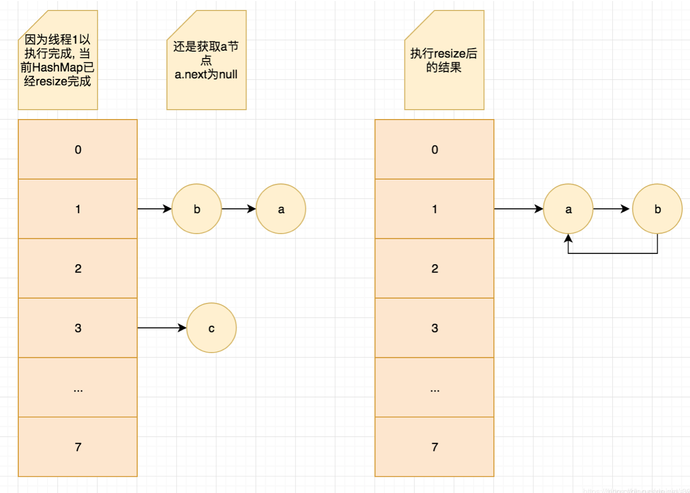
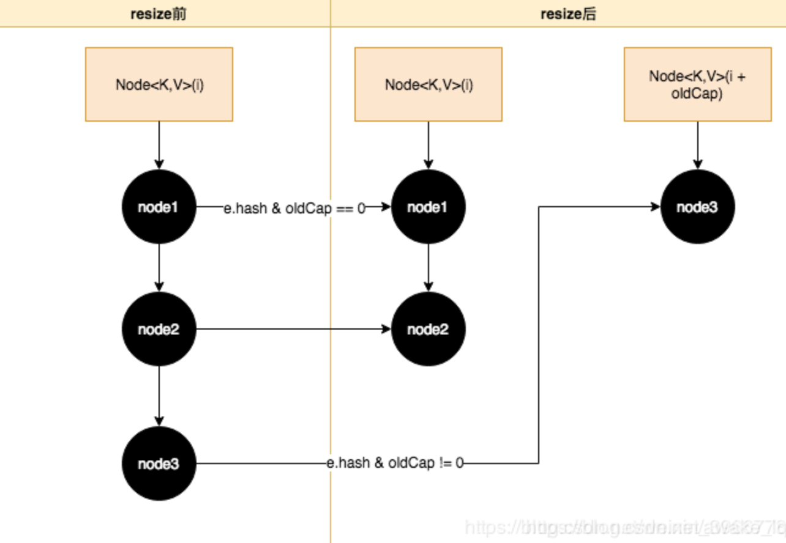

### 1、HashMap的数据结构？

- JDK1.8之前采用数组+链表的结构，遇到哈希冲突的时候采用链表结构解决。
- JDK1.8之后采用数组+链表+红黑树，当bucket中元素个数小于8个时采用链表，大于8个时采用红黑树。

### 2、HashMap的数组长度为什么是2的次方？

HashMap的初始容量和扩容都是以2的次方来进行的，那么length-1换算成二进制的话肯定所有位都为1，就比如2的3次方为8，length-1的二进制表示就是111， 而按位与计算的原则是两位同时为“1”，结果才为“1”，否则为“0”。所以h& (length-1)运算从数值上来讲其实等价于对length取模，也就是h%length。hash%length==hash&(length-1)的前提是length是2的n次方。

### 3、如果想要使用线程安全的HashMap如何做？

- Collections的synchronizedMap()方法使HashMap具有同步的能力

    ```java
    Map map = Collections.synchronizedMap(new HashMap());
    ```

- 使用ConcurrentHashMap

- 使用HashTable（不允许null作为key和value，但是支持同步，任何时候只能有一个线程在写）

### 4、JDK1.7和JDK1.8扩容方法有什么不同，做了什么改进？

```java
    final Node<K,V>[] resize() {
        Node<K,V>[] oldTab = table;
        int oldCap = (oldTab == null) ? 0 : oldTab.length;
        int oldThr = threshold;
        int newCap, newThr = 0;
        if (oldCap > 0) {
            if (oldCap >= MAXIMUM_CAPACITY) {
                threshold = Integer.MAX_VALUE;
                return oldTab;
            }
            else if ((newCap = oldCap << 1) < MAXIMUM_CAPACITY && oldCap >= DEFAULT_INITIAL_CAPACITY)
                newThr = oldThr << 1;
        }
        else if (oldThr > 0)
            newCap = oldThr;
        else {
            newCap = DEFAULT_INITIAL_CAPACITY;
            newThr = (int)(DEFAULT_LOAD_FACTOR * DEFAULT_INITIAL_CAPACITY);
        }
        if (newThr == 0) {
            float ft = (float)newCap * loadFactor;
            newThr = (newCap < MAXIMUM_CAPACITY && ft < (float)MAXIMUM_CAPACITY ? (int)ft : Integer.MAX_VALUE);
        }
        threshold = newThr;
        Node<K,V>[] newTab = (Node<K,V>[])new Node[newCap];
        table = newTab;
        if (oldTab != null) {
            for (int j = 0; j < oldCap; ++j) {
                Node<K,V> e;
                if ((e = oldTab[j]) != null) {
                    oldTab[j] = null;
                    if (e.next == null)
                        newTab[e.hash & (newCap - 1)] = e;
                    else if (e instanceof TreeNode)
                        ((TreeNode<K,V>)e).split(this, newTab, j, oldCap);
                    else { // preserve order
                        Node<K,V> loHead = null, loTail = null;
                        Node<K,V> hiHead = null, hiTail = null;
                        Node<K,V> next;
                        do {
                            next = e.next;
                          //通过(e.hash & oldCap) == 0来判断是否需要移位，如果为真则在原位不动, 
                            if ((e.hash & oldCap) == 0) {
                              //尾插法
                                if (loTail == null)
                                    loHead = e;
                                else
                                    loTail.next = e;
                                loTail = e;
                            }
                            else {
                              //尾插法
                                if (hiTail == null)
                                    hiHead = e;
                                else
                                    hiTail.next = e;
                                hiTail = e;
                            }
                        } while ((e = next) != null);
                        if (loTail != null) {
                            loTail.next = null;
                            newTab[j] = loHead;
                        }
                        if (hiTail != null) {
                         // 当前hash槽位 + oldCap的位置;
                            hiTail.next = null;
                            newTab[j + oldCap] = hiHead;
                        }
                    }
                }
            }
        }
        return newTab;
    }
```

不同之处在于：

- 1.8中的扩容方法内不再为每一个元素重新计算下标，而是分为两类，一类不需要计算直接用原来的下标，一类为原下标+原tables长度
- 1.8对于重新定位的代码做了优化

不同之处的分析：

（1）为何 e.hash & oldCap == 0为什么可以判断当前节点是否需要移位, 而不是再次计算hash？

```java
static int indexFor(int h, int length) { 
  	 //jdk1.7的源码，jdk1.8没有这个方法，但是实现原理一样的,在方法体中运用
     return h & (length-1);  //第三步 与运算
}
```

```java
//old：默认大小16的时候
26: 0001 1010
15: 0000 1111
 &: 0000 1010    
//new：扩容一倍之后
26: 0001 1010
31: 0001 1111
 &: 0001 1010
```

可以看出来，其实因为扩容一倍之后呢，`h & (length-1）`等于左边多了一位，所以如果oldcap获取的值根据原来来看是tables的长度即16，恰好就是多左边多出来的那位。0001 0000,所以 e.hash & oldCap == 0如果不是等于0 代表示它高位的第四位是为1，即它通过indexFor计算的下标会与原来的不同，所以可以判断出它是需要移位的。

```java
newTab[j + oldCap] = hiHead;
```

那为什么j + oldCap就是他的当前下标呢？原因很简单：j代表的是为扩容前的下表，而上述既然表现出它比为扩容多一位，那一位就恰恰好等于oldcap长度，这也是为什么hashmap扩容是扩两倍，都是环环相扣的。

（2）1.8对于节点重新定位做了优化？

```java
/**
 * JDK1.7 重新定位的代码
 */
void transfer(Entry[] newTable, boolean rehash) {
    int newCapacity = newTable.length;
    for (Entry<K,V> e : table) {
        while(null != e) {
            //导致闭合的重要原因，先获取了next，另一个线程如果先resize完，那么gg公司了，会导致闭合
            Entry<K,V> next = e.next;
            if (rehash) {
                e.hash = null == e.key ? 0 : hash(e.key);
            }
            //重新利用hash计算下标
            int i = indexFor(e.hash, newCapacity);
            //头插法
            e.next = newTable[i];
            newTable[i] = e;
            e = next;
        }
    }
}
```

上面的代码是JDK1.7中对于HashMap节点扩容时重新定位节点新位置的方法，由于HashMap是非线程安全的，最主要的原因是在resize的时候会形成环形链表, 然后导致get时死循环。



有两个线程需要插入第四个节点，这个时候HashMap就需要做resize了，先假设线程一已经resize完成, 而线程二必须等线程一完成再resize。



经过线程一resize后, 可以发现a b节点的顺序被反转了, 这时候我们来看线程二



.1 线程二的开始点是只获取到A节点, 还没获取他的next;
.2 这时候线程一resize完成, a.next = null; b.next = a; newTable[i] = b;
.3 线程二开始执行, 获取A节点的next节点, a.next = null;
.4 接着执行 a.next = newTable[i]; 因为这时候newTable[i]已经是B节点了, 并且b.next = a; 那么我们把newTablei赋值给a.next后, 就会线程a-b-a这样的环形链表了, 也就是上图的结果;
.5 因为第三步的a.next已经是null, 所以C节点就丢失了;
.6 那这时候来查位于1节点的数据D(其实不存在), 因为 d != a, 会接着查a.next, 也就是b; 但是b != d, 所以接着查b.next, 但是b.next还是a; 这就悲剧了, 在循环里出不去了;

这就是JDK7 resize最大的缺陷, resize会使同一桶的数据链表头尾倒置，而在多线程下这会导致会形成死循环;那么JDK8做了优化以后, 死循环的问题解除了吗?


通过上图我们发现JDK8的resize是让节点的顺序发生改变的, 也就是没有倒排问题了;也是假设有两个线程, 线程一已执行完成, 这时候线程二来执行:
.1 因为顺序没变, 所以node1.next还是node2, 只是node2.next从node3变成了null;
.2 而且JDK8是在遍历完所有节点之后, 才对形成的两个链表进行关联table的, 所以不会像JAVA7一般形成A-B-A问题了;
.3 但是如果并发了, JAVA的HashMap还是没有解决丢数据的问题, 但是不和JAVA7一般有数据倒排以及死循环的问题了;

HashMap设计时就是没有保证线程安全的, 所以在多线程环境请使用ConcurrentHashMap;

