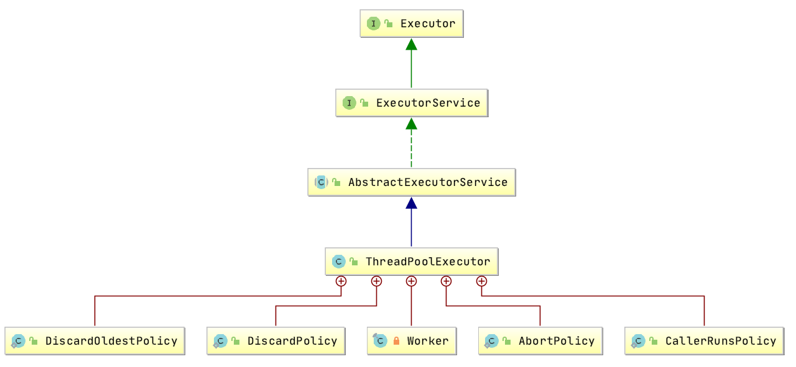
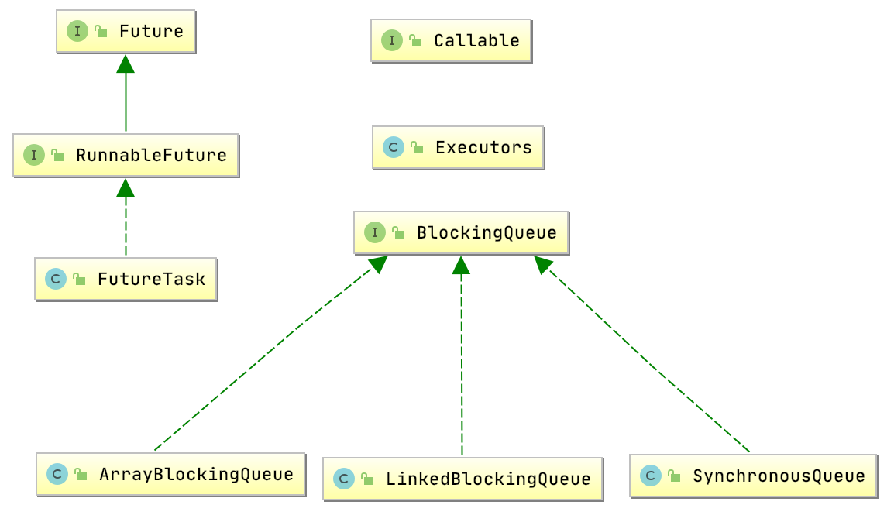
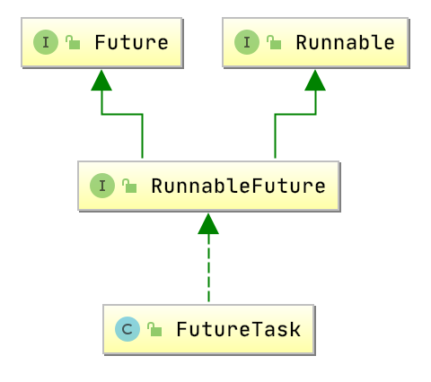
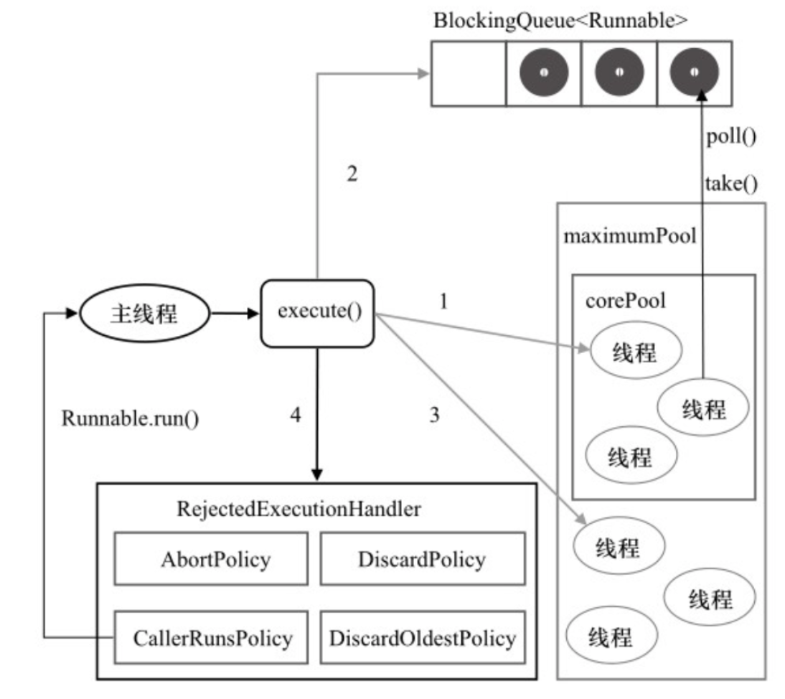

## 线程池类继承体系



- Executor：最顶层的接口，也是最简单的，就一个execute(Runnable runnable)接口方法定义。
- ExecutorService：也是接口，在Executor接口的基础上添加了很多接口方法，所以一般情况下，就是使用的这个接口
- AbstractExecutorService：抽象类，这里提供了很多非常有用的方法供子类直接使用。
- ThreadPoolExecutor：线程池实现类，核心重点

- 线程池的实现还涉及到了如下的类。由于线程池支持获取线程执行结果，所以引入了Future接口，RunnableFuture接口继承了它，最重要的是其实现类FutureTask。``线程池的使用过程是往线程池中提交任务（Task），提交的任务是实现了Runnable接口，实际上是将Runnable的任务包装成了FutureTask，然后再提交到线程池中。``FutureTask类就是一个任务（Task），具有Future接口语义，即可以在将来获取执行结果。

    

- 线程池中BlockingQueue也是非常重要，当线程池的线程数量大于corePoolSize，每个任务都会提交到任务队列，等待线程池中线程来获取并执行。BlockingQueue在不同使用场景中有对应不同的实现。

## Executor接口

```java
public interface Executor {
	//提交任务
    void execute(Runnable command);
}
```

Doug Lea在这个接口的源码注释中做了一些概述如下：一般使用线程的方式

```java
new Thread(new Runnable(){
  // do something
}).start();
```

使用线程池之后的用法

```java
Executor executor = anExecutor;
executor.execute(new RunnableTask1());
executor.execute(new RunnableTask2());
```

如果希望线程池同步执行每一个任务，可以这么实现接口

```java
class DirectExecutor implements Executor {
    public void execute(Runnable r) {
        r.run();// 这里不是用的new Thread(r).start()，也就是说没有启动任何一个新的线程。
    }
}
```

如果希望每个任务提交进来之后，都直接启动一个新线程来执行这个任务的话，可以这么实现：

```java
class ThreadPerTaskExecutor implements Executor {
    public void execute(Runnable r) {
        new Thread(r).start();  // 每个任务都用一个新的线程来执行
    }
}
```

如果希望组合执行器Executor来使用，是将所有任务添加到一个queue中，然后从queue取出任务，交给真正执行器执行

```java
class SerialExecutor implements Executor {
   final Queue<Runnable> tasks = new ArrayDeque<Runnable>();//任务队列
   final Executor executor;									//真正的执行器
   Runnable active;											//当前正在执行的任务
   //初始化的时候，传入执行器
   SerialExecutor(Executor executor) {
     this.executor = executor;
   }
    
   //添加任务到线程池，将任务添加到任务队列，scheduleNext触发执行器去任务队列获取任务	
   public synchronized void execute(final Runnable r) {
     tasks.offer(new Runnable() {
       public void run() {
         try {
           r.run();
         } finally {
           scheduleNext();
         }
       }
     });
     if (active == null) {
       scheduleNext();
     }
   }
   	
   protected synchronized void scheduleNext() {
     if ((active = tasks.poll()) != null) {
       //具体的执行操作，由执行器执行  
       executor.execute(active);
     }
   }
 }
```

Executor 这个接口只有提交任务功能，太简单了，想要更丰富的功能，比如想获取执行结果、想知道当前线程池有多少个线程活着、已经完成了多少任务等等，这些都是这个接口的不足的地方。接下来我们要介绍的是继承自 `Executor` 接口的 `ExecutorService` 接口，这个接口提供了比较丰富的功能，也是我们最常使用到的接口。

## ExecutorService接口

这个接口一般情况下都可以满足大部分需要，因此一般使用线程池的时候往往都是使用如下的方式：

```java
ExecutorService executor = Executors.newFixedThreadPool(args...);
ExecutorService executor = Executors.newCachedThreadPool(args...);
```

接口的定义

```java
public interface ExecutorService extends Executor {
	//关闭线程池，已提交的任务继续执行，不再接受新提交任务
    void shutdown();
	//关闭线程池，尝试关闭正在执行的线程，不再接受新任务
    List<Runnable> shutdownNow();
	//线程池是否已关闭
    boolean isShutdown();
	//线程池是否关闭。必须在调用shutdown或shutdownNow方法之后调用，所有任务结束了才会返回true
    boolean isTerminated();
	//等待所有任务完成，并设置超时时间。实际应用中先调用shutdown或shutdownNow，再调它等待所有线程真正完成，返回值表示有没有超时
    boolean awaitTermination(long timeout, TimeUnit unit) throws InterruptedException;
    //提交任务
    <T> Future<T> submit(Callable<T> task);
	//提交任务
    <T> Future<T> submit(Runnable task, T result);
	//提交任务
    Future<?> submit(Runnable task);
	//执行所有任务，返回Future类型的列表
    <T> List<Future<T>> invokeAll(Collection<? extends Callable<T>> tasks) throws InterruptedException;
	//执行所有任务，返回Future类型的列表，可以设置超时功能
    <T> List<Future<T>> invokeAll(Collection<? extends Callable<T>> tasks,long timeout, TimeUnit unit);
	//只要其中一个任务执行了，就可以返回，并返回那个任务的结果
    <T> T invokeAny(Collection<? extends Callable<T>> tasks) throws InterruptedException, ExecutionException;
	//只要其中一个任务执行了，就可以返回，并返回那个任务的结果，可以设置超时功能
    <T> T invokeAny(Collection<? extends Callable<T>> tasks,long timeout, TimeUnit unit);
}

```

## FutureTask任务类



FutureTask由RunnableFuture间接实现了Runnable接口，所以Runnable通常都会包装成FutureTask，再调用executor.execute()提交给线程池。

Runnable 的 void run() 方法是没有返回值的，所以如果需要返回值的话，会在 submit 中指定第二个参数作为返回值。

```java
<T> Future<T> submit(Runnable task, T result);
```

其实到时候可以通过将task，result这两个参数包装成 Callable。它和 Runnable 的区别在于 run() 没有返回值，而 Callable 的 call() 方法有返回值，同时，如果运行出现异常，call() 方法会抛出异常。

```java
public interface Callable<V> {
    V call() throws Exception;
}
```

## AbstractExecutorService抽象类

AbstractExecutorService是ExecutorService的抽象实现。实现了几个实用的方法，提供给子类调用。这个抽象类实现了 invokeAny 方法和 invokeAll 方法，这里的两个 newTaskFor 方法也比较有用，用于将任务包装成 FutureTask。定义于最上层接口 Executor中的 `void execute(Runnable command)` 由于不需要获取结果，不会进行 FutureTask 的包装。`需要获取结果（FutureTask），用 submit 方法，不需要获取结果，可以用 execute 方法。`

- submit()：提交任务
- invokeAny()：执行任务
- invokeAll()：执行任务
- newTaskFor()：用于将Runnable或Callable任务包装成FutureTask类型的任务

## ThreadPoolExecutor线程池类

ThreadPoolExecutor是线程池的JDK具体实现，实现了各个方法（任务提交、线程管理、监控等方法）

#### 1、提交任务的方法

```java
public Future<?> submit(Runnable task) {
    if (task == null) throw new NullPointerException();
    RunnableFuture<Void> ftask = newTaskFor(task, null);
    execute(ftask);
    return ftask;
}
public <T> Future<T> submit(Runnable task, T result) {
    if (task == null) throw new NullPointerException();
    RunnableFuture<T> ftask = newTaskFor(task, result);
    execute(ftask);
    return ftask;
}
public <T> Future<T> submit(Callable<T> task) {
    if (task == null) throw new NullPointerException();
    RunnableFuture<T> ftask = newTaskFor(task);
    execute(ftask);
    return ftask;
}
```

submit方法中提交任务，任务的逻辑就指的是Runnable的run()或Callable中call()方法中的业务逻辑。

#### 2、创建线程池的方法

经常会通过Executors工具类来创建线程池，只需要提供参数就行，不需要关注具体实现

```java
public static ExecutorService newFixedThreadPool(int nThreads) {
    return new ThreadPoolExecutor(nThreads, nThreads,
                                  0L, TimeUnit.MILLISECONDS,
                                  new LinkedBlockingQueue<Runnable>());
}
public static ExecutorService newCachedThreadPool() {
    return new ThreadPoolExecutor(0, Integer.MAX_VALUE,
                                  60L, TimeUnit.SECONDS,
                                  new SynchronousQueue<Runnable>());
}
```

最终都会导向到线程池的构造方法

```java
public ThreadPoolExecutor(int corePoolSize,
                              int maximumPoolSize,
                              long keepAliveTime,
                              TimeUnit unit,
                              BlockingQueue<Runnable> workQueue,
                              ThreadFactory threadFactory,
                              RejectedExecutionHandler handler) {
    	//参数检查
        if (corePoolSize < 0 || maximumPoolSize <= 0 || maximumPoolSize < corePoolSize || keepAliveTime < 0){
            throw new IllegalArgumentException();
        }
        if (workQueue == null || threadFactory == null || handler == null){
            throw new NullPointerException();
        }
    	//参数初始化
        this.corePoolSize = corePoolSize;
        this.maximumPoolSize = maximumPoolSize;
        this.workQueue = workQueue;
        this.keepAliveTime = unit.toNanos(keepAliveTime);
        this.threadFactory = threadFactory;
        this.handler = handler;
    }
```

可以看到线程池中几个重要的属性参数

- **corePoolSize**：核心线程数
- **maximunPoolSize**：最大线程数，线程池允许创建的最大线程数
- **workQueue**：任务队列，BlockingQueue接口的某个具体实现，常用的是ArrayBlockingQueue和LinkedBlockingQueue。
- **keepAliveTime**：空闲线程的存活时间。如果某个线程空闲时间超过这个时间都没有任务来执行，线程就会被关闭。这个值不会对所有线程都起作用，如果线程池中线程数少于核心线程数，这些核心线程也不会因为空闲而被关闭，但可以通过allowCoreThreadTimeout(true)进行配置。
- **threadFactory**：用于创建线程。
- **handler**：当线程池已满时，对新提交的任务应该采取的处理策略。

#### 3、状态控制参数

Doug Lea采用了一个32位的整数来存放线程池的状态和当前线程池中线程数。其中`高3位存放线程池状态，低29位存线程个数`。Java语言在整数编码上统一使用补码。下面是简单的移位和布尔操作。

```java
private final AtomicInteger ctl = new AtomicInteger(ctlOf(RUNNING, 0));
private static final int COUNT_BITS = Integer.SIZE - 3;		//用来表示线程池数量的位数，Integer.size =32，即29
private static final int CAPACITY   = (1 << COUNT_BITS) - 1;//线程池中线程的最大个数 2^29 - 1

//线程池有5种状态，所以至少需要3位来表示，取高3位，表示线程池运行状态
private static final int RUNNING    = -1 << COUNT_BITS;
private static final int SHUTDOWN   =  0 << COUNT_BITS;
private static final int STOP       =  1 << COUNT_BITS;
private static final int TIDYING    =  2 << COUNT_BITS;
private static final int TERMINATED =  3 << COUNT_BITS;

private static int runStateOf(int c)     { return c & ~CAPACITY; }
private static int workerCountOf(int c)  { return c & CAPACITY; }
private static int ctlOf(int rs, int wc) { return rs | wc; }
```

##### 3.1、线程池最大容量

线程池最大数量的计算

```java
private static final int CAPACITY   = (1 << COUNT_BITS) - 1;
```

从代码中看出，1需要向左移动29位，再减去1，那么向左移动29位是怎么计算 ？

```
1 << COUNT_BITS -1 的计算过程
（1）000 00000 00000000 00000000 00000001	//1的32位2进制
（2）001 00000 00000000 00000000 00000000	//左移29位的话
（3）000 11111 11111111 11111111 11111111 //再进行减1，也就是说线程池的最大数量是 2^29 - 1
```

##### 3.2、运行状态

```java
//正数的反码，补码都是一样的，计算机里存储的是补码
private static final int RUNNING    = -1 << COUNT_BITS;
private static final int SHUTDOWN 	=  0 << COUNT_BITS;
private static final int STOP 		=  1 << COUNT_BITS;
private static final int TIDYING    =  2 << COUNT_BITS;
private static final int TERMINATED =  3 << COUNT_BITS;
```

- **RUNNING：可以接受新任务并且处理已经在阻塞队列中的任务**。高3位全部是1的话，就是RUNNING。

    ```java
    -1 << COUNT_BITS  //这里是-1往左移29位，稍微有点不一样，-1的话需要我们自己算出补码来
    
    100 00000 00000000 00000000 00000001	//-1的原码
    111 11111 11111111 11111111 11111110	//-1的反码，负数的反码是将原码除符号位以外全部取反
    111 11111 11111111 11111111 11111111	//-1的补码，负数的补码就是将反码+1
    111 00000 00000000 00000000 00000000	//关键了，往左移29位，所以高3位全是1就是RUNNING状态
    ```

- **SHUTDOWN：不接受新任务，但是会处理已经在任务队列中的任务**。高3位全是0的时候就是SHUTDOWN。

    ```java
    0 << COUNT_BITS
    00000000 00000000 00000000 00000000	//0的表示
    00000000 00000000 00000000 00000000	//往左移29位
    ```

- **STOP：不接受新任务，也不处理任务队列已有任务，并且会中断正在处理的线程**。高3位001。

    ```java
    1 << COUNT_BITS
    00000000 00000000 00000000 00000001	//1的表示
    00100000 00000000 00000000 00000000	//往左移29位
    ```

- **TIDYING：所有任务都被中止，workCount为0，线程状态转化为TIDYING，并且条用terminaled()回调方法**。高3位是010。

    ```java
    2 << COUNT_BITS
    00000000 00000000 00000000 00000010	//2的32位2进制
    01000000 00000000 00000000 00000000	//往左移29位
    ```

- **TERMINALED：terminaled()方法调用完成，线程池状态就变成了这个**

    ```java
    3 << COUNT_BITS
    00000000 00000000 00000000 00000011	//3的32位2进制
    11000000 00000000 00000000 00000000	//往左移29位
    ```

##### 3.3、状态相关方法

- runStateOf(int c) ：线程池状态

    ```java
    private static int runStateOf(int c){ 
        return c & ~CAPACITY;
    }
    ```

    ```java
    ~CAPACITY
    ~ 是按位取反的意思
    & 是按位与的意思
    
    而CAPACITY是，高位3个0，低29位都是1，所以是
    000 11111 11111111 11111111 11111111
    
    取反的话就是
    111 00000 00000000 00000000 00000000
    传进来的c参数与取反的CAPACITY进行按位与操作
    1、低位29个0进行按位与，还是29个0
    2、高位3个1，即保持c参数的高3位
    既高位保持原样，低29位都是0，这也就获得了线程池的运行状态runState
    ```

- workerCountOf(int c)：线程池当前有效的线程数量

    ```java
    private static int workerCountOf(int c){ 
        return c & CAPACITY;
    }
    ```

    ```java
    CAPACITY的32位2进制是
    000 11111 11111111 11111111 11111111
    用入参c跟CAPACITY进行按位与操作
    1、低29位都是1，所以保留c的低29位，也就是有效线程数
    2、高3位都是0，所以c的高3位也是0
    这样获取出来的便是workerCount的值
    ```

- ctlOf(int rs, int wc)：原子整型变量ctl的初始化方法

    ```java
    //结合这几句代码来看
    private static final int RUNNING    = -1 << COUNT_BITS;
    private final AtomicInteger ctl = new AtomicInteger(ctlOf(RUNNING, 0));
    private static int ctlOf(int rs, int wc){ return rs | wc; }
    ```

    ```java
    ctlOf是将rs和wc进行按位或的操作，初始化的时候是将RUNNING和0进行按位或
    111 00000 00000000 00000000 00000000 //RUNNING
    000 00000 00000000 00000000 00000000 //0的32位2进制是
    111 00000 00000000 00000000 00000000 //经过计算，初始化时的ctl
    ```

##### 3.4、状态转化

- RUNNING --> SHUTDOWN：调用了shutdown方法之后，会发生这个状态转化
- RUNNING OR SHUTDOWN --> STOP：当调用了shutdownNow方法会发生这个状态转化
- SHUTDOWN -> TIDYING：当任务队列和线程池都清空后
- STOP -> TIDYING：当任务队列清空后，发生这个转换
- TIDYING -> TERMINATED：当 terminated() 方法结束后

**RUNNING 定义为 -1，SHUTDOWN 定义为 0，其他都比 0 大，所以等于 0 时不能提交任务，大于 0 的话，连正在执行的任务也需要中断。**

#### 4、工作线程Worker

Doug Lea把线程池中线程封装成一个Worker，即做任务的线程。**任务是Runnable，线程是Worker**。

```java
private final class Worker extends AbstractQueuedSynchronizer implements Runnable {

    final Thread thread;			//真正执行任务的线程
    Runnable firstTask;				//线程需要执行的第一个任务，线程创建后直接从这里拿第一个要执行的任务，或者从队列中获取
    volatile long completedTasks;	//存放当前线程已经执行完的任务个数，使用volatile保证保存可见性
    Worker(Runnable firstTask) { 	//只有这一个构造函数，传入firstTask，也可以传null
        setState(-1); 
        this.firstTask = firstTask;
        this.thread = getThreadFactory().newThread(this);	//通过线程工厂创建一个线程
    }

    public void run() {
        runWorker(this);
    }
	//下面几个方法都是AQS独占锁来获取线程的执行权
    protected boolean isHeldExclusively() {
        return getState() != 0;
    }

    protected boolean tryAcquire(int unused) {
        if (compareAndSetState(0, 1)) {
            setExclusiveOwnerThread(Thread.currentThread());
            return true;
        }
        return false;
    }

    protected boolean tryRelease(int unused) {
        setExclusiveOwnerThread(null);
        setState(0);
        return true;
    }
    public void lock()        { acquire(1); }
    public boolean tryLock()  { return tryAcquire(1); }
    public void unlock()      { release(1); }
    public boolean isLocked() { return isHeldExclusively(); }
    void interruptIfStarted() {
        Thread t;
        if (getState() >= 0 && (t = thread) != null && !t.isInterrupted()) {
            try {
                t.interrupt();
            } catch (SecurityException ignore) {
            }
        }
    }
}
```

#### 5、核心方法execute()

执行流程如图所示



```java
public void execute(Runnable command) {
    if (command == null){
        throw new NullPointerException();
    }
    //控制变量，包含了线程池运行状态和线程池已有线程个数
    int c = ctl.get();
    //如果当前线程个数小于核心线程数，直接添加一个worker来执行任务（workerCountOf获取当前池中已有线程个数）
    if (workerCountOf(c) < corePoolSize) {
        //创建新线程并把当前任务command作为firstTask来执行。执行的结果会包装在FutureTask中，返回false表示线程池不允许提交任务
        if (addWorker(command, true)){
            return;
        }
        c = ctl.get();	//此处代表addWorker失败了，重新获取线程池的运行状态
    }
    
    //此处表示当前线程数大于核心线程个数了，如果运行状态是RUNNABLE，就将任务添加到任务队列中
    if (isRunning(c) && workQueue.offer(command)) {
        int recheck = ctl.get();
        //如果线程池不处于运行状态，就从队列中移除刚刚添加的那个任务
        if (! isRunning(recheck) && remove(command)){
            reject(command);
        } else if (workerCountOf(recheck) == 0){ //考虑到任务提交到队列中了，但是线程都关闭了
            addWorker(null, false);
        }
    }
    //如果任务队列也满了，那么进入到这个分支。添加任务失败，就执行拒绝策略
    else if (!addWorker(command, false)){
        reject(command);
    } 
}
```

创建线程的方法

```java
/**
 * 创建工作线程
 * firstTask：准备提交的任务，可以为null
 * core：确定创建线程的个数边界标记
 *	（1）true：使用corePoolSize作为创建线程的界限：少于corePoolSize，创建线程；队列未满时，任务添加到队列，否则就创建非核心线程
 * 	（2）false：使用最大线程数maximumPoolSize作为创建线程的界限，少于maximunPoolSize时，都会创建线程，否则就将任务添加到队列
 */
private boolean addWorker(Runnable firstTask, boolean core) {
    retry: //外层循环标记
    for (;;) {
        int c = ctl.get();
        int rs = runStateOf(c);

        /*
         * 当线程池状态大于 SHUTDOWN，其实也就是 STOP, TIDYING, 或 TERMINATED，即下面的不允许创建线程并会返回false，表示创建失败。
         * 当线程池状态处于 SHUTDOWN，不允许提交任务，但是已有的任务继续执行
         * 当线程池状态大于 SHUTDOWN，不允许提交任务，且中断正在执行的任务
         * 如果线程池状态为 SHUTDOWN，但是 firstTask 为 null，且 workQueue 非空，那么是允许创建worker的
         * SHUTDOWN的语义：不允许提交新的任务，但要把已进入到队列的任务执行完，所以在满足条件的基础上，是允许创建新的Worker的
         */
        if (rs >= SHUTDOWN && !(rs == SHUTDOWN && firstTask == null && !workQueue.isEmpty())){
             return false;
        }

        for (;;) {
            //工作线程个数
            int wc = workerCountOf(c);
            //创建线程的个数边界。
            //超过线程池线程数最大容量数、或大于边界个数都是不允许创建线程，直接返回false，即表示创建失败。
            if (wc >= CAPACITY || wc >= (core ? corePoolSize : maximumPoolSize)){
                return false;
            }
            //执行到此处，表示创建线程的前提条件已经满足了，使用CAS操作更新线程池的线程数变量，直到成功为止。
            if (compareAndIncrementWorkerCount(c)){
                break retry;
            }
            //由于处于并发环境，重新获取状态；在并发场景下，如果线程池的状态发生变化，就重新再操作一把
            c = ctl.get();
            if (runStateOf(c) != rs){
                continue retry;
            }
        }
    }
	
    /*
     * 执行到此处，线程池线程数也已更新，创建线程的前提条件已经具备。开始创建线程来执行任务
     */
    boolean workerStarted = false;	//worker 是否已经启动
    boolean workerAdded = false;	//是否已将这个worker添加到workers这个HashSet 中
    Worker w = null;
    try {
        w = new Worker(firstTask); //创建worker对象，构造方法里通过线程工厂ThreadFactory创建了一个线程对象
        final Thread t = w.thread; //获取worker中新的线程对象引用
        if (t != null) {
            //获取线程池的“全局锁”，以此保证安全地创建线程
            final ReentrantLock mainLock = this.mainLock;
            mainLock.lock();
            try {
                int rs = runStateOf(ctl.get());
				//如果小于SHUTDOWN，即RUNNABLE是最正常的场景；如果是SHUTDIWN，那不会接受新任务，但会继续将任务队列的任务执行完毕
                if (rs < SHUTDOWN || (rs == SHUTDOWN && firstTask == null)) {
                    //判断一下，新线程不能是已经启动的状态，否则下面会有问题
                    if (t.isAlive()){
                        throw new IllegalThreadStateException();
                    }
                    //将线程添加到线程池的集合中
                    workers.add(w);
                    int s = workers.size();
                    //largestPoolSize用来记录线程池中线程个数曾经达到的最大值
                    if (s > largestPoolSize){
                        largestPoolSize = s;
                    }
                    workerAdded = true;
                }
            } finally {
                mainLock.unlock();
            }
            //线程池里添加线程成功，然后启动线程来执行任务
            if (workerAdded) {
                t.start();
                workerStarted = true;
            }
        }
    } finally {
        //如果没有线程启动失败，做一些清理工作。比如workCount减1，从队列删除这个有问题线程等
        if (! workerStarted){
            addWorkerFailed(w);
        }
    }
    //返回线程启动是否成功的结果
    return workerStarted;
}
```

线程启动失败时的清理工作

```java
private void addWorkerFailed(Worker w) {
    final ReentrantLock mainLock = this.mainLock;
    mainLock.lock();
    try {
        if (w != null){
            workers.remove(w);
        }
        decrementWorkerCount();
        tryTerminate();
    } finally {
        mainLock.unlock();
    }
}
```

worker线程start后，其run方法会调用runWorker方法

```java
// 工作线程Worker类的实现了Runnable接口，它的run() 方法如下
public void run() {
    runWorker(this);
}

/*
 * worker工作线程执行任务
 * worker工作线程启动后，在whlie循环里面不断地从任务队列中获取任务来执行
 * 上面已经提到，worker初始化的时候，可以不指定firstTask，那么第一个任务就可以从任务队列中获取
 */
final void runWorker(Worker w) {
    Thread wt = Thread.currentThread();
    //如果第一个任务存在的话
    Runnable task = w.firstTask;
    w.firstTask = null;
    //线程可以响应中断
    w.unlock();
    boolean completedAbruptly = true;
    try {
        //循环调用getTask()方法获取任务
        while (task != null || (task = getTask()) != null) {
            w.lock();
            //如果线程池状态大于等于STOP，线程也要中断
            if ((runStateAtLeast(ctl.get(), STOP) ||(Thread.interrupted() && runStateAtLeast(ctl.get(), STOP))) &&
                !wt.isInterrupted()){
                wt.interrupt();
            }
            
            try {
                //这是一个回调方法入口，是留给需要的子类实现的
                beforeExecute(wt, task);
                Throwable thrown = null;
                try {
                    //真正地开始执行任务
                    task.run();
                } catch (RuntimeException x) {
                    thrown = x; throw x;
                } catch (Error x) {
                    thrown = x; throw x;
                } catch (Throwable x) {
                    //这里不允许抛出异常，所以转为Error
                    thrown = x; throw new Error(x);
                } finally {
                    //也是一个回调方法，将task和异常作为参数，是留给子类实现，在需要的时候用
                    afterExecute(task, thrown);
                }
            } finally {
                //任务置为空，准备获取下一个任务
                task = null;
                //当前线程执行成功的任务个数
                w.completedTasks++;
                //释放worker的独占锁
                w.unlock();
            }
        }
        completedAbruptly = false;
    } finally {
        //如果执行到这里，需要执行线程关闭
        //1. 说明 getTask 返回 null，也就是说，队列中已经没有任务需要执行了，执行关闭。getTask已经执行了workCount减1的操作
        //2. 任务执行过程中发生了异常。workCount没有减1，因此需要在processWorkerExit中处理
        processWorkerExit(w, completedAbruptly);
    }
}
```

看一下getTask中如何获取任务

```java
/**
 * 获取任务，执行情况有3种可能：
 * 1.阻塞直到获取到任务后返回。默认corePoolSize之内的线程是不会被回收的，核心线程一直在等待
 * 2.超时退出。keepAliveTime 起作用的时候，也就是如果这么多时间内都没有任务，那么应该执行关闭
 * 3.如果发生了以下条件，此方法必须返回 null:
 *   3.1 如果发生了以下条件，此方法必须返回 null:	
 *   3.2 线程池处于 SHUTDOWN，而且 workQueue 是空的，前面说了，这种不再接受新的任务
 *   3.3 线程池处于 STOP，不仅不接受新的线程，连任务队列中的线程也不再执行
 */
private Runnable getTask() {
    boolean timedOut = false;
    for (;;) {
        int c = ctl.get();
        int rs = runStateOf(c);
		//rs == SHUTDOWN && workQueue.isEmpty() 或者 rs >= STOP
        if (rs >= SHUTDOWN && (rs >= STOP || workQueue.isEmpty())) {
            decrementWorkerCount();//CAS 操作，减少工作线程数
            return null;
        }
        
        int wc = workerCountOf(c);
        //允许核心线程数内的线程回收，或当前线程数超过了核心线程数，那么有可能发生超时关闭
        boolean timed = allowCoreThreadTimeOut || wc > corePoolSize;
		//如果当前线程数 wc > maximumPoolSize，或者超时，都返回 null
        //wc > maximumPoolSize 的情况？返回 null 意味着关闭线程。
        //有可能开发者调用了 setMaximumPoolSize() 将线程池的 maximumPoolSize 调小了，那么多余的 Worker 就需要被关闭
        if ((wc > maximumPoolSize || (timed && timedOut)) && (wc > 1 || workQueue.isEmpty())) {
            //CAS操作减少线程个数
            if (compareAndDecrementWorkerCount(c)){
                return null;
            }
            continue;
        }

        try {
            //从队列中获取任务
            Runnable r = timed ? workQueue.poll(keepAliveTime, TimeUnit.NANOSECONDS) : workQueue.take();
            if (r != null){
                return r;
            }
            timedOut = true;
        } catch (InterruptedException retry) {
            timedOut = false;
        }
    }
}
```

#### 6、饱和策略

查看execute()核心方法，最后一步是当线程个数达到最大限制且任务队列已满的时候，就是根据饱和策略处理新提交的任务。

```java
final void reject(Runnable command) {
    // 执行拒绝策略
    handler.rejectedExecution(command, this);
}
```

JDK预定义了4种：

- **AbortPolicy：抛出RejectedExecutionHandler异常**（缺省策略）
- **DiscardPolicy：直接忽略任务**
- **CallerRunsPolicy：使用提交任务的线程来执行此任务**
- **DiscardOldestPolicy：将队列中等待最久的任务删除，然后提交此任务**

handler是由ThreadPoolExecutor构造方法初始化的时候传入进来的，它是RejectedExecutionHandler的实例。RejectedExecutionHandler已经在ThreadPoolExecutor中定义了4个，当然也可以根据需要自行定义，只要实现RejectedExecutorHandler接口。

```java
// 只要线程池没有被关闭，那么由提交任务的线程自己来执行这个任务。
public static class CallerRunsPolicy implements RejectedExecutionHandler {
    public CallerRunsPolicy() { }
    public void rejectedExecution(Runnable r, ThreadPoolExecutor e) {
        if (!e.isShutdown()) {
            r.run();
        }
    }
}

// 不管怎样，直接抛出 RejectedExecutionException 异常(默认的策略，构造线程池的时候，不传入就是默认这个策略)
public static class AbortPolicy implements RejectedExecutionHandler {
    public AbortPolicy() { }
    public void rejectedExecution(Runnable r, ThreadPoolExecutor e) {
        throw new RejectedExecutionException("Task " + r.toString() +" rejected from " + e.toString());
    }
}

// 不做任何处理，直接忽略掉这个任务
public static class DiscardPolicy implements RejectedExecutionHandler {
    public DiscardPolicy() { }
    public void rejectedExecution(Runnable r, ThreadPoolExecutor e) {
    }
}

// 这个相对霸道一点，如果线程池没有被关闭的话，
// 把队列队头的任务(也就是等待了最长时间的)直接扔掉，然后提交这个任务到等待队列中
public static class DiscardOldestPolicy implements RejectedExecutionHandler {
    public DiscardOldestPolicy() { }
    public void rejectedExecution(Runnable r, ThreadPoolExecutor e) {
        if (!e.isShutdown()) {
            e.getQueue().poll();
            e.execute(r);
        }
    }
}
```

## Executors工具类

 Executors 这个类，因为它仅仅是工具类，它的所有方法都是 static 的。

- 生成一个固定大小的线程池

    ```java
    public static ExecutorService newFixedThreadPool(int nThreads) {
        return new ThreadPoolExecutor(nThreads, 
                                      nThreads,
                                      0L,
                                      TimeUnit.MILLISECONDS, 
                                      new LinkedBlockingQueue<Runnable>());
    }
    ```

    最大线程数和核心线程数相等，此时keepAliveTime设置为0，这里它是没有用的，因为线程池默认不会回收corePoolSize内的线程，采用LinkedBlockingQueue，无界队列。

- 生成只有一个线程的固定线程池

    ```java
    //只需要将线程数设置为1即可
    public static ExecutorService newSingleThreadExecutor() {
        return new FinalizableDelegatedExecutorService(new ThreadPoolExecutor(
            										   1, 
            										   1,
                                    				   0L, 
                                                       TimeUnit.MILLISECONDS,
                                    				   new LinkedBlockingQueue<Runnable>()));
    }
    ```

- 生成一个需要的时候就创建新线程，同时可以复用空闲线程的线程池

    ```java
    public static ExecutorService newCachedThreadPool() {
        return new ThreadPoolExecutor(0, 
                                      Integer.MAX_VALUE,
                                      60L, 
                                      TimeUnit.SECONDS,
                                      new SynchronousQueue<Runnable>());
    }
    ```

    核心线程数为0，最大个数为Integer.MAX_VALUE，keepAliveTime为60秒，任务队列采用SynchronousQueue。

    这种线程池对于任务可以比较快速完成的场景有比较好的性能。如果线程空闲了60秒都没有任务，那么将关闭线程并且从线程池移除。

## 线程池的关闭

- shutdown()：原理是将线程池的状态设置为SHUTDOWN，然后中断所有没有正在执行的任务的线程

- shutdownNow()：原理是遍历线程池中所有线程，然后逐个调用线程的interrupt()方法来中断线程，所以无法响应中断的任务可能永远无法终止。shutdownNow()首先会将线程池状态更新为STOP，然后尝试停止所有线程。

    通常使用shutdown()来关闭线程，如果任务不一定要执行完，就可以使用shutdownNow()。

## 总结

- Java线程池有哪些关键属性？

    corePoolSize，maximumPoolSize，workQueue，keepAliveTime，rejectedExecutionHandler

    1. corePoolSize 到 maximumPoolSize 之间的线程会被回收，当然 corePoolSize 的线程设置allowCoreThreadTimeOut(true)得到回收。
    2. workQueue 用于存放任务，当当前线程数大于corePoolSize，将向队列中添加任务，线程池中的线程会负责到队列中拉取任务。
    3. keepAliveTime用于设置空闲时间，如果线程数超出了 corePoolSize，并且有些线程的空闲时间超过了这个值，会关闭这些线程。
    4. rejectedExecutionHandler用于处理当线程池不能执行此任务时的情况，默认有**抛出 RejectedExecutionException 异常**、**忽略任务**、**使用提交任务的线程来执行此任务**和**将队列中等待最久的任务删除，然后提交此任务**这四种策略，默认为抛出异常。

- 说说线程池中的线程创建时机？

    - 如果当前线程数少于 corePoolSize，那么提交任务的时候创建一个新的线程，并由这个线程执行这个任务；

    - 如果当前线程数已经达到 corePoolSize，那么将提交的任务添加到队列中，等待线程池中的线程去队列中取任务；

    - 如果队列已满，那么创建新的线程来执行任务，需要保证池中的线程数不会超过 maximumPoolSize，如果此时线程数超过了 maximumPoolSize，那么执行拒绝策略。

        注意：如果将队列设置为无界队列，那么线程数达到 corePoolSize 后，其实线程数就不会再增长了。因为后面的任务直接往队列塞就行了，此时 maximumPoolSize 参数就没有什么意义。

- 任务执行过程中发生异常怎么处理？

    如果某个任务执行出现异常，那么执行任务的线程会被关闭，而不是继续接收其他任务。然后会启动一个新的线程来代替它。

- 什么时候会执行拒绝策略？

    - workers 的数量达到了 corePoolSize（任务此时需要进入任务队列），任务入队成功，与此同时线程池被关闭了，而且关闭线程池并没有将这个任务出队，那么执行拒绝策略。这里说的是非常边界的问题，入队和关闭线程池并发执行，读者仔细看看 execute 方法是怎么进到第一个 reject(command) 里面的。
    - workers 的数量大于等于 corePoolSize，将任务加入到任务队列，可是队列满了，任务入队失败，那么准备开启新的线程，可是线程数已经达到 maximumPoolSize，那么执行拒绝策略。

