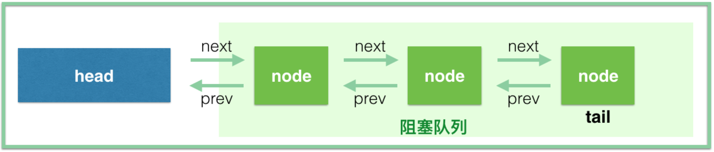
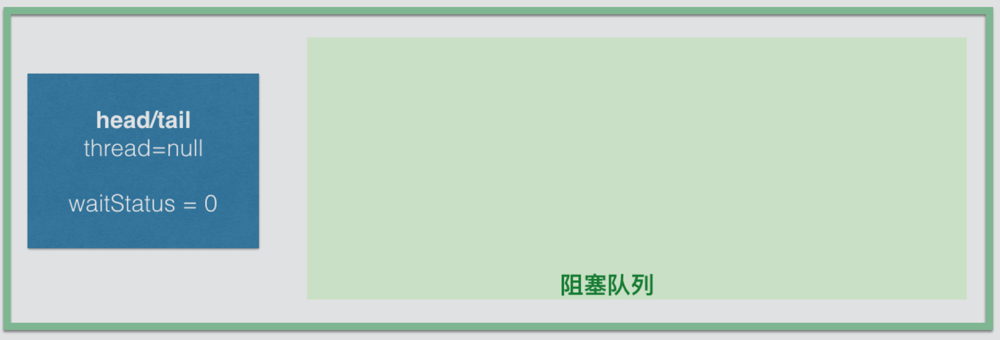
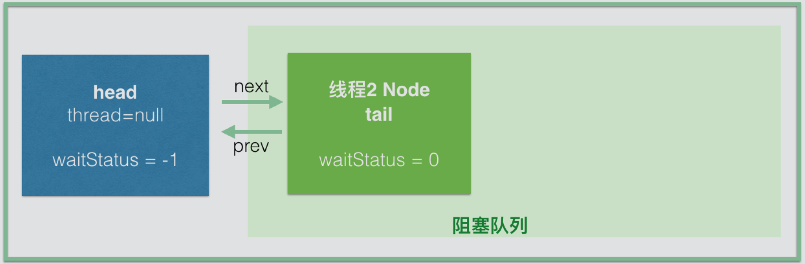
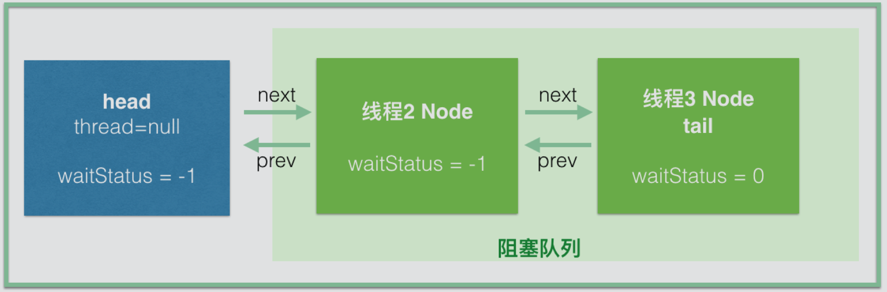

> - `AbstractQueueSynchronizer`同步器内部使用了一个FIFO队列，`为构建锁或其他同步组件提供了基础框架`，简称为AQS。
>
> - AQS是Java并发包的基础工具类，是构建ReentrantLock、CountDownLatch、Semaphore、FutureTask等工具的基础组件。

## AQS结构

先看一下AQS的属性

```java
// 头节点，可以直接把它当做当前持有锁的线程
private transient volatile Node head;
// 阻塞的尾节点，每个新的节点进来，都插入到最后，也就形成了一个链表
private transient volatile Node tail;
// 同步状态，代表当前锁的状态，0：没有被占用，大于0：有线程持有当前锁
private volatile int state;
// 代表当前持有独占锁的线程
private transient Thread exclusiveOwnerThread; 
```

同步器中维护的等待队列示意图如下，之后分析中的queue，不包含head



等待队列中每个节点都被封装成一个Node，Node的定义

```java
   static final class Node {
        static final Node SHARED = new Node();	//标识当前节点在共享模式下
        static final Node EXCLUSIVE = null;		//标识当前节点在独占模式下

        static final int CANCELLED =  1; //线程被取消
        static final int SIGNAL    = -1; //当前节点的后继节点需要被唤醒
        static final int CONDITION = -2; //当前节点的线程等待Condition
        static final int PROPAGATE = -3; //

        volatile int waitStatus;//等待状态
        volatile Node prev;		//前置节点引用
        volatile Node next;		//后继节点引用
        volatile Thread thread;	//当前节点关联的线程的引用
        Node nextWaiter;		//condition等待队列中后继节点的引用

        /** 当前节点是否是共享模式 */
        final boolean isShared() {
            return nextWaiter == SHARED;
        }

        /** 当前节点的前置节点 */
        final Node predecessor() throws NullPointerException {
            Node p = prev;
            if (p == null)
                throw new NullPointerException();
            else
                return p;
        }

        Node() {
        }
        Node(Thread thread, Node mode) {
            this.nextWaiter = mode;
            this.thread = thread;
        }
        Node(Thread thread, int waitStatus) {
            this.waitStatus = waitStatus;
            this.thread = thread;
        }
    }
```

下面以ReentrantLock为入口，逐步分析AQS。

```java
// 日常开发中的service案例
public class OrderService {
    // 使用static，这样每个线程拿到的是同一把锁。
    private static ReentrantLock reentrantLock = new ReentrantLock(true);
    public void createOrder() {
        // 比如我们同一时间，只允许一个线程创建订单；lock 之后紧跟着 try 语句
        reentrantLock.lock();
        try {
            //这块代码区域同一时间只能有一个线程进来(拿到锁的线程)，
            //其他线程在lock()方法上阻塞，等待获取到锁，再进来
        } finally {
            // 释放锁
            reentrantLock.unlock();
        }
    }
}
```

ReentrantLock类中通过内部类Sync来实现锁的机制，所以真正的获取锁和释放锁都是通过Sync来控制的。

```java
abstract static class Sync extends AbstractQueuedSynchronizer {
    // ...
}

abstract static class NofairSync extends AbstractQueuedSynchronizer {
	// ...
}
```

Sync抽象类有两个实现，分别是NofairSync和FairSync，ReentrantLock默认情况下是非公平锁。

```java
public ReentrantLock(boolean fair) {
    sync = fair ? new FairSync() : new NonfairSync();
}
```

## 线程抢锁

下面以FairSync为例，跟着源代码分析

```java
static final class FairSync extends Sync {
    private static final long serialVersionUID = -3000897897090466540L;
	/** 争锁 */
    final void lock() {
        acquire(1);
    }
	
    /** 从AQS继承，获取锁 */
    public final void acquire(int arg) {
        //1、tryAcquire先尝试获取锁，如果能获取成功，就直接返回，不用后续放入队列等操作
        //2、addWaiter将当前线程构建成节点加入同步队列中。Node.EXCLUSIVE即独占模式节点
        //3、acquireQueued 线程挂起，然后被唤醒的操作都在这个方法中
        if (!tryAcquire(arg) && acquireQueued(addWaiter(Node.EXCLUSIVE), arg)){
            selfInterrupt();
        }
    }
    
    /**
     * 尝试获取锁
     * 有2种成功获取锁的可能：锁没有被占用、当前线程已经持有锁
     */
    protected final boolean tryAcquire(int acquires) {
        final Thread current = Thread.currentThread();
        int c = getState();
        // 1、判断锁有没有被其他线程占有
        if (c == 0) {
            //公平锁这里hasQueuedPredecessors()方法先判断当前节点有没有前驱节点
            //没有前驱节点说明此刻没有线程持有锁，就可以尝试获取锁
            if (!hasQueuedPredecessors() && compareAndSetState(0, acquires)) {
                //拿到了锁，将当前线程设置为锁的拥有者
				setExclusiveOwnerThread(current);
                return true;
            }
        } 
        // 2、如果是当前线程再次获取锁的操作，锁状态增加acquire(默认都是增加1)
        else if (current == getExclusiveOwnerThread()) {
            int nextc = c + acquires;
            if (nextc < 0) throw new Error("Maximum lock count exceeded");
            setState(nextc);
            return true;
        }
        return false;
    }
    
    /**
     * 将当前线程构建成节点，然后通过CAS操作添加到同步队列尾部
     */
    private Node addWaiter(Node mode) {
        //waitStatus是int，因此Node()新节点的waitStatus=0
        Node node = new Node(Thread.currentThread(), mode);
        Node pred = tail;
        //tail!=null表示队列不为空的情况（可以先尝试CAS设置尾节点操作一把）
        if (pred != null) {
            node.prev = pred;
            //没有其他线程并发设置的时候，CAS操作成功则立即返回当前节点
            //如果有其他线程也在入队设置，CAS可能失败，在下面enq方法中自旋入队
            if (compareAndSetTail(pred, node)) {
                pred.next = node;
                return node;
            }
        }
        
        //代码执行到此处有2种可能
        //（1）队列是空的
        //（2）第一次尝试CAS设置尾节点的操作失败
        enq(node);
        return node;
    }
    
    /**
     * 采用自旋的方式将节点添加入队
     * 进入这个方法的2种情景：队列为空、有其他线程竞争入队
     * 自旋的意思是： CAS原子操作设置添加尾节点的时候，不断尝试操作，直到成功为止
     */
    private Node enq(final Node node) {
        for (;;) {
            Node t = tail;
            //1、队列为空的情景
            if (t == null) {
                //此刻可能有其他线程也进来了，CAS方式进行首次初始化队列操作
                if (compareAndSetHead(new Node())){
                    // 初始化队列完成，head节点的waitStatus=0
                    // Node()创建对象时，int类型的waitStatus设置了默认0
                    // 这里没有return，因此下一次循环将进入下面的分支
                    tail = head;
                }
            }
            //2、与其他线程竞争操作，并发设置尾节点
            else {
                node.prev = t;
                if (compareAndSetTail(t, node)) {
                    t.next = node;
                    return t;
                }
            }
        }
    }
    
    /**
     * 当前节点已经入队，线程被阻塞，直到被前驱节点唤醒
     * 自旋过程做了两件事：
     * 1、判断如果当前节点是队列首节点并且尝试获取锁成功，就结束自旋返回
     * 2、如果当前线程节点不是队列首节点，就检查是否线程的中断状态
     * 注意：阻塞线程是在当前线程入队后使用LockSupport.park()方法；
     *      唤醒线程是由前驱节点通过LockSupport.unpark(Thread t)方法“精准唤醒”的。
     */
    final boolean acquireQueued(final Node node, int arg) {
        boolean failed = true;
        try {
            boolean interrupted = false;
            for (;;) {
                //获取当前线程对应的节点的前置节点
                final Node p = node.predecessor();
                // 如果当前节点是队列的第一个节点，尝试获取锁
                if (p == head && tryAcquire(arg)) {
                    setHead(node);
                    p.next = null; // 断开引用，等待GC回收
                    failed = false;
                    return interrupted;
                }
                
                if (shouldParkAfterFailedAcquire(p,node) && parkAndCheckInterrupt()){
                    interrupted = true;
                } 
            }
        } finally {
            // tryAcquire()方法抛出异常的时候，failed为true
            if (failed)
                cancelAcquire(node);
        }
    }
    
    /**
     * 判断当前节点的线程是否需要被阻塞
     * pred：前置节点
     * node：当前节点
     */
    private static boolean shouldParkAfterFailedAcquire(Node pred, Node node) {
        int ws = pred.waitStatus;
        //前置节点的状态为-1，即前置节点正常，当前节点的"线程被阻塞，等待被唤醒"
        if (ws == Node.SIGNAL){
            return true;
        }
        //前置节点同步状态大于0，即CANCELLED，说明前置节点线程取消了“等待获取锁的操作”
        //需要说明的是阻塞队列中的线程会被挂起，而唤醒操作是由前置节点完成的，这个是非常关键的一点！！！
        if (ws > 0) {
            //下面循环是将当前节点prev指向 waitStatus< 0的节点。
            //为了找一个好老大，因为还要依赖好老大唤醒它，向前遍历找到“正常状态节点”为止
            do {
                node.prev = pred = pred.prev;
            } while (pred.waitStatus > 0);
            pred.next = node;
        } else {
            // 节点创建并入队时，节点的waitStatus=0
            // 通过CAS操作将前置节点的waitStatus设置为Node.SIGNAL（即-1）
            compareAndSetWaitStatus(pred, ws, Node.SIGNAL);
        }
        //返回false，则会在acquireQueued()方法循环中再次进入当前方法
        return false;
    }
    
    /**
     * 阻塞当前线程
     * 当shouldParkAfterFailedAcquire返回true，也就是需要挂起当前线程的时候调用
     */
    private final boolean parkAndCheckInterrupt() {
        //阻塞当前线程，然后停在这里，等待被唤醒
        //唤醒是由它的前驱节点释放锁方法时，在unparkSuccessor方法中通过LockSupport.unpark(t)方法，“明确指定”地唤醒它
        LockSupport.park(this);
        return Thread.interrupted();
    }
    
}
```

## 解锁操作

正常情况下，如果线程获取到锁，线程会被`LockSupport.park(this)`方法挂起，等待被唤醒

```java
public void unlock() {
    //代理给了Sync的release()方法去处理
    sync.release(1);
}

/**
 * Sync的release()方法
 */
public final boolean release(int arg) {
    if (tryRelease(arg)) {
        Node h = head;
        if (h != null && h.waitStatus != 0)
            unparkSuccessor(h);
        return true;
    }
    return false;
}

/**
 * FairSync覆写了Sync的treRelease()方法
 */
protected final boolean tryRelease(int releases) {
    int c = getState() - releases;
    // 只有占有锁的线程才能释放锁，否则就抛出异常；
    if (Thread.currentThread() != getExclusiveOwnerThread()){
        throw new IllegalMonitorStateException();
    }
    
    boolean free = false;
    // 重入锁的重入计数如果为0，表示释放完毕了，否则还不能释放掉
    if (c == 0) {
        free = true;
        setExclusiveOwnerThread(null);
    }
    //更新锁的同步状态
    setState(c);
    return free;
}

/**
 * 唤醒后继节点的线程
 * 由release()方法中知道，node是head节点
 */
private void unparkSuccessor(Node node) {
    int ws = node.waitStatus;
    //如果head节点的waitStatus<0，更新其为0
    if (ws < 0){
        compareAndSetWaitStatus(node, ws, 0);
    }
    //接下来处理后继节点。当后继节点为空或者后继节点线程取消等待(waitStatus=1)
    Node s = node.next;
    if (s == null || s.waitStatus > 0) {
        s = null;
        //遍历找到阻塞队列中第一个处于待唤醒状态的节点，后续就会唤醒它
        for (Node t = tail; t != null && t != node; t = t.prev){
            //waitStatus：0,-1,-2
            if (t.waitStatus <= 0){
                s = t;
            } 
        }
    }
    // LockSupport.unpark()唤醒阻塞队列中等待状态的第一个节点中的线程
    if (s != null){
        LockSupport.unpark(s.thread);
    }
}

/**
 * 唤醒线程之后，被唤醒的线程将从这个阻塞时的这个方法这里继续向下走
 */
private final boolean parkAndCheckInterrupt() {
    //进入阻塞队列的时候，被阻塞在这里了
    LockSupport.park(this); 
    //Thread.interrupted()用于判断是否发生了中断，同时这句代码也会清除中断状态
    return Thread.interrupted();
}

/**
 * FairSync的selfInterrupt方法，该方法中唤醒线程
 */
static void selfInterrupt() {
    Thread.currentThread().interrupt();
}
```

## 总结

在并发情况下，加锁和解锁需要3个部件的协助：

- 锁状态：通过state这个状态变量用来判断锁是不是被线程占有了。为0的时候表示没有线程占有锁，可以争抢这个锁；用CAS操作设置为1，设置成功就表示抢锁成功，这样其他线程就不能获取了，如果锁可以重入的话，state加1就行了，释放锁就是减1，直到state为0，表示完全释放了锁，因此`lock()和unlock()调用次数必须匹配`，然后唤醒后继节点的线程，让其来占有锁。
- 线程的阻塞和唤醒：AQS采用了LockSupport.park(thread)来挂起线程，unpark()来唤醒线程。
- 阻塞队列：因为争抢锁的线程可能很多，但只能有一个线程拿到锁，其他线程必须都必须等待。这时候需要一个queue来管理这些线程，AQS通过FIFO队列来控制，就是一个双向链表。每个Node节点维护了前置后继节点的链接。

## 示意图解析

首先，第一个线程调用 reentrantLock.lock()，翻到最前面可以发现，tryAcquire(1) 直接就返回 true 了，结束。只是设置了 state=1，连 head 都没有初始化，更谈不上什么阻塞队列了。要是线程 1 调用 unlock() 了，才有线程 2 来，那世界太美好了，完全没有交集嘛，那我还要 AQS 干嘛。如果线程 1 没有调用 unlock() 之前，线程 2 调用了 lock(), 想想会发生什么？线程 2 会初始化 head (即new Node( ))，同时线程 2 也会插入到阻塞队列并挂起 (注意看这里是一个 for 循环，而且设置 head 和 tail 的部分是不 return 的，只有入队成功才会跳出循环)

```java
private Node enq(final Node node) {
    for (;;) {
        Node t = tail;
        if (t == null) {
            if (compareAndSetHead(new Node()))
                tail = head;
        } else {
            node.prev = t;
            if (compareAndSetTail(t, node)) {
                t.next = node;
                return t;
            }
        }
    }
}
```

首先，是线程2初始化 head 节点，此时 head、tail、waitStatus=0



然后线程2入队



同时我们也要看此时节点的 waitStatus，由于 head 节点是线程 2 初始化的，此时的 waitStatus 没有设置， java 默认会设置为 0，但是到 shouldParkAfterFailedAcquire 这个方法的时候，线程 2 会把前驱节点，也就是 head 的waitStatus设置为 -1。那线程 2 节点此时的 waitStatus 是多少呢，由于没有设置，所以是 0；如果线程 3 此时再进来，直接插到线程 2 的后面就可以了，此时线程 3 的 waitStatus 是 0，到 shouldParkAfterFailedAcquire 方法的时候把前驱节点线程 2 的 waitStatus 设置为 -1。



这里可以简单说下 waitStatus 中 SIGNAL(-1) 状态的意思，Doug Lea 注释的是：代表后继节点需要被唤醒。也就是说这个 waitStatus 其实代表的不是自己的状态，而是后继节点的状态，我们知道，每个 node 在入队的时候，都会把前驱节点的状态改为 SIGNAL，然后阻塞，等待被前驱唤醒。

