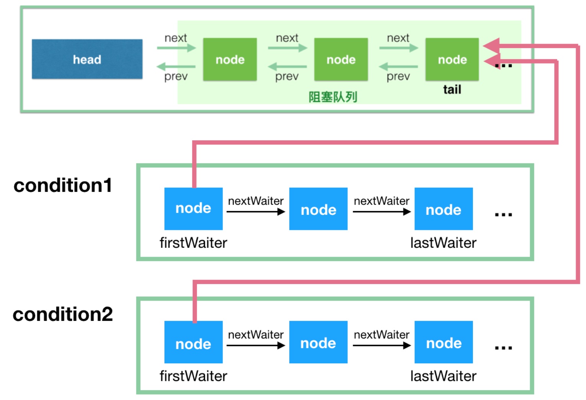

### Condition概述

通常Condition经常可以用在生产者-消费者的场景中，先看一下Doug Lea给出的例子

```java
import java.util.concurrent.locks.Condition;
import java.util.concurrent.locks.Lock;
import java.util.concurrent.locks.ReentrantLock;
class BoundedBuffer {
    final Lock lock = new ReentrantLock();
    //通过lock创建condition对象
    final Condition notFull = lock.newCondition();
    final Condition notEmpty = lock.newCondition();
    final Object[] items = new Object[100];
    int putptr, takeptr, count;
    
    // 生产
    public void put(Object x) throws InterruptedException {
        lock.lock();
        try {
            while (count == items.length){
                notFull.await();  // 队列已满，等待，直到 not full 才能继续生产
            }
            items[putptr] = x;
            if (++putptr == items.length) putptr = 0;
            ++count;
            notEmpty.signal();    // 生产成功，队列已经not empty了，发个通知出去
        } finally {
            lock.unlock();
        }
    }

    // 消费
    public Object take() throws InterruptedException {
        lock.lock();
        try {
            while (count == 0){
                notEmpty.await(); //队列为空，等待，直到队列not empty，才能继续消费
            }
            Object x = items[takeptr];
            if (++takeptr == items.length) takeptr = 0;
            --count;
            notFull.signal(); 	  //被我消费掉一个，队列not full了，发个通知出去
            return x;
        } finally {
            lock.unlock();
        }
    }
}
```

Condition提供了和Object中监视器wait()、notify() 或 notifyAll()方法类似的功能。

Condition是基于ReentrantLock的，而**ReentrantLock是基于AbstractQueuedSynchronizer实现的**。

Condition 是依赖于 ReentrantLock的，不管是调用 await 进入等待还是 signal 唤醒，**都必须获取到锁才能进行操作**。

每个 ReentrantLock  实例可以通过调用多次 newCondition 产生多个 ConditionObject 的实例

```java
final ConditionObject newCondition() {
    // 实例化一个 ConditionObject
    return new ConditionObject();
}
```

ConditionObject是Condition接口的实现类，它是AbstractQueuedSynchronizer的内部类。

```java
public class ConditionObject implements Condition, java.io.Serializable {
    private static final long serialVersionUID = 1173984872572414699L;
    private transient Node firstWaiter;	//条件队列的第一个节点
    private transient Node lastWaiter;	//条件队列的最后一个节点
    ......
}        
```

AQS中有一个阻塞队列，用于保存等待获取锁的线程的队列，准确的的说，应该叫`同步队列`。这里再引入一个概念，叫`条件队列`，



从图中可看出如下几点；

- 条件队列和同步队列的节点，都是Node类型。因为条件队列的节点是需要转移到同步队列中。
- ReentrantLock实例可以通过多次调用 newCondition() 来产生多个 Condition 实例，这里对应 condition1 和 condition2。而ConditionObject 只有两个属性 firstWaiter 和 lastWaiter。
- 每个 condition 有一个关联的`条件队列`，如线程 1 调用 `condition1.await()` 方法即可将当前线程 1 包装成 Node 后加入到条件队列中，然后阻塞在这里，不继续往下执行，条件队列是一个单向链表。
- 调用`condition1.signal()` 触发一次唤醒，此时唤醒的是队头，会将condition1 对应的**条件队列**的 firstWaiter（队头） 移到`塞队列的队尾`，等待获取锁，获取锁后 await 方法才能返回，继续往下执行

### 源码分析

#### 0、入口方法

```java
/**
  * 将当前线程构建成节点，加入等待队列
  * 这个方法会阻塞，直到调用了signal()或signalAll()方法，或者被中断	
  */
public final void await() throws InterruptedException {
    
    // 判断是否已经被中断，是则抛出异常
    if (Thread.interrupted()){
        throw new InterruptedException();
    }
    
    //1、将节点加入到条件队列中
    Node node = addConditionWaiter();
    
    //2、完全释放独占锁
    int savedState = fullyRelease(node);
    int interruptMode = 0;
    
    //3、循环自旋方式检测如果当前节点不在阻塞队列中，就将线程阻塞
    while (!isOnSyncQueue(node)) {
        //循环结束出口：1、isOnlyQueue()：判断节点是否在阻塞队列中 2、checkInterruptWhileWaiting(node) ：检查线程是否中断
        LockSupport.park(this);
        if ((interruptMode = checkInterruptWhileWaiting(node)) != 0)
            break;
    }
    
    //4、线程被唤醒之后，进入阻塞队列，等待获取锁
    if (acquireQueued(node, savedState) && interruptMode != THROW_IE){
        interruptMode = REINTERRUPT;
    }
    if (node.nextWaiter != null){
        unlinkCancelledWaiters();
    }
    if (interruptMode != 0){
        reportInterruptAfterWait(interruptMode);
    }   
}
```

#### 1、将节点加入到条件队列中

addConditionWaiter()方法是将节点加入到条件队列中，Condition的条件队列中的操作是线程安全的。

```java
/**
 * 将当前线程的节点加入到队列尾部
 */
private Node addConditionWaiter() {
    //获取条件队列最后一个节点
    Node t = lastWaiter;
    //如果条件队列中最后一个节点被取消了
    if (t != null && t.waitStatus != Node.CONDITION) {
        //这个方法会遍历队列，将被取消的节点清理出去
        unlinkCancelledWaiters();
        t = lastWaiter;
    }
    
    Node node = new Node(Thread.currentThread(), Node.CONDITION);
    if (t == null)
        firstWaiter = node;
    else
        t.nextWaiter = node;
    lastWaiter = node;
    return node;
}

/**
 * 遍历队列，从中清除被取消的节点
 */
private void unlinkCancelledWaiters() {
    Node t = firstWaiter;
    Node trail = null;
    while (t != null) {
        Node next = t.nextWaiter;
        //如果节点的状态不是Node.CONDITION，节点就是被取消的
        if (t.waitStatus != Node.CONDITION) {
            t.nextWaiter = null;
            if (trail == null)
                firstWaiter = next;
            else
                trail.nextWaiter = next;
            if (next == null)
                lastWaiter = trail;
        }
        else
            trail = t;
        t = next;
    }
}
```

#### 2、完全释放独占锁

在await()方法，节点入队了之后，要调用`int savedState = fullyRelease(node)`释放锁。这里完全释放独占锁，因为锁是可重入的。

```java
final int fullyRelease(Node node) {
    boolean failed = true;
    try {
        //因为是可重入锁，getState()返回值state也代表着当前线程拥有锁的个数，需要归零彻底释放完
        int savedState = getState();
        if (release(savedState)) {
            failed = false;
            return savedState;
        } else {
            throw new IllegalMonitorStateException();
        }
    } finally {
        //如果一个线程在没持有锁的情况下，就去调用了condition.await()方法，它能进入条件队列中
        //但是在上面的release()方法由于线程不持有锁，肯定会返回false，这样就会进入异常分支，进而进入finally
        //在finally中，节点的状态设置为取消，之后会被从队列中清除出去
        if (failed)
            node.waitStatus = Node.CANCELLED;
    }
}

/**
 * 释放指定个数的锁，然后调用unparkSuccessor方法唤醒后继节点
 */
public final boolean release(int arg) {
    if (tryRelease(arg)) {
        Node h = head;
        if (h != null && h.waitStatus != 0)
            unparkSuccessor(h);
        return true;
    }
    return false;
}

/**
 * 释放当前线程占有的锁，释放成功后返回true
 */
protected final boolean tryRelease(int releases) {
    int c = getState() - releases;
    if (Thread.currentThread() != getExclusiveOwnerThread())
        throw new IllegalMonitorStateException();
    boolean free = false;
    if (c == 0) {
        free = true;
        setExclusiveOwnerThread(null);
    }
    setState(c);
    return free;
}

/**
 * 唤醒队列中第一个等待中的线程
 * 由于线程可能被取消
 */
private void unparkSuccessor(Node node) {
    int ws = node.waitStatus;
    //如果head节点的waitStatus<0，更新其为0
    if (ws < 0){
        compareAndSetWaitStatus(node, ws, 0);
    }
	//接下来处理后继节点。当后继节点为空或者后继节点线程取消等待(waitStatus=1)
    Node s = node.next;
    if (s == null || s.waitStatus > 0) {
        s = null;
        //遍历找到阻塞队列中第一个处于待唤醒状态(waitStatus：0,-1,-2)的节点，后续就会唤醒它
        for (Node t = tail; t != null && t != node; t = t.prev)
            if (t.waitStatus <= 0){
                s = t;
            }
    }
    if (s != null){
        LockSupport.unpark(s.thread);
    }
}
```

#### 3、等待进入阻塞队列

释放掉锁以后，接下来是这段，这边会自旋，如果发现自己还没到阻塞队列，那么挂起，等待被转移到阻塞队列。

```java
while (!isOnSyncQueue(node)) {
    //节点不在同步队列上，线程挂起
    LockSupport.park(this);
    if ((interruptMode = checkInterruptWhileWaiting(node)) != 0){
        break;
    }
}
```

检查节点是否在队列上

```java
/**
 * 判断节点是否在同步队列上
 * 节点加入条件队列的时候设置了waitStatus = Node.CONDITION，signal的时候会将节点移动到同步队列
 * 节点移动到同步队列之后会设置waitStatus = 0
 */
final boolean isOnSyncQueue(Node node) {
    //有2种条件下，节点是不在阻塞队列上的
    //（1）等待状态是Node.CONDITION
    //（2）节点的prev为null，肯定没有在阻塞队列
    if (node.waitStatus == Node.CONDITION || node.prev == null){
        return false;
    }
    //如果节点的next引用不为空，说明在阻塞队列中
    if (node.next != null) {
        return true;
    }
    //继续遍历检测
    return findNodeFromTail(node);
}

/**
 * 在阻塞队列中从后向前遍历，如果找到就返回true
 */
private boolean findNodeFromTail(Node node) {
    Node t = tail;
    for (;;) {
        if (t == node)
            return true;
        if (t == null)
            return false;
        t = t.prev;
    }
}
```

回到前面的循环，isOnSyncQueue(node) 返回 false 的话，那么进到 `LockSupport.park(this);` 这里线程挂起，等待召唤。

#### 4、signal唤醒线程并转移节点

唤醒线程的操作通常由另一个线程操作，就像生产者-消费者模式中，如果线程因为等待消费而挂起，那么生产者生产一个东西之后，会调用signal()方法唤醒正在等待的线程去消费。

```java
public final void signal() {
    //当前线程中调用signal方法，必须是先获取到锁
    if (!isHeldExclusively()){
        throw new IllegalMonitorStateException();
    }
    //唤醒的时候，都是唤醒条件队列中首节点
    Node first = firstWaiter;
    if (first != null){
        doSignal(first);
    }
}

/**
 * 检查独占锁的持有者线程是不是当前线程
 */
protected final boolean isHeldExclusively() {
    return getExclusiveOwnerThread() == Thread.currentThread();
}

/**
 * 在条件队列中，从头到位遍历，找到第一个等待状态的节点（有些线程可能取消排队，有些可能还在等待排队中）
 */
private void doSignal(Node first) {
    do {
        if ( (firstWaiter = first.nextWaiter) == null){
            lastWaiter = null;
        }
        first.nextWaiter = null;
    } while (!transferForSignal(first) && (first = firstWaiter) != null);
}

/**
 * 将节点从条件队列移动到同步队列
 */
final boolean transferForSignal(Node node) {
    //CAS失败时，说明此node的waitStatus已不是Node.CONDITION，即线程已取消排队，这样就不需要移动了，直接返回；否则置为0
    if (!compareAndSetWaitStatus(node, Node.CONDITION, 0)){
        return false;
    }
    //自旋进入阻塞队列，添加到尾部
	Node p = enq(node);
    int ws = p.waitStatus;
    //ws>0 说明node在阻塞队列中的前置节点取消了等待锁，直接唤醒node对应的线程
    //ws<=0 compareAndSetWaitStatus()方法会被调用，节点入队后，需要把前置节点的状态更新为待唤醒(SIGNAL，即-1)
    if (ws > 0 || !compareAndSetWaitStatus(p, ws, Node.SIGNAL)){
        //如果前置节点取消或者CAS设置失败，会进入到这里唤醒线程
        LockSupport.unpark(node.thread);
    }
    return true;
}
```

#### 5、唤醒后检查中断的状态

上一步，signal()之后线程从条件队列移动到了同步队列中，之后就准备获取锁了。只要获取到了锁以后，继续向下执行。

```java
while (!isOnSyncQueue(node)) {
    //节点不在同步队列上，线程挂起
    LockSupport.park(this);
    
    /* 线程唤醒之后，将从这里继续向下执行，interruptMode中断状态的值有如下3个：
     *  0：表示在wait期间，没有发生中断
     *  1：表示await返回的时候需要重新设置中断状态，REINTERRUPT
     * -1：表示await返回的时候需要抛出InterruptException异常，THROW_IE
     */
    if ((interruptMode = checkInterruptWhileWaiting(node)) != 0){
        break;
    }
}
```

有3种情况会使得`LockSupport.park(this)`继续向下执行：

- 正常情况下。signal --> 转移到同步队列中 --->获取到了锁lock
- 线程中断。在park的时候另一个线程对这个线程进行了中断
- signal的时候，转移以后的前置节点取消了，或者对前置节点的CAS操作失败了

线程唤醒以后第一步就是执行checkInterruptWhileWaiting(node)方法，此方法用于判断是否在线程挂起期间发生了中断，如果发生，是在signal调用之前发生的，还是signal调用之后发生的。

```java
/**
 * 在signal调用之前已经发生中断，返回THROW_IE
 * 在signal调用之后发生中断，返回REINRUPT
 * 没有发生中断，返回 0
 */
private int checkInterruptWhileWaiting(Node node) {
    //Thread.interrupted()如果当前线程处于中断状态，返回true，同时将中断状态设置为false。因此后面还要重新中断。
    return Thread.interrupted() ? (transferAfterCancelledWait(node) ? THROW_IE : REINTERRUPT) : 0;
}

/**
 * 判断中断是发生在signal之前还是之后
 */
final boolean transferAfterCancelledWait(Node node) {
    //CAS操作将状态设置为0，如果成功，说明signal调用之前发生的中断，因为signal发生的时候会将waitStauts设置为0
    if (compareAndSetWaitStatus(node, Node.CONDITION, 0)) {
        enq(node);
        return true;
    }
    
    //走到这里，说明上面的CAS操作失败了，肯定是因为signal已经调用了，调用中将waitStatus设置为0了
    //signal方法会将节点移动到阻塞队列中，但是可能还没有完成，所以这里需要自旋来等待其完成
    //这种情况会比较少：signal调用之后，没完成移动之前，发生了中断
    while (!isOnSyncQueue(node))
        Thread.yield();
    return false;
}


```

#### 6、获取独占锁

while循环结束之后，已经`保证节点已经进入了同步队列中，准备获取锁了`，接来下会执行下面的代码：

```java
if (acquireQueued(node, savedState) && interruptMode != THROW_IE){
    interruptMode = REINTERRUPT;
}
```

这里的acquireQueued()方法的第一个参数node经过之前的enq(node)方法已经进入了队列中，参数savedState之前释放锁的个数state，这个方法返回的时候代表了线程已经获取了锁，而且state==savedState。前面说过，不管有没有发生中断，节点都会进入同步队列中，acquireQueued(node , saveStated)方法的返回值代表了线程是否被中断。如果返回true，说明被中断了，而且interrunptMode != THROW_IE，说明了signal之前就发生了中断，因此这里将interruptMode设置为REINTERRUPT，用于待会儿重新中断。主流程继续向下走：

```java
/**
 * node.nextWaiter != null这个条件的满足场景：
 * 不管中断是发生在signal调用之前还是之后，都会将节点移动到同步队列中
 * 1、中断之前调用了signal，将节点移动到同步队列时有一步是node.nextWaiter=null，即断开节点与条件队列之间的链接
 * 2、中断之后调用了signal，也需要节点转移到同步队列，但是这一步，是没有设置node.nextWaiter=null的
 * 如果有节点取消，就需要调用unlinkCancelledWaiters()方法来清除取消排队的节点
 */
if (node.nextWaiter != null){
    unlinkCancelledWaiters();
}
```

#### 7、处理中断状态

主流程接下来就执行到下面部分了

```java
if (interruptMode != 0){
    reportInterruptAfterWait(interruptMode);
}
```

到这里，我们终于可以好好说下这个 interruptMode的作用：

- 0：什么都不做，没有被中断过；
- THROW_IE：await 方法抛出 InterruptedException 异常，因为它代表在 await() 期间发生了中断；
- REINTERRUPT：重新中断当前线程，因为它代表 await() 期间没有被中断，而是 signal() 以后发生的中断

```java
private void reportInterruptAfterWait(int interruptMode) throws InterruptedException {
    if (interruptMode == THROW_IE){
        throw new InterruptedException();
    }else if (interruptMode == REINTERRUPT){
        selfInterrupt();
    }
}
```

经过上面的7个步骤，ConditionObject类基本上分析完了