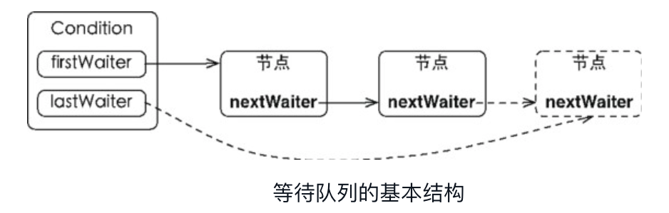
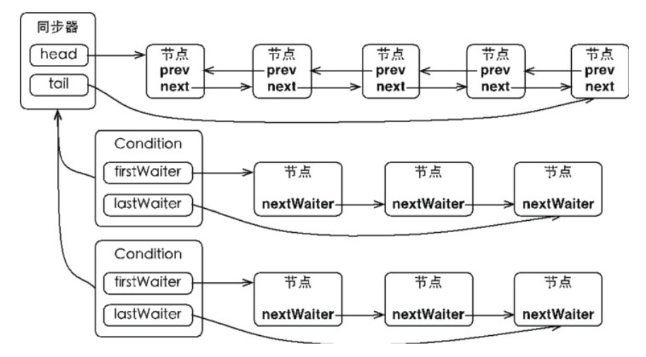
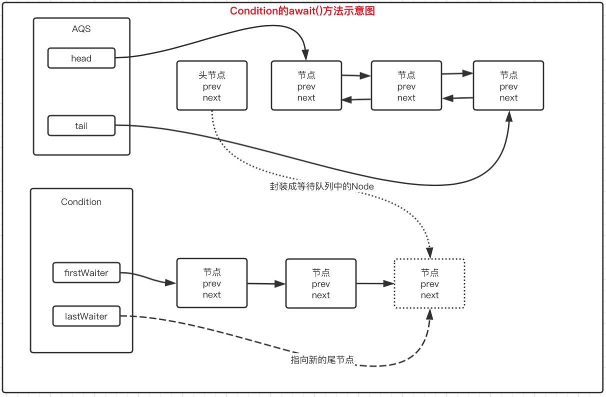
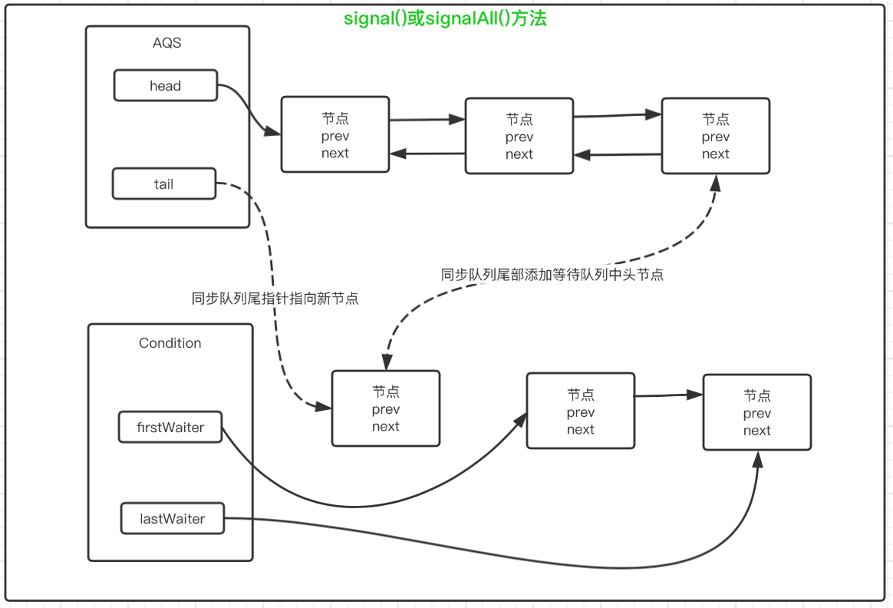
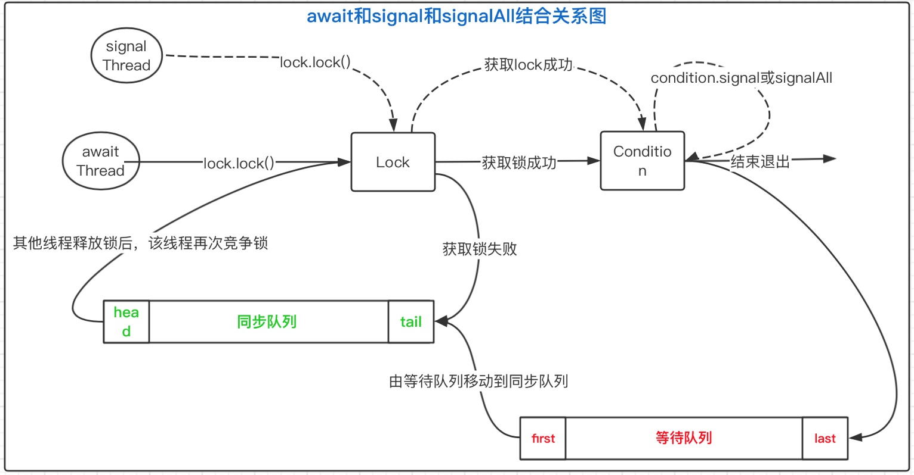

### Condition接口

> - Java所有对象包含了wait( )、wait( long)、notify( )、notifyAll( )方法这些方法可以与synchronized同步关键字配合，可以实现等待/通知模式。
> - Condition接口也提供了类似Object的监视器方法，与Lock搭配使用可以实现等待/通知模式。两者在使用方式和功能特性都有一些差异。

Object方式是Java语言底层提供的，Lock/Condition是语言级别提供的，具有更高的可控制性和扩展性。

- **Condition支持响应中断，而Object方式不支持**
- **Condition能够支持多个等待队列，Object只能支持一个**
- **Condition能够支持超时时间的设置，Object不支持**

### Condition的实现分析

- **Condition定义了等待/通知两种类型的方法，当前线程调用这些方法的时候，需要提前获取到Condition对象关联的锁。**
- **Condition对象依赖于Lock的，可多次调用lock.newCondition()创建多个Condition，而每个Condition都有自己的等待队列。**
- **ConditionObject是Condition接口的实现类，是AQS的内部类。ConditionObject主要包括等待队列、等待和通知。**

以下提到的Condition在不加说明的情况下都指的是ConditionObject。

#### 1、等待队列

- 在锁机制的实现上，AQS内部维护了一个同步队列，如果是独占式锁的话，所有获取锁失败的线程都会被构建成节点添加到队列尾部，其队列首节点表示成功获取同步状态的节点。类似地，Condition内部也维护了一个队列来管理等待线程，这个队列称为条件队列。

- 等待队列是一个FIFO的队列，队列中每个节点都包含一个线程引用，这个线程就是在Condition上等待的线程。如果一个线程调用了condition.await()方法，那么这个线程将会释放锁，构造成节点加入等待队列并且进入等待状态。
- 区别：同步队列存放的是竞争同步资源的线程的引用；条件队列中存放待唤醒的线程的引用。
- 联系：`队列的节点类型都是AbstractQueuedSynchronizer.Node，其他线程调用condition.signal()或signalAll()时，唤醒等待队列首节点中的线程，并且首节点移动到同步队列尾部中去竞争锁，只有竞争锁成功，才会继续向下执行。`



Condition拥有首节点和尾节点的引用，而新增节点只需要将原有的尾节点的nextWaiter指向新节点，并且更新Condition尾节点引用指向新的节点即可。更新操作没有使用CAS保证，原因是调用await()方法的线程必定是获取了锁的线程。在Object的监视器模型上，一个对象拥有一个同步队列和一个等待队列；并发包中的`Lock拥有一个同步队列和多个Condition的等待队列`。



#### 2、等待

调用Condition的以await前缀的方法

- 调用后会使得当前线程释放锁并进入等待队列，同时线程变为等待状态。
- 当await系列方法返回时，当前线程一定是获取到了Condition相关联的锁。
- 从队列的角度看，调用await()方法相当于同步队列的首节点（获取了锁的节点）移动到Condition的等待队列中



调用了await()方法的线程成功获取了锁的线程，也就是同步队列中的首节点，方法中会将当前线程构建成节点并添加到等待队列中，然后释放同步状态，唤醒同步队列中的后继节点，然后当前线程会进入等待状态。

```java
public final void await() throws InterruptedException {
  	if (Thread.interrupted()) throw new InterruptedException();
		//将当前线程包装成Node节点，添加到队列的尾部
  		Node node = addConditionWaiter();
  		//调用await()的线程一定是获取到锁的，要释放当前线程占用的锁在释放过程中会唤醒同步队列中后继节点的线程
  		int savedState = fullyRelease(node);
  		int interruptMode = 0;
  		while (!isOnSyncQueue(node)) {
      		//当前线程进入等待状态（其他线程调用了signal()方法，且当前线程被唤醒的时候才从park()方法中返回）
    		LockSupport.park(this);
    		if ((interruptMode = checkInterruptWhileWaiting(node)) != 0)
      		break;
  		}
  		//退出while循环，即当线程被唤醒后，acquireQueued中线程会自旋不断尝试获取锁，直到成功获取到锁。
    	//acquireQueued()中一定会拿到锁并返回，这说明了await()方法退出时，必须是获取到Condition关联的锁。
  		if (acquireQueued(node, savedState) && interruptMode != THROW_IE){
      		interruptMode = REINTERRUPT;
    	}
  		if (node.nextWaiter != null)
    		unlinkCancelledWaiters();
  		//处理被中断的情况
  		if (interruptMode != 0)
    		reportInterruptAfterWait(interruptMode);
}
```

await方法要返回，必须就要退出while循环，终止while循环的出口有2个

- break终止：当前等待的线程被中断后程序走到了break出口
- while循环的逻辑条件为false：当前节点被移动到了同步队列中（即其他线程调用Condition的signal()或signalAll()方法）

添加节点到队列的方法

```java
private Node addConditionWaiter() {
  	Node t = lastWaiter;
  	// 判断lastWaiter是否为空，或否处于条件状态，如果不是，将它从等待队列中删除
  	if (t != null && t.waitStatus != Node.CONDITION) {
    	unlinkCancelledWaiters();
    	t = lastWaiter;
  	}
    //当前线程包装成节点，并添加到等待队列中
  	Node node = new Node(Thread.currentThread(), Node.CONDITION);
  	if (t == null){
        firstWaiter = node;
    }else {
        t.nextWaiter = node;
    }
    lastWaiter = node;
    return node;
}
```

释放当前线程占有的锁，并唤醒后继节点的线程

```java
final int fullyRelease(Node node) {
    boolean failed = true;
    try {
        int savedState = getState();
        //release方法释放同步状态
        if (release(savedState)) {
            failed = false;
            return savedState;
        } else {
            throw new IllegalMonitorStateException();
        }
    } finally {
        if (failed)
            node.waitStatus = Node.CANCELLED;
    }
}
```

#### 3、唤醒

调用Condition的signal()或signalAll()方法

- 调用的前提是当前线程已经获得了lock，该方法中将等待队列中等待时间最长的节点移动到同步队列中，而移动到同步队列中才有机会使得等待线程被唤醒后有机会获得锁，即从lockSupport.park()方法中返回，从而使调用wait()方法的线程成功退出。

- 按照FIFO的原则，等待队列的头节点必定是等待时间最长的节点，就是说每次都是将头节点移动到同步队列中。



```java
public final void signal() {
    //检查当前线程必须是获取了锁，否则抛出异常
    if (!isHeldExclusively()){
        throw new IllegalMonitorStateException();
    }
    Node first = firstWaiter;
    if (first != null){
        doSignal(first);
    }
}
```

```java
private void doSignal(Node first) {
    do {
        
        if ((firstWaiter = first.nextWaiter) == null){
            lastWaiter = null;
        }
        //将头节点从等待队列取出，真正做节点转化的是在transferForSignal方法中
        first.nextWaiter = null;
    } while (!transferForSignal(first) && (first = firstWaiter) != null);
}
```

```java
    final boolean transferForSignal(Node node) {
        //更新节点状态为0，等待状态
        if (!compareAndSetWaitStatus(node, Node.CONDITION, 0)){
            return false;
        }
        //通过enq()方法将等待队列头节点移动到同步队列中
        Node p = enq(node);
        int ws = p.waitStatus;
        if (ws > 0 || !compareAndSetWaitStatus(p, ws, Node.SIGNAL)){
            LockSupport.unpark(node.thread);
        }
        return true;
    }
```

#### 4、await和signal结合

await和signal就像一个开关控制着等待方线程和通知方线程，他们之间的关系用下图描述



线程awaitThread先通过lock.lock()方法成功获取到锁之后，调用了condition.await()进入等待队列；

另一个线程signalThread通过lock.lock()方法成功获取到锁之后调用了condition.signal或condition.signalAll方法

使得线程awaitThread有机会移动到同步队列中，当其他线程释放锁之后使得awaitThread线程能够有机会获取lock，从而awaitThread线程能够从await方法中退出，然后执行后续操作。如果awaitThread获取锁失败就直接进入同步队列。

### 示例一

写2个线程，其中一个线程打印1-52，另一个线程打印A-Z，打印顺序应该是12A34B56C……5152Z，需使用多线程通信的知识解决。

```java
package com.gopherasset.juc.locks;
import java.util.Iterator;
import java.util.List;
import java.util.concurrent.locks.Condition;
import java.util.concurrent.locks.Lock;
import java.util.concurrent.locks.ReentrantLock;
public class PrintTask<T> implements Runnable {
    private int period;                 //每次打印的字符个数
    private int priority;               //优先级，在多个队列中打印次序
    private int total;                  //队列个数
    private static int sequence = 0;    //当前打印队列序号
    private List<T> charList;           //需要打印的字符队列
	/*
	 *	由于需要锁定的sequence是类成员，创建一个static锁就可以保证该任务的线城实例能够感知到signalAll()；
	 *	如果不是static修饰的锁和条件对象，不同实例之间是无法感知的。
	 */
    private static final Lock lock = new ReentrantLock();
    private static final Condition condition = lock.newCondition();
    
    public PrintTask(List<T> charList, int period, int priority, int total) {
        this.period = period;
        this.priority = priority;
        this.total = total;
        this.charList = charList;
    }
    
    @Override
    public void run() {
        Iterator<T> iter = charList.iterator();
        while (iter.hasNext()) {
            //获取锁
            lock.lock();
            try {
                if (sequence % total == priority) {
                    for (int i = 0; i < period; i++) {
                        if (iter.hasNext()) {
                            System.out.print(iter.next());
                        } else {
                            break;
                        }
                    }
                    ++sequence;
                    //该类其他实例都可以接收signalAll
                    condition.signalAll();
                } else {
                    //告诉类的所有实例对象，感知signalAll
                    condition.await();
                }
            } catch (Exception e) {
                e.printStackTrace();
            } finally {
                lock.unlock();
            }
        }
    }
}
```

测试代码

```java
package com.gopherasset.juc.locks;
import java.util.ArrayList;
import java.util.List;
public class LockConditionDemo {
    private static final int TOTAL = 2;
    public static void main(String[] args) {
        List<Integer> numbers = new ArrayList<>();
        for (int i = 1; i <= 52; i++) {
            numbers.add(i);
        }

        List<Character> characters = new ArrayList<>();
        for (char i = 'A'; i <= 'Z'; i++) {
            characters.add(i);
        }

        new Thread(new PrintTask<>(numbers, 2, 0, TOTAL)).start();
        new Thread(new PrintTask<>(characters, 1, 1, TOTAL)).start();
    }
}
```

输出结构

```
12A34B56C78D910E1112F1314G1516H1718I1920J2122K2324L2526M2728N2930O3132P3334Q3536R3738S3940T4142U4344V4546W4748X4950Y5152Z
```

### 示例二

```java
import java.util.concurrent.locks.Condition;
import java.util.concurrent.locks.Lock;
import java.util.concurrent.locks.ReentrantLock;
public class ConditionDemo {
    
    private final Lock lock = new ReentrantLock();
    private final Condition full = lock.newCondition();
    private final Condition notFull = lock.newCondition();
    private int count = 0;
    private int takeptr = 0;
    private int putptr = 0;
    private Object[] blockArray = new Object[100];

    public void put(Object element) throws InterruptedException {
		lock.lock();
        try {
            //当表示数组已满，调用await()方法，当前线程随之释放锁并进入等待状态
            while (count == blockArray.length) {
                System.out.println("put: putptr = " + putptr + ", await");
                full.await();
            }
          	//放入元素
            System.out.println("put: putptr = " + putptr + ", 执行 put");
            blockArray[putptr] = element;
            if (++putptr == blockArray.length) {
                putptr = 0;
            }
            ++count;
          	//通知等待notFull的线程，数组中有新元素可以获取
            notFull.signal();
        } finally {
            lock.unlock();
        }
    }

    public Object take() throws InterruptedException {
        lock.lock();
        Object data = null;
        try {
          	//取出数组中最后一个元素时，将取出操作线程阻塞进入等待状态
            while (count == blockArray.length) {
                System.out.println("take: takeptr == " + takeptr + "，await");
                notFull.await();
            }
          	//取出元素
            System.out.println("take: takeptr = " + takeptr + ", 执行 take");
            data = blockArray[takeptr];
          	//最后一个元素取出，重置取出的指针
            if (++takeptr == blockArray.length) {
                takeptr = 0;
            }
            --count;
          	//数组中已经置空，唤醒取出操作的线程
            full.signal();
            return data;
        } finally {
            lock.unlock();
        }
    }

    public static void main(String[] args) {
        final ConditionDemo condition = new ConditionDemo();
        for (int i = 0; i < 100; i++) {
            //放入数据对象
            new Thread(() -> {
                try {
                    condition.put(new Object());
                } catch (InterruptedException e) {
                    e.printStackTrace();
                }
            }).start();
            //取出数据对象
            new Thread(() -> {
                try {
                    condition.take();
                } catch (InterruptedException e) {
                    e.printStackTrace();
                }
            }).start();
        }

    }
}
```

