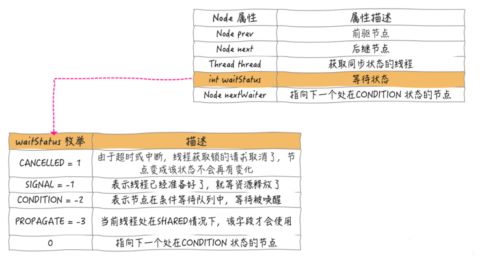
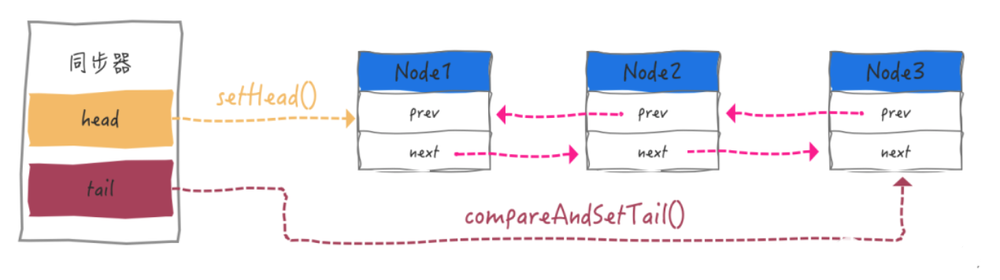
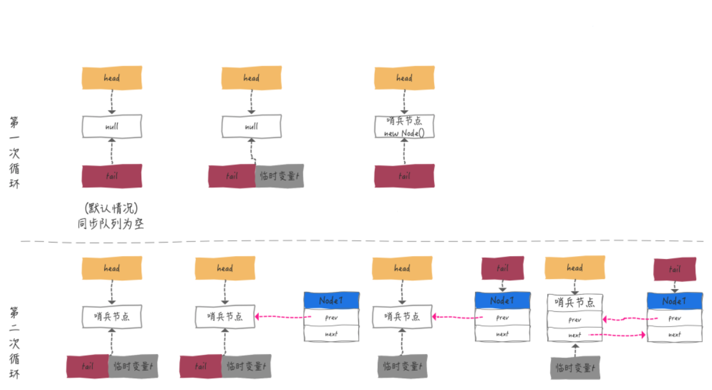
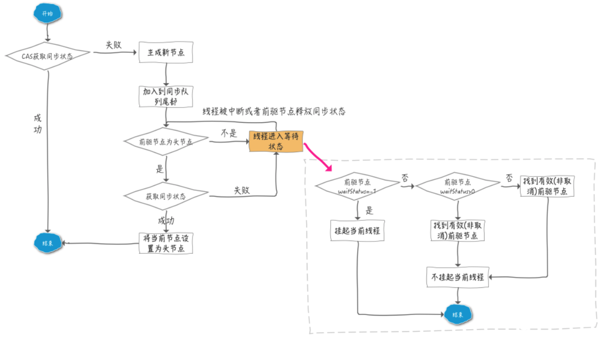
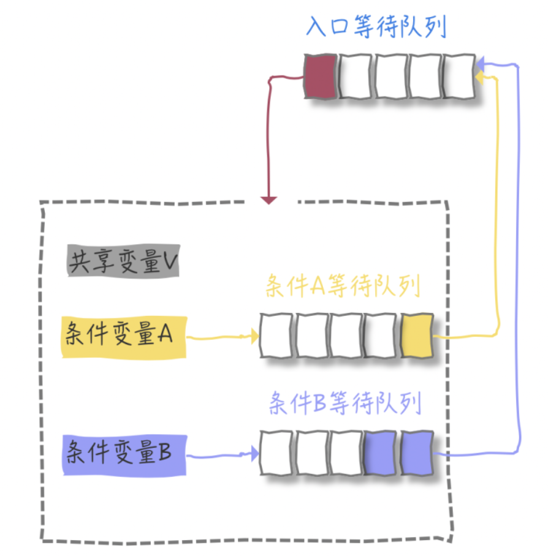
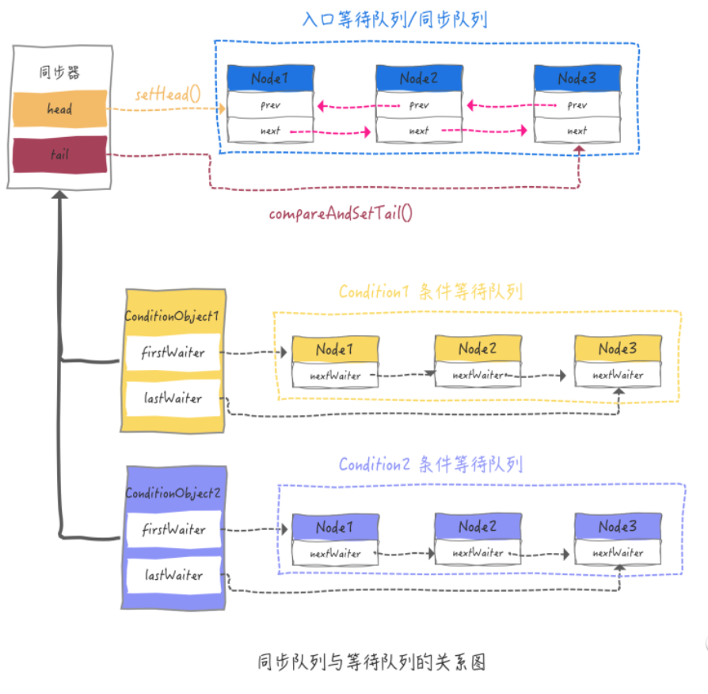
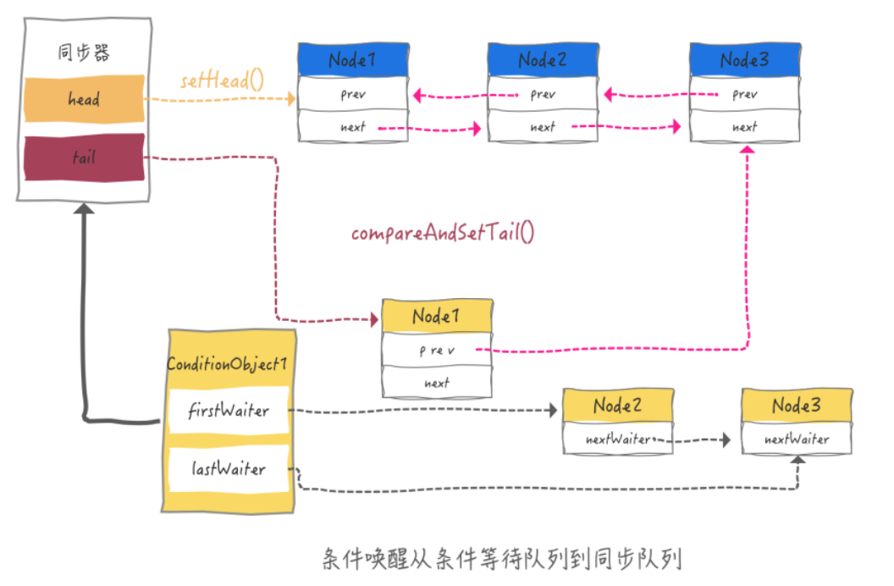

### 1、同步器可重写的方法

| 方法名称                                          | 方法描述                             |
| ------------------------------------------------- | ------------------------------------ |
| **protected boolean tryAcquire(int arg) **        | 独占式获取同步状态                   |
| **protected boolean tryRelease(int arg)**         | 独占式释放同步状态                   |
| ***protected boolean tryAcquireShared(int arg)*** | 共享式获取同步状态                   |
| ***protected boolean tryReleaseShared(int arg)*** | 共享式释放同步状态                   |
| **protected boolean isHeldExclusively()**         | 判断同步器是否被线程在独占模式下使用 |

一般来说，需要重写的方法由abstract修饰，为什么这里没有？原因很简单，自定义同步器或锁不可能既是独占式又是共享式，为了避免强制重写不相干或者用不到的方法，所有就没有使用abstract修饰，只不过需要抛出异常告知不能直接使用的即可。

```java
protected boolean tryAcquire(int arg) {
    throw new UnsupportedOperationException();
}
```

### 2、同步器提供的模板方法

| 方法名称                                                    | 方法描述                                                     |
| ----------------------------------------------------------- | ------------------------------------------------------------ |
| **public final void acquire(int arg)**                      | 独占式获取同步状态，获取成功就返回，失败就进入同步队列       |
| **public final void acquireInterruptibly(int arg)**         | 与acquire一样，但能够响应中断，如被中断就抛出InterruptException异常并返回 |
| **public final void tryAcquireNaos(int arg)**               | 在acquireInterruptibly基础上，超时时间内获取到就返回true，否则返回false |
| **public final void release(int arg)**                      | 独占式释放同步状态                                           |
| ***public final void acquireShared(int arg)***              | 共享式获取同步状态                                           |
| ***public final void acquireSharedInterruptibly(int arg)*** | 与acquireShared一样，但能够响应中断，如被中断就抛出InterruptException异常并返回 |
| ***public final void tryAcquireSharedNaos(int arg)***       | 在acquireSharedInterruptibly基础上，超时时间内获取到就返回true，否则返回false |
| ***public final void releaseShared(int arg)***              | 共享式释放同步状态                                           |

上面的方法都有final修饰，因此是不能被子类重写的。

`lock.tryLock()`非阻塞式获取锁就是调用自定义同步器重写的`tryAcquire()`方法，通过设置CAS操作设置state状态，不管成功与否都会返回。然而通过`lock.lock()`这种阻塞式获取锁的实现需要依赖阻塞队列。`有阻塞必然要排队，要排队必然需要队列`。

AQS实现中，每个排队的个体都是一个个Node。

### 3、Node节点

AQS内部维护了一个同步队列，用来管理同步状态。

- 当线程获取同步状态失败时，就会将当前线程以及等待状态等信息构建成一个Node节点，将其将入阻塞队列并阻塞线程。
- 当同步状态被释放时，会唤醒同步队列中的“首节点”的线程获取同步状态。



同步队列的基本结构如下：



### 4、独占式获取同步状态

##### 4.1、从`lock.lock()`开始

```java
public void lock() {
 // 阻塞式的获取锁，调用同步器模版方法，获取同步状态
 sync.acquire(1);
}
```

##### 4.2、进入模板方法acquire()

```java
public final void acquire(int arg) {
    if (!tryAcquire(arg) && acquireQueued(addWaiter(Node.EXCLUSIVE), arg)) {
        selfInterrupt();
    }
}
```

首先尝试非阻塞的获取同步状态，如果获取失败（即tryAcquire()方法返回false），则会调用`addWaiter(Node node)`方法中构造独占式Node节点（Node.EXCLUSIVE），并且通过CAS操作安全地添加到阻塞队列尾部。

```java
private Node addWaiter(Node mode) {
    // 构造Node，同时包装当前线程并设置节点模式
    Node node = new Node(Thread.currentThread(), mode);
    // 创建pred变量，指向tail指向的尾节点
    Node pred = tail;
    //如果尾节点不为空，说明已有节点在队列中
    if (pred != null) {
        //新添加的节点的前驱引用指向原来的尾节点
        node.prev = pred;
        //由于多个线程可能同时获取同步状态失败后，要竞争入队，因此这里需要通过CAS操作保证安全的设置操作
        if (compareAndSetTail(pred, node)) {
            //原先的尾节点的后继节点引用指向新节点
            pred.next = node;
            //CAS操作完成，返回即可
            return node;
        }
    }
    //走到这里有两个可能：阻塞队列为空而当前节点是第一个要插入的；上面尝试性的CAS入队操作失败了，说明有多个线程在竞争入队
    //入队操作
    enq(node);
    return node;
}
```

enq(Node)方法里面是个死循环，它的执行流程如下图所示



##### 4.3、获取同步状态

Node添加到了阻塞队列中之后，就会进入“自旋”方式获取其前驱节点的状态，根据状态来判断是否要进行哪些操作

```java
final boolean acquireQueued(final Node node, int arg) {
    boolean failed = true;
    try {
        boolean interrupted = false;
        //“死循环”，尝试获取锁
        for (;;) {
            //获取当前节点的前驱节点
            final Node p = node.predecessor();
            //只有当前节点的前驱节点是头节点，才会尝试获取锁
            if (p == head && tryAcquire(arg)) {
                setHead(node);
                p.next = null; // help GC
                failed = false;
                //返回中断标识
                return interrupted;
            }
            //当前节点的前驱节点不是首节点，或者当前节点的前驱节点是首节点但是获取锁失败
            if (shouldParkAfterFailedAcquire(p, node) && parkAndCheckInterrupt()) {
                interrupted = true;
            }
        }
    } finally {
        if (failed)
            cancelAcquire(node);
    }
}
```

同步状态获取成功之后就返回了，这个自然很好理解。但是如果失败了，就会一直陷入“死循环”中浪费资源吗？显然不是！

`shouldParkAfterFailedAcquire()`和`parkAndCheckInterrupt()`方法就会将获取同步状态失败的线程阻塞挂起。

```java
    private static boolean shouldParkAfterFailedAcquire(Node pred, Node node) {
        //获取前驱节点状态
        int ws = pred.waitStatus;
        //1、如果是SIGNAL状态，也就是等待被占用的资源释放，这种情况下就直接返回true，后续会调用parkAndCheckInterrupt()
        if (ws == Node.SIGNAL){
            return true;
        }
		//2、等待状态大于0，说明是CANCELLED状态
        if (ws > 0) {
            do {
                //循环判断当前节点的前驱节点是否为CANCELLED状态，如果是，就去掉消状态的节点，重新构建队列（保证节点都是可用有效的）
                node.prev = pred = pred.prev;
            } while (pred.waitStatus > 0);
            pred.next = node;
        } else {
            //将当前节点的状态设置为SIGNAL，用于后续的唤醒操作（节点入队后第一次会在这里并返回false，第二次循环会从方法的第6行返回）
            compareAndSetWaitStatus(pred, ws, Node.SIGNAL);
        }
        return false;
    }
```

节点进入队列后，节点被设置成了SIGNAL状态后，就会执行到`parkAndCheckInterrupt()`方法

```java
private final boolean parkAndCheckInterrupt() {
    //下面一句代码会将线程阻塞，程序执行流不会再向下执行了，直到由前驱节点的线程中唤醒它，才会继续向下执行。在阻塞过程中也不会响应中断。
    LockSupport.park(this);
    //判断线程是否收到过中断信号，返回中断状态，并清空中断状态。
    //如果收到中断，就会返回true，这样acquire()方法if代码块的selfInterrupt会执行，线程响应中断并取消执行。
    return Thread.interrupted();
}
```

当前节点被其前驱节点唤醒之后，如果在阻塞期间收到过中断信号，就会中断并退出线程的程序执行

```java
public final void acquire(int arg) {
 if (!tryAcquire(arg) && acquireQueued(addWaiter(Node.EXCLUSIVE), arg)){
     selfInterrupt();
 }
}

static void selfInterrupt() {
    Thread.currentThread().interrupt();
}
```

> 线程中断：中断只是一个信号，至于是否响应中断是自己可以控制的，程序执行到这里只直到程序被中断了，至于中断原因是不知道的。中断标识被Thread.interrupt()无情的清空了，所以要自己重新建立一个中断标识。

上面还遗漏了一部分逻辑，就是acquireQueued()方法的finally代码块

```java
if (failed){
    cancelAcquire(node);
}
```

这段代码被执行的条件是 failed 为 true，正常情况下，如果跳出循环，failed 的值为false，如果不能跳出循环貌似怎么也不能执行到这里，所以只有不正常的情况才会执行到这里，也就是会发生异常，才会执行到此处。查看 try 代码块，只有两个方法会抛出异常：

- `node.processor()`方法

- 自己重写的的`tryAcquire()`方法

    ```java
    final Node predecessor() throws NullPointerException {
        Node p = prev;
        if (p == null){
            throw new NullPointerException();
        } else {
            return p;
        }
    }
    ```

    很显然，这里抛出的异常不是重点。那就以 ReentrantLock 重写的 tryAcquire() 方法为例

    ```java
    protected final boolean tryAcquire(int acquires) {
        final Thread current = Thread.currentThread();
        int c = getState();
        if (c == 0) {
            if (!hasQueuedPredecessors() && compareAndSetState(0, acquires)) {
                setExclusiveOwnerThread(current);
                return true;
            }
        }
        else if (current == getExclusiveOwnerThread()) {
            int nextc = c + acquires;
            if (nextc < 0) {
                throw new Error("Maximum lock count exceeded"); // 这里的异常应该就是要关注的异常；自己覆写tryAcquire中的异常也是
            }
            setState(nextc);
            return true;
        }
        return false;
    }
    ```

在`shouldParkAfterFailedAcquire()`中对取消状态进行了判断，什么时候产生或设置节点为取消状态呢？其实答案在`cancelAcquire()`方法中

```java
private void cancelAcquire(Node node) {
    //忽略无效节点
    if (node == null){
        return;
    }
    //将节点关联的线程清空
    node.thread = null;
    //跳过同样是取消状态的前驱节点，循环退出的条件是：找到了一个有效的前驱节点
    Node pred = node.prev;
    while (pred.waitStatus > 0){
        node.prev = pred = pred.prev;
    }
    
	//获取前驱有效节点的后继节点
    Node predNext = pred.next;
    //将当前节点的状态设置为“取消”
    node.waitStatus = Node.CANCELLED;

    //如果当前节点是队列的尾节点，直接删除就好
    if (node == tail && compareAndSetTail(node, pred)) {
        compareAndSetNext(pred, predNext, null);
    } else {
        
        int ws;
        // 1、如果当前节点的有效前驱节点不是头节点，也就是说当前节点不是头节点的后继节点
        if (pred != head &&
            // 2、判断当前节点有效前驱节点的状态是否为 SIGNAL
            ((ws = pred.waitStatus) == Node.SIGNAL ||
			 // 3、如果不是，尝试将前驱节点的状态置为 SIGNAL
             (ws <= 0 && compareAndSetWaitStatus(pred, ws, Node.SIGNAL))) && pred.thread != null) {
            Node next = node.next;
            if (next != null && next.waitStatus <= 0){
                compareAndSetNext(pred, predNext, next);
            }
        } else {
            unparkSuccessor(node);
        }
        node.next = node;
    }
}
```

##### 4.4、获取过程的小结



### 5、独占式释放同步状态

##### 5.1、从`lock.unlock()`开始

```java
public void unlock() {
    // 释放锁
    sync.release(1);
}
```

##### 5.2、进入模板方法release()

```java
public final boolean release(int arg) {
    //调用自定义同步器的tryRelease()方法释放同步状态
    if (tryRelease(arg)) {
        //释放成功，获取头节点
        Node h = head;
        //存在头节点，并且状态不是初始状态，
        if (h != null && h.waitStatus != 0){
            //解除线程阻塞挂起状态
            unparkSuccessor(h);
        }
        return true;
    }
    return false;
}
```

##### 5.3、解除阻塞并唤醒后继节点

```java
private void unparkSuccessor(Node node) {
    //获取头节点的状态
    int ws = node.waitStatus;
    if (ws < 0) {
        //清空头节点的等待状态，即设置waitStatus=0
        compareAndSetWaitStatus(node, ws, 0);
    }
	
    //获取头节点的后继节点，判断后继节点是否为取消状态，如果是，需要移除，重新整理队列
    Node s = node.next;
    if (s == null || s.waitStatus > 0) {
        s = null;
        for (Node t = tail; t != null && t != node; t = t.prev) {
            if (t.waitStatus <= 0) {
                s = t;
            }
        }
    }
    //唤醒后继节点的线程（所以上面的几个方法中都有“整理队列，移除取消状态的节点”的操作，有一个好前任很重要）
    if (s != null){
        LockSupport.unpark(s.thread);
    }   
}
```

同步状态到此为止已经释放成功，节点入队之后其中的线程由阻塞状态到被唤醒，继续从下面的第3行代码返回，并且进入线程获取到锁后的实际业务逻辑程序的执行了。

到这了，关于独占式获取/释放锁的过程就形成了闭环，但是关于AQS的另外两个模板方法

- 响应中断
- 超时限制

### 6、独占式响应中断获取同步状态

##### 6.1、lock.lockInterruptibly() 方法

```java
public void lockInterruptibly() throws InterruptedException {
    // 调用同步器模版方法可中断式获取同步状态
    sync.acquireInterruptibly(1);
}
```

结合前面的分析，理解独占式可响应中断的获取同步状态方式非常容易：

```java
public final void acquireInterruptibly(int arg)
    throws InterruptedException {
    if (Thread.interrupted()){
        throw new InterruptedException();
    }

    // 尝试非阻塞式获取同步状态失败，如果没有获取到同步状态，执行代码7行
    if (!tryAcquire(arg)){
        doAcquireInterruptibly(arg);
    }
}

private void doAcquireInterruptibly(int arg)
    throws InterruptedException {
    final Node node = addWaiter(Node.EXCLUSIVE);
    boolean failed = true;
    try {
        for (;;) {
            final Node p = node.predecessor();
            if (p == head && tryAcquire(arg)) {
                setHead(node);
                p.next = null; // help GC
                failed = false;
                return;
            }
            if (shouldParkAfterFailedAcquire(p, node) && parkAndCheckInterrupt())
                //获取中断信号后，不再返回 interrupted = true 的值，而是直接抛出 InterruptedException 
                throw new InterruptedException();
        }
    } finally {
        if (failed)
            cancelAcquire(node);
    }
}
```

没想到 JDK 内部也有如此相近的代码，可响应中断获取锁没什么深奥的，就是被中断抛出 InterruptedException 异常（代码第17行），这样就逐层返回上层调用栈捕获该异常进行下一步操作了。

### 7、独占式超时限制获取同步状态

超时限制，很好理解：给定一个时限，在该时间段内获取到同步状态，就返回 true， 否则，返回 false。好比线程给自己定了一个闹钟，闹铃一响，线程就自己返回了，这就不会使自己是阻塞状态了。核心逻辑肯定是计算时间间隔，因为在超时时间内，肯定是多次尝试获取锁的，每次获取锁肯定有时间消耗。

##### 7.1从lock.tryLock(time, unit)开始

```java
public boolean tryLock(long time, TimeUnit unit) throws InterruptedException {
    // 调用同步器模板方法，可响应中断和超时时间限制
    return sync.tryAcquireNanos(1, unit.toNanos(time));
}
```

##### 7.2、tryAcquireNanos方法

```java
public final boolean tryAcquireNanos(int arg, long nanosTimeout) throws InterruptedException {
    if (Thread.interrupted()) {
        throw new InterruptedException();
    }
    // 这里跟上面类似的方法很相似，主要是doAcquireNanos()方法或抛出异常
    return tryAcquire(arg) || doAcquireNanos(arg, nanosTimeout);
}

private boolean doAcquireNanos(int arg, long nanosTimeout) throws InterruptedException {
    long lastTime = System.nanoTime();
    //以独占方式加入到同步队列中
    final Node node = addWaiter(Node.EXCLUSIVE);
    boolean failed = true;
    try {
        for (;;) {
            final Node p = node.predecessor();
            if (p == head && tryAcquire(arg)) {
                setHead(node);
                p.next = null; // help GC
                failed = false;
                return true;
            }
            //如果超时，直接返回 false
            if (nanosTimeout <= 0){
                return false;
            }  
            if (shouldParkAfterFailedAcquire(p, node) && nanosTimeout > spinForTimeoutThreshold){
                //挂起线程nanosTimeout的时间，时间到，自动返回
                LockSupport.parkNanos(this, nanosTimeout);
            }   
            long now = System.nanoTime();
            nanosTimeout -= now - lastTime;
            lastTime = now;
            if (Thread.interrupted()){
                throw new InterruptedException();
            }
        }
    } finally {
        if (failed){
            cancelAcquire(node);
        }
    }
}
```

### 8、Condition

用Condition实现等待通知机制，大致流程图如下：



##### 8.1、从`lock.newCondition()`开始

```java
public Condition newCondition() {
    // 使用自定义的条件
    return sync.newCondition();
}

Condition newCondition() {
    return new ConditionObject();
}
```

ConditionObject是 Condition 的实现类，该类就定义在了 AQS 中，只有两个成员变量。

```java
private transient Node firstWaiter;
private transient Node lastWaiter;
```

只需要来看一下 ConditionObject 实现的 await / signal 方法来使用这两个成员变量就可以了

```java
public final void await() throws InterruptedException {
    if (Thread.interrupted()){
        throw new InterruptedException();
    }
    //构建Node节点，添加到队列中
    Node node = addConditionWaiter();
    //释放状态
    int savedState = fullyRelease(node);
    int interruptMode = 0;
    while (!isOnSyncQueue(node)) {
        LockSupport.park(this);
        if ((interruptMode = checkInterruptWhileWaiting(node)) != 0) {
            break;
        }
    }
    if (acquireQueued(node, savedState) && interruptMode != THROW_IE)
        interruptMode = REINTERRUPT;
    if (node.nextWaiter != null)
        unlinkCancelledWaiters();
    if (interruptMode != 0)
        reportInterruptAfterWait(interruptMode);
}
```

注意，在介绍同步状态时，addWaiter()是加入到同步队列，就是上面图中的入口等待队列。这里说的是等待队列，所以addConditionWaiter()方法肯定是构建了一个自己的队列。

```java
private Node addConditionWaiter() {
    Node t = lastWaiter;
    if (t != null && t.waitStatus != Node.CONDITION) {
        unlinkCancelledWaiters();
        t = lastWaiter;
    }
    // 新建节点的状态时CONDITON，注意不是0或SIGNAL
    Node node = new Node(Thread.currentThread(), Node.CONDITION);
    if (t == null){
        firstWaiter = node;
    } else {
        t.nextWaiter = node;
    }
    lastWaiter = node;
    return node;
}
```

> 为什么这里是单向队列，也没有使用CAS 来保证加入队列的安全性呢？

因为 await 是 Lock 范式 try 中使用的，说明已经获取到锁了，所以就没必要使用 CAS 了，至于是单向，因为这里还不涉及到竞争锁，只是做一个条件等待队列。在 Lock 中可以定义多个条件，每个条件都会对应一个 条件等待队列，所以将上图丰富说明一下就变成了这个样子：



线程已经按相应的条件加入到了条件等待队列中，那如何再尝试获取锁呢？signal / signalAll 方法就已经排上用场了

```java
public final void signal() {
    if (!isHeldExclusively()){
        throw new IllegalMonitorStateException();
    }
    Node first = firstWaiter;
    if (first != null){
        doSignal(first);
    }   
}
```

Signal 方法通过调用 doSignal 方法，只唤醒条件等待队列中的第一个节点

```java
private void doSignal(Node first) {
    do {
        if ( (firstWaiter = first.nextWaiter) == null){
            lastWaiter = null;
        }
        first.nextWaiter = null;
        // 调用该方法，将条件等待队列的线程节点移动到同步队列中
    } while (!transferForSignal(first) && (first = firstWaiter) != null);
}

final boolean transferForSignal(Node node) {
    if (!compareAndSetWaitStatus(node, Node.CONDITION, 0)){
        return false;
    }
    //重新入队操作
    Node p = enq(node);
    int ws = p.waitStatus;
    if (ws > 0 || !compareAndSetWaitStatus(p, ws, Node.SIGNAL)){
        // 唤醒同步队列中的该线程
        LockSupport.unpark(node.thread);
    }
    return true;
}
```

唤醒的整个过程图示



到这里，理解 signalAll 就非常简单了，只不过循环判断是否还有 nextWaiter，如果有就像 signal 操作一样，将其从条件等待队列中移到同步队列中

```java
private void doSignalAll(Node first) {
    lastWaiter = firstWaiter = null;
    do {
        Node next = first.nextWaiter;
        first.nextWaiter = null;
        transferForSignal(first);
        first = next;
    } while (first != null);
}
```

