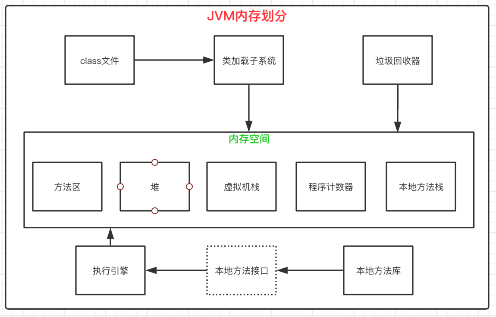
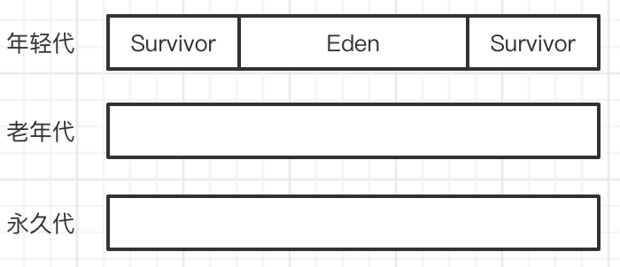

## JVM内存划分

JVM在执行Java程序的时候，会把它所管理的内存划分为多个不同区域。

#### （1）class文件

class文件是Java程序编译后生成的中间代码，将倍JVM加载并执行。

#### （2）类加载子系统

类加载子系统负责把class文件装在到内存中，供虚拟机执行。JVM虚拟机有两种类加载器，分别是启动类加载器和用户自定义类加载器。启动类加载器是JVM内置的，由C++实现；用户类加载器则是通过Java代码实现的，必须是ClassLoader类的子类。常见类加载器如下：

- BootStrap ClassLoader：启动类加载器，JVM的根类加载器，由它加载$JAVA_HOME/lib/目录下的所有类。
- Extension ClassLoader：扩展类加载器，JVM使用它来加载扩展功能的jar，主要是$JAVA_HOME/lib/ext/目录下的所有类。
- System ClassLoader：应用类加载器，加载classpath中的用户类
- User-Defined ClassLoader：用户自定义的类加载器

#### （3）方法区

方法区用于存储虚拟机加载的类信息、常量、静态变量、编译器编译后的代码等数据。在类加载器加载class文件的时候，这些信息将会被提取出来，并存储在方法区。这个区域是由所有线程共享的，因此它是被设计为线程安全的。

#### （4）堆

堆主要用来存储对象的实例，因此堆是垃圾回收器管理的重点区域，虚拟机启动的时候创建的被所有线程共享的区域。

#### （5）虚拟机栈

栈主要用来实现Java方法的调用和执行，每个方法在被执行的时候，都会创建一个栈帧用来存储这个方法的局部变量、操作数、动态链接和方法出口等信息。当进行方法调用的时候，通过压栈和出栈来进行栈空间的分配和释放。虚拟机栈区域是线程私有的，每当有线程创建时，就会给它分配一个栈空间，当线程结束后，栈空间就被回收。因此栈与线程生命周期相同。

#### （6）程序计数器

可以看作是当前线程执行的字节码的行号指示器，解释器的工作原理就是通过改变这个计数器的值来确定下一条需要被执行的字节码指令。

#### （7）本地方法栈

本地方法栈与虚拟机栈作用是类似的，唯一不同的是虚拟机栈为虚拟机执行Java方法服务，而本地方法栈则是为虚拟机使用到的Native方法服务。Native接口方法都会使用某种本地方法栈，当线程调用Java方法时，JVM会创建一个新的栈帧并压入虚拟机栈。然而当它调用的时候本地方法的时候，虚拟机栈保持不变，不会再线程的虚拟机栈中压入栈帧，而是简单地动态链接并直接调用指定的本地方法。

#### （8）执行引擎

主要负责执行字节码指令。

#### （9）垃圾回收器

主要用来回收程序中不再使用的内存。

## 运行时内存划分

#### 分代垃圾回收

根据对象的生命周期的长短，把对象分为不同的种类：年轻代、老年代和永久代，并分别进行垃圾内存回收，这就是分代垃圾回收。

分代垃圾回收算法的主要思想：**把堆分成两个或多个子堆，每一个子堆都被视为一代。在运行的过程中，优先收集那些年幼的对象，如果一个对象经过多次回收仍然存活，那么就可以把对象转移到高一级的堆里，减少对其扫描次数。**

HotSpot把JVM中对空间分为三个代：年轻代、老年代、永久代。

- `年轻代`：被分为3个子区域，一个Eden和2个Suvivor。Eden用来存储新建的对象，Survivor是大小相等的两个区域，在使用“标记-复制”算法的时候，保存不会被回收的对象。
- `老年代`：主要存储生命周期较长的对象，超大的对象（无法在年轻代分配的对象）
- `永久代`：存放代码、字符串常量池、静态变量等可以持久化的数据。方法区就在永久代。

#### GC触发条件和区域

- `MinorGC`：新建对象优先在Eden区域分配内存，如果Eden区域满了，那么就会触发MinorGC操作，主要针对年轻代垃圾收集进行回收。
- `fullGC`：清理整个堆空间，包括年轻代和永久代。它会造成很大的系统资源开销，应该尽量避免。几种常见fullGC产生原因以及避免方法
    - 调用了System.gc()方法会触发fullGc。代码中应该避免使用。
    - 老年代空间不足。避免创建大对象或大数组等实例，在MinorGC时，只有Survivor不足以放下存活对象时放入老年代，此时只有老年代也放不下的时候才会触发。另一种避免方式是增大Survivor去、老年代空间或调低触发并发GC的比率。
    - 永久代满。主要用老存放class相关信息，永久代满的时候，会触发fullGC。应该避免这种情况发生，增大永久代的空间（比如-XX:MaxPermSize =1024m）；或者开启CMS回收永久代选项。

## 元空间

在JDK1.8以前的版本中，类的元数据信息都是静态的，很少被卸载或收集，因此也被称为“永久的”，存放这些数据的区域被称为“永久代”。又因为class信息是由JVM管理的，而不是由应用程序创建的，所有又被称为“非堆”。

- JDK1.7开始将永久代的数据向其他存储空间转移了，但是没有完全移除这个区域。比如字符串常量池从永久代转移到了堆空间。
- JDK1.8彻底把永久代从JVM移除了，而类的元数据放在本地化的堆内存中，这个本地化的堆内存被叫做元数据空间（Metaspace）。

#### 为什么要移除永久代？

- 永久代内存经常不够用或者发生内存泄漏而抛出异常：java.lang.OutOfMemoryError:PermGen。尤其是在JavaWeb开发中经常需要动态生成类，永久代又是一块非常小的存储空间，动态生成过多的类会导致永久代的空间被用完而抛出异常，而元空间可以有非常大的空间。
- 移除永久代可以促进HotSpot JVM和JRockit VM的融合，因为后者没有永久代。
- 在HotSpot中，每个垃圾收集器都需要专门的代码来处理存储在PermGen中类的元数据信息。从把类的元数据从永久代转移到MetaSpace之后，由于Metaspace的分配具有和Java Heap相同的地址空间，因此可以实现Metaspace和Java Heap的无缝化管理，而且简化了FullGC的过程，以至于未来可以并行对元数据信息进行垃圾收集，而GC没有暂停。

#### Metaspace的内存分配

