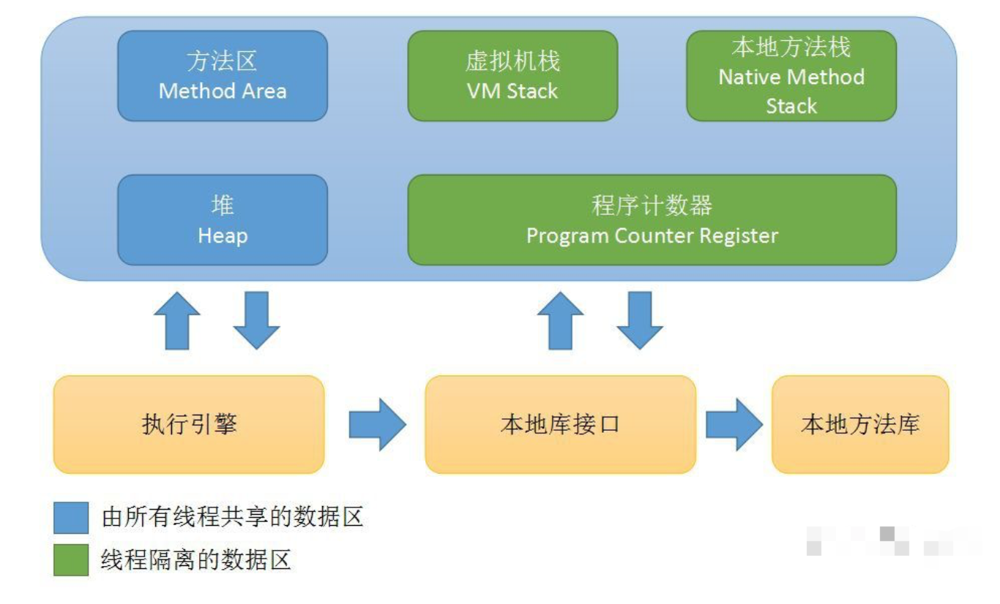
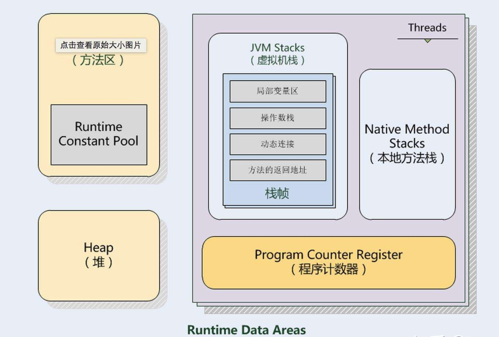

Java虚拟机规范规定了虚拟机所管理的内存中将会包括以下的运行时数据区域：

- 虚拟机栈、本地方法栈、程序计数器：用户线程管理，随线程启动和结束而建立与销毁。
- 方法区、堆：虚拟机所有线程共享。

### 1、程序计数器

- 可以理解为当前线程执行字节码的行号指示器。字节码解释器执行时就是通过改变这个程序计数器的值来获取下一条需要执行的字节码指令，用来控制程序执行流程的指示器。
- Java虚拟机的多线程是通过线程轮流切换、分配处理器执行时间的方式来实现的。在任何一个特定的世界，处理器都会执行一个线程中的指令。因此，为了线程切换后能恢复到正确的执行位置，每个线程都需要一个独立的程序计数器，各个线程的程序计数器互不影响，独立存储，因此程序计数器这片内存区域属于是“`线程私有`”。

### 2、Java虚拟机栈

- Java虚拟机栈也是`线程私有`的，生命周期与线程相同。

- Java虚拟机栈描述的是Java方法执行的内存模型：每个方法被执行的时候，Java虚拟机都会同步创建一个栈帧，用户存储局部变量表、操作数栈、动态链接、方法出口等信息，每一个方法被调用直到执行完毕的过程，就对应着一个栈帧在虚拟机栈中入栈到出栈的过程。

- 局部变量表存储的是基本数据类型、引用数据类型（reference类型，不同于对象本身，是一个对象地址）。

### 3、堆

- 堆是`Java虚拟机所管理的内存中最大的一块。`它是所有`线程共享`的一块内存，在虚拟机启动时创建。
- 该内存区域目的就是`存储对象实例。`几乎所有对象实例都是在这里分配内存的。
- 堆可以被是线程固定大小的，可以是可扩展的。主流的虚拟机都是可扩展的，通过-Xmx和-Xms两个参数来设定。
- 如果堆中没有内存来完成内存分配，并且堆也无法扩展时，将抛出OutOfMemoryError异常。

### 4、方法区

- 所有`线程共享`的内存区域。
- 用于存储已经被虚拟机加载的类型信息、常量、静态变量，即时编译器编译后的代码缓存、运行时常量池也在方法区中。
- **在Java7以前，HotSpot虚拟机中，方法区也被称为“永久代”**，因为在物理上，方法区使用的是由JVM开辟的堆内存，由于和Java堆共享内存且内存空间由垃圾收集器统一分配和管理，自然的垃圾收集也拓展到了方法区上。此时，Java堆中分区为青年代Young Generation和老年代Old Generation，而方法区自然地被称为永久代Permanent Generation 。但是永久代实现的方法区更容易出现内存溢出，而且某些方法`String::intern()`在不同的虚拟机下面有不同的执行表现。
- **在Java8中，HotSpot虚拟机改变了原有方法区的物理实现，将原本由JVM管理内存的方法区的内存移到了虚拟机以外的计算机本地内存，并将其称为元空间（Metaspace）**。这样一来，现在的方法区实际存储在于元空间，再也不用和Java堆共享内存了，“永久代”也就永久地被撤销了。尽管永久代撤销了，方法区这个逻辑上的空间一直是存在的，所以在java8以后，方法区的垃圾回收在物理上就是对元空间的垃圾回收。由于元空间用的是计算机本地内存，所以理论上来说只要内存足够大，方法区就能有多大，实际上Metaspace的大小是可以通过参数设定的，如果Metaspace的空间占用达到了设定的最大值，那么就会触发GC来收集死亡对象和类的加载器。常用的G1和CMS垃圾收集器都能很好地回收Metaspace区。
- `运行时常量池是方法区的一部分。`Class文件中除了有类的版本、字段、方法、接口等描述信息之外，还有`常量池表用于存放编译器生成的各种字面量与符号引用，这部分内容将在类加载之后存放在方法区的运行时常量池中。`

### 5、直接内存

- 直接内存并不是虚拟机运行时管理的一部分，也不是虚拟机规范中的一部分。但是这部分内存也会导致OutOfMemoryError。
- 在JDK1.4之后，引入了NIO，基于通道和缓冲区的IO方式。它可以使用Native函数库实现内存分配。然后通过一个存储在Java堆中的DirectByteBuffer直接引用进行操作。这样在一些场景中能显著提高性能。因为避免了Java堆和Native的数据复制过程。虽然直接内存不会受到Java堆大小的限制，但会受到本机物理内存的限制，一般虚拟机堆内存通过-Xmx参数指定，但是直接内存可能会由于动态扩展时出现OutOfMemoryError异常。

