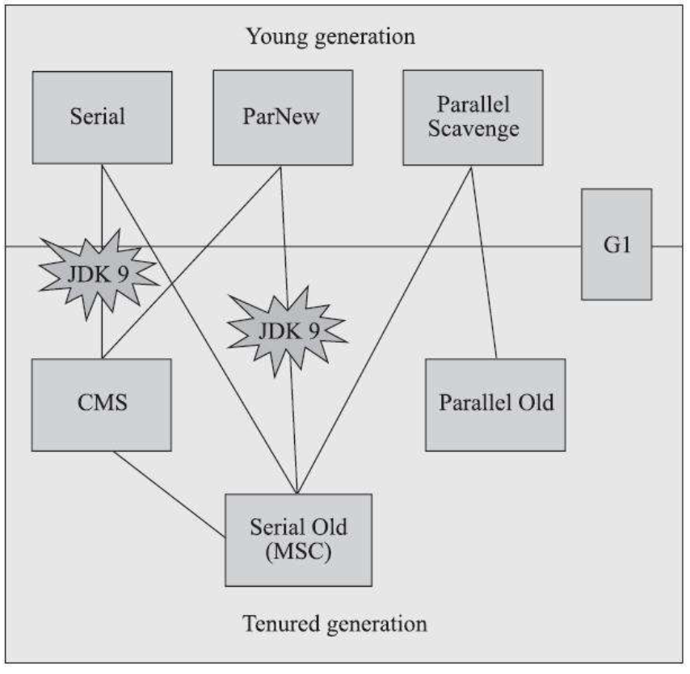
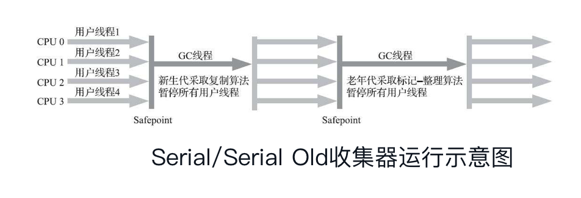
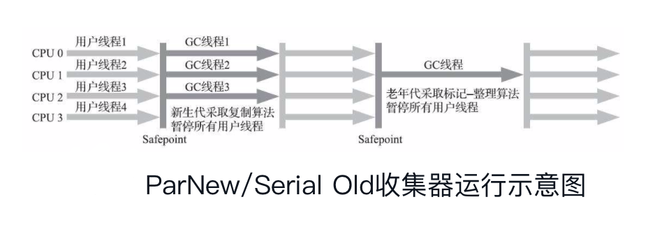
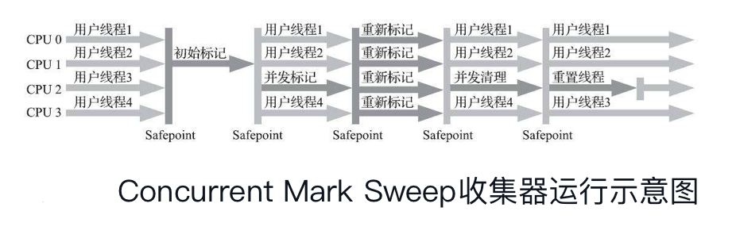
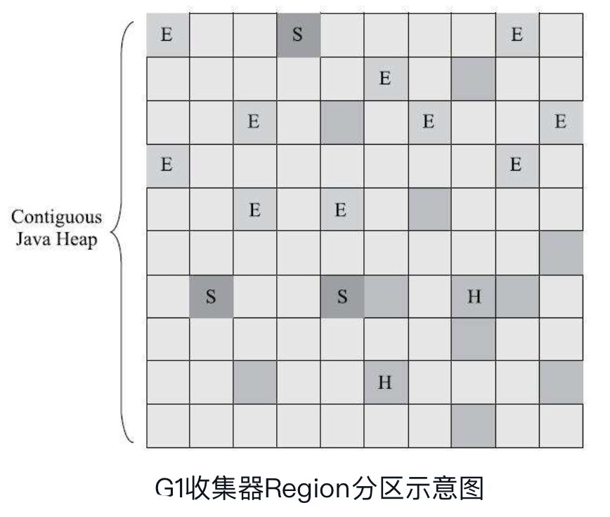
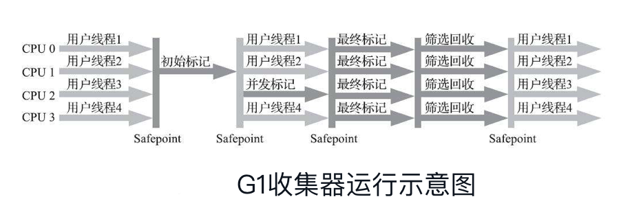

## 1、经典垃圾收集器

“经典”只是为了与目前处于实验阶段的几款高性能低延迟的收集器区分开，经典收集器主要是指在JDK7之后，JDK11正式发布之前所有可用的垃圾收集器。各经典垃圾收集器之间的关系如下：

图中展示了7种可用的垃圾收集器，连线表示可以搭配使用。垃圾收集器所处的区域表示属于新生代还是老年代的收集器。

### 1.1、Serial收集器

- 概述：最早最基础的收集器，它是一个`单线程工作`的收集器。
- 原理：“单线程”不仅仅是说明它只会使用一个处理器或者一个线程去完成垃圾收集工作，更重要的是强调它在垃圾收集的时候，必须暂停所有其他工作线程，直到它收集完毕。
- 特点：
  - 简单而高效。对于内存资源受限的环境，它是所有收集器里额外内存消耗最小的。
  - 对于单核处理器或者处理器核心少的环境来说，由于没有线程交互开销，收集效率非常高。
- 使用场景：对于客户端模式下的虚拟机来说，它是一个很好的选择。

### 1.2、ParNew收集器

- 概述：ParNew收集器本质上是`Serial收集器的多线程并行版本`，除了使用多线程进行垃圾收集之外，其余行为与Serial收集器相同。JDK5中引入具有划时代意义的CMS收集器，CMS收集老年代的时候，只能搭配Serial或ParNew收集器来收集新生代。
- 特点：
  - 支持ParNew收集器支持多线程并行收集。
  - ParNew收集器是激活CMS后的默认新生代收集器。可以认为ParNew合并入CMS了，成为它专处理新生代的组成部分。
- 场景：JDK7之前的运行在服务器模式下的新生代收集器。

### 1.3、Parallel Scavenge收集器

Parallel Scavenge收集器也是一款`新生代收集器`，基于`标记-复制`算法实现。也是`能够并行收集的多线程收集器`。

- 目标：控制和提高用户程序运行的吞吐量。由于与吞吐量密切相关，因此也被称为“吞吐量优先收集器”。

- 高吞吐量适合以最高效率利用处理器资源，尽快完成程序的运算任务，主要适合后台运算而不需要太多交互的分析任务。

### 1.4、CMS收集器

- 目标：获取`最短停顿时间的并发收集器`。Concurrent Mark Sweep说明了它是采用`标记-清除`的算法。

- 运行原理：运行过程较为复杂，分为4个过程

  - 初始标记：仅仅是标记一下GC Roots能直接关联的对象，速度很快。需要“Stop The World”，即停止所有线程。
  - 并发标记：从GC Roots直接关联的对象开始遍历整个对象图的过程。耗时长且不需要停顿，可与用户线程并发。
  - 重新标记：为了修正并发标记阶段因用户线程继续运行而导致标记变动的那一部分标记记录。
  - 并发清除：清理删除已经被判定死亡的对象，由于不需要移动对象，因此可以与用户线程并发运行。

  

- 缺点：

  - CMS对处理器资源比较敏感。在两个并发阶段会先用处理器资源，导致用户线程变慢，降低吞吐量。
  - CMS收集器无法处理“浮动垃圾”。并发标记阶段用户线程产生的新垃圾对象无法在本次收集过程中回收掉。
  - CMS基于标记-清除算法实现。收集结束会产生大量的内存碎片。CMS提供了一个-XX：+UseCMS-CompactAtFullCollection参数用来在无法为大对象分配内存的情况下需要Full GC的时候，开启合并整理功能。由于内存整理过程要移动对象而无法进行并发，因此停顿会长一些。因此还提供了另外一个参数-XX：CMSFullGCsBefore-Compaction，参数作用是要求CMS收集器在执行过若干次不整理空间的Full GC之后，下一次进入Full GC前会先进行碎片整理（默认值为0，表示每次进入Full GC时都进行碎片整理）

  

### 1.5、Garbage First收集器

- 目标：能够支持在一个指定时间长度M毫秒时间片段内，消耗在垃圾收集上的时间大概率不超过N毫秒的目标。

  

  - G1收集器也遵循分代收集理论设计，但实现方式不同。G1不再坚持固定大小以及固定数量的分代区域划分，而是把连续的Java堆划分为多个大小相等的独立区域（Region），每一个Region都可以根据需要，扮演新生代的Eden空间、Survivor空间或者老年代空间。收集器对于扮演不同角色的Region采用不同的策略去处理。
  - Region中还有一类特殊的Humongous区域，专门来存储大对象。G1认为只要大小超过了一个Region容量一半的对象即可判定为大对象。而对于那些需要占用整个Region容量的超级大对象，将会被存放在N个连续的Humongous Region之中，G1的大多数行为都把Humongous Region作为老年代的一部分进行看待。
  - 每次回收的内存空间都是Region的整数倍，避免在整个堆中进行全区域的垃圾收集，更具体的处理思路是`让G1收集器去跟踪各个Region中垃圾堆积的“价值”大小（价值即回收所获得的空间大小及回收所需要的时间），然后在后台维护一个优先级列表，每次根据用户设定的允许的收集停顿时间，优先处理回收价值最大的那些Region，这就是“Garbage First”的名字由来。这种使用Region划分内存空间的，以及具有优先级的区域回收方式，保证了G1收集器在有限时间内获取尽可能高的收集效率。`
  - 

- 与CMS的对比

  - **算法实现上**：CMS是基于“标记-清除”算法；G1从整体来看是基于“标记-整理”实现，但是局部看又是基于“标记-复制”的算法，所以G1运行期间不会产生内存空间碎片，垃圾收集完成之后能提供规整的可用空间。
  - **内存占用上**：G1和CMS都使用卡表处理跨带指针，但是G1的卡表实现更为复杂，而且堆中每个Region，不论是扮演新生代还是老年代，都必须有一份卡表，这导致G1的记忆集占用更多内存空间。而CMS只需要维护老年代到新生代的引用即可，占用内存相对少。
  - **执行负载上**：CMS使用写后屏障来更新维护卡表；G1除了使用写后屏障来进行同样算法，还需要使用写前屏障来跟踪并发时的指针变化情况。相比起增量更新算法，原始快照搜索能够减少CMS在重新标记阶段停顿时间过长的缺点，但是在用户程序运行过程中确实会产生由跟踪引用变化带来的额外负担。由于G1对写屏障的复杂操作要比CMS消耗更多的运算资源。CMS的写屏障实现是直接的同步操作，而G1不得不将其实现为类似于消息队列的结构，把写前屏障和写后屏障中要做的事情都放在队列里，然后异步处理。

- 小内存应用上CMS的表现大概率仍然会优于G1；大内存应用上G1大多能发挥其优势。目前这个优劣势Java堆容量平衡点通常在6GB至8GB之间。

## 2、低延迟垃圾收集器

