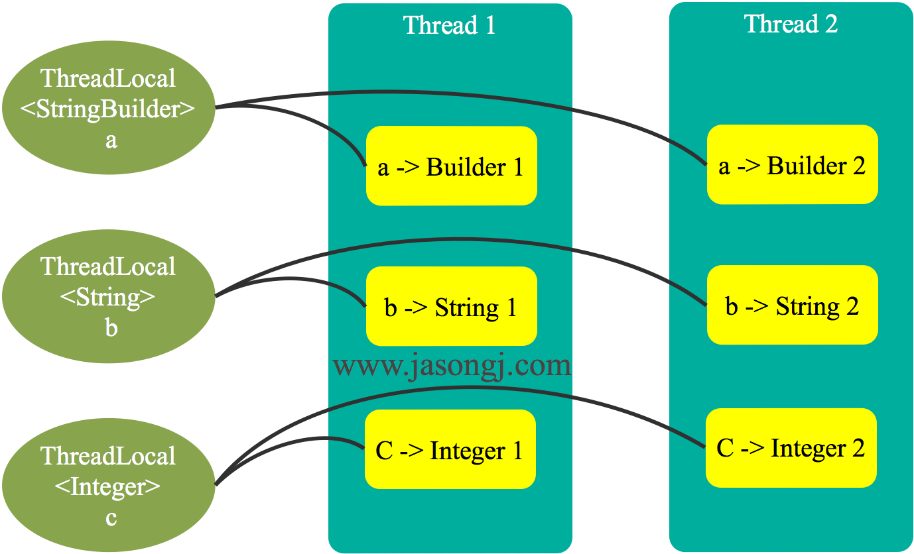
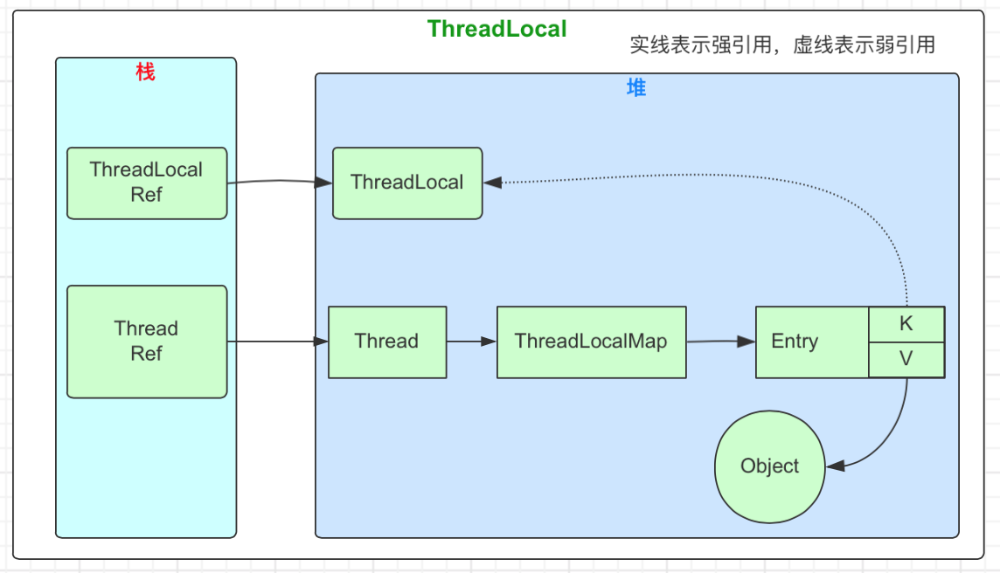

## 1、ThreadLocal是什么

ThreadLocal是一个在多线程环境下变量共享访问的类

> `作用`：ThreadLocal 用于每个线程需要自己独立的实例且该实例需要在多个方法中被使用，即**变量在线程间隔离而在方法或类间共享的场景**。
>
> `场景`：使变量在每个线程中都有独立拷贝，线程之间互不干扰的场景。最常见ThreadLocal使用场景有：解决数据库连接、Session管理等
>
> `用法`：ThreadLocal 变量通常被**private static**修饰。当一个线程结束时，它所使用的ThreadLocal对象中对应的副本变量都可被回收。

## 2、ThreadLocal用法

#### 2.1、实例代码

```java
import java.util.concurrent.CountDownLatch;
public class ThreadLocalDemo {

    private static class Counter {
        private static ThreadLocal<StringBuilder> counter = ThreadLocal.withInitial(StringBuilder::new);
    }

    private static class InnerClass {
        public void add(String newStr) {
            StringBuilder str = Counter.counter.get();
            Counter.counter.set(str.append(newStr));
        }
        public void set(String words) {
            Counter.counter.set(new StringBuilder(words));
            System.out.printf("Set, Thread name:%s , ThreadLocal hashcode:%s,  Instance hashcode:%s, Value:%s\n",
                    Thread.currentThread().getName(),
                    Counter.counter.hashCode(),
                    Counter.counter.get().hashCode(),
                    Counter.counter.get().toString());
        }
       public void print() {
            System.out.printf("Thread name:%s , ThreadLocal hashcode:%s, Instance hashcode:%s, Value:%s\n",
                    Thread.currentThread().getName(),
                    Counter.counter.hashCode(),
                    Counter.counter.get().hashCode(),
                    Counter.counter.get().toString());
        }
    }

    public static void main(String[] args) throws InterruptedException {
        int threads = 3;
        CountDownLatch countDownLatch = new CountDownLatch(threads);
        InnerClass innerClass = new InnerClass();
        for (int i = 0; i < threads; i++) {
            new Thread(() -> {
                for (int j = 0; j < 4; j++) {
                    innerClass.add(String.valueOf(j));
                    innerClass.print();
                }
                innerClass.set("hello world");
                countDownLatch.countDown();
            }, "T-" + i).start();
        }

        countDownLatch.await();
    }
}
```

输出结果如下：

```
Thread name:T-1 , ThreadLocal hashcode:1595128233, Instance hashcode:1636825749, Value:0
Thread name:T-2 , ThreadLocal hashcode:1595128233, Instance hashcode:620413642, Value:0
Thread name:T-0 , ThreadLocal hashcode:1595128233, Instance hashcode:975096498, Value:0
Thread name:T-0 , ThreadLocal hashcode:1595128233, Instance hashcode:975096498, Value:01
Thread name:T-2 , ThreadLocal hashcode:1595128233, Instance hashcode:620413642, Value:01
Thread name:T-2 , ThreadLocal hashcode:1595128233, Instance hashcode:620413642, Value:012
Thread name:T-2 , ThreadLocal hashcode:1595128233, Instance hashcode:620413642, Value:0123
Thread name:T-1 , ThreadLocal hashcode:1595128233, Instance hashcode:1636825749, Value:01
Set, Thread name:T-2 , ThreadLocal hashcode:1595128233,  Instance hashcode:708655141, Value:hello world
Thread name:T-0 , ThreadLocal hashcode:1595128233, Instance hashcode:975096498, Value:012
Thread name:T-0 , ThreadLocal hashcode:1595128233, Instance hashcode:975096498, Value:0123
Set, Thread name:T-0 , ThreadLocal hashcode:1595128233,  Instance hashcode:1042372905, Value:hello world
Thread name:T-1 , ThreadLocal hashcode:1595128233, Instance hashcode:1636825749, Value:012
Thread name:T-1 , ThreadLocal hashcode:1595128233, Instance hashcode:1636825749, Value:0123
Set, Thread name:T-1 , ThreadLocal hashcode:1595128233,  Instance hashcode:1173664928, Value:hello world
```

#### 2.2、实例分析

ThreadLocal本身支持范型。上面的案例使用了 StringBuilder 类型的 ThreadLocal 变量。可通过 ThreadLocal 的 get() 方法读取 StringBuidler 实例，也可通过 set(T t) 方法设置 StringBuilder。从输出结果可以看出：

- 从第1-3行输出可见，每个线程通过 ThreadLocal 的 get() 方法拿到的是不同的 StringBuilder 实例
- 从第1-3行输出表明，每个线程所访问到的是同一个 ThreadLocal 变量
- 从7、11、14行输出以及第22行代码可见，虽然从代码上都是对 Counter 类的静态 counter 字段进行 get() 得到 StringBuilder 实例并追加字符串，但是这并不会将所有线程追加的字符串都放进同一个 StringBuilder 中，而是每个线程将字符串追加进各自的 StringBuidler 实例内。
- 对比第7行与第14行输出并结合第14行代码可知，使用 set(T t) 方法后，ThreadLocal 变量所指向的 StringBuilder 实例被替换。

## 3、ThreadLocal原理

### 3.1、ThreadLocal维护线程与实例的映射

既然每个访问ThreadLocal变量的线程都有自己的一个“本地”实例副本。一个可能的方案是ThreadLocal维护了一个Map，键是Thread，值是它在Thread内的实例。线程通过该ThreadLocal的get方法获取实例时，只要以线程为键，从Map中找到对应的实例即可。该方案如下：


该方案可满足上文提到的每个线程内一个独立备份的要求。每个新线程访问该 ThreadLocal 时，需要向 Map 中添加一个映射，而每个线程结束时，应该清除该映射。这里就有两个问题：

- 增加线程与减少线程均需要写 Map，故需保证该 Map 线程安全。虽然有线程安全的ConcurrentHashMap，但它或多或少都需要锁来保证线程的安全性。加锁的问题，也是JDK 未采用该方案的一个原因。
- 线程结束时，需要保证它所访问的所有 ThreadLocal 中对应的映射均删除，否则可能会引起内存泄漏。

### 3.2、Thread维护ThreadLocal与实例的映射

上面的方案中，出现锁的问题，原因在于多线程访问同一个Map。

如果该Map由 Thread 维护，从而使得每个Thread只访问自己的 Map，那就不存在多线程写的问题，也就不需要锁。该方案如下图所示。



该方案虽然没有锁的问题，但是由于每个线程访问某 ThreadLocal 变量后，都会在自己的 Map 内维护该 ThreadLocal 变量与具体实例的映射，如果不删除这些引用（映射），则这些 ThreadLocal 不能被回收，可能会造成内存泄漏。后文会介绍 JDK 如何解决该问题。

## 4、ThreadLocal 在 JDK 8 中的实现

JDK中ThreadLocal实现原理与运行时图



### 4.1、ThreadLocalMap与内存泄漏

- Map由ThreadLocal类的静态内部类ThreadLocalMap提供。该类的实例维护某个 ThreadLocal 与具体实例的映射。

- 与 HashMap 不同的是，ThreadLocalMap 的每个 Entry 都是一个对 **键** 的弱引用。另外，每个 Entry 都包含了一个对**值** 的强引用。

```java
static class Entry extends WeakReference<ThreadLocal<?>> {
  /** 通过这个value属性建立所关联的ThreadLocal变量，它保存的就是ThreadLocal变量的引用 */
  Object value;
  Entry(ThreadLocal<?> k, Object v) {
    super(k);
    value = v;
  }
}
```

使用弱引用的原因在于，当没有强引用指向 ThreadLocal 变量时，它可被回收，从而避免上文所述 ThreadLocal 不能被回收而造成的内存泄漏的问题。但是，这里又可能出现另外一种内存泄漏的问题。ThreadLocalMap 维护 ThreadLocal 变量与具体实例的映射，当 ThreadLocal 变量被回收后，该映射的键变为 null，该 Entry 无法被移除。从而使得实例被该 Entry 引用而无法被回收造成内存泄漏。注：Entry虽然是弱引用，但它是 ThreadLocal 类型的弱引用（也即上文所述它是对 ***键\*** 的弱引用），而非具体实例的的弱引用，所以无法避免具体实例相关的内存泄漏。

### 4.2、读取实例

读取实例方法如下所示

```java
/**
  * ThreadLocal#get()方法，获取放入的数据副本
  */
public T get() {
    // 获取当前线程对象
  	Thread t = Thread.currentThread();
    // 从当前线程对象中取出ThreadLocalMap映射信息
  	ThreadLocalMap map = getMap(t);
  	if (map != null) {
        // 从当前线程维护的映射集合中取出与当前ThreadLocal的关联实体，this就是当前访问的ThreadLocal对象。
    	ThreadLocalMap.Entry e = map.getEntry(this);
        //Entry不为null，就从中取出本线程对应的实例；否则会进入下面的setInitialValue()设置初始值
    	if (e != null) {
      		@SuppressWarnings("unchecked")
            // 从实体中取出当前线程自身关联维护的值
      		T result = (T)e.value;
      		return result;
    	}
  	}
    return setInitialValue();
}

ThreadLocalMap getMap(Thread t) {
  return t.threadLocals;
}
```

读取实例时，线程首先通过`getMap(t)`方法获取线程自身维护的 ThreadLocalMap。从ge tMap()方法可知ThreadLocalMap的实例是 Thread 类的一个属性，即由`Thread 维护 ThreadLocal 对象与具体实例的映射。`

### 4.3、设置初始值

设置初始值方法如下

```java
//该方法为private方法，无法被重载
private T setInitialValue() {
  	T value = initialValue();
  	Thread t = Thread.currentThread();
    // 从当前线程中获取与当前ThreadLocal变量关联的映射
  	ThreadLocalMap map = getMap(t);
    //map不为空，就直接ThreadLocal对象和初始值的映射添加到当前线程ThreadLocalMap中维护。
  	if (map != null)
    	map.set(this, value);
  	else
    //map为空，就直接创建新的映射关联
    	createMap(t, value);
  	return value;
}
```

- 通过`initialValue()`方法获取初始值。该方法为public，且默认返回 null。典型用法中常常重载该方法。案例中在内部匿名类中将其重载。

- 这里并不需要考虑 ThreadLocalMap的线程安全问题。因为每个线程有且只有一个 ThreadLocalMap 对象，并且只有该线程自己可以访问它，其它线程不会访问该 ThreadLocalMap，也即该对象不会在多个线程中共享，也就不存在线程安全的问题。

### 4.3、设置实例

除了通过`initialValue()`方法设置实例的初始值，还可通过set方法设置线程内实例的值，如下所示。

```java
public void set(T value) {
  	Thread t = Thread.currentThread();
  	ThreadLocalMap map = getMap(t);
  	if (map != null)
    	map.set(this, value);
  	else
    	createMap(t, value);
}
```

该方法先获取该线程的 ThreadLocalMap 对象，然后直接将 ThreadLocal 对象（即代码中的 this）与目标实例的映射添加进 ThreadLocalMap 中。当然，如果映射已经存在，就直接覆盖。另外，如果获取到的 ThreadLocalMap 为 null，则先创建该 ThreadLocalMap 对象。

### 4.4、防止内存泄漏

对于已经不再被使用且已被回收的 ThreadLocal 对象，它在每个线程内对应的实例由于被线程的 ThreadLocalMap 的 Entry 强引用，无法被回收，可能会造成内存泄漏。针对该问题，ThreadLocalMap 的 set 方法中，通过 replaceStaleEntry 方法将所有键为null 的Entry的值设置为null，从而使得该值可被回收。会在 rehash 方法中通过 expungeStaleEntry 方法将键和值为null的Entry设置为null 从而使得该 Entry 可被回收。通过这种方式，ThreadLocal 可防止内存泄漏。

```java
private void set(ThreadLocal<?> key, Object value) {
  	Entry[] tab = table;
  	int len = tab.length;
  	int i = key.threadLocalHashCode & (len-1);

  	for (Entry e = tab[i]; e != null; e = tab[i = nextIndex(i, len)]) {
    	ThreadLocal<?> k = e.get();
    	if (k == key) {
      		e.value = value;
      		return;
    	}
    	if (k == null) {
      		replaceStaleEntry(key, value, i);
      		return;
    	}
  	}
  	tab[i] = new Entry(key, value);
  	int sz = ++size;
  	if (!cleanSomeSlots(i, sz) && sz >= threshold){
        rehash();
    }
}
```

避免内存泄漏：使用者手动调用ThreadLocal的remove函数，手动删除不再需要的ThreadLocal，防止内存泄露。

## 5、适用场景

- 如上文所述，ThreadLocal 适用于如下两种场景
    - 每个线程需要有自己单独的实例。
    - 实例需要在多个方法中共享，但不希望被多线程共享。

- 常见开源框架中有
    - PageHelper 的PageInfo
    - Dubbo的RpcConetxt
    - 日志的MDC
    - spring的声明式事务
    - spring的RequestContextHolder

## 6、使用案例一

对于 Java Web 应用而言，Session 保存了很多信息。很多时候需要通过 Session 获取信息，有些时候又需要修改 Session 的信息。一方面，需要保证每个线程有自己单独的 Session 实例。另一方面，由于很多地方都需要操作 Session，存在多方法共享 Session 的需求。如果不使用 ThreadLocal，可以在每个线程内构建一个 Session实例，并将该实例在多个方法间传递，如下所示。

```java
public class SessionHandler {
  	@Data
  	public static class Session {
    	private String id;
    	private String user;
    	private String status;
  	}
  	public Session createSession() {
    	return new Session();
  	}
  	public String getUser(Session session) {
    	return session.getUser();
  	}
  	public String getStatus(Session session) {
    	return session.getStatus();
  	}
  	public void setStatus(Session session, String status) {
    	session.setStatus(status);
  	}

  	public static void main(String[] args) {
    	new Thread(() -> {
      		SessionHandler handler = new SessionHandler();
      		Session session = handler.createSession();
      		handler.getStatus(session);
      		handler.getUser(session);
      		handler.setStatus(session, "close");
      		handler.getStatus(session);
    	}).start();
  	}
}
```

该方法是可以实现需求的。但是每个需要使用 Session 的地方，都需要显式传递 Session 对象，方法间耦合度较高。使用 ThreadLocal 重新实现该功能：

```java
public class SessionHandler {
  public static ThreadLocal<Session> session = ThreadLocal.<Session>withInitial(() -> new Session());
  	@Data
  	public static class Session {
    	private String id;
    	private String user;
    	private String status;
  	}

  	public String getUser() {
    	return session.get().getUser();
  	}
  	public String getStatus() {
    	return session.get().getStatus();
  	}
  	public void setStatus(String status) {
    	session.get().setStatus(status);
  	}

  	public static void main(String[] args) {
    	new Thread(() -> {
      		SessionHandler handler = new SessionHandler();
      		handler.getStatus();
      		handler.getUser();
     	    handler.setStatus("close");
      		handler.getStatus();
    	}).start();
  	}
}
```

使用 ThreadLocal 改造后的代码，不再需要在各个方法间传递 Session 对象，并且也非常轻松的保证了每个线程拥有自己独立的实例。如果单看其中某一点，替代方法很多。比如可通过在线程内创建局部变量可实现每个线程有自己的实例，使用静态变量可实现变量在方法间的共享。但如果要同时满足变量在线程间的隔离与方法间的共享，ThreadLocal再合适不过。


## 7、使用案例二

**最典型的是管理数据库的Connection：**当时在学JDBC的时候，为了方便操作写了一个简单数据库连接池，需要数据库连接池的理由也很简单，频繁创建和关闭Connection是一件非常耗费资源的操作，因此需要创建数据库连接池。那么，数据库连接池的连接怎么管理呢？？我们交由ThreadLocal来进行管理。为什么交给它来管理呢？？ThreadLocal能够实现**当前线程的操作都是用同一个Connection，保证了事务！**

```java
public class DBUtil {
    //数据库连接池
    private static BasicDataSource source;
    //为不同的线程管理连接
    private static ThreadLocal<Connection> local;
    static {
        try {
            //1、加载配置文件
            Properties properties = new Properties();
            //2、获取读取流
            InputStream stream = DBUtil.class.getClassLoader().getResourceAsStream("连接池/config.properties");
            //3、从配置文件中读取数据
            properties.load(stream);
            //4、关闭流
            stream.close();
            //5、初始化连接池
            source = new BasicDataSource();
            //6、设置驱动
            source.setDriverClassName(properties.getProperty("driver"));
            //7、设置url
            source.setUrl(properties.getProperty("url"));
            //8、设置用户名
            source.setUsername(properties.getProperty("user"));
            //9、设置密码
            source.setPassword(properties.getProperty("pwd"));
            //10、设置初始连接数量
            source.setInitialSize(Integer.parseInt(properties.getProperty("initsize")));
            //11、设置最大的连接数量
            source.setMaxActive(Integer.parseInt(properties.getProperty("maxactive")));
            //12、设置最长的等待时间
            source.setMaxWait(Integer.parseInt(properties.getProperty("maxwait")));
            //13、设置最小空闲数
            source.setMinIdle(Integer.parseInt(properties.getProperty("minidle")));
            //14、初始化线程本地
            local = new ThreadLocal<>();
        } catch (IOException e) {
            e.printStackTrace();
        }
    }

    public static Connection getConnection() throws SQLException {
        if(local.get()!=null){
            return local.get();
        } else {
          //1、获取Connection对象
          Connection connection = source.getConnection();
          //2、把Connection放进ThreadLocal里面
          local.set(connection);
          //3、返回Connection对象
          return connection;
       }
    }

    //关闭数据库连接
    public static void closeConnection() {
        //从线程中拿到Connection对象
        Connection connection = local.get();
        try {
            if (connection != null) {
                //恢复连接为自动提交
                connection.setAutoCommit(true);
                //这里不是真的把连接关了,只是将该连接归还给连接池
                connection.close();
                //既然连接已经归还给连接池了,ThreadLocal保存的Connction对象也已经没用了
                local.remove();
            }
        } catch (SQLException e) {
            e.printStackTrace();
        }
        // finally 这里也需要关闭 connection 和 remove  local
    }
}
```

同样的，Hibernate对Connection的管理也是采用了相同的手法。

## 8、总结

> - ThreadLocal 并不解决线程间共享数据的问题
> - ThreadLocal 通过隐式的在不同线程内创建独立实例副本避免了实例线程安全的问题
> - 每个线程持有一个 Map 并维护了 ThreadLocal 对象与具体实例的映射，该 Map 由于只被持有它的线程访问，故不存在线程安全以及锁的问题
> - ThreadLocalMap的 Entry 对 ThreadLocal 的引用为弱引用，避免了 ThreadLocal 对象无法被回收的问题
> - ThreadLocalMap的set方法通过调用 replaceStaleEntry方法回收键为 null 的 Entry 对象的值（即具体实例以及Entry对象本身从而防止内存泄漏
> - ThreadLocal 适用于变量在线程间隔离且在方法间共享的场景

