ThreadLocal是一个线程本地变量，也就意味着这个变量是线程独有的，是不能与其他线程共享的，这样就可以避免资源竞争带来的多线程问题。这种解决多线程的安全问题和Lock（这里的Lock指的是synchronized 或者Lock 等实现的锁）是有本质区别的：

- Lock的资源是多个线程共享的，访问的时候需要加锁；Lock是通过时间换空间的方式
- ThreadLocal是每个线程都有一个数据副本，不需要加锁；ThreadLocal是典型的空间换时间的方式
- 它们的使用场景不一样，关键是看关注的资源是多线程之间共享的还是单线程内部独享的。

## 0、ThreadLocal方法

ThreadLocal有4个方法

- public T get() { }：获取ThreadLocal在当前线程中保存的变量副本
- public void set(T value) { }：将变量作为副本数据，保存在当前线程的ThreadLocalMap中
- public void remove() { }：移除当前线程中变量的副本，加快GC回收
- protected T initialValue(){ }：protected方法，一般是用来在使用时进行重写的

## 1、使用案例

 ```java
public class Test {
    public static void main(String[] args) {
        ThreadLocal<String> local = new ThreadLocal<>();
        //设置值
        local.set("hello word");
        //获取刚刚设置的值
        System.out.println(local.get());
    }
}
 ```

## 2、源码分析

在分析源代码之前先看一下，Thread、ThreadLocal以及ThreadLocalMap之间的关系

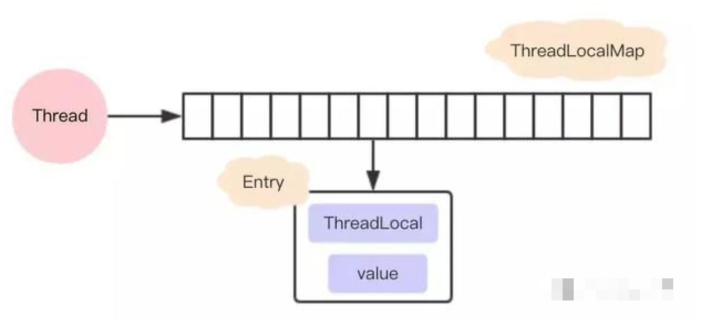


### 2.1、set方法

```java
/** 设置变量 */
public void set(T value) {
    Thread t = Thread.currentThread();
    //获取当前线程中的ThreadLocalMap，第一次调用的时候，会进入createMap()方法初始化
    ThreadLocalMap map = getMap(t);
    if (map != null){
        map.set(this, value);
    } else {
        createMap(t, value);
    }
}

/** 创建ThreadLocalMap，并且赋值给Thread对象的threadLocals属性 */
void createMap(Thread t, T firstValue) {
    t.threadLocals = new ThreadLocalMap(this, firstValue);
}
```

值真正的存放在ThreadLocalMap中存取的，ThreadLocalMap内部类中有一个Entry类，key是ThreadLocal对象，value是要存放的值。ThreadLocalMap和HashMap的功能类似，但是实现上有很大不同：

- HashMap的数据结构是数组+链表；ThreadLocalMap的内部数据结构仅仅是数组
- HashMap通过链地址法解决hash冲突问题；ThreadLocalMap是通过开放地址法
- HashMap里Entry实体类的引用都是强引用；ThreadLocalMap中Entry类的key是弱引用，value是强引用

### 2.2、选择开放地址法来解决哈希冲突

JDK中大多数的类都是采用了链地址法来解决hash 冲突，为什么ThreadLocalMap 采用开放地址法来解决哈希冲突呢？首先我们来看看这两种不同的方式

- **链地址法**

    这种方法的基本思想是将所有哈希地址为i的元素构成一个称为同义词链的单链表，并将单链表的头指针存在哈希表的第i个单元中，因而查找、插入和删除主要在同义词链中进行。列如对于关键字集合{12,67,56,16,25,37, 22,29,15,47,48,34}，我们用前面同样的12为除数，进行除留余数法：

    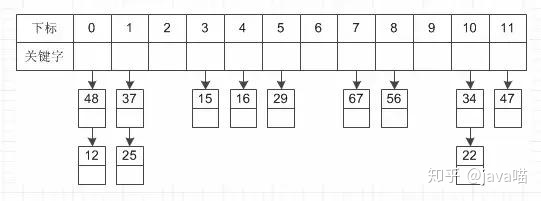

- **开放地址法**

    这种方法的基本思想是一旦发生了冲突，就去寻找下一个空的散列地址(这非常重要，源码都是根据这个特性，必须理解这里才能往下走)，只要散列表足够大，空的散列地址总能找到，并将记录存入。

    比如说，我们的关键字集合为{12,33,4,5,15,25},表长为10。 我们用散列函数f(key) = key mod l0。 当计算前S个数{12,33,4,5}时，都是没有冲突的散列地址，直接存入（蓝色代表为空的，可以存放数据）：

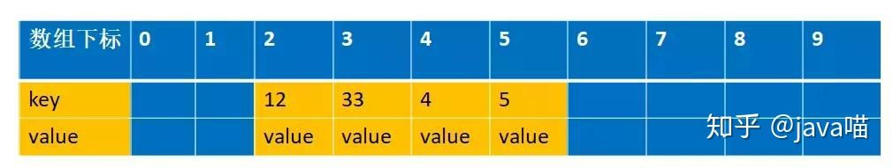

​			计算key = 15时，发现f(15) = 5，此时就与5所在的位置冲突。于是我们应用上面的公式f(15) = (f(15)+1) mod 10 =6。于是将15存入下标为6的位置。这			其实就是房子被人买了于是买下一间的作法：

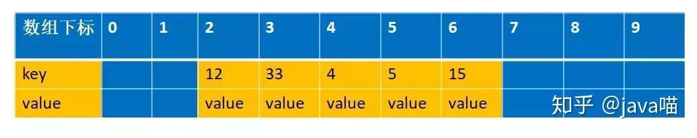

- **链地址法和开放地址法的优缺点**

    - 开放地址法：
        - 容易产生堆积问题，不适于大规模的数据存储。
        - 散列函数的设计对冲突会有很大的影响，插入时可能会出现多次冲突的现象。
        - 删除的元素是多个冲突元素中的一个，需要对后面的元素作处理，实现较复杂。
    - 链地址法：
        - 处理冲突简单，且无堆积现象，平均查找长度短。
        - 链表中的结点是动态申请的，适合构造表不能确定长度的情况。
        - 删除结点的操作易于实现。只要简单地删去链表上相应的结点即可。
        - 指针需要额外的空间，故当结点规模较小时，开放定址法较为节省空间。

- **ThreadLocalMap 采用开放地址法原因**

    - ThreadLocal 中看到一个属性 HASH_INCREMENT = 0x61c88647 ，0x61c88647 是一个神奇的数字，让哈希码能均匀的分布在2的N次方的数组里, 即 Entry[] table，关于这个神奇的数字google 有很多解析，这里就不重复说了
    - ThreadLocal 往往存放的数据量不会特别大（而且key 是弱引用又会被垃圾回收，及时让数据量更小），这个时候开放地址法简单的结构会显得更省空间，同时数组的查询效率也是非常高，加上第一点的保障，冲突概率也低

- **弱引用**

    接下来我们看看ThreadLocalMap 中的存放数据的内部类Entry 的实现源码

    ```java
    static class Entry extends WeakReference<ThreadLocal<?>> {
        Object value;
        Entry(ThreadLocal<?> k, Object v) {
            super(k);
            value = v;
        }
    }
    ```

    可以知道Entry 的key 是一个弱引用，也就意味这可能会被垃圾回收器回收掉了，`threadLocal.get()==null`意味着被回收掉了。

### 2.3、ThreadLocalMap set 方法

```java
/** ThreadLocal的set方法最终都会落实到ThreadLocalMap#set方法的调用上 */
private void set(ThreadLocal<?> key, Object value) {
	Entry[] tab = table;
    int len = tab.length;
    // 计算数组下标
    int i = key.threadLocalHashCode & (len-1);
	// 先通过hash找到数组下标，然后寻找相等的ThreadLocal对象，找不到就往下一个index查找
    // 循环推出的条件有2个：
    //（1）找到了相同ThreadLocal对象
    //（2）一直往数组下一个下标查询，直到下一个下标对应的是null 跳出
    for (Entry e = tab[i]; e != null; e = tab[i = nextIndex(i, len)]) {
        ThreadLocal<?> k = e.get();
        // 如果找到相同的ThreadLocal对象，就直接返回
        if (k == key) {
            e.value = value;
            return;
        }
		// k==null && e!=null 说明key被垃圾回收了
        if (k == null) {
            // 被回收的话就需要替换掉过期过期的值，把新的值放在这里返回
            replaceStaleEntry(key, value, i);
            return;
        }
    }
    //执行流程到这里就说明没找到
    tab[i] = new Entry(key, value);
    int sz = ++size;
    if (!cleanSomeSlots(i, sz) && sz >= threshold){
        //进行扩容，这里先不讲
        rehash();
    }
}
```

还是用上面解释开放地址法解释的例子来说明下。 比如说，我们的关键字集合为{12,33,4,5,15,25},表长为10。 我们用散列函数f(key) = key mod 10。 当计算前S个数{12,33,4,5,15,25}时，并且此时key=33，k=5 已经过期了（蓝色代表为空的，可以存放数据，红色代表key 过期，过期的key为null）：

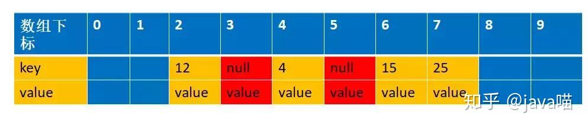

```java
//这时候来了一个新的数据，key=15,value=new,通过计算f(15)=5,此时5已经过期，进入到下面这个if 语句    
if (k == null) {
    //key过期了，要进行替换
    replaceStaleEntry(key, value, i);
    return;
}
```

#### 2.3.1、replaceStaleEntry

```java
private void replaceStaleEntry(ThreadLocal<?> key, Object value, int staleSlot) {
    Entry[] tab = table;
    int len = tab.length;
    Entry e;
    //第一步：这里采用的是从当前的staleSlot 位置向前面遍历，i--。这是为了把前面所有的已经被垃圾回收的也一起释放空间出来
    //		 注意这里只是key被回收，value还没被回收，entry更加没回收，所以需要让他们回收
    //		 同时也避免这样存在很多过期的对象的占用,导致这个时候刚好来了一个新的元素达到阀值而触发一次新的rehash
    int slotToExpunge = staleSlot;
    for (int i = prevIndex(staleSlot, len); (e = tab[i]) != null; i = prevIndex(i, len)){
        //slotToExpunge 记录staleSlot左手边第一个空的entry 到staleSlot 之间key过期最小的index
        if (e.get() == null) slotToExpunge = i;
    }
	
    //第二步：从数组下标小的往下标大的方向遍历，i++，刚好跟上面相反。
    //		这两个遍历就是为了在左边遇到的第一个空的entry到右边遇到的第一空的 entry之间查询所有过期的对象。
    //		在右边如果找到需要设置值的key（这个例子是key=15）相同的时候就开始清理，然后返回，不再继续遍历下去了
    for (int i = nextIndex(staleSlot, len); (e = tab[i]) != null; i = nextIndex(i, len)) {
        ThreadLocal<?> k = e.get();
        
        if (k == key) {
            //说明之前已经存在相同的key，所以需要替换旧的值并且和前面那个过期的对象的进行交换位置
            e.value = value;
            tab[i] = tab[staleSlot];
            tab[staleSlot] = e;
            //这里的意思就是前面的第一个for 循环(i--)往前查找的时候没有找到过期的，只有staleSlot
            // 这个过期，由于前面过期的对象已经通过交换位置的方式放到index=i上了，
            // 所以需要清理的位置是i,而不是传过来的staleSlot
            if (slotToExpunge == staleSlot){
                slotToExpunge = i;
            }
            //进行清理过期数据
            cleanSomeSlots(expungeStaleEntry(slotToExpunge), len);
            return;
        }
        // 如果我们在第一个for 循环(i--) 向前遍历的时候没有找到任何过期的对象
        // 那么我们需要把slotToExpunge 设置为向后遍历(i++) 的第一个过期对象的位置
        // 因为如果整个数组都没有找到要设置的key 的时候，该key 会设置在该staleSlot的位置上
        // 如果数组中存在要设置的key,那么上面也会通过交换位置的时候把有效值移到staleSlot位置上
        // 综上所述，staleSlot位置上不管怎么样，存放的都是有效的值，所以不需要清理的
        if (k == null && slotToExpunge == staleSlot){
            slotToExpunge = i;
        }
    }
    // 如果key在数组中没有存在，那么直接新建一个新的放进去就可以
    tab[staleSlot].value = null;
    tab[staleSlot] = new Entry(key, value);
    // 如果有其他已经过期的对象，那么需要清理他
    if (slotToExpunge != staleSlot){
        cleanSomeSlots(expungeStaleEntry(slotToExpunge), len);
    }
}
```

第一个for 循环是向前遍历数据的，直到遍历到空的entry 就停止（这个是根据开放地址的线性探测法）,这里的例子就是遍历到index=1就停止了。向前遍历的过程同时会找出过期的key,这个时候找到的是下标index=3 的为过期，进入到

```java
if (e.get() == null){
	slotToExpunge = i;
}                  
```

注意此时slotToExpunge=3，staleSlot=5

第二个for 循环是从index=staleSlot开始，向后编列的，找出是否有和当前匹配的key,有的话进行清理过期的对象和重新设置当前的值。这个例子遍历到index=6 的时候，匹配到key=15的值，进入如下代码

```java
if (k == key) {
    e.value = value;
    tab[i] = tab[staleSlot];
    tab[staleSlot] = e;
    if (slotToExpunge == staleSlot){
        slotToExpunge = i;
    }
    cleanSomeSlots(expungeStaleEntry(slotToExpunge), len);
    return;
}
```

先进行数据交换，注意此时slotToExpunge=3，staleSlot=5，i=6。这里就是把5 和6 的位置的元素进行交换，并且设置新的value=new,交换后的图是这样的

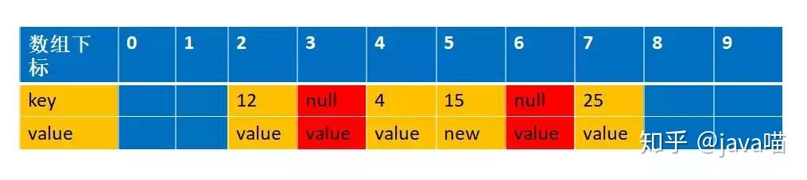

#### 2.3.2、为什么要交换

这里解释下为什么交换，我们先来看看如果不交换的话，经过设置值和清理过期对象，会是以下这张图

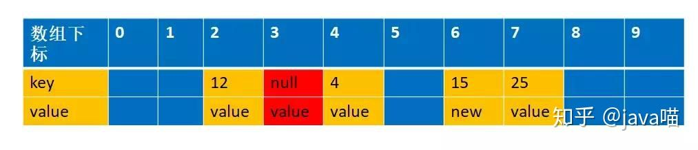

这个时候如果我们再一次设置一个key=15,value=new2 的值，通过f(15)=5,这个时候由于上次index=5是过期对象，被清空了，所以可以存在数据，那么就直接存放在这里了

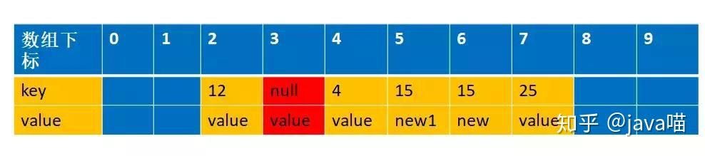

你看，这样整个数组就存在两个key=15 的数据了，这样是不允许的，所以一定要交换数

#### 2.3.3、**expungeStaleEntry**

```java
private int expungeStaleEntry(int staleSlot) {
    Entry[] tab = table;
    int len = tab.length;

    // expunge entry at staleSlot
    tab[staleSlot].value = null;
    tab[staleSlot] = null;
    size--;

    // Rehash until we encounter null
    Entry e;
    int i;
    for (i = nextIndex(staleSlot, len);
         (e = tab[i]) != null;
         i = nextIndex(i, len)) {
        ThreadLocal<?> k = e.get();
        if (k == null) {
            e.value = null;
            tab[i] = null;
            size--;
        } else {
            //这里主要的作用是由于采用了开放地址法，所以删除的元素是多个冲突元素中的一个，需要对后面的元素作
            //处理，可以简单理解就是让后面的元素往前面移动
            //为什么要这样做呢？主要是开放地址寻找元素的时候，遇到null 就停止寻找了，你前面k==null
            //的时候已经设置entry为null了，不移动的话，那么后面的元素就永远访问不了了，下面会画图进行解释说明
            int h = k.threadLocalHashCode & (len - 1);
            if (h != i) {
                tab[i] = null;
                //他们不相等，说明是经过hash 是有冲突的
                while (tab[h] != null)
                    h = nextIndex(h, len);
                tab[h] = e;
            }
        }
    }
    return i;
}
```

接下来我们详细模拟下整个过程 根据我们的例子，key=5,15,25 都是冲突的，并且k=5的值已经过期，经过replaceStaleEntry 方法，在进入expungeStaleEntry 方法之前，数据结构是这样的

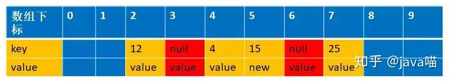

此时传进来的参数staleSlot=6

```java
if (k == null) {
    //这里设置为null ,方便让GC 回收
    e.value = null;
    tab[i] = null;
    size--;
}
```

这个时候会把index=6设置为null,数据结构变成下面的情况

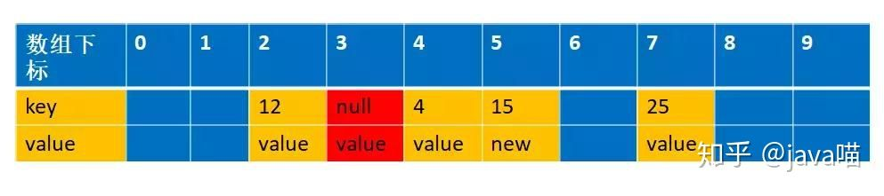

```java
//接下来我们会遍历到i=7，经过int h = k.threadLocalHashCode & (len - 1) (实际上对应我们的举例的函数int h= f(25)); 
//得到的h=5,而25实际存放在index=7 的位置上，这个时候我们需要从h=5的位置上重新开始编列，直到遇到空的entry 为止                    
int h = k.threadLocalHashCode & (len - 1);
if (h != i) {
    tab[i] = null;
    while (tab[h] != null)
        h = nextIndex(h, len);
    tab[h] = e;
}
```

这个时候h=6，并把k=25 的值移到index=6 的位置上，同时设置index=7 为空，如下图

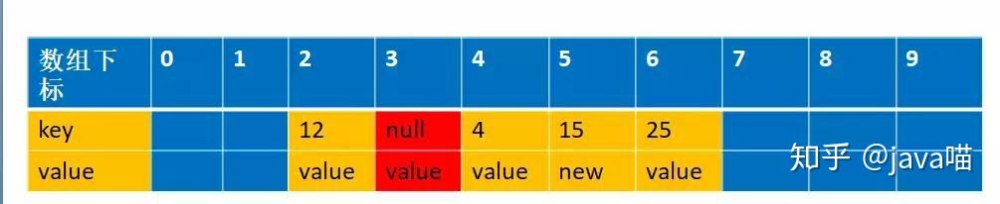

其实目的跟replaceStaleEntry 交换位置的原理是一样的，为了防止由于回收掉中间那个冲突的值，导致后面冲突的值没办法找到

### 2.4、ThreadLocal 内存溢出问题

通过上面的分析，我们知道expungeStaleEntry() 方法是帮助垃圾回收的，根据源码，我们可以发现 get 和set 方法都可能触发清理方法expungeStaleEntry()，所以正常情况下是不会有内存溢出的 但是如果我们没有调用get 和set 的时候就会可能面临着内存溢出，养成好习惯不再使用的时候调用remove(),加快垃圾回收，避免内存溢出。退一步说，就算我们没有调用get 和set 和remove 方法,线程结束的时候，也就没有强引用再指向ThreadLocal 中的ThreadLocalMap了，这样ThreadLocalMap 和里面的元素也会被回收掉，但是有一种危险是，如果线程是线程池的， 在线程执行完代码的时候并没有结束，只是归还给线程池，这个时候ThreadLocalMap 和里面的元素是不会回收掉。

