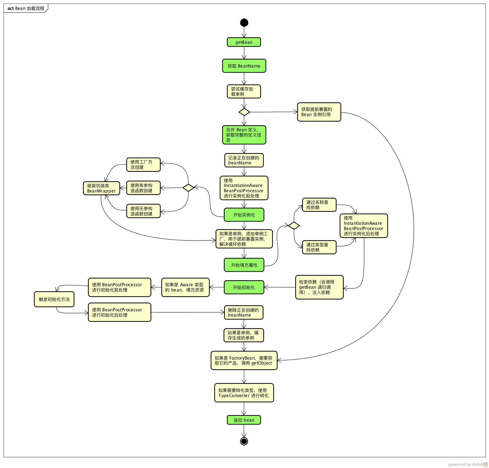

## 1、FactoryBean

为了解决**应对各种复杂情况下bean的实例化过程，也为了提高灵活性**，Spring提供了一个org.springframework.beans.factory.FactoryBean的工厂类接口，用户可以通过实现该接口定制实例化bean的逻辑。FactoryBean对于Spring框架至关重要，Spring自身为其提供了70多个FactoryBean的实现。

Spring3.0开始FactoryBean接口支持泛型，它的定义为：

```java
public interface FactoryBean<T> {
	/** 返回由FactoryBean创建的bean实例，如果isSingeton()返回true，则该实例会被放入到Spring容器的单实力池中 */
	T getObject() throws Exception;
	/** 返回由FactoryBean创建bean的类型 */
	Class<?> getObjectType();

	/** 返回FactoryBean创建的bean实例作用域是singleton还是prototype */
	default boolean isSingleton() {
		return true;
	}
}
```


## 2、Bean的加载流程

一般情况下，我们使用Spring的最简单的代码如下：

```java
ApplicationContext context = new ClassPathXmlApplicationContext("hello.xml");
HelloBean helloBean = (HelloBean) context.getBean("hello");
helloBean.sayHello();
```

因此就通过`getBean()`方法作为入口，去理解Spring如何加载Bean，以及内部创建Bean、作用域、依赖关系处理等细节

### 2.1、总体流程图



从图中可以看到Bean的加载过程可以分为几个关键的步骤：

- **获取和转化Bean名称**。对转入的name进行解析，转化为可以从Map中获取到BeanDefinition的beanName。
- **合并Bean定义**。对父类的中Bean定义信息进行合并与覆盖操作，如果父类还有父类，递归方式合并来整合Bean的完整定义信息。
- **实例化**。使用构造函数或工厂方法创建Bean实例。
- **属性填充**。寻找并注入依赖，依赖的bean还会递归调用getBean方法获取
- **初始化**。调用自定义的初始化方法
- **获取最终的bean**。如果是FactoryBean需要调用getObject方法；如果需要类型转化，需要调用TypeConvertor进行转化

### 


