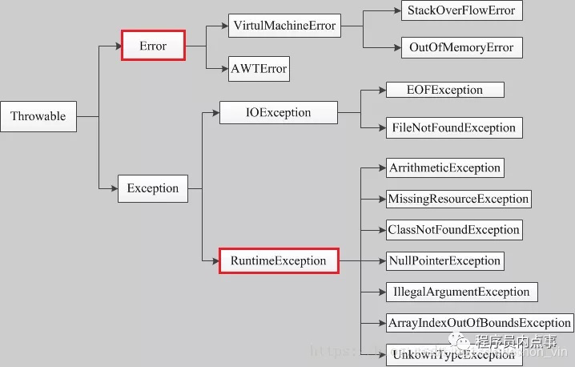

### 1、@Transactional应用

@Transactional可以用在`类`、`接口`、`方法`之上。

- 作用在类上：表示所有该类的public方法都配置相同的事务属性信息。
- 作用在方法上：当类配置了@Transactional，方法也配置了@Transactional，方法的事务会覆盖类的事务配置信息。
- 作用在接口上：不推荐这种使用方法，因为一旦标注在Interface上并且配置了Spring AOP 使用CGLib动态代理，将会导致@Transactional注解失效。

### 2、@Transactional失效及原因

- ### @Transactional标记的方法是非public方法

    失效的原理是：@Transactional是基于动态代理的，非public的方法，使得@Transactional的目标对象为空，所以不能回滚

- ### @Transactional 注解属性 propagation 设置错误

    这种失效是由于配置错误，若是错误的配置以下三种 propagation，事务将不会发生回滚。

    - **TransactionDefinition.PROPAGATION_SUPPORTS**：如果当前存在事务，则加入该事务；如果当前没有事务，则以非事务的方式继续运行
    - **TransactionDefinition.PROPAGATION_NOT_SUPPORTED**：以非事务方式运行，如果当前存在事务，则把当前事务挂起。
    - **TransactionDefinition.PROPAGATION_NEVER**：以非事务方式运行，如果当前存在事务，则抛出异常。

- ### @Transactional 注解属性 rollbackFor 设置错误

    **rollbackFor**可以指定能够触发事务回滚的异常类型。Spring默认抛出了未检查unchecked异常（继承自RuntimeException的异常）或者Error才回滚事务；其他异常不会触发回滚事务。如果在事务中抛出其他类型的异常，但却期望 Spring 能够回滚事务，就需要指定rollbackFor属性。若在目标方法中抛出的异常是 rollbackFor 指定的异常的子类，事务同样会回滚。

    

- ### 同一个类中方法调用，导致@Transactional失效

    开发中避免不了会对同一个类里面的方法调用，比如有一个类Test，它的一个方法A，A再调用本类的方法B（不论方法B是用public还是private修饰），但方法A没有声明注解事务，而B方法有。则外部调用方法A之后，方法B的事务是不会起作用的。这也是经常犯错误的一个地方。那为啥会出现这种情况？其实这还是由于使用Spring AOP代理造成的，因为只有当事务方法被当前类以外的代码调用时，才会由Spring生成的代理对象来管理。

- ### 异常被你的 catch“吃了”导致@Transactional失效

