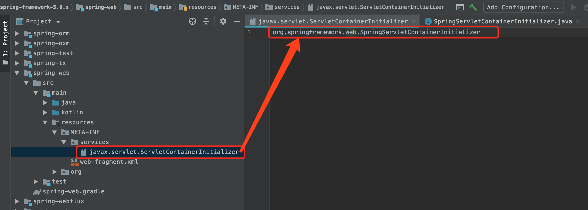

Servlet3.X规范中提供了一些接口和注解。这些接口和注解可以消除传统Web项目中XML配置文件。

- ServletContainerInitializer：实现了该接口的类，在Web容器启动时会加载。
- @WebServlet：标注一个类是Servlet组件
- @WebFilter：标注一个类是Filter组件
- @WebListener：标注一个类是Listener组件
- @HandlesTypes：这个注解的value属性中指定的接口，接口的所有实现类会在Web容器启动时被扫描到，放入集合后传入onStartUp()方法中。

### 1、ServletContainerInitializer

```java
public interface ServletContainerInitializer {
    // Servlet3.x规范中指定onStartUp()方法是启动初始化的回调方法
    void onStartup(Set<Class<?>> c, ServletContext ctx) throws ServletException;
}
```

### 2、加载和初始化

Web容器（比如Tomcat、Jetty）启动时，会通过Java的SPI机制去加载ServletContainerInitializer接口的实现类。

- 在spring-boot-web包下面的/resources/META-INF/services/目录下的javax.servlet.ServletContainerInitializer文本中指定了它的实现类的全路径名
- Web容器通过SPI机制去加载SpringServletContainerInitializer实现类，加载完成后会调用onStartUp(...)方法，完成第三方容器加载SpringMVC的目的



### 3、SpringMVC的容器初始化

```java
@HandlesTypes(WebApplicationInitializer.class)
public class SpringServletContainerInitializer implements ServletContainerInitializer {

	/**
	 * 方法实现说明：容器启动的时候会调用该方法
	 * 容器会自动扫描加载@HandlesTypes注解里面指定的WebApplicationInitializer接口的所有实现类，作为onStartUp()方法的第一个参数
	 */
	@Override
	public void onStartup(@Nullable Set<Class<?>> webAppInitializerClasses, ServletContext servletContext) {
		List<WebApplicationInitializer> initializers = new LinkedList<>();
		if (webAppInitializerClasses != null) {
			for (Class<?> waiClass : webAppInitializerClasses) {
				// 只有WebApplicationInitializer接口的实现类，并且类不是抽象的，才会进行初始化；否则就跳过
				if (!waiClass.isInterface() 
                    && !Modifier.isAbstract(waiClass.getModifiers())
                    && WebApplicationInitializer.class.isAssignableFrom(waiClass)) {
					try {
						// 通过反射实例化类，并添加到集合中
                        Object objject = ReflectionUtils.accessibleConstructor(waiClass).newInstance();
						initializers.add((WebApplicationInitializer) object);
					} catch (Throwable ex) {
						throw new ServletException("Failed to instantiate WebApplicationInitializer class", ex);
					}
				}
			}
		}
		if (initializers.isEmpty()) {
			servletContext.log("No Spring WebApplicationInitializer types detected on classpath");
			return;
		}
		servletContext.log(initializers.size() + " Spring WebApplicationInitializers detected on classpath");
		// 如果我们的WebApplicationInitializer的实现类，实现了Ordered接口或者标注了@Order注解，即指定了初始化的调用顺序，这时对集合进行排序
		AnnotationAwareOrderComparator.sort(initializers);
		// 依次循环调用实例的onStartUp()方法进行初始化
		for (WebApplicationInitializer initializer : initializers) {
			initializer.onStartup(servletContext);
		}
	}
}
```

