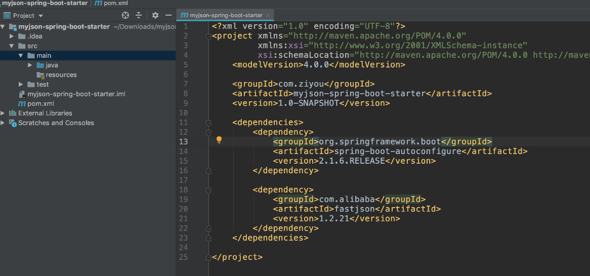

自定义Starter的命名规范建议

由于 SpringBoot 官方本身就会提供很多 Starter，为了区别哪些 Starter 是官方，哪些是私人的或者第三方的，所以 SpringBoot 官方提出，第三方在建立自己的 Starter 的时候命名规则统一用`xxx-spring-boot-starter`，而官方提供的 Starter 统一命名方式为`spring-boot-starter-xxx`。


自定义需求

假设我们现在有一个需求是将对象转换成 JSON，并在字符串前面加上一个名称，前缀支持通过配置文件配置的方式。(当然这个需求只是一个假设，仅仅用来测试功能用，实际的开发当然不会只是这么简单)。

1、创建一个Maven的项目

​		创建一个Maven项目，命名为myjson-spring-boot-starter，加入SpringBoot的自动装配依赖，这时候必须的。另外是功能实现层面的依赖，此处只引入Fastjson的依赖就行。



2、创建starter的功能方法

​	创建Service，并且加入一个方法`public String objToJson(Object object)` 方法，直接调用`fastjson` 的方法

```java
import com.alibaba.fastjson.JSON;
public class MyJsonService {

    private String name;

    /**
     * 使用 fastjson 将对象转换为 json 字符串输出
     */
    public String objToJson(Object object) {
        return getName() + JSON.toJSONString(object);
    }

    public String getName() {
        return name;
    }

    public void setName(String name) {
        this.name = name;
    }
}
```

3、编写配置类

```java
import org.springframework.boot.context.properties.ConfigurationProperties;
@ConfigurationProperties(prefix = "ziyou.json")
public class MyJsonProperties {
    public static final String DEFAULT_NAME = "ziyou";
    private String name = DEFAULT_NAME;
    
    public String getName() {
        return name;
    }
    public void setName(String name) {
        this.name = name;
    }
}
```

4、创建自动化配置类

```java
import org.springframework.beans.factory.annotation.Autowired;
import org.springframework.boot.autoconfigure.condition.ConditionalOnClass;
import org.springframework.boot.autoconfigure.condition.ConditionalOnMissingBean;
import org.springframework.boot.context.properties.EnableConfigurationProperties;
import org.springframework.context.annotation.Bean;
import org.springframework.context.annotation.Configuration;

@Configuration
@ConditionalOnClass({MyJsonService.class})
@EnableConfigurationProperties(MyJsonProperties.class)
public class MyJsonAutoConfiguration {
    @Autowired
    private MyJsonProperties myJsonProperties;

    /**
     * 当当前上下文中没有 MyJsonService 类时创建类
     */
    @Bean
    @ConditionalOnMissingBean(MyJsonService.class)
    public MyJsonService myJsonService() {
        MyJsonService myJsonService = new MyJsonService();
        myJsonService.setName(myJsonProperties.getName());
        return myJsonService;
    }
}
```

5、然后我们再创建 resource/META-INF/spring.factories 文件，增加如下内容，将自动装配的类配置上

```properties
org.springframework.boot.autoconfigure.EnableAutoConfiguration=com.ziyou.starter.MyJsonAutoConfiguration
```

6、然后我们通过运行mvn install命令，将这个项目打包成 jar 部署到本地仓库中，提供让另一个服务调用。

7、创建一个新的 SpringBoot web 项目test-myjson-spring-boot-starter，提供一个接口去访问。

```java
package com.ziyou.test.controller;

import com.ziyou.starter.MyJsonService;
import org.springframework.beans.factory.annotation.Autowired;
import org.springframework.web.bind.annotation.RequestMapping;
import org.springframework.web.bind.annotation.RestController;

@RestController
public class MyJsonController {

    @Autowired
    private MyJsonService myJsonService;

    @RequestMapping(value = "tojson")
    public String getStr() {
        User user = new User();
        user.setName("dsfsf");
        user.setAge(18);
        return myJsonService.objToJson(user);
    }
}
```

8、application.properties 中配置

```properties
server.port=8089
ziyou.json.name=java-geek-teck
```

9、pom.xml 中配置刚刚编写的 Starter

```java
<?xml version="1.0" encoding="UTF-8"?>
<project xmlns="http://maven.apache.org/POM/4.0.0"
         xmlns:xsi="http://www.w3.org/2001/XMLSchema-instance"
         xsi:schemaLocation="http://maven.apache.org/POM/4.0.0 http://maven.apache.org/xsd/maven-4.0.0.xsd">
    <modelVersion>4.0.0</modelVersion>

    <parent>
        <groupId>org.springframework.boot</groupId>
        <artifactId>spring-boot-starter-parent</artifactId>
        <version>2.1.6.RELEASE</version>
        <relativePath/> <!-- lookup parent from repository -->
    </parent>

    <groupId>com.ziyou</groupId>
    <artifactId>test-myjson-spring-boot-starter</artifactId>
    <version>1.0-SNAPSHOT</version>

    <dependencies>
        <dependency>
            <groupId>com.ziyou</groupId>
            <artifactId>myjson-spring-boot-starter</artifactId>
            <version>1.0-SNAPSHOT</version>
        </dependency>
        <dependency>
            <groupId>org.springframework.boot</groupId>
            <artifactId>spring-boot-starter-web</artifactId>
        </dependency>

        <dependency>
            <groupId>org.springframework.boot</groupId>
            <artifactId>spring-boot-starter</artifactId>
        </dependency>
    </dependencies>

</project>
```

10、启动测试项目，打开浏览器访问接口可以看到如下效果。


