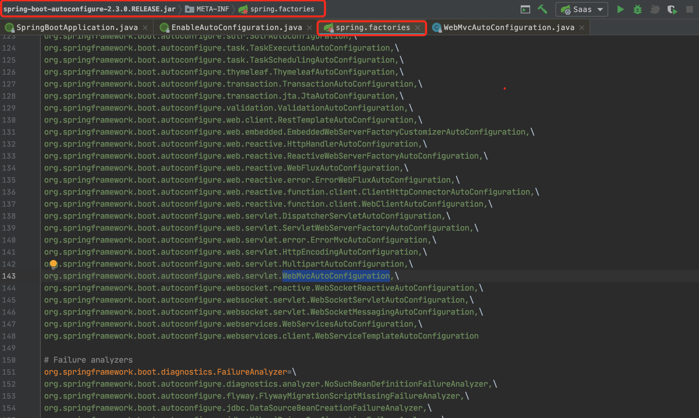
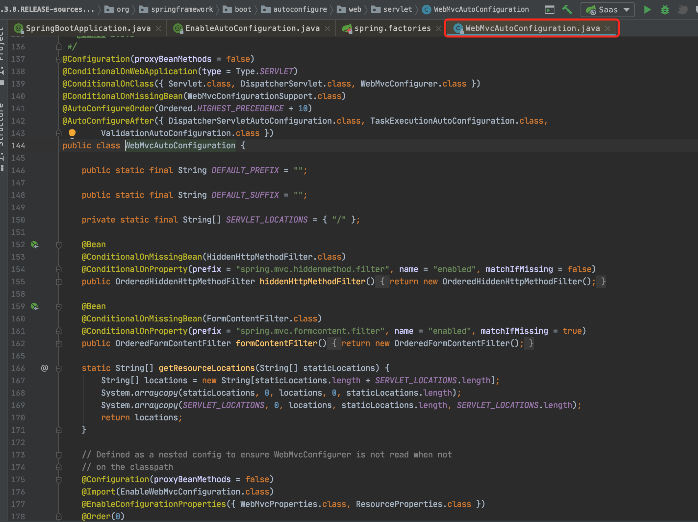

SpringBoot应用在主启动类上需要添加@SpringBootApplication注解。

这个注解实现了SpringBoot应用的各种自动装配。

### @SpringBootApplication注解

```java
@SpringBootConfiguration
@EnableAutoConfiguration
@ComponentScan(excludeFilters = { @Filter(type = FilterType.CUSTOM, classes = TypeExcludeFilter.class),
								  @Filter(type = FilterType.CUSTOM, classes = AutoConfigurationExcludeFilter.class) })
public @interface SpringBootApplication {
    
	@AliasFor(annotation = EnableAutoConfiguration.class)
	Class<?>[] exclude() default {};
    
    @AliasFor(annotation = EnableAutoConfiguration.class)
	String[] excludeName() default {};
    
    @AliasFor(annotation = ComponentScan.class, attribute = "basePackages")
	String[] scanBasePackages() default {};
    
    @AliasFor(annotation = ComponentScan.class, attribute = "basePackageClasses")
	Class<?>[] scanBasePackageClasses() default {};
    
    @AliasFor(annotation = ComponentScan.class, attribute = "nameGenerator")
	Class<? extends BeanNameGenerator> nameGenerator() default BeanNameGenerator.class;
    
    @AliasFor(annotation = Configuration.class)
	boolean proxyBeanMethods() default true;
}
```

从源码可以看出，@SpringBootApplication中有@SpringBootConfiguration和@EnableAutoConfiguration两个注解标记它。

- @SpringBootConfiguration：用于完成SpringBoot的配置操作
- @EnableAutoConfiguration：用于开启自动配置特性

### @SpringBootConfiguration

```java
@Configuration
public @interface SpringBootConfiguration {
	@AliasFor(annotation = Configuration.class)
	boolean proxyBeanMethods() default true;
}
```

@SpringBootApplication注解就是一个@Configuration的配置类，标识它所标注的类是一个配置类。

@Configuration注解有两个作用：

- @Configuration所标注的类，可以作为一个配置类

    - Spring中通过@Configuration标识一个Java类，然后在这个类中使用@Bean注解描述一个类，这样就替代了XML的配置方式

- @Configuration所标注的类，会被自动纳入Spring IoC容器

    ​	实际上，Spring可以通过两种方式将一个对象纳入到Spring IoC容器中：

    - 在applicationContext.xml中使用<bean>标签配置。

        先将一个类用@Controller、@Service、@Repository、@Component标识，然后将这个类放入compoent-scan扫描器的base-package属性中。

    - 使用@Configuration标识该对象所在的类。

        SpringBoot中的@Configuration等价于Spring中的@Controller、@Service、@Repository、@Component。

### @EnableAutoConfiguration

@EnableAutoConfiguration是SpringBoot中最为重要的一个注解，自动装配功能就是通过它实现的。

```java
@AutoConfigurationPackage
@Import(AutoConfigurationImportSelector.class)
public @interface EnableAutoConfiguration {
	String ENABLED_OVERRIDE_PROPERTY = "spring.boot.enableautoconfiguration";
	Class<?>[] exclude() default {}; //不通过自动自动装配的类
	String[] excludeName() default {};//不通过自动自动装配的类名称
}
```

@EnableAutoConfiguration也是一个复合注解，上面标记了@AutoConfigurationPackage和@Import。

@AutoConfigurationPackage主要是使用@Import给Spring容器导入了一个组件。这里导入的是Registrar.class

```java
@Import(AutoConfigurationPackages.Registrar.class)
public @interface AutoConfigurationPackage {
	String[] basePackages() default {};
	Class<?>[] basePackageClasses() default {};
}
```

进一步看一下AutoConfigurationPackages的部分源码如下：

```java
// 包导入注册器
static class Registrar implements ImportBeanDefinitionRegistrar, DeterminableImports {
    //通过这个方法获取扫描的包路径。在new PackageImports(..)中可以看到获取配置扫描路径
    @Override
    public void registerBeanDefinitions(AnnotationMetadata metadata, BeanDefinitionRegistry registry) {
        register(registry, new PackageImports(metadata).getPackageNames().toArray(new String[0]));
    }
    @Override
    public Set<Object> determineImports(AnnotationMetadata metadata) {
        return Collections.singleton(new PackageImports(metadata));
    }
}

//“包导入”的包装器
private static final class PackageImports {
    private final List<String> packageNames;
    // 获取并解析配置的包导入路径
    PackageImports(AnnotationMetadata metadata) {
        AnnotationAttributes attributes = AnnotationAttributes
            .fromMap(metadata.getAnnotationAttributes(AutoConfigurationPackage.class.getName(), false));
        List<String> packageNames = new ArrayList<>();
        for (String basePackage : attributes.getStringArray("basePackages")) {
            packageNames.add(basePackage);
        }
        for (Class<?> basePackageClass : attributes.getClassArray("basePackageClasses")) {
            packageNames.add(basePackageClass.getPackage().getName());
        }
        if (packageNames.isEmpty()) {
            packageNames.add(ClassUtils.getPackageName(metadata.getClassName()));
        }
        this.packageNames = Collections.unmodifiableList(packageNames);
    }

    List<String> getPackageNames() {
        return this.packageNames;
    }
}
```

通过@AutoConfigurationPackage注解就获取到了@SpringBootApplication注解中配置的扫描路径。现在包扫描路径有了，那么需要加载哪些组件呢？接下来就是@EnableAutoConfiguration注解上的@Import注解导入的AutoConfigurationImportSelector选择器的职能了。

### @Import({AutoConfigurationImportSelector.class})

可以进入到AutoConfigurationImportSelector选择器里面有一个selectImports方法，将所有需要导入的组件以全类名的方式返回；这些组件就会被添加到容器中。

```java
//将所有需要导入的组件，将组建的类全名称返回，这些组件就会被添加到容器中
public String[] selectImports(AnnotationMetadata annotationMetadata) {
    if (!isEnabled(annotationMetadata)) {
        return NO_IMPORTS;
    }
    AutoConfigurationEntry autoConfigurationEntry = getAutoConfigurationEntry(annotationMetadata);
    return StringUtils.toStringArray(autoConfigurationEntry.getConfigurations());
}

//筛选自动配置类(xxxxAutoConfiguration),
protected AutoConfigurationEntry getAutoConfigurationEntry(AnnotationMetadata annotationMetadata) {
    if (!isEnabled(annotationMetadata)) {
        return EMPTY_ENTRY;
    }
    AnnotationAttributes attributes = getAttributes(annotationMetadata);
    // 加载和解析配置文件
    List<String> configurations = getCandidateConfigurations(annotationMetadata, attributes);
    //配置信息去重
    configurations = removeDuplicates(configurations);
    //去除手工指定的那些“不需要自动配置的组件”
    Set<String> exclusions = getExclusions(annotationMetadata, attributes);
    checkExcludedClasses(configurations, exclusions);
    configurations.removeAll(exclusions);
    configurations = getConfigurationClassFilter().filter(configurations);
    
    fireAutoConfigurationImportEvents(configurations, exclusions);
    return new AutoConfigurationEntry(configurations, exclusions);
}

//加载和解析配置文件
protected List<String> getCandidateConfigurations(AnnotationMetadata metadata, AnnotationAttributes attributes) {
    List<String> configurations = SpringFactoriesLoader.loadFactoryNames(getSpringFactoriesLoaderFactoryClass(),
                                                                         getBeanClassLoader());
    Assert.notEmpty(configurations, "No auto configuration classes found in META-INF/spring.factories. If you "
                    + "are using a custom packaging, make sure that file is correct.");
    return configurations;
}
```

配置文件的加载过程SpringFactoriesLoader#loadFactoryNames()

```java
public final class SpringFactoriesLoader {
    //自动配置类清单的配置文件
    public static final String FACTORIES_RESOURCE_LOCATION = "META-INF/spring.factories";
    private static final Map<ClassLoader, MultiValueMap<String, String>> cache = new ConcurrentReferenceHashMap<>();
    
    public static List<String> loadFactoryNames(Class<?> factoryType, @Nullable ClassLoader classLoader) {
            String factoryTypeName = factoryType.getName();
            return loadSpringFactories(classLoader).getOrDefault(factoryTypeName, Collections.emptyList());
        }

    private static Map<String, List<String>> loadSpringFactories(@Nullable ClassLoader classLoader) {
        MultiValueMap<String, String> result = cache.get(classLoader);
        if (result != null) {
            return result;
        }

        try {
            // 从指定位置读取自动配置类清单的配置文件
            Enumeration<URL> urls = (classLoader != null ?
                                     classLoader.getResources(FACTORIES_RESOURCE_LOCATION) :
                                     ClassLoader.getSystemResources(FACTORIES_RESOURCE_LOCATION));
            result = new LinkedMultiValueMap<>();
            while (urls.hasMoreElements()) {
                URL url = urls.nextElement();
                UrlResource resource = new UrlResource(url);
                //配置文件解析为Properties对象
                Properties properties = PropertiesLoaderUtils.loadProperties(resource);
                for (Map.Entry<?, ?> entry : properties.entrySet()) {
                    String factoryTypeName = ((String) entry.getKey()).trim();
                    String[] beanNames = StringUtils.commaDelimitedListToStringArray((String) entry.getValue())
                        for (String factoryImplementationName : beanNames) {
                            result.add(factoryTypeName, factoryImplementationName.trim());
                        }
                }
            }
            cache.put(classLoader, result);
            return result;
        } catch (IOException ex) {
            throw new IllegalArgumentException("Unable to load factories from location [" +
                                               FACTORIES_RESOURCE_LOCATION + "]", ex);
        }
    }
}
```

Spring Boot在启动的时候`从类路径下的META-INF/spring.factories中获取EnableAutoConfiguration指定的值，将这些值作为自动配置类导入到容器中，自动配置类就生效，帮我们进行自动配置工作`。原来我们需要自己配置的东西，自动配置类都帮我们完成了。



比如SpringMVC的自动配置类WebMvcAutoConfiguration，在这个配置类里面，对SpringMVC的组件进行了默认配置



